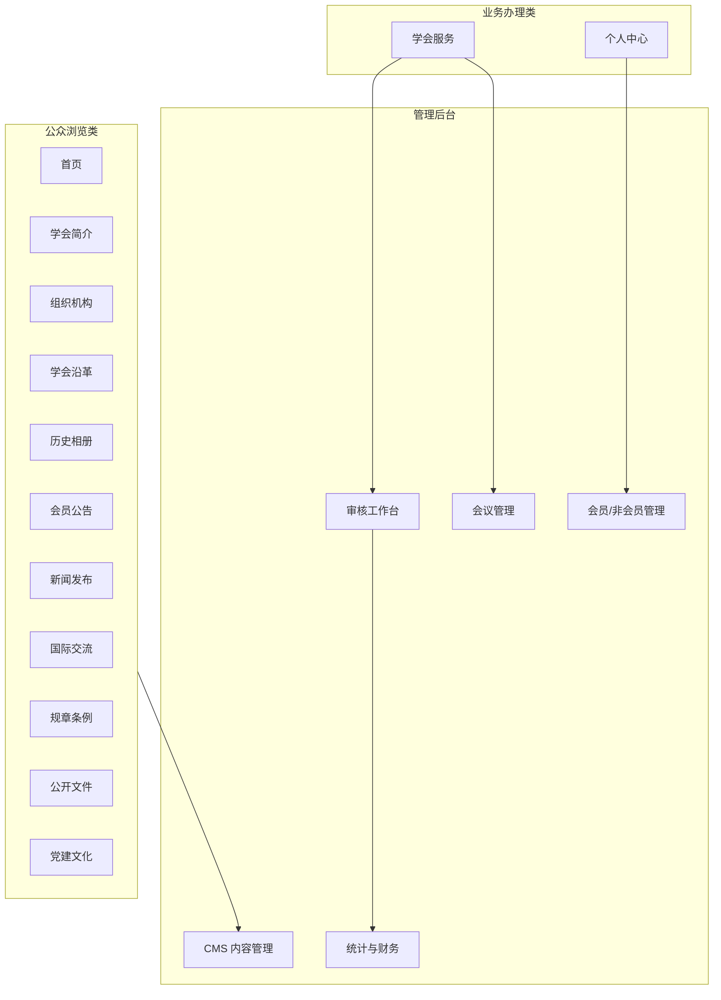
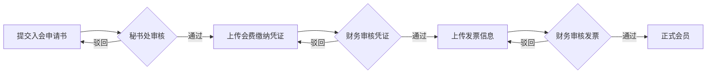

# 功能模块说明

## 基本信息

| 字段 | 内容 |
|------|------|
| 文档主题 | 中国古生物学会网站前台、后台各功能模块说明 |
| 整理时间 | 2026-07-06 |
| 文档状态 | 已确认（与当前实现一致） |
| 适用系统 | 学会主站（前台）+ 管理后台 + CMS 后端 |
| 关联文档 | [功能模块说明](./2026-07-06-功能模块说明.md)、[客户需求说明（基于当前实现）](./2026-07-06-客户需求说明-基于当前实现.md)、[后台管理角色说明](./2026-07-05-后台管理角色说明-PRD.md) |
| 技术附录 | [网站 README](../paleontology-website-latest/README.md)、[管理后台 README](../paleontology-admin-latest/README.md) |

## 文档目的

本文档面向**秘书处、分会负责人、业务验收人员**，用业务语言说明网站顶栏各模块「做什么、给谁用、由谁在后台维护」，并单独说明**学会服务**（会员与会议）的完整流程。

> **范围说明**：前台用户的「普通用户 / 非会员 / 正式会员」属于业务身份，不是后台管理角色。后台角色见 [后台管理角色说明](./2026-07-05-后台管理角色说明-PRD.md)。

---

## 一、网站整体结构

学会网站由两大部分组成：

| 部分 | 入口 | 版式特点 |
|------|------|----------|
| **学会主站** | 顶栏导航（首页、简介、服务……） | 大部分页面全宽展示；学会服务、个人中心为业务交互页 |
| **党建文化子系统** | 顶栏「党建文化」 | 左侧 12 个子栏目 + 右侧内容区 |

内容类页面（简介、沿革、相册、公告等）由管理后台 **CMS 内容管理** 发布；会员入会、会议报名、缴费审核等由 **业务管理** 模块处理。

---

## 二、主站顶栏模块（从左至右）

与网站顶部导航栏顺序一致。

### 1. 首页

| 项目 | 说明 |
|------|------|
| **面向用户** | 所有访客 |
| **主要功能** | 展示学会形象：首页轮播大图、要闻摘要、快捷入口、学会概况引导 |
| **后台维护** | 轮播图、新闻动态 |

学会对外展示的「门面」，访客无需登录即可浏览。

---

### 2. 学会简介

| 项目 | 说明 |
|------|------|
| **面向用户** | 所有访客 |
| **主要功能** | 学会概况、章程、发展规划、领导机构、获奖成果等 |
| **后台维护** | 学会简介、获奖成果 |

用于介绍学会基本情况、组织架构与重要荣誉。

---

### 3. 组织机构

| 项目 | 说明 |
|------|------|
| **面向用户** | 所有访客 |
| **主要功能** | 总学会组织架构图；可进入 **11 个专业分会子站**（概况、工作动态、科学传播、下载中心等） |
| **后台维护** | 组织机构、分会栏目 |

分会子站与总学会结构并列展示，便于按专业方向浏览各分会信息。

---

### 4. 学会服务 ★ 核心业务

| 项目 | 说明 |
|------|------|
| **面向用户** | 注册用户、会员用户（部分 Tab 公众可浏览） |
| **主要功能** | 会员入会、会费缴纳、分会绑定、学术会议报名、科学传播、国际交流、科技奖励等 |
| **后台维护** | 学会服务（内容）、审核工作台、会议管理、会员/非会员管理 |

**网站最核心的业务入口**，详见 [§四、学会服务子模块](#四学会服务子模块) 与 [§五、会员与会议流程](#五会员与会议流程)。

---

### 5. 党建文化

| 项目 | 说明 |
|------|------|
| **面向用户** | 党员及内部人员（部分内容公众可读） |
| **主要功能** | 党建子系统首页；左侧导航进入 12 个子栏目 |
| **后台维护** | 党建文化 |

独立于主站版式的党建专区，详见 [§六、党建文化子栏目](#六党建文化子栏目)。

---

### 6. 学会沿革

| 项目 | 说明 |
|------|------|
| **面向用户** | 所有访客 |
| **主要功能** | 按时间轴浏览学会发展史上的重要节点与事件 |
| **后台维护** | 学会沿革 |

以时间线形式呈现学会历史。

---

### 7. 历史相册

| 项目 | 说明 |
|------|------|
| **面向用户** | 所有访客 |
| **主要功能** | 按分类浏览历史照片，支持图册与大图展示 |
| **后台维护** | 历史相册 |

---

### 8. 会员公告

| 项目 | 说明 |
|------|------|
| **面向用户** | 会员及公众 |
| **主要功能** | 学会及各分会发布的通知、公告列表 |
| **后台维护** | 会员公告 |

---

### 9. 新闻发布

| 项目 | 说明 |
|------|------|
| **面向用户** | 所有访客 |
| **主要功能** | 会议通知、党务公开、重要新闻；支持封面图与原文附件下载 |
| **后台维护** | 新闻发布 |

与「新闻动态」（首页摘要）区分：本栏目侧重正式发布的会议通知与重要新闻。

---

### 10. 国际交流

| 项目 | 说明 |
|------|------|
| **面向用户** | 所有访客 |
| **主要功能** | 外事手续说明、国际会议申报、合作机构介绍等 |
| **后台维护** | 学会服务（与国际交流 Tab 共用内容） |

顶栏独立入口，内容与「学会服务 → 国际交流」**同源**，两处编辑一处即可。

---

### 11. 规章条例

| 项目 | 说明 |
|------|------|
| **面向用户** | 所有访客 |
| **主要功能** | 学会章程、管理办法等规章制度正文及附件下载 |
| **后台维护** | 规章条例 |

---

### 12. 公开文件

| 项目 | 说明 |
|------|------|
| **面向用户** | 所有访客（**无需登录**） |
| **主要功能** | 公开文档、音频、影视、照片等资料下载 |
| **后台维护** | 公开文件管理 |

---

### 13. 个人中心（顶栏用户菜单）

| 项目 | 说明 |
|------|------|
| **入口** | 登录后右上角用户名下拉 → 个人中心 |
| **面向用户** | 已登录用户 |
| **主要功能** | 修改个人资料、查看会员状态、缴费与会议记录、系统通知、安全退出、注销账号 |

---

## 三、模块关系示意

---

## 四、学会服务子模块

进入「学会服务」后，通过页内 Tab 切换以下功能：

| Tab | 功能说明 | 是否需登录 |
|-----|----------|------------|
| **服务大厅** | 服务总览与快捷入口 | 否 |
| **专业分会** | 浏览 11 个分会，跳转组织机构/分会子站 | 否 |
| **会员服务** | 注册登录、身份选择、入会申请、会费缴纳、分会绑定、会员状态查询 | 是 |
| **学术会议** | 会议列表、会议费报名、摘要/住宿/野外路线填报 | 是 |
| **科学传播** | 科普文章、视频、化石保护等内容 | 否 |
| **国际交流** | 同顶栏「国际交流」 | 否 |
| **科技奖励** | 奖项介绍与申报指南 | 否 |

### 会员身份说明（前台用户）

| 身份 | 说明 | 能否绑定分会 | 会议费 |
|------|------|--------------|--------|
| **普通用户** | 刚注册、尚未选择路径 | 否 | — |
| **非会员** | 选择「作为非会员继续」，无需缴会费 | 是 | 会员价 × 1.1 |
| **正式会员** | 完成入会全流程（见下节） | 是 | 会员价 |

首次登录须选择「成为正式会员」或「作为非会员继续」；**选择结果会保存，重复登录不再弹出**。非会员可随时在会员服务中升级为正式会员。

---

## 五、会员与会议流程

### 5.1 成为正式会员（三步审核）

仅当以下三步**全部通过**后，用户才被认定为**正式会员**，并计入后台「正式会员」统计。

| 阶段 | 用户操作 | 管理员操作 | 用户端状态 |
|------|----------|------------|------------|
| 1 | 填写并提交入会申请书 | 秘书处审核通过/驳回 | 申请审核中 → 申请已通过 |
| 2 | 上传会费缴纳凭证 | 财务审核凭证 | 凭证审核中 → 待上传发票 |
| 3 | 上传发票 | 财务审核发票 | 发票审核中 → **正式会员** |

中间任一环节被驳回，用户可按提示修改后重新提交。**申请已通过但尚未完成缴费的用户**，在后台归入「入会办理中」，不计入正式会员。

### 5.2 会议报名（两阶段缴费）

| 阶段 | 用户操作 | 管理员操作 |
|------|----------|------------|
| 1 | 选择会议、提交报名信息、上传会议费凭证 | 审核缴费凭证 |
| 2 | 上传发票 | 审核发票 → 报名确认 |

报名确认后，用户可继续填报会议摘要、住宿需求、野外路线等（视会议配置而定）。会议费按用户身份自动适用会员价或非会员价。

### 5.3 分会绑定

非会员与正式会员均可绑定感兴趣的专业分会；普通用户（未选择路径）须先完成身份选择。

---

## 六、党建文化子栏目

进入「党建文化」后，左侧导航包含以下 12 个子栏目：

| # | 子栏目 | 功能说明 |
|---|--------|----------|
| 1 | 通知公告 | 党建相关通知 |
| 2 | 党群机构 | 组织架构与职责分工 |
| 3 | 党委纪委 | 党委、纪委成员信息 |
| 4 | 党建工作 | 年度党建计划与落实情况 |
| 5 | 组织生活 | 三会一课、主题党日等活动 |
| 6 | 党员队伍建设 | 党员发展与培训 |
| 7 | 理论学习专栏 | 理论学习资料 |
| 8 | 工作动态 | 党建新闻动态 |
| 9 | 党建专题 | 专题学习页面 |
| 10 | 先进典型 | 优秀党员与先进事迹 |
| 11 | 违法违纪举报 | 在线举报（定制表单页） |
| 12 | 下载中心 | 党建资料下载 |

---

## 七、管理后台模块

管理后台供秘书处、分会负责人、财务人员使用，与前台模块一一对应。

### 7.1 业务管理

| 模块 | 主要使用人 | 功能说明 |
|------|------------|----------|
| **仪表盘** | 总管理员、分会、财务 | 用户总数、正式会员数、入会办理中、待审核数量、会费/会议费趋势 |
| **审核工作台** | 总管理员、财务 | 入会/退会申请审核；会员费、会议费凭证与发票两阶段审核 |
| **审计追溯** | 总管理员、分会 | 关键操作记录（中文摘要，含相关用户信息），只读查询 |
| **会员用户管理** | 总管理员 | 仅展示**正式会员**（三步全流程已完成） |
| **非会员用户管理** | 总管理员 | 非会员及入会办理中的用户 |
| **会议管理** | 总管理员、分会 | 发布会议、配置费用档位与报名截止、摘要/住宿/野外模板 |
| **统计中心** | 总/分会/财务 | 全局 → 分会 → 单会三级数据钻取 |
| **财务记录** | 财务 | 缴费记录查询、按人群分类导出 ZIP |
| **分会管理** | 总管理员 | 分会名称、简介、启用状态 |

角色权限与数据范围详见 [后台管理角色说明](./2026-07-05-后台管理角色说明-PRD.md)。

### 7.2 CMS 内容管理

与前台页面对应关系：

| 后台栏目 | 维护内容 | 前台页面 |
|----------|----------|----------|
| 轮播图 | 首页大图与跳转链接 | 首页 |
| 新闻动态 | 学会要闻 | 首页摘要 |
| 学会简介 | 概况、章程、领导机构等 | 学会简介 |
| 组织机构 | 总学会架构图 | 组织机构 |
| 分会栏目 | 各分会子站内容 | 组织机构 → 分会子站 |
| 获奖成果 | 奖项与获奖人 | 学会简介内展示 |
| 会员公告 | 学会/分会公告 | 会员公告 |
| 学会沿革 | 时间线节点 | 学会沿革 |
| 历史相册 | 分类相册 | 历史相册 |
| 学会服务 | 服务说明、国际交流、科学传播、科技奖励 | 学会服务及相关 Tab |
| 规章条例 | 制度正文与附件 | 规章条例 |
| 新闻发布 | 会议通知、党务公开、重要新闻 | 新闻发布 |
| 公开文件 | 公开下载资料 | 公开文件 |
| 党建文化 | 12 个子栏目文章 | 党建文化 |
| 媒体库 | 图片与附件 | 全站引用 |
| 站点配置 | 版权、联系方式、快捷入口 | 页脚等全站元素 |

### 7.3 栏目编排

总管理员可在「栏目编排」中调整顶栏顺序、页面路由与版式类型；保存后前台导航自动更新。

---

## 八、常见问题

**Q：顶栏「国际交流」和学会服务里的国际交流有什么区别？**  
A：内容完全相同，只是两个入口，后台在「学会服务」中统一维护。

**Q：什么情况下算「正式会员」？**  
A：入会申请书、会费凭证、发票**三项审核均通过**后，方为正式会员，计入正式会员统计。

**Q：申请已通过但还没缴费的用户算会员吗？**  
A：不算。此类用户属于「入会办理中」，在「非会员用户管理」中查看，不计入正式会员数。

**Q：非会员能参加会议吗？**  
A：可以，会议费按会员价的 1.1 倍收取。

**Q：党建内容谁维护？**  
A：由具备相应权限的管理员在后台「党建文化」栏目发布；总会与分会按角色说明中的数据范围操作。

---

## 九、修订记录

| 日期 | 版本 | 说明 |
|------|------|------|
| 2026-07-06 | v1.0 | 首版：主站 12 顶栏模块 + 学会服务 + 党建 + 后台对应关系 + 会员/会议流程 |
