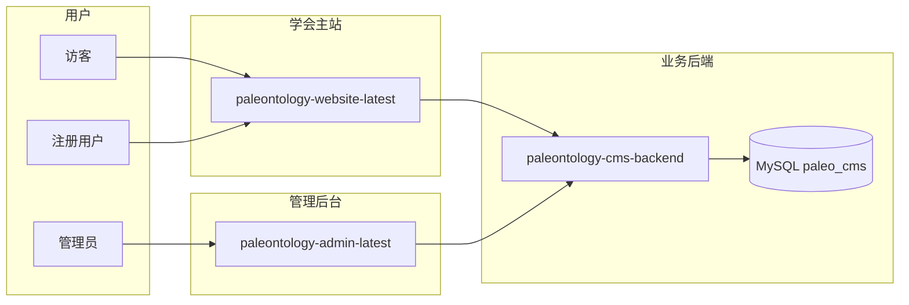
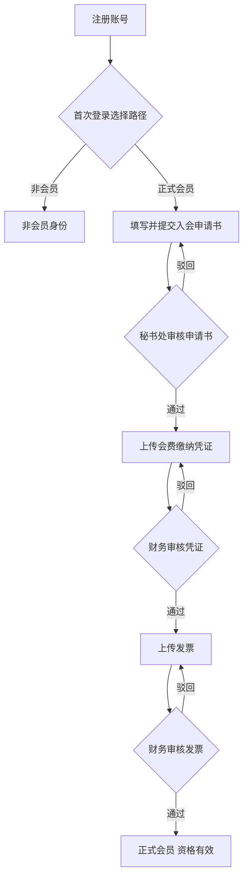

# 客户需求说明（基于当前实现）

## 基本信息

| 字段 | 内容 |
|------|------|
| 文档主题 | 中国古生物学会网站 — 前台、管理后台、业务后端的客户需求与业务规则说明 |
| 整理时间 | 2026-07-06 |
| 文档状态 | **基于当前代码实现整理**（非未来规划） |
| 适用系统 | `paleontology-website-latest`（学会主站）+ `paleontology-admin-latest`（管理后台）+ `paleontology-cms-backend`（业务后端） |
| 关联文档 | [功能模块说明](./2026-07-06-功能模块说明.md)、[后台管理角色说明](./2026-07-05-后台管理角色说明-PRD.md)、[中国古生物学会完整需求文档](./中国古生物学会完整需求文档.md) |
| 读者对象 | 秘书处、分会负责人、财务、业务验收人员、项目经理 |

## 文档目的

本文档以**当前已上线/可演示的代码逻辑**为准，用客户可理解的语言说明：

1. 网站能为用户提供哪些服务、须满足哪些业务规则；
2. 管理后台各角色能审核、发布、统计什么；
3. 会员入会、会议报名等核心流程的**状态流转与判定标准**；
4. 哪些功能已对接数据库与 API，哪些仍为演示阶段的本地存储。

> **重要说明**：本系统为学会数字化平台的**轻量实现版本**，与 `PaleontologicalResearch` 生产栈（RuoYi 全家桶）在框架与部分模块完整度上存在差异。本文描述的是 **Paleontology 三仓库当前行为**，验收时以此为准；与历史 MRD/PRD 不一致之处，以本文及代码为准并单独标注。

---

## 一、系统组成



| 组成部分 | 面向谁 | 主要职责 |
|----------|--------|----------|
| **学会主站** | 公众、注册用户 | 内容浏览、会员入会、会议报名、分会绑定、个人中心 |
| **管理后台** | 秘书处、分会、财务 | 内容发布、入会/退会审核、缴费审核、统计导出、审计查询 |
| **业务后端** | 前后台调用 | 用户认证、会员/会议业务、CMS 内容、审计日志、仪表盘统计 |

**数据持久化原则**：

- 已对接 API 的业务（注册登录、入会申请、会费/会议费审核、会员名录、审计追溯、CMS 内容等）以 **MySQL 数据库** 为准；
- 部分管理功能（会议发布配置、财务 ZIP 导出、会员手动禁用等）仍使用浏览器 **localStorage** 演示数据，与 API 可能不同步，见 [§十二、实现完成度说明](#十二实现完成度说明)。

---

## 二、用户身份与角色

### 2.1 前台用户身份（业务身份，非管理角色）

所有访客可先浏览公开内容。注册登录后，用户依次经历以下身份：

| 身份 | 系统标识 | 说明 | 能否绑定分会 | 会议费计价 |
|------|----------|------|--------------|------------|
| **普通用户** | `regular` | 刚注册，尚未选择会员路径 | 否（须先选择路径） | — |
| **非会员** | `non_member` | 选择「作为非会员继续」，无需缴纳会费 | 是 | 会员基准价 × **1.1** |
| **正式会员** | `member` | 完成入会全流程（见 §四） | 是 | 会员基准价 |

**首次登录路径选择**（`MembershipChoiceDialog`）：

- 触发条件：已登录 + 身份为普通用户 + 尚未做过选择；
- 用户须二选一，**不可关闭弹窗跳过**：
  - **作为非会员继续**：立即可绑定分会、报名会议（按非会员价）；
  - **成为正式会员**：进入入会申请流程（须缴纳会费）；
- 选择结果保存至数据库与本地，**重复登录不再弹出**；
- 非会员可随时在「学会服务 → 会员服务」升级为正式会员。

**正式会员认定标准**（与后台统计一致）：

须**依次**完成以下三步且均被管理员审核通过：

1. 入会申请书审核通过；
2. 会费缴纳凭证审核通过；
3. 发票审核通过 → 状态为 **会员资格有效**（`active`）。

仅此时计入后台「正式会员」数量；中间状态归入「入会办理中」。

### 2.2 后台管理角色

当前轻量后台实现 **3 类业务角色**（对应后端 JWT 角色）：

| 角色 | 标识 | 主要使用人 | 数据范围 |
|------|------|------------|----------|
| **学会总管理员** | `super_admin` | 秘书处 | 全站：12 个学会单元（1 总学会 + 11 分会） |
| **分会管理员** | `branch_admin` | 各分会负责人 | 仅绑定的 1 个分会 |
| **财务审核员** | `finance_reviewer` | 财务或秘书处代操作 | 全站缴费/发票审核与统计（菜单受限） |

分会管理员与学会的绑定关系由总管理员在「数据权限配置」中维护，**重新登录后生效**。

> 生产环境 RuoYi 栈另有「超级管理员」等系统角色，见 [后台管理角色说明](./2026-07-05-后台管理角色说明-PRD.md)；轻量后台以本文三角色为准。

---

## 三、网站功能需求

### 3.1 内容浏览类（无需登录）

顶栏导航与 [功能模块说明](./2026-07-06-功能模块说明.md) 一致，主要包括：

| 模块 | 客户需求要点 |
|------|--------------|
| 首页 | 轮播大图、要闻摘要、快捷入口 |
| 学会简介 | 概况、章程、发展规划、领导机构、获奖成果 |
| 组织机构 | 总学会架构图；11 个专业分会子站（概况、动态、科学传播、下载等） |
| 学会沿革 | 历史时间轴 |
| 历史相册 | 分类照片浏览 |
| 会员公告 | 学会及分会通知公告 |
| 新闻发布 | 会议通知、党务公开、重要新闻（封面 + 附件下载） |
| 国际交流 | 外事与合作信息（与学会服务内 Tab 内容同源） |
| 规章条例 | 制度正文与附件 |
| 公开文件 | **无需登录**即可下载文档/音视频/照片 |
| 党建文化 | 独立子系统，12 个子栏目（见 §3.4） |

内容均由管理后台 CMS 发布；顶栏顺序可在后台「栏目编排」中调整。

### 3.2 学会服务（核心业务，须登录）

入口：顶栏「学会服务」。页内 Tab 包括：

| Tab | 客户需求 |
|-----|----------|
| 服务大厅 | 服务总览与快捷入口 |
| 专业分会 | 浏览 11 个分会并跳转子站 |
| **会员服务** | 注册/登录、路径选择、入会/退会申请、会费缴纳、分会绑定、状态查询 |
| **学术会议** | 会议列表、会议费报名、参会资料填报 |
| 科学传播 | 科普内容浏览 |
| 国际交流 | 同顶栏 |
| 科技奖励 | 奖项介绍与申报指南 |

### 3.3 个人中心

登录后通过右上角用户菜单进入，包含：

| 功能 | 说明 |
|------|------|
| 个人资料 | 查看/修改姓名、性别、单位、职务等 |
| 会员状态 | 展示当前身份与入会/缴费进度 |
| 退会申请 | 仅**正式会员**可提交（须下载模板、上传申请书） |
| 分会绑定 | 只读展示已绑定分会 |
| 会议报名 | 只读展示进行中/已确认的报名 |
| 缴费记录 | 会费与会议费历史 |
| 安全退出 | 清除登录状态 |
| 注销账号 | 两步确认后删除本地账号数据 |

### 3.4 党建文化子系统

进入「党建文化」后，左侧 12 个子栏目：

通知公告、党群机构、党委纪委、党建工作、组织生活、党员队伍建设、理论学习专栏、工作动态、党建专题、先进典型、违法违纪举报、下载中心。

版式：左侧导航 + 右侧内容；与主站其他全宽页面区分。

### 3.5 消息通知

- 系统在用户操作后（如提交申请、审核结果、绑定分会等）写入消息中心；
- 顶栏铃铛显示未读数；打开面板后标记为已读；
- 消息目前存储在用户浏览器本地，换设备不自动同步。

---

## 四、会员入会需求（正式会员路径）

### 4.1 流程总览



### 4.2 入会申请书

| 项目 | 规则 |
|------|------|
| 谁可提交 | 选择「正式会员」路径的用户 |
| 文件格式 | Word（.doc/.docx）或 PDF |
| 大小限制 | 单文件不超过 20MB |
| 模板 | 后台可维护入会/退会申请书模板，用户可下载 |
| 待审核期间 | 可取消申请；不可重复提交同类型待审核申请 |
| 审核方 | **学会总管理员**（秘书处） |
| 驳回 | 须填写驳回原因，用户可修改后重新提交 |

### 4.3 会费缴纳（两阶段）

与会议费相同，采用 **凭证初审 → 发票终审** 两阶段：

| 阶段 | 用户操作 | 审核方 | 通过后状态 |
|------|----------|--------|------------|
| 第一阶段 | 上传缴费凭证（转账截图等） | 财务审核员 / 总管理员 | 进入「待上传发票」 |
| 第二阶段 | 上传发票 | 财务审核员 / 总管理员 | **会员资格有效** |

**会费金额**（默认，后台可配置覆盖）：

| 会员类别 | 默认金额（元/年） |
|----------|-------------------|
| 普通会员 | 200 |
| 学生会员 | 100 |
| 单位会员 | 5000（预留） |

系统根据用户是否为学生自动匹配类别。

**发票上传期限**：凭证审核通过后 **7 个工作日**内须上传发票（与后台工作日计算规则一致）。

**驳回规则**：凭证或发票被驳回时，须填写原因；用户可重新上传。

### 4.4 用户可见状态说明

| 状态 | 用户看到的意思 | 用户可做什么 |
|------|----------------|--------------|
| 尚未入会 | 未开始入会流程 | 可提交入会申请 |
| 入会申请审核中 | 秘书处审核中 | 可取消申请 |
| 入会申请被驳回 | 申请未通过 | 可重新申请 |
| 入会申请已通过 | 可申请缴费 | 上传会费凭证 |
| 凭证初审中 | 财务审核凭证 | 等待 |
| 凭证被驳回 | 凭证有问题 | 重新上传凭证 |
| 待上传发票 | 凭证已通过 | 上传发票 |
| 发票终审中 | 财务审核发票 | 等待 |
| 发票被驳回 | 发票有问题 | 重新上传发票 |
| **会员资格有效** | 正式会员 | 绑定分会、按会员价报名会议 |
| 已退会 | 已办理退会 | 可重新申请入会 |
| 已过期 | 会员资格到期 | 可续费（重新走缴费流程） |

### 4.5 退会

| 项目 | 规则 |
|------|------|
| 谁可申请 | 仅**会员资格有效**的用户 |
| 流程 | 下载退会模板 → 上传退会申请书 → 秘书处审核 |
| 审核通过 | 当日终止会员资格，身份变为非会员；已缴会费记录作废处理 |
| 审核驳回 | 保持正式会员身份 |
| 待审核期间 | 可取消退会申请 |
| 退会后 | **分会绑定保留**；可按非会员价参加会议 |
| 再次入会 | **无需管理员解锁**，重新提交入会申请即可 |

### 4.6 会员到期

- 会员资格有效期满（默认自发票确认日起一年）后，系统自动将身份降为**非会员**；
- 分会绑定保留；
- 已确认的会议报名保留；进行中的未完成报名可能被清理；
- 用户须重新完成缴费两阶段以恢复正式会员。

---

## 五、会议报名需求

### 5.1 谁可报名

| 条件 | 说明 |
|------|------|
| 已登录 | 必须 |
| 已选择路径 | 普通用户须先完成非会员/正式会员选择 |
| 正式会员 | 须为「会员资格有效」，或正处于会费发票审核中（允许边办会员边报名） |
| 非会员 | 可直接报名 |
| 分会权限 | 报名某分会举办的会议时，用户须已绑定该分会（**总学会会议对所有用户开放**） |
| 报名截止 | 超过缴费截止时间后不可报名 |
| 费用为 0 | 视为报名通道关闭 |

### 5.2 会议费四类人群

每场会议配置四类价格（管理端维护）：

| 人群 | 说明 |
|------|------|
| 学生会员 | 学生身份 + 正式会员 |
| 非学生会员 | 非学生 + 正式会员 |
| 学生（非会员） | 学生身份 + 非会员 |
| 非学生（非会员） | 非学生 + 非会员 |

若未单独配置，系统按默认规则推算：非会员价 = 会员价 × 1.1；学生价约为基准价 × 2/3。**报名创建时锁定金额**，后续改价不影响已报名用户。

### 5.3 会议费缴纳（两阶段）

与会费相同：

```
上传缴费凭证 → 财务初审通过 → 上传发票 → 财务终审通过 → 报名确认
```

驳回须填原因，用户可重新上传。

### 5.4 报名确认后可做的事

仅当会议费**终审通过（报名确认）**后，用户可：

| 功能 | 说明 |
|------|------|
| 下载盖章会议通知 | 管理员上传的 PDF |
| 下载摘要模板 | 管理员上传的 Word 模板 |
| 填写参会表单 | 住宿需求、野外路线选择、摘要上传、报告类型（口头/展板/仅参会） |

> **当前实现说明**：参会表单、摘要、住宿等详细填报数据主要保存在用户浏览器本地，尚未全部同步至后端数据库。

### 5.5 会议组织分工

| 会议类型 | 谁发布 | 谁审核会议费 |
|----------|--------|--------------|
| 总学会会议 | 学会总管理员 | 财务 / 总管理员 |
| 分会会议 | 对应分会管理员（仅本分会） | 财务 / 总管理员（分会管理员仅本分会数据） |

当前管理端会议发布配置存储在本地演示数据中；开放会议列表由后端数据库提供。

---

## 六、分会绑定需求

### 6.1 学会单元

系统包含 **1 个总学会 + 11 个专业分会**：

| 编码 | 名称 |
|------|------|
| zgswxh | 中国古生物学会（总学会） |
| gwjzdwxfh | 古无脊椎动物学分会 |
| kpgzwyh | 科普工作委员会 |
| bfxfh | 孢粉学分会 |
| wtxfh | 微体学分会 |
| hszlzwyh | 化石藻类专业委员会 |
| gzwxfh | 古植物学分会 |
| dqswx | 地球生物学分会 |
| gst | 古生态专业分会 |
| gjzdw | 古脊椎动物学分会 |
| swcj | 生物沉积学分会 |
| xjsxff | 新技术新方法专业委员会 |

### 6.2 绑定规则

| 规则 | 说明 |
|------|------|
| 总学会 | 对所有注册用户**默认可访问**，无需手动绑定，也不可解绑 |
| 专业分会 | 非会员与正式会员可自行绑定/解绑，**无需管理员审批** |
| 普通用户 | 前台提示须先选择会员路径；技术上绑定接口未强制拦截 |
| 绑定数量 | 可同时绑定多个分会 |
| 用途 | 决定可报名哪些分会的会议；个人中心与学会服务展示已绑定列表 |

---

## 七、注册与账号需求

### 7.1 注册

| 字段 | 要求 |
|------|------|
| 邮箱 | 必填，作为登录账号，不可重复 |
| 密码 | 至少 6 位 |
| 姓名 | 必填 |
| 性别 | 必填 |
| 单位 | 必填 |
| 身份/职务 | 选填（如教师、学生等） |

注册成功后提示用户登录并前往「学会服务 → 会员服务」完成路径选择。

### 7.2 登录

- 使用邮箱 + 密码登录；
- 登录后自动恢复会员状态、分会绑定、报名记录（从服务器同步，约每 5 秒及页面切换时刷新）。

### 7.3 退出与注销

| 操作 | 行为 |
|------|------|
| 安全退出 | 清除登录状态，回到普通访客浏览 |
| 注销账号 | 删除本地账号与业务缓存；**服务器账号可能仍存在**（当前未对接注销 API） |

### 7.4 密码相关（当前限制）

| 功能 | 当前实现 |
|------|----------|
| 忘记密码 | 演示逻辑，不发送真实邮件 |
| 修改密码 | 仅前端校验提示，未调用后端改密接口 |

---

## 八、管理后台需求

### 8.1 仪表盘

| 角色 | 展示内容 |
|------|----------|
| 学会总管理员 | 用户总数、**正式会员**、**入会办理中**、非会员/其他、待审核数、会费/会议费趋势、分会会员分布 |
| 分会管理员 | 本分会会议数、确认参会人数、分会用户数、待审核（会议凭证） |
| 财务审核员 | 待初审、待终审、今日已处理、逾期未上传发票 |

**统计口径**：

- **正式会员** = 已完成申请书 + 凭证 + 发票三步审核；
- **入会办理中** = 已提交申请或正在缴费审核流程中的用户；
- 其余归入「非会员/其他」。

### 8.2 审核工作台

| Tab | 可见角色 | 审核内容 |
|-----|----------|----------|
| 凭证初审 | 总管理员、财务 | 会费凭证、会议费凭证 |
| 发票终审 | 总管理员、财务 | 会费发票、会议费发票 |
| 入会申请 | **仅总管理员** | 入会申请书 |
| 退会申请 | **仅总管理员** | 退会申请书 |

操作规则：

- 通过凭证 → 用户进入「待上传发票」；
- 通过发票 → 会费变为「会员资格有效」/ 会议变为「报名确认」；
- 驳回 → **必须填写原因**；
- 支持批量通过/驳回（凭证、发票 Tab）；
- 总管理员可延长发票上传期限（当前为本地演示逻辑）。

### 8.3 会员用户管理 / 非会员用户管理

| 页面 | 列入用户 |
|------|----------|
| 会员用户管理 | 仅**正式会员**（会员资格有效） |
| 非会员用户管理 | 非会员 + 入会办理中 + 已退会/已过期等 |

功能：搜索、按分会筛选、查看详情与缴费记录（优先从 API 读取）。

**演示功能**（仅本地）：手动禁用/启用会员、手动开通会员至当年 12 月 31 日。

### 8.4 会议管理

- 发布/编辑会议：名称、时间地点、所属学会、四类费用、各阶段截止日期；
- 野外路线：最多 15 条；
- 上传：会议通知、盖章通知 PDF、摘要模板 Word；
- 状态：草稿 / 已发布；
- 分会管理员只能管理本分会会议。

> 当前会议 CRUD 主要存于管理端本地；已发布会议列表由后端 API 提供给前台。

### 8.5 CMS 内容管理

与前台页面一一对应，管理员可：

- 新增/编辑/发布/下架内容；
- 上传图片与附件（媒体库统一管理）；
- 维护党建 12 子栏目、分会子站各栏目；
- 配置站点版权、联系方式、首页快捷入口；
- **直接发布，无多人审批流**（客户 0626 已确认）。

分会管理员仅可编辑本分会范围内的 CMS 内容；国际交流、科技奖励等部分栏目仅总管理员可改。

### 8.6 栏目编排

总管理员可调整顶栏顺序、页面路由、版式类型（时间轴、相册、文件列表等）；保存后前台导航自动更新。

### 8.7 统计中心与财务记录

| 功能 | 说明 |
|------|------|
| 统计视图 | 总览 / 按学会 / 按会议三级切换 |
| 收入口径 | 仅统计**已确认**的会费与会议费 |
| 参会统计 | 确认参会人数、口头/展板报告数、住宿分布、野外路线报名 |
| 12×4 费用矩阵 | 12 个学会单元 × 四类人群的缴费汇总 |
| ZIP 导出 | 按学会或单会，分四类人群文件夹导出凭证/发票 + Excel 台账 |

> 统计与 ZIP 导出当前主要从本地演示数据聚合，与 API 仪表盘数字在接入真实数据后需对齐验收。

### 8.8 审计追溯

- 只读查询关键操作日志；
- 展示中文摘要、操作人、相关用户信息、审核意见；
- 不展示原始技术 JSON；
- 分会管理员仅可见本分会相关记录；
- 财务审核员**无权限**访问此页。

记录范围包括：入会/退会审核、凭证/发票审核、CMS 发布/下架、管理员分会绑定变更、识别结果人工复核等。

### 8.9 识别结果（辅助功能）

- 用户上传凭证/发票后，系统自动进行**模拟智能识别**（演示 OCR）；
- 识别结果供管理员人工复核，**不自动通过审核**；
- 总管理员与分会管理员（本分会范围）可查看与标注「确认无误 / 有争议」。

### 8.10 数据权限配置

- 仅总管理员可操作；
- 为分会管理员账号绑定可管理的分会；
- 保存后须重新登录生效。

### 8.11 分会管理

- 维护 11 个分会及总学会的名称、简介、启用/停用；
- 展示各分会正式会员数量；
- 当前元数据存于本地演示存储。

---

## 九、权限矩阵（当前实现）

| 功能 | 总管理员 | 分会管理员 | 财务审核员 |
|------|:--------:|:----------:|:----------:|
| 仪表盘 | ✓ | ✓（本分会） | ✓ |
| 审核工作台 — 凭证/发票 | ✓ | — | ✓ |
| 审核工作台 — 入会/退会 | ✓ | — | — |
| 会员/非会员用户管理 | ✓ | — | — |
| 会议管理 | ✓ | ✓（本分会） | — |
| 统计中心 | ✓ | ✓（本分会） | ✓ |
| 财务记录与导出 | ✓ | — | ✓ |
| 审计追溯 | ✓ | ✓（本分会） | — |
| 识别结果 | ✓ | ✓（本分会） | — |
| CMS 内容（全站栏目） | ✓ | 部分 | — |
| CMS 内容（本分会） | ✓ | ✓ | — |
| 栏目编排 | ✓ | — | — |
| 分会管理 | ✓ | — | — |
| 数据权限配置 | ✓ | — | — |

---

## 十、业务规则速查

### 10.1 价格规则

| 场景 | 规则 |
|------|------|
| 非会员会议费 | 会员基准价 × 1.1 |
| 学生会议费 | 约为对应人群基准价 × 2/3 |
| 会费 | 普通 200 元/年，学生 100 元/年（可后台覆盖） |
| 报名锁价 | 创建报名时锁定金额与人群类别 |

### 10.2 审核规则

| 场景 | 规则 |
|------|------|
| 入会/退会 | 仅秘书处（总管理员） |
| 凭证/发票 | 财务或总管理员 |
| 驳回 | 必须填写原因 |
| CMS 发布 | 管理员直接发布，无二级审批 |
| 分会绑定 | 用户自助，无需审核 |

### 10.3 数据隔离规则

| 场景 | 规则 |
|------|------|
| 分会管理员 | 仅见、仅改本分会会议、CMS、统计、审计（本分会） |
| 总学会与分会统计 | 独立拆分，不混计（客户 0625 要求） |
| 财务 | 可见全站缴费数据，菜单不含 CMS 与用户管理 |

### 10.4 发票期限

- 凭证审核通过后 **7 个工作日**内上传发票；
- 逾期状态可在界面展示；总管理员可演示性延长期限（本地逻辑）。

---

## 十一、客户已确认的关键决策（需求溯源）

| 日期/来源 | 客户确认内容 | 当前实现 |
|-----------|--------------|----------|
| 0617 | 入会须上传申请书；退会须申请书；秘书处审核 | ✓ API + 审核工作台 |
| 0617 | 分会管理员仅管本分会，不能改其他分会 | ✓ 角色 + 数据权限绑定 |
| 0612 | 会员费只收一次（学会级），非分会重复收 | ✓ 统一入会缴费 |
| 0625 | 总学会与 11 分会统计独立 | ✓ 统计按学会单元拆分 |
| 0626 | 退会后再入会无需解锁 | ✓ 可重新申请 |
| 0626 | CMS 管理员直接发布 | ✓ 无审批流 |
| 0617 | 野外路线最多 15 条 | ✓ 会议配置支持 |
| 0617 | 会议通知 PDF 仅管理员上传盖章版 | ✓ 管理员上传 |

---

## 十二、实现完成度说明

以下对照**客户需求**与**当前代码**，供验收时区分「已上线」与「演示/待完善」。

### 12.1 已对接数据库与 API

| 功能 | 说明 |
|------|------|
| 用户注册/登录/身份选择 | `paleo_user`、JWT |
| 入会/退会申请与审核 | `paleo_membership_application` |
| 会费两阶段审核 | `paleo_membership_payment` |
| 会议列表（开放会议） | `paleo_conference` |
| 会议报名与两阶段审核 | `paleo_conference_registration` |
| 分会绑定 | `paleo_user_binding` |
| 会员名录与状态解析 | 统一 `membershipStatus` |
| 仪表盘核心统计 | 正式会员/办理中/待审核 |
| 审核工作台待办队列 | 实时 API 轮询 |
| 审计追溯 | `paleo_audit_log` |
| CMS 内容/栏目/区块 | 全站内容发布 |
| 识别结果记录 | `paleo_recognition_result` |
| 管理员分会绑定 | `paleo_admin_association` |

### 12.2 仍为演示或本地存储

| 功能 | 影响 | 建议 |
|------|------|------|
| 会议发布与费用配置（管理端） | 与 DB 会议列表可能不一致 | 后续迁移至 API |
| 参会表单/摘要/住宿/野外详细数据 | 换设备或清缓存会丢失 | 后续同步 API |
| 财务 ZIP 导出、统计明细 | 从本地数据聚合 | 与 API 缴费记录对齐 |
| 会员手动禁用/开通 | 仅改本地，不影响 DB | 生产需 API |
| 发票期限延长 | 仅本地 | 需后端接口 |
| 忘记密码/修改密码 | 无真实邮件与 API | 生产需补齐 |
| 注销账号 | 不删服务器用户 | 生产需 API |
| 消息通知 | 仅本地 | 可选接入站内信 |
| 财务仪表盘「今日已处理」 | 读本地旧日志 | 改读审计 API |

### 12.3 已知业务细节差异

| 项 | 说明 |
|----|------|
| `application_rejected` / `invoice_overdue` | 前端有状态展示，后端状态机部分场景未单独返回，依赖同步逻辑 |
| 会员到期自动处理 | 后端有逻辑，**未配置定时任务**；前台也会在本地检测到期 |
| 发票逾期提醒 | 前端函数已实现，**未全局调用** |
| 学生判定 | 仪表盘以「角色标签=学生」为准，非单独字段 |

---

## 十三、验收建议清单

### 13.1 前台 — 会员流程

- [ ] 注册 → 首次登录弹出路径选择，且不可跳过
- [ ] 选择正式会员 → 提交入会申请 → 秘书处通过后可见缴费入口
- [ ] 凭证驳回须见原因，可重传
- [ ] 凭证通过 → 7 工作日内上传发票
- [ ] 发票通过 → 显示「会员资格有效」，后台计入正式会员
- [ ] 非会员会议价为会员价 × 1.1
- [ ] 退会 → 秘书处通过 → 变为非会员，绑定保留

### 13.2 前台 — 会议流程

- [ ] 未绑定分会时不能报该分会会议（总学会会议除外）
- [ ] 两阶段缴费与驳回重传
- [ ] 报名确认后可下载通知/模板并填参会表

### 13.3 管理后台

- [ ] 财务仅能审凭证/发票，不能审入会申请
- [ ] 分会管理员仅能看本分会会议与 CMS
- [ ] 会员用户管理仅含正式会员
- [ ] 审计追溯为中文可读详情
- [ ] CMS 发布后前台可见

### 13.4 数据一致性

- [ ] 同一用户在前后台会员状态一致
- [ ] 仪表盘正式会员数 = 会员用户管理列表数
- [ ] 审核通过后前台 5 秒内状态更新（或刷新页面）

---

## 十四、修订记录

| 日期 | 版本 | 说明 |
|------|------|------|
| 2026-07-06 | v1.0 | 首版：基于三仓库当前代码整理客户需求与业务规则 |

---

## 附录：相关技术文档

| 文档 | 路径 |
|------|------|
| 功能模块说明（简版） | [2026-07-06-功能模块说明.md](./2026-07-06-功能模块说明.md) |
| 后台角色说明 | [2026-07-05-后台管理角色说明-PRD.md](./2026-07-05-后台管理角色说明-PRD.md) |
| 网站 README | [paleontology-website-latest/README.md](../paleontology-website-latest/README.md) |
| 管理后台 README | [paleontology-admin-latest/README.md](../paleontology-admin-latest/README.md) |
| 业务后端 README | [paleontology-cms-backend/README.md](../paleontology-cms-backend/README.md) |
