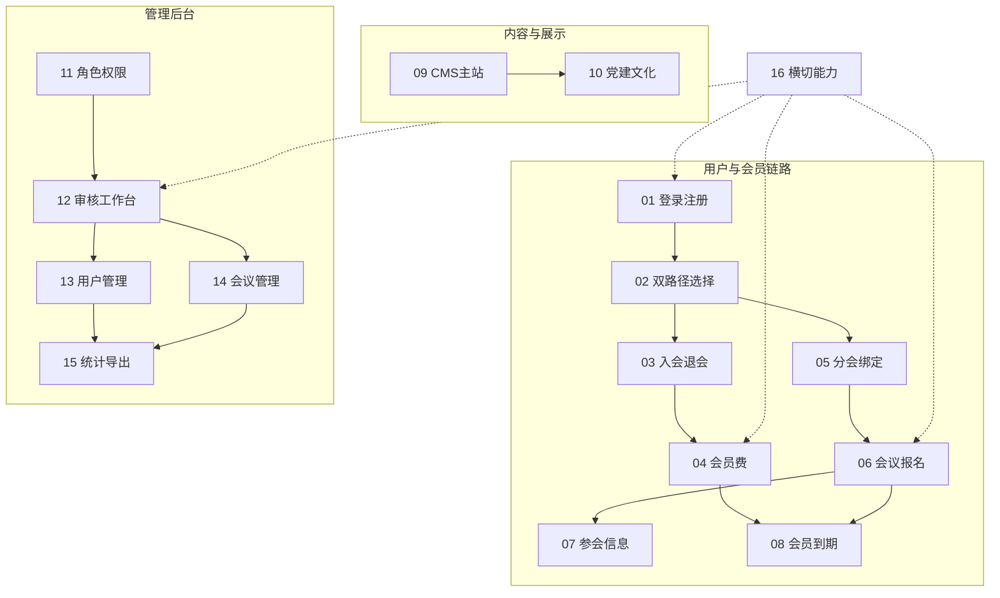

# 00 模块划分索引

| 字段 | 内容 |
|------|------|
| 文档名称 | 中国古生物学会网站 — 模块化 PRD 划分索引 |
| 版本 | v2.5 |
| 编写日期 | 2026-07-06 |
| 文档状态 | 已确认划分方案 |
| 前置基准 | [中国古生物学会完整需求文档.md](../中国古生物学会完整需求文档.md) v3.1 |
| 存放目录 | `docs/modules-prd/` |
| 工作流 | AI 生成单模块 PRD 初稿 → 人工校验细节与业务修正 → 最终验收 |

---

## 1. 划分原则

| 原则 | 说明 |
|------|------|
| **模块数量** | 共 **16** 个功能模块（不含本索引与基准总文档） |
| **单模块体量** | 单份 PRD 建议 800～1500 行，便于人工校验 |
| **边界清晰** | 每个模块可独立开发、联调、验收 |
| **依赖有序** | 编号反映推荐实施顺序，非强制并行约束 |
| **总文档映射** | 各模块回写总需求 §7～§19 对应章节，不重复 §1～§3 基础架构 |

### 不单独拆为功能模块的内容

| 总需求章节 | 处理方式 |
|------------|----------|
| §1 项目概述、§2 系统架构、§3 信息架构 | 保留于基准文档 |
| §5 学会服务（总览） | 拆分至模块 02～08 |
| §20 页面视觉与素材规范 | 各模块 PRD 引用，不单列 |
| §21 待决事项与风险提示 | 随相关模块维护 |
| §22 验收标准 | 各模块自带验收项；总文档保留汇总 |
| §23 附录 | 枚举/表结构分散至各模块或共享附录 |
| 个人中心 | 按功能归属分散至 01、03～07，不单列 |

---

## 2. 模块总览（16）

| 编号 | 文件名 | 模块名称 | 总需求章节 | 主要端 | 状态 |
|:----:|--------|----------|------------|--------|:----:|
| 01 | [01_用户登录注册模块需求.md](./01_用户登录注册模块需求.md) | 用户登录注册 | §7 | 学会主站 + 后端 | ✅ 初稿 |
| 02 | [02_双路径会员选择模块需求.md](./02_双路径会员选择模块需求.md) | 双路径会员选择 | §8 | 学会主站 + 后端 | ✅ 初稿 |
| 03 | [03_入会退会申请模块需求.md](./03_入会退会申请模块需求.md) | 入会/退会申请 | §9 | 主站 + 后台审核 | ✅ 初稿 |
| 04 | [04_会员费缴纳模块需求.md](./04_会员费缴纳模块需求.md) | 会员费缴纳（两阶段） | §10 | 主站 + 后台审核 | ✅ 初稿 |
| 05 | [05_分会绑定与可见性模块需求.md](./05_分会绑定与可见性模块需求.md) | 分会绑定与可见性 | §11 | 主站 + 后端 | ✅ 初稿 |
| 06 | [06_会议发布与会议费报名模块需求.md](./06_会议发布与会议费报名模块需求.md) | 会议发布与会议费报名 | §12 | 主站 + 后台 | ✅ 初稿 |
| 07 | [07_参会信息摘要住宿野外模块需求.md](./07_参会信息摘要住宿野外模块需求.md) | 参会信息/摘要/住宿/野外 | §13 | 主站 + 后台 | ✅ 初稿 |
| 08 | [08_会员到期与会议资格模块需求.md](./08_会员到期与会议资格模块需求.md) | 会员到期与会议资格 | §14 | 后端定时 + 主站 | ✅ 初稿 |
| 09 | [09_CMS主站内容发布模块需求.md](./09_CMS主站内容发布模块需求.md) | CMS 主站内容发布 | §4、§17.6–17.7 | 主站 + 管理后台 | ✅ 初稿 |
| 10 | [10_党建文化子系统模块需求.md](./10_党建文化子系统模块需求.md) | 党建文化子系统 | §6 | 主站 + 管理后台 | ✅ 初稿 |
| 11 | [11_后台角色与数据权限模块需求.md](./11_后台角色与数据权限模块需求.md) | 后台角色与数据权限 | §17.1–17.2 | 管理后台 | ✅ 初稿 |
| 12 | [12_审核工作台模块需求.md](./12_审核工作台模块需求.md) | 审核工作台 | §17.4 | 管理后台 | ✅ 初稿 |
| 13 | [13_用户管理模块需求.md](./13_用户管理模块需求.md) | 用户管理（会员/非会员） | §17.3、§17.5 | 管理后台 | ✅ 初稿 |
| 14 | [14_会议管理后台模块需求.md](./14_会议管理后台模块需求.md) | 会议管理后台 | §17.8–17.10 | 管理后台 | ✅ 初稿 |
| 15 | [15_统计与财务导出模块需求.md](./15_统计与财务导出模块需求.md) | 统计与财务导出 | §18、§17.3 | 管理后台 | ✅ 初稿 |
| 16 | [16_横切能力模块需求.md](./16_横切能力模块需求.md) | 消息/邮件/文件/OCR/审计 | §15、§16、§19 | 全端 | ✅ 初稿 |

**状态图例**：✅ 初稿已出 · 🔄 校验中 · ✔️ 已验收 · ⬜ 待编写

---

## 3. 分层结构

### 3.1 用户与会员链路（01～08）

核心业务闭环，对应总需求「学会服务」主体。

```
01 登录注册 → 02 双路径选择
                ├→ 03 入会退会 → 04 会员费 → 08 会员到期
                ├→ 05 分会绑定 → 06 会议报名 → 07 参会信息 → 08 会员到期
                └→ 05 分会绑定（非会员路径，跳过 03/04）
```

| 模块 | 一句话说明 |
|------|------------|
| 01 | 邮箱验证码注册、登录、忘记密码、会话与个人资料基础能力 |
| 02 | 首次登录强制选择「非会员」或「正式会员」路径，不可跳过 |
| 03 | 入会/退会申请书提交、秘书处审核、模板下载 |
| 04 | 会员费凭证初审 → 发票终审，两阶段状态机 |
| 05 | 用户绑定/解绑 11 个分会，控制子站与会议可见性 |
| 06 | 会议发布、四类会议费、报名与会议费两阶段缴费 |
| 07 | 报名确认后填报参会信息、摘要 Word、住宿、野外路线选择 |
| 08 | 会员到期降级、会议资格冻结/保留/清理规则 |

### 3.2 内容与展示（09～10）

| 模块 | 一句话说明 |
|------|------------|
| 09 | 主站 CMS：简介、沿革、相册、公告、新闻、规章、公开文件、栏目编排 |
| 10 | 党建文化 12 子栏目 + 侧栏双栏版式 |

> 公开文件（§4.10、§16 公开下载部分）并入 **09**，不单独成册。

### 3.3 管理后台（11～15）

| 模块 | 一句话说明 |
|------|------------|
| 11 | 四类业务角色 + 超级管理员；菜单与数据范围隔离 |
| 12 | 凭证/发票/入会/退会四 Tab 审核工作台 |
| 13 | 正式会员名录、非会员与办理中用户、账号禁用 |
| 14 | 会议创建编辑、费用配置、截止日、野外路线、模板上传 |
| 15 | 仪表盘、三级统计钻取、财务 ZIP 导出 |

### 3.4 横切能力（16）

| 模块 | 一句话说明 |
|------|------------|
| 16 | 站内通知、邮件服务、OSS 文件存储、OCR 识别、审计追溯 |

---

## 4. 模块依赖关系



**图例**：实线 = 强依赖（须先完成上游）；虚线 = 横切支撑（可并行接入）

---

## 5. 推荐实施顺序

与领导「优先会员服务 + 党建」一致：

| 阶段 | 模块 | 说明 |
|:----:|------|------|
| P0 | 01 → 02 → 05 | 账号体系 + 路径选择 + 分会绑定，打通最小业务入口 |
| P1 | 03 → 04 → 06 → 07 | 入会全流程 + 会议报名全流程 |
| P2 | 08 | 到期与资格处理（依赖 04、06 状态机） |
| P3 | 10 ∥ 09 | 党建可与会员链路并行；CMS 内容类可并行 |
| P4 | 11 → 12 → 13 → 14 → 15 | 后台管理与统计验收 |
| 贯穿 | 16 | 邮件/通知/文件/OCR/审计随 P0～P4 分阶段接入 |

---

## 6. 单模块 PRD 标准结构

各模块 PRD 建议采用统一章节，便于 AI 生成与人工校验：

1. 模块概述（定位、原则、系统边界、不在范围）
2. 业务背景与目标
3. 角色与权限边界
4. 业务流程（含 Mermaid 图）
5. 页面原型说明（线框、视觉规范、交互状态）
6. 字段与校验规则
7. 接口需求
8. 数据模型
9. 安全与频率限制（如适用）
10. 异常处理
11. 与上下游模块衔接
12. 原型差距与改造清单
13. 验收标准（可勾选）
14. 附录（演示账号、待确认项）

参考范本：[01_用户登录注册模块需求.md](./01_用户登录注册模块需求.md)

---

## 7. 关联文档

| 文档 | 路径 | 关系 |
|------|------|------|
| 完整需求规格（基准） | [中国古生物学会完整需求文档.md](../中国古生物学会完整需求文档.md) | 单一事实来源 |
| 功能模块说明（业务语言） | [2026-07-06-功能模块说明.md](../2026-07-06-功能模块说明.md) | 面向秘书处/验收人员 |
| 后台管理角色说明 | [2026-07-05-后台管理角色说明-PRD.md](../2026-07-05-后台管理角色说明-PRD.md) | 模块 11 可引用，避免重复 |
| 学会主站原型 | `paleontology-website-latest/` | 前台 UI 与交互参考 |
| 管理后台原型 | `paleontology-admin-latest/` | 后台 UI 与交互参考 |
| 业务后端 | `paleontology-cms-backend/` | API 与数据模型参考 |

---

## 8. 命名规范

| 项目 | 规范 |
|------|------|
| 目录 | `docs/modules-prd/` |
| 索引文件 | `00_模块划分索引.md`（本文件） |
| 模块文件 | `{两位编号}_{模块简称}模块需求.md` |
| 编号 | 01～16 连续，与实施顺序大致一致 |
| 版本 | 各模块 PRD 独立维护版本号（v1.0 起） |

---

## 9. 修订记录

| 版本 | 日期 | 说明 |
|------|------|------|
| v1.0 | 2026-07-06 | 初版：确立 16 模块划分方案；01 模块初稿已交付 |
| v1.1 | 2026-07-06 | 02 双路径会员选择模块初稿已交付 |
| v1.2 | 2026-07-06 | 03 入会退会申请模块初稿已交付 |
| v1.3 | 2026-07-06 | 04 会员费缴纳模块初稿已交付 |
| v1.4 | 2026-07-06 | 05 分会绑定与可见性模块初稿已交付 |
| v1.5 | 2026-07-06 | 06 会议发布与会议费报名模块初稿已交付 |
| v1.6 | 2026-07-06 | 07 参会信息/摘要/住宿/野外模块初稿已交付 |
| v1.7 | 2026-07-06 | 08 会员到期与会议资格模块初稿已交付 |
| v1.8 | 2026-07-06 | 09 CMS 主站内容发布模块初稿已交付 |
| v1.9 | 2026-07-06 | 10 党建文化子系统模块初稿已交付 |
| v2.0 | 2026-07-06 | 11 后台角色与数据权限模块初稿已交付 |
| v2.1 | 2026-07-06 | 12 审核工作台模块初稿已交付 |
| v2.2 | 2026-07-06 | 13 用户管理模块初稿已交付 |
| v2.3 | 2026-07-06 | 14 会议管理后台模块初稿已交付 |
| v2.4 | 2026-07-06 | 15 统计与财务导出模块初稿已交付 |
| v2.5 | 2026-07-06 | 16 横切能力模块初稿已交付；**16 模块 PRD 初稿全部完成** |

---

**文档结束**

*新增或合并模块时，须同步更新本索引、基准总需求文档章节映射及修订记录。*
