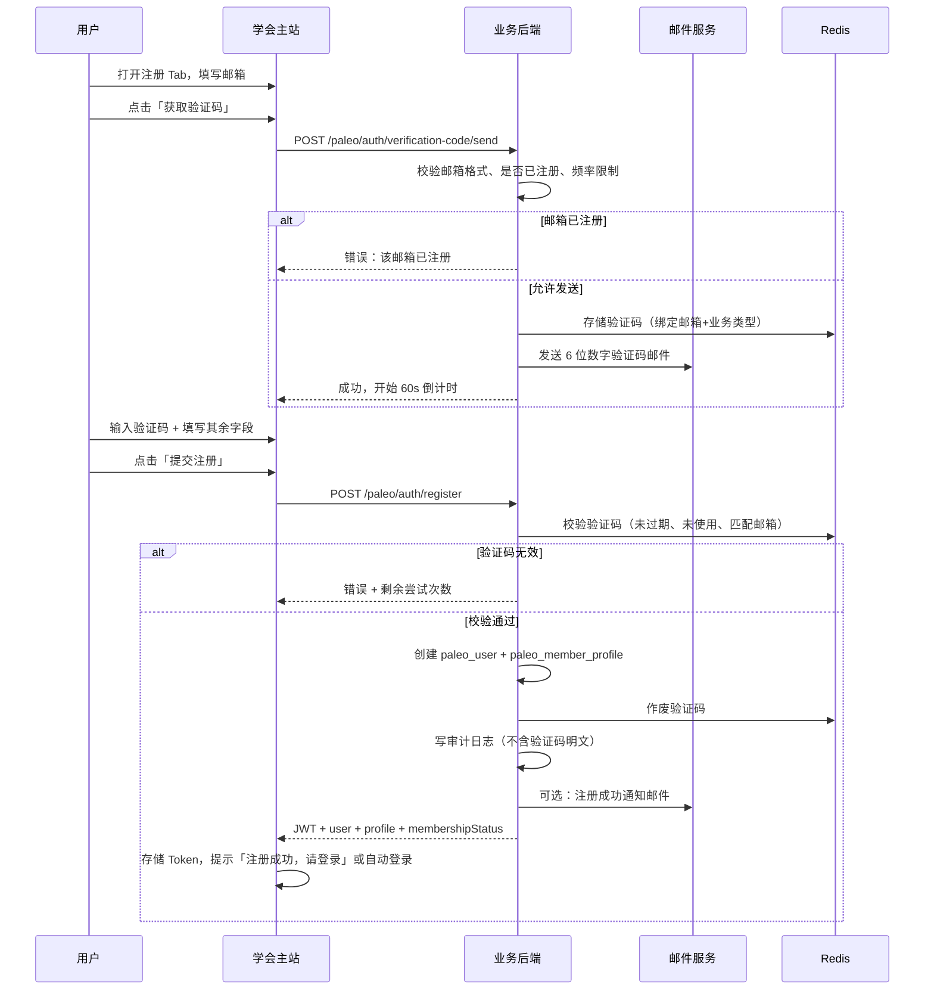
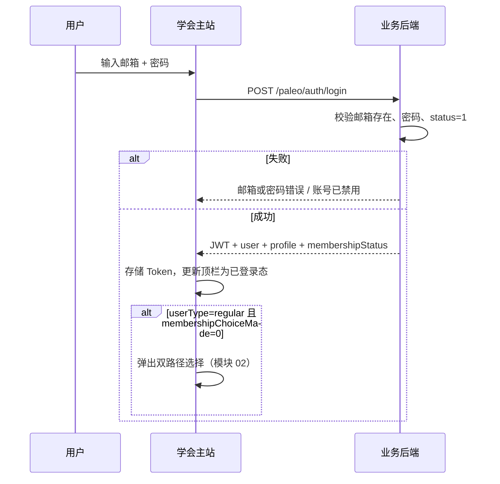

# 01 用户登录注册模块需求

| 字段 | 内容 |
|------|------|
| 文档名称 | 用户登录注册流程模块 PRD |
| 模块编号 | 01 |
| 版本 | v1.0 |
| 编写日期 | 2026-07-06 |
| 文档状态 | 初稿（待人工校验） |
| 前置基准 | [中国古生物学会完整需求文档.md](../中国古生物学会完整需求文档.md) v3.1 |
| 适用端 | 学会主站（前台用户） |
| 关联原型 | `paleontology-website-latest` · `paleontology-cms-backend` |
| 不在本模块范围 | 管理后台管理员登录（见模块 17）、双路径会员选择弹窗（见模块 02）、入会/退会全流程（见模块 03） |

---

## 目录

1. [模块概述](#1-模块概述)
2. [业务背景与目标](#2-业务背景与目标)
3. [角色与权限边界](#3-角色与权限边界)
4. [业务流程](#4-业务流程)
5. [页面原型说明](#5-页面原型说明)
6. [字段与校验规则](#6-字段与校验规则)
7. [接口需求](#7-接口需求)
8. [数据模型](#8-数据模型)
9. [安全与频率限制](#9-安全与频率限制)
10. [异常处理](#10-异常处理)
11. [与下游模块衔接](#11-与下游模块衔接)
12. [原型差距与改造清单](#12-原型差距与改造清单)
13. [验收标准](#13-验收标准)
14. [附录](#14-附录)

---

## 1. 模块概述

### 1.1 模块定位

本模块负责**学会主站前台用户**的账号全生命周期入口能力，包括：

- 邮箱验证码注册（实名信息采集）
- 邮箱 + 密码登录
- 忘记密码 / 重置密码
- 会话维持与安全退出
- 个人资料只读/可改字段约束（登录后基础能力）
- 修改密码、注销账号（服务端完成）

注册成功后用户身份为 **普通用户（`regular`）**，须在首次登录后进入**双路径会员选择**（由模块 02 承接，本模块仅负责触发条件与状态回传）。

### 1.2 核心设计原则（继承总需求）

| 原则 | 本模块落地 |
|------|------------|
| 单账号全局通用 | 一个邮箱对应一个账号，全站 12 个学会单元通用 |
| 邮箱实名验证 | 注册须邮箱验证码，校验通过方可提交 |
| 服务端持久化 | 用户、会话、验证码、审计均入库/入 Redis，不依赖浏览器本地模拟 |
| 与管理端隔离 | 前台用户表 `paleo_user` 与管理员表 `cms_admin_user` 完全分离 |

### 1.3 系统边界

```
┌─────────────────────────────────────────────────────────────┐
│  学会主站（paleontology-website-latest）                      │
│  LoginJoinDialog · PartyLayout 顶栏 · PersonalCenter        │
└──────────────────────────┬──────────────────────────────────┘
                           │ HTTPS / JWT
┌──────────────────────────▼──────────────────────────────────┐
│  业务后端（paleontology-cms-backend）                        │
│  /paleo/auth/* · 邮件服务 · Redis 验证码 · 审计日志          │
└──────────────────────────┬──────────────────────────────────┘
                           │
          ┌────────────────┼────────────────┐
          ▼                ▼                ▼
      MySQL            Redis           邮件服务
   paleo_user      验证码/限流      SendCloud/企业邮箱
```

**管理后台登录**（`paleontology-admin-latest` → `POST /login`）属于独立认证体系，不在本 PRD 实现范围内，仅作对照参考。

---

## 2. 业务背景与目标

### 2.1 业务背景

中国古生物学会网站需支撑会员注册、会费缴纳、会议报名等核心业务。所有业务办理均以**已注册、已登录**的学会用户为前提。邮箱作为全局唯一登录标识，须通过验证码确认归属，以满足实名制与后续财务凭证核对（姓名与付款方比对）要求。

### 2.2 模块目标

| 目标 | 说明 |
|------|------|
| G1 | 用户可在 3 分钟内完成注册并登录 |
| G2 | 杜绝未验证邮箱注册、重复注册、暴力破解 |
| G3 | 注册信息采集满足后续会员/会议业务字段复用 |
| G4 | 登录态跨页面、跨设备（服务端 Token + 用户信息 API）一致 |
| G5 | 忘记密码、修改密码、注销账号均经服务端校验并完成 |

### 2.3 成功指标

- 注册转化率：验证码发送成功率 ≥ 98%
- 注册失败可理解率：所有错误均有中文提示，无裸异常
- 登录接口 P95 响应 < 500ms（不含邮件发送）
- 验收用例 100% 通过（见 §13）

---

## 3. 角色与权限边界

### 3.1 参与角色

| 角色 | 说明 | 本模块能力 |
|------|------|------------|
| 访客 | 未登录访问者 | 浏览公开内容；可打开注册/登录弹窗 |
| 注册用户 | 已完成注册并登录 | 使用个人中心、退出、改密、注销 |
| 学会总管理员 | 后台 `paleo_admin` | 禁用/启用用户账号（间接影响登录） |
| 系统 | 邮件服务、Redis、审计 | 发码、限流、记日志 |

### 3.2 账号状态

| status 值 | 含义 | 登录行为 |
|-----------|------|----------|
| `1` | 正常 | 允许登录 |
| `0` | 已禁用 | 拒绝登录，提示「账号已被禁用，请联系秘书处」 |

禁用操作在后台「非会员/办理中用户管理」或后续用户管理功能中执行，本模块仅校验 `status`。

### 3.3 用户类型（注册后初始值）

| userType | 标签 | 说明 |
|----------|------|------|
| `regular` | 普通用户 | 注册默认；尚未做双路径选择 |
| `non_member` | 非会员 | 模块 02 写入 |
| `member` | 正式会员路径 | 模块 02 写入；正式资格由入会模块认定 |

`membershipChoiceMade`：注册时为 `0`；完成路径选择后为 `1`。

---

## 4. 业务流程

### 4.1 注册流程（含邮箱验证码）



**业务规则摘要：**

1. 必须先通过验证码校验，方可创建账号。
2. 注册成功默认 `userType = regular`，`membershipChoiceMade = 0`。
3. 注册成功后可切换至登录 Tab，或按产品决策自动登录（推荐：提示成功并切登录 Tab，与现有原型一致）。
4. 注册成功**不**自动完成会员路径选择。

### 4.2 登录流程



**页面刷新 / 重开浏览器：**

1. 若本地有有效 Token，调用 `GET /paleo/auth/info` 恢复会话。
2. Token 无效或过期：清除本地 Token，展示未登录态。

### 4.3 忘记密码流程

支持两种等价方案，**任选其一实现，验收前须固定**：

| 方案 | 流程 | 推荐 |
|------|------|------|
| A：验证码重置 | 输入邮箱 → 获取验证码 → 输入验证码 + 新密码 → 提交 | ✓ 与注册一致，实现成本低 |
| B：邮件链接重置 | 输入邮箱 → 收邮件点击链接 → 打开重置页设新密码 | 原型文案已倾向此方案 |

**共同规则：**

- 使用业务类型 `RESET_PASSWORD`，与注册验证码不可混用。
- 邮箱不存在时：**统一提示**「若该邮箱已注册，您将收到重置邮件」，防止枚举（方案 B）；或明确提示不存在（方案 A，与注册发码策略一致时可区分）。
- 重置成功后旧 Token 全部失效（JWT 黑名单或短 TTL 策略）。

### 4.4 安全退出

1. 用户点击顶栏「安全退出」或个人中心「安全退出」。
2. 前端清除 `paleo_user_token` 及会话相关本地缓存（**不**删除已持久化到服务端的业务数据）。
3. 可选：调用 `POST /paleo/auth/logout` 将 Token 加入 Redis 黑名单。
4. 跳转首页或保持当前公开页。

### 4.5 修改密码（登录后）

1. 个人中心 → 修改密码。
2. 输入原密码、新密码、确认新密码。
3. `PUT /paleo/auth/password`：校验原密码 → 更新 `password_hash` → 可选强制重新登录。

### 4.6 注销账号（登录后）

1. 个人中心 → 注销账号。
2. **两步确认**（输入「确认注销」或勾选风险提示）。
3. `DELETE /paleo/auth/account`：软删除或硬删除策略由技术评审确定；须清除/匿名化关联个人数据，并写审计日志。
4. 清除本地 Token，跳转首页。

> 若账号存在进行中的缴费、会议报名，须提示风险并阻止注销，或转人工处理——具体规则在验收前与秘书处确认。

---

## 5. 页面原型说明

### 5.1 入口与布局

| 入口 | 位置 | 行为 |
|------|------|------|
| 顶栏「登录」 | `PartyLayout` 全局导航右侧 | 打开 `LoginJoinDialog`，默认 Tab = 登录 |
| 顶栏「加入会员」/ 快速入口 | 首页、学会服务 | 未登录：打开注册 Tab；已登录且未完成入会：引导入会（非本模块） |
| 个人中心 | `/personal-center` | 已登录可访问；未登录重定向或提示登录 |
| 业务页拦截 | 学会服务、会议报名等 | 需登录操作触发登录弹窗 |

**登录态顶栏展示：**

- 未登录：`登录` 按钮
- 已登录：用户姓名、消息铃铛、下拉菜单（个人中心、安全退出）

参考实现：`paleontology-website-latest/client/src/components/PartyLayout.tsx`

### 5.2 登录/注册弹窗（LoginJoinDialog）

**组件**：`LoginJoinDialog.tsx`  
**形式**：全屏遮罩 + 居中卡片弹窗（max-width ~512px），z-index 高于导航。

#### 5.2.1 视觉规范（Strata & Heritage）

| 元素 | 规范 |
|------|------|
| 标题区背景 | Strata Deep Blue `#002B49` |
| 边框 | Fossil Stone `#E5E1DA` |
| 主按钮 | `#002B49`，hover `#001f35` |
| 错误提示 | Party Red 系，字段下 12px 文案 |
| 圆角 | `rounded-lg` / `rounded-xl`（学术风格，非大圆角） |
| 图标 | Material Symbols Outlined |

#### 5.2.2 Tab 结构

| Tab | 标题文案 | 说明 |
|-----|----------|------|
| login | 账号登录 · SIGN IN | 默认 |
| register | 注册账号 · REGISTER | |
| forgot | 重置密码 · RESET PASSWORD | 从登录页「忘记密码？」进入 |

Tab 切换时**保留已填字段**（同一会话内）；关闭弹窗后可选择清空（建议清空密码类字段）。

#### 5.2.3 登录 Tab 线框

```
┌─────────────────────────────────────────────┐
│ [icon] 账号登录 · SIGN IN              [×]  │  ← 深蓝标题栏
├─────────────────────────────────────────────┤
│  [ 账号登录 ]  [ 注册账号 ]                  │  ← Tab
│                                             │
│  电子邮箱 *                                  │
│  [ mail icon | example@paleontology.org.cn ] │
│                                             │
│  登录密码 *              忘记密码？           │
│  [ lock icon | •••••••• ]                   │
│                                             │
│  ┌─────────────────────────────────────┐   │
│  │ [ 立即登录 ]                         │   │
│  └─────────────────────────────────────┘   │
│  还没有账号？ 立即注册                        │
└─────────────────────────────────────────────┘
```

#### 5.2.4 注册 Tab 线框（须新增验证码区）

```
┌─────────────────────────────────────────────┐
│ 真实姓名 *          │ 性别 *                │
│ 电子邮箱 *（注册后不可修改）                  │
│                                             │
│ 邮箱验证码 *  ← 【v3.1 新增，原型待补】       │
│ [ 输入 6 位验证码 ]  [ 获取验证码 60s ]      │
│                                             │
│ 登录密码 *          │ 确认密码 *            │
│ 工作/学习单位 *     │ 职务类型（可选）       │
│                     │ [学生][教师][嘉宾]    │
│ 职称（可选）                                 │
│                                             │
│  [ 提交注册 ]                                │
│  已有账号？ 立即注册                          │
└─────────────────────────────────────────────┘
```

**职务类型**（原型已有，与总需求对齐）：

- 学生
- 教师 / 科研人员（非学生）
- 嘉宾 / 其他（非学生）

选择「学生」时 `isStudent = 1`，影响后续会员费档位（模块 03）。

#### 5.2.5 忘记密码 Tab 线框

```
┌─────────────────────────────────────────────┐
│ 说明：将向注册邮箱发送重置指引…              │
│ 注册电子邮箱 *                               │
│ [ mail icon | email ]                       │
│ [ 返回登录 ]  [ 发送重置邮件 / 确认重置 ]    │
└─────────────────────────────────────────────┘
```

若采用验证码方案，须增加验证码输入框与新密码字段（可合并为单页或第二步）。

### 5.3 个人中心相关页面（登录后）

| 区块 | 路径/Tab | 本模块相关字段 |
|------|----------|----------------|
| 个人资料 | 个人中心 · 资料 | 邮箱只读；姓名、性别、单位、职务可改 |
| 修改密码 | 个人中心 · 安全 | 原密码、新密码、确认密码 |
| 注销账号 | 个人中心 · 安全 | 两步确认 + 风险提示 |
| 安全退出 | 顶栏下拉 / 个人中心 | 清除会话 |

### 5.4 交互状态说明

| 状态 | UI 表现 |
|------|---------|
| 提交中 | 主按钮 loading，禁用重复提交 |
| 验证码倒计时 | 按钮文案「60s 后重新获取」，倒计时结束前不可点 |
| 字段错误 | 输入框红色边框 + 下方错误文案 |
| 全局错误 | `sonner` Toast，中文说明 |
| 注册成功 | Toast「注册成功，请登录」+ 自动切登录 Tab |
| 登录成功 | 关闭弹窗 + Toast「欢迎回来，{姓名}」 |

---

## 6. 字段与校验规则

### 6.1 注册字段

| 字段 | 必填 | 前端校验 | 后端校验 | 入库字段 | 备注 |
|------|:----:|----------|----------|----------|------|
| email | ✓ | 合法邮箱格式；trim 小写 | 唯一；未注册 | `paleo_user.email` | **注册后不可修改** |
| verificationCode | ✓ | 6 位数字 | Redis 校验 | 不入库 | v3.1 新增 |
| password | ✓ | 长度 ≥ 6 | 同左 | `password_hash` | BCrypt 存储 |
| confirmPassword | ✓ | 与 password 一致 | — | — | 仅前端 |
| name | ✓ | 非空；1~50 字 | 同左 | `user_name` | 实名制，供凭证核对 |
| gender | ✓ | 男 / 女 | 枚举 | `gender` | |
| unit | ✓ | 非空；1~200 字 | 同左 | `unit` | 工作单位 |
| role | — | 学生/教师/嘉宾 | 同左 | `role_label` | 默认「教师」 |
| title | — | ≤ 50 字 | 同左 | `title` | 职称可选 |
| isStudent | — | role=学生 → 1 | 同左 | `is_student` | |

### 6.2 登录字段

| 字段 | 必填 | 校验 |
|------|:----:|------|
| email | ✓ | 合法邮箱格式 |
| password | ✓ | 非空 |

### 6.3 忘记密码 / 修改密码字段

| 场景 | 字段 | 校验 |
|------|------|------|
| 忘记密码 | email | 合法邮箱 |
| 忘记密码 | verificationCode | 6 位数字（若用验证码方案） |
| 忘记密码 | newPassword | ≥ 6 位 |
| 忘记密码 | confirmPassword | 与新密码一致 |
| 修改密码 | oldPassword | 非空；须与库中匹配 |
| 修改密码 | newPassword | ≥ 6 位；不得与旧密码相同（建议） |
| 修改密码 | confirmPassword | 与新密码一致 |

### 6.4 个人资料更新（登录后）

| 字段 | 可修改 | 说明 |
|------|:------:|------|
| email | ✗ | 只读展示 |
| user_name | ✓ | |
| gender | ✓ | |
| unit | ✓ | |
| role_label | ✓ | |
| title | ✓ | |
| is_student | ✓ | 随 role 联动 |

接口：`PUT /paleo/auth/profile`（已实现，本模块复用）。

### 6.5 邮箱验证码规则（注册 / 忘记密码）

| 项目 | 规则 |
|------|------|
| 格式 | 6 位纯数字 |
| 有效期 | 5~10 分钟，默认 10 分钟，可后台配置 |
| 一次性 | 校验成功后立即失效 |
| 邮箱绑定 | 验证码与请求邮箱绑定；换邮箱须重新获取 |
| 业务类型 | `REGISTER` / `RESET_PASSWORD` 分离 |
| 错误尝试 | 连续 5 次失败后锁定该邮箱 15 分钟 |
| 错误提示 | 展示剩余可尝试次数 |

### 6.6 发送频率限制

| 限制项 | 值 |
|--------|-----|
| 同邮箱发送间隔 | ≥ 60 秒 |
| 同邮箱每日上限 | ≤ 10 次 |
| 同 IP 每日上限 | ≤ 30 次（可配置） |

---

## 7. 接口需求

### 7.1 通用约定

| 项目 | 约定 |
|------|------|
| 基础路径 | `/paleo/auth` |
| 认证方式 | `Authorization: Bearer {JWT}`（除匿名接口） |
| 响应格式 | `{ "code": 200, "msg": "...", "data": { ... } }` |
| 错误码 | `code != 200`；401 未登录；403 无权限；429 频率限制 |
| Token 存储 | 前端 `localStorage` key：`paleo_user_token` |

### 7.2 接口清单

#### 7.2.1 发送邮箱验证码 【待实现】

```
POST /paleo/auth/verification-code/send
```

**请求体：**

```json
{
  "email": "user@example.com",
  "bizType": "REGISTER"
}
```

`bizType` 枚举：`REGISTER` | `RESET_PASSWORD`

**成功响应：**

```json
{
  "code": 200,
  "msg": "验证码已发送",
  "data": {
    "cooldownSeconds": 60,
    "expireMinutes": 10
  }
}
```

**业务逻辑：**

1. 校验邮箱格式。
2. `REGISTER`：若邮箱已注册 → 返回「该邮箱已注册」，**不发送**。
3. `RESET_PASSWORD`：若邮箱不存在 → 按安全策略返回（见 §4.3）。
4. 频率限制校验（§6.6）。
5. 生成 6 位数字码，存 Redis，发邮件。
6. 写发送日志（邮箱、时间、IP、成功/失败，**不含明文验证码**）。

---

#### 7.2.2 校验验证码（可选独立接口）

```
POST /paleo/auth/verification-code/verify
```

用于「先验码、后填表」交互；若注册接口内一并校验，本接口可省略。

---

#### 7.2.3 用户注册 【改造：增加验证码参数】

```
POST /paleo/auth/verification-code/send  （前置）
POST /paleo/auth/register
```

**现状**：`UserAuthController` + `PaleoUserService.register` 已实现，**缺少验证码校验**。

**请求体（扩展）：**

```json
{
  "email": "user@example.com",
  "password": "******",
  "verificationCode": "123456",
  "name": "张三",
  "gender": "男",
  "unit": "南京大学",
  "role": "教师",
  "title": "副教授",
  "isStudent": false
}
```

**成功响应：**

```json
{
  "code": 200,
  "data": {
    "token": "eyJ...",
    "user": {
      "userId": 1,
      "email": "user@example.com",
      "userName": "张三",
      "gender": "男",
      "unit": "南京大学",
      "roleLabel": "教师",
      "title": "副教授",
      "isStudent": "0",
      "userType": "regular",
      "membershipChoiceMade": "0"
    },
    "profile": { "userId": 1, "memberStatus": "PENDING", ... },
    "membershipStatus": "not_member"
  }
}
```

**说明**：注册成功可返回 Token（与现原型 `registerUser` 一致），但 UI 仍建议引导用户确认后登录。

---

#### 7.2.4 用户登录 【已实现】

```
POST /paleo/auth/login
```

**请求体：**

```json
{
  "email": "demo@paleontology.org.cn",
  "password": "demo123"
}
```

**错误场景：**

| 条件 | msg |
|------|-----|
| 邮箱或密码错误 | 邮箱或密码错误 |
| status = 0 | 账号已被禁用，请联系秘书处 |
| 参数为空 | 邮箱和密码不能为空 |

---

#### 7.2.5 当前用户信息 【已实现】

```
GET /paleo/auth/info
```

用于页面刷新恢复会话；返回 `user`、`profile`、`membershipStatus`。

---

#### 7.2.6 更新个人资料 【已实现】

```
PUT /paleo/auth/profile
```

---

#### 7.2.7 更新会员路径 【已实现，模块 02 调用】

```
PUT /paleo/auth/user-type
```

本模块登录成功后根据返回值决定是否触发模块 02 弹窗。

---

#### 7.2.8 忘记密码 【待实现】

```
POST /paleo/auth/password/forgot
```

验证码方案请求体示例：

```json
{
  "email": "user@example.com",
  "verificationCode": "123456",
  "newPassword": "******"
}
```

链接方案：

```
POST /paleo/auth/password/forgot-request   → 发邮件
POST /paleo/auth/password/reset            → token + newPassword
```

---

#### 7.2.9 修改密码 【待实现】

```
PUT /paleo/auth/password
```

```json
{
  "oldPassword": "******",
  "newPassword": "******"
}
```

---

#### 7.2.10 安全退出 【建议实现】

```
POST /paleo/auth/logout
```

将当前 Token 加入 Redis 黑名单直至过期。

---

#### 7.2.11 注销账号 【待实现】

```
DELETE /paleo/auth/account
```

```json
{
  "confirmText": "确认注销",
  "password": "******"
}
```

---

### 7.3 邮件模板要求

#### 注册验证码邮件

| 项 | 内容 |
|----|------|
| 主题 | 【中国古生物学会】注册验证码 |
| 正文 | 用途说明、6 位验证码、有效期（分钟）、勿泄露、学会署名与联系方式 |
| 发件人 | 学会官方邮箱或已备案域名 |

#### 忘记密码邮件

按选定方案：验证码或含一次性 Token 的重置链接（链接有效期建议 30 分钟）。

#### 注册成功通知（可选）

欢迎加入中国古生物学会网站，提示首次登录后选择参与方式。

---

## 8. 数据模型

### 8.1 paleo_user（已有）

| 字段 | 类型 | 说明 |
|------|------|------|
| user_id | BIGINT PK | |
| email | VARCHAR UNIQUE | 登录账号 |
| password_hash | VARCHAR | BCrypt |
| user_name | VARCHAR | 姓名 |
| gender | VARCHAR | 男/女 |
| unit | VARCHAR | 单位 |
| role_label | VARCHAR | 学生/教师/嘉宾 |
| title | VARCHAR | 职称 |
| is_student | CHAR(1) | 0/1 |
| user_type | VARCHAR | regular/non_member/member |
| membership_choice_made | CHAR(1) | 0/1 |
| status | CHAR(1) | 1 正常 / 0 禁用 |
| create_time | DATETIME | |
| update_time | DATETIME | |

### 8.2 paleo_member_profile（注册时自动创建）

注册成功后 `PaleoMemberProfileService.getOrCreate` 初始化档案，`member_status` 初始为 `PENDING`。

### 8.3 Redis 验证码结构（建议）

```
Key:   paleo:vc:{bizType}:{email}
Value: { "code": "123456", "attempts": 0, "createdAt": ... }
TTL:   600s（10 分钟）
```

### 8.4 验证码发送日志表（建议新增）

| 字段 | 说明 |
|------|------|
| id | PK |
| email | 目标邮箱 |
| biz_type | REGISTER / RESET_PASSWORD |
| client_ip | |
| send_status | SUCCESS / FAILED |
| fail_reason | |
| created_at | |

**不存储明文验证码。**

### 8.5 审计日志

注册成功写入 `paleo_audit_log`，动作类型建议：`USER_REGISTER`，详情含 userId、email、姓名，**不含密码与验证码**。

---

## 9. 安全与频率限制

| 措施 | 说明 |
|------|------|
| 密码存储 | BCrypt（`PasswordEncoder`，已用） |
| HTTPS | 生产环境强制 |
| JWT | 短期有效 + 可选刷新；退出加黑名单 |
| 验证码 | Redis + TTL + 一次性 + 业务类型隔离 |
| 防枚举 | 登录失败统一文案；忘记密码按方案处理 |
| 防刷 | IP/邮箱频率限制；连续错误锁定 |
| 敏感字段 | 接口响应永不返回 `password_hash` |
| 演示账号 | `demo@paleontology.org.cn` / `demo123` 仅用于验收演示 |

---

## 10. 异常处理

### 10.1 前端异常

| 场景 | 用户提示 | 系统行为 |
|------|----------|----------|
| 网络断开 | 网络异常，请稍后重试 | 保留已填表单 |
| 401 | 登录已过期，请重新登录 | 清 Token，开登录弹窗 |
| 429 | 操作过于频繁，请稍后再试 | 禁用发码按钮 |
| 5xx | 系统繁忙，请稍后重试 | 记录前端日志 |

### 10.2 注册异常

| 场景 | HTTP | msg 示例 |
|------|------|----------|
| 邮箱已注册 | 200 code≠200 | 该邮箱已注册 |
| 验证码错误 | 200 code≠200 | 验证码错误，还可尝试 N 次 |
| 验证码过期 | 200 code≠200 | 验证码已过期，请重新获取 |
| 邮箱未验证 | 200 code≠200 | 请先完成邮箱验证 |
| 验证码未提供 | 200 code≠200 | 请输入邮箱验证码 |
| 字段缺失 | 200 code≠200 | 请填写所有必填项 |
| 发送过于频繁 | 429 | 请 60 秒后再试 |
| 邮箱被锁定 | 200 code≠200 | 验证失败次数过多，请 15 分钟后再试 |

### 10.3 登录异常

| 场景 | msg |
|------|-----|
| 凭证错误 | 邮箱或密码错误 |
| 账号禁用 | 账号已被禁用，请联系秘书处 |
| 空字段 | 请填写邮箱和密码 |

### 10.4 邮件发送失败

- 自动重试（建议 3 次，指数退避）。
- 仍失败：返回「验证码发送失败，请稍后重试」，记发送日志 `FAILED`。
- 管理端可查询发送日志排查。

---

## 11. 与下游模块衔接

| 下游模块 | 衔接点 | 本模块输出 |
|----------|--------|------------|
| 02 双路径会员选择 | 登录成功且 `userType=regular` ∧ `membershipChoiceMade=0` | 触发 `MembershipChoiceDialog` |
| 03 入会/会费 | 注册字段 `name`、`isStudent` | 供申请书与会费档位使用 |
| 04 分会绑定 | 须已登录且已完成路径选择 | 依赖本模块 JWT |
| 15 消息通知 | 注册成功、忘记密码 | 邮件 + 可选站内通知 |
| 17 后台用户管理 | 禁用账号 | 影响登录接口 |

**首次登录完整链路：**

```
注册 → 登录 → [本模块结束] → 双路径选择 → 非会员/正式会员路径
```

---

## 12. 原型差距与改造清单

对照当前代码库（2026-07-06）：

| 项 | 原型现状 | 目标状态 | 优先级 |
|----|----------|----------|--------|
| 注册邮箱验证码 UI | `LoginJoinDialog` 无验证码字段 | 增加验证码输入 + 获取按钮 + 倒计时 | P0 |
| 注册 API 验码 | `PaleoUserService.register` 无验码 | 注册前校验 Redis 验证码 | P0 |
| 发码 API | 不存在 | 新增 `verification-code/send` | P0 |
| 邮件服务 | 未接入 | SendCloud / 企业邮箱 | P0 |
| 忘记密码 | `MembershipContext.resetPassword` 仍为 localStorage 模拟 | 对接服务端 + 邮件 | P0 |
| 修改密码 | 个人中心可能未接 API | `PUT /paleo/auth/password` | P1 |
| 注销账号 | 部分 localStorage 逻辑 | `DELETE /paleo/auth/account` 服务端 | P1 |
| 退出登录 | 仅清本地 | 可选 Token 黑名单 | P2 |
| 账号禁用 | `findByEmail` 已过滤 status=1 | 登录时明确提示禁用 | P1 |
| 管理端登录 | `admin-latest` 独立 | 保持分离，不纳入本模块 | — |

**前端关键文件：**

- `paleontology-website-latest/client/src/components/LoginJoinDialog.tsx`
- `paleontology-website-latest/client/src/contexts/MembershipContext.tsx`
- `paleontology-website-latest/client/src/lib/membership-api.ts`

**后端关键文件：**

- `paleontology-cms-backend/.../controller/UserAuthController.java`
- `paleontology-cms-backend/.../service/PaleoUserService.java`

---

## 13. 验收标准

### 13.1 注册

- [ ] 未填写或未通过邮箱验证码时，无法提交注册
- [ ] 验证码 6 位数字，邮件 10 分钟内有效（可配置）
- [ ] 验证码使用后立即失效，不可重复使用
- [ ] 换邮箱后须重新获取验证码
- [ ] 已注册邮箱点击获取验证码提示「该邮箱已注册」且不发送
- [ ] 同邮箱 60 秒内不可重复发送；日上限 10 次；IP 日上限 30 次
- [ ] 连续 5 次验证码错误锁定 15 分钟
- [ ] 注册成功创建 `paleo_user`（`userType=regular`）及 `paleo_member_profile`
- [ ] 密码 BCrypt 存储，接口不返回密码哈希
- [ ] 注册字段校验与 §6.1 一致
- [ ] 注册成功写审计日志（无验证码明文）

### 13.2 登录与会话

- [ ] 邮箱 + 密码登录成功返回 JWT
- [ ] 错误密码提示「邮箱或密码错误」，不泄露邮箱是否存在
- [ ] 禁用账号无法登录，提示联系秘书处
- [ ] 刷新页面后 `GET /paleo/auth/info` 可恢复登录态
- [ ] Token 失效后自动退出并提示重新登录
- [ ] 顶栏正确切换未登录/已登录展示
- [ ] 登录成功后，若 `regular` 且未选择路径，弹出双路径对话框（模块 02 联调）

### 13.3 忘记密码 / 修改密码 / 注销

- [ ] 忘记密码通过服务端 + 邮件完成，不再使用 localStorage 模拟
- [ ] 注册验证码与忘记密码验证码业务类型隔离
- [ ] 修改密码须验证原密码
- [ ] 注销账号两步确认，服务端删除/匿名化并清会话

### 13.4 安全与非功能

- [ ] 核心业务数据不依赖 `paleo_user_db` 等浏览器模拟库（生产路径）
- [ ] 邮件服务可用，发送失败有重试与日志
- [ ] 管理端可查验证码发送日志（无明文验证码）
- [ ] 演示账号 `demo@paleontology.org.cn` / `demo123` 可完成登录验收

### 13.5 界面

- [ ] 弹窗视觉符合 Strata & Heritage 规范（#002B49 主色）
- [ ] 移动端弹窗可滚动，字段不溢出
- [ ] 所有错误与成功提示为中文 Toast 或行内文案
- [ ] 提交中按钮 loading，防重复提交

---

## 14. 附录

### 14.1 演示账号

| 端 | 邮箱 | 密码 | 说明 |
|----|------|------|------|
| 学会主站 | demo@paleontology.org.cn | demo123 | `DemoUserInitializer` |
| 管理后台 | admin@paleontology.org.cn | admin123 | 仅管理端验收，非本模块 |

### 14.2 相关总需求章节映射

| 总需求章节 | 本模块覆盖 |
|------------|------------|
| §7.1 注册规则 | §6.1、§7.2.3 |
| §7.2 邮箱验证码 | §4.1、§6.5、§7.2.1 |
| §7.3 登录 | §4.2、§7.2.4 |
| §7.4 个人中心（部分） | §4.5、§4.6、§5.3 |
| §22.1 验收（注册登录子集） | §13 |

### 14.3 待人工确认项

| 编号 | 问题 | 建议 |
|------|------|------|
| Q1 | 忘记密码用验证码还是邮件链接？ | 验证码方案，与注册一致 |
| Q2 | 注册成功是否自动登录？ | 切登录 Tab，不自动登录 |
| Q3 | 注销时存在进行中业务是否允许？ | 阻止并提示先处理 |
| Q4 | JWT 有效期多长？ | 7 天 + 滑动刷新或 24h 纯 JWT |
| Q5 | 职务类型「嘉宾」是否保留？ | 原型已有，总需求写「其他」，可映射为嘉宾 |

---

**文档结束**

*本文档为模块化 PRD 初稿，须经人工校验业务细节后作为开发与测试依据。变更请同步更新版本号并回写总需求文档相关章节。*
