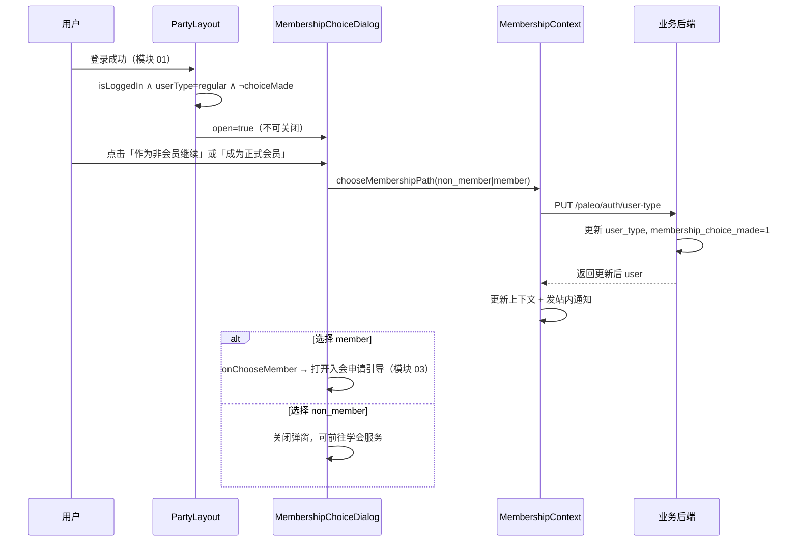

# 02 双路径会员选择模块需求

| 字段 | 内容 |
|------|------|
| 文档名称 | 双路径会员选择模块 PRD |
| 模块编号 | 02 |
| 版本 | v1.0 |
| 编写日期 | 2026-07-06 |
| 文档状态 | 初稿（待人工校验） |
| 前置基准 | [中国古生物学会完整需求文档.md](../中国古生物学会完整需求文档.md) v3.1 §8 |
| 适用端 | 学会主站（前台用户） |
| 上游模块 | [01_用户登录注册模块需求.md](./01_用户登录注册模块需求.md) |
| 下游模块 | [03_入会退会申请](./03_入会退会申请模块需求.md)（路径 B）· [05_分会绑定](./05_分会绑定与可见性模块需求.md) · [06_会议报名](./06_会议发布与会议费报名模块需求.md) |
| 关联原型 | `paleontology-website-latest` · `paleontology-cms-backend` |
| 不在本模块范围 | 入会申请书审核（模块 03）、会费缴纳（模块 04）、会员到期降级细节（模块 08）、后台用户分类统计（模块 13） |

---

## 目录

1. [模块概述](#1-模块概述)
2. [业务背景与目标](#2-业务背景与目标)
3. [角色与身份模型](#3-角色与身份模型)
4. [业务流程](#4-业务流程)
5. [页面原型说明](#5-页面原型说明)
6. [权限与价格规则](#6-权限与价格规则)
7. [字段与状态规则](#7-字段与状态规则)
8. [接口需求](#8-接口需求)
9. [数据模型](#9-数据模型)
10. [异常处理](#10-异常处理)
11. [与上下游模块衔接](#11-与上下游模块衔接)
12. [原型差距与改造清单](#12-原型差距与改造清单)
13. [验收标准](#13-验收标准)
14. [附录](#14-附录)

---

## 1. 模块概述

### 1.1 模块定位

本模块实现中国古生物学会网站的**双路径会员体系**入口：用户在完成注册并首次登录后，必须在两条参与路径中**二选一**：

| 路径 | 标识 | 用户选择文案 | 核心差异 |
|------|------|--------------|----------|
| **路径 A** | `non_member` | 作为非会员继续 | 无需缴会费；可立即绑定分会、报名会议；会议费按非会员价 |
| **路径 B** | `member` | 成为正式会员 | 须完成入会全流程（模块 03～04）；通过后享会员价参会 |

选择前用户为 **普通用户（`regular`）**；选择后写入服务端，**重复登录不再弹出**选择弹窗。

> **重要区分**：`userType = member` 表示用户**选择了正式会员路径**，不等于已是「正式会员（`active`）」。后者须完成入会申请 + 会费两阶段审核（模块 03、04）。

### 1.2 核心设计原则

| 原则 | 本模块落地 |
|------|------------|
| 不可跳过 | 弹窗无关闭按钮、无 ESC 跳过；未选择前限制核心业务 |
| 一次选择、持久化 | `userType` + `membershipChoiceMade` 服务端存储 |
| 可升级、不可随意降级 | 非会员可随时升级为正式会员路径；已生效正式会员须走退会（模块 03） |
| 价格可预期 | 非会员会议费 = 会员基准价 × 1.1（向上取整） |
| 单账号全局通用 | 路径选择与 12 个学会单元共享 |

### 1.3 系统边界

```
┌──────────────────────────────────────────────────────────────┐
│ 学会主站                                                      │
│  MembershipChoiceDialog（首次选择）                          │
│  Services 会员服务 Tab（非会员升级入口）                       │
│  PartyLayout（触发条件）                                      │
│  MembershipContext（userType / chooseMembershipPath）        │
└────────────────────────────┬─────────────────────────────────┘
                             │ PUT /paleo/auth/user-type
┌────────────────────────────▼─────────────────────────────────┐
│ 业务后端                                                      │
│  PaleoUserService.updateUserType                               │
│  paleo_user.user_type / membership_choice_made               │
└──────────────────────────────────────────────────────────────┘
```

---

## 2. 业务背景与目标

### 2.1 业务背景

学会需同时服务两类人群：**尚未缴纳会费但希望参会的外部用户**，以及**愿意缴纳年费、享受会员价的正式会员**。若注册后强制缴费，会流失大量会议参与者；若默认全员会员价，则无法区分会费贡献。

双路径设计在**降低注册门槛**与**保障会员权益**之间取得平衡，也是秘书处 2026-06-12 需求取舍的确认方案。

### 2.2 模块目标

| 目标 | 说明 |
|------|------|
| G1 | 100% 新用户在首次登录后完成路径选择，无遗漏 |
| G2 | 选择结果前后端一致，换设备登录不重复弹窗 |
| G3 | 普通用户在未完成选择前无法绑定分会、报名会议 |
| G4 | 非会员可随时升级，无需注销重注册 |
| G5 | 会议费、权限判断统一基于 `userType` + `membershipStatus` 组合 |

### 2.3 不在本模块实现

- 入会申请书上传与审核（模块 03）
- 会费凭证/发票缴纳（模块 04）
- 会员到期后 `userType` 自动降为 `non_member`（模块 08，本模块定义初始选择语义）

---

## 3. 角色与身份模型

### 3.1 三种前台身份（userType）

| 身份 | 标识 | 标签 | 说明 |
|------|------|------|------|
| 普通用户 | `regular` | 普通用户 | 刚注册或尚未完成路径选择 |
| 非会员 | `non_member` | 非会员 | 选择路径 A |
| 正式会员路径 | `member` | 正式会员（办理中/已生效） | 选择路径 B；UI 标签随 `membershipStatus` 细化 |

### 3.2 userType 与 membershipStatus 的关系

| userType | membershipStatus 示例 | 用户感知 |
|----------|----------------------|----------|
| `regular` | `not_member` | 须完成路径选择 |
| `non_member` | `not_member` | 非会员，可按非会员价参会 |
| `member` | `not_member` / `application_submitted` / … | 已选路径 B，办理中 |
| `member` | `active` | **正式会员**（三步全流程完成） |
| `non_member` | `expired`（模块 08） | 曾系会员，到期后降为非会员 |

**定价与权限主键**：

- **能否绑定分会 / 报名**：看 `userType !== regular` 且 `membershipChoiceMade === true`
- **会议费档位**：看 `userType` + 用户是否学生（`isStudent` / `roleLabel`）
- **是否正式会员统计**：看 `membershipStatus === active`（模块 13、15）

### 3.3 membershipChoiceMade 语义

| 值 | 含义 |
|----|------|
| `0` / `false` | 尚未完成双路径选择 |
| `1` / `true` | 已完成选择（含路径 A 或 B） |

**派生规则**（与原型 `resolveMembershipChoiceMade` 一致）：

- 若 `userType` 为 `non_member` 或 `member`，视为已选择（`membershipChoiceMade = true`）
- 若 `userType` 为 `regular`，以库中 `membership_choice_made` 字段为准

---

## 4. 业务流程

### 4.1 首次登录路径选择（主流程）



**触发条件（须同时满足）**：

```
isLoggedIn === true
AND userType === "regular"
AND membershipChoiceMade === false
```

**弹窗行为**：

- **无右上角关闭按钮**（原型已符合）
- **不响应遮罩点击关闭**
- **不响应 ESC 关闭**（建议实现）
- 选择完成前，拦截需身份的业务操作并引导完成选择

### 4.2 路径 A：作为非会员继续

```
选择 non_member
  → userType = non_member, membershipChoiceMade = 1
  → 站内通知：「已选择作为非会员使用…」
  → 立即可：绑定分会（模块 05）、报名会议（模块 06，非会员价）
  → 不可：缴纳会费、享受会员价
```

### 4.3 路径 B：成为正式会员

```
选择 member
  → userType = member, membershipChoiceMade = 1
  → 站内通知：「已选择成为正式会员…」
  → 引导打开入会申请弹窗（MembershipApplicationDialog，模块 03）
  → 在入会/会费完成前：按办理中状态展示，会议费仍可能按非会员或办理中规则（见 §6.2）
```

### 4.4 非会员升级为正式会员（二次入口）

**入口**：学会服务 → 会员服务 Tab（`Services.tsx`）

| 场景 | UI |
|------|-----|
| `userType === non_member` | 展示「升级为正式会员（¥{标准会费}/年）」按钮 |
| 会议报名页 | 可展示节省金额提示，引导升级 |

**流程**：

```
非会员点击「升级为正式会员」
  → chooseMembershipPath("member")（同 4.3，但不再弹 MembershipChoiceDialog）
  → 进入入会申请流程（模块 03）
```

**规则**：

- 同一账号升级，**无需注销重注册**
- 升级后 `userType` 由 `non_member` → `member`
- `membershipChoiceMade` 保持 `1`
- 已绑定的分会**保留**

### 4.5 路径变更限制

| 变更 | 是否允许 | 说明 |
|------|:--------:|------|
| regular → non_member | ✓ | 首次选择路径 A |
| regular → member | ✓ | 首次选择路径 B |
| non_member → member | ✓ | 升级 |
| member → non_member（手动） | ✗ | 不允许自助降级 |
| member(active) → non_member | 仅退会 | 模块 03 退会审核通过后由系统写入 |
| 重新选择 regular | ✗ | 不支持回退到「未选择」 |

### 4.6 会员到期与路径（与模块 08 衔接）

会员资格到期后（`membershipStatus = expired`）：

- `userType` 降为 `non_member`（模块 08 写入）
- `membershipChoiceMade` **保持为 1**，**不再次弹出**双路径选择弹窗
- 分会绑定保留；可按非会员价继续参会

---

## 5. 页面原型说明

### 5.1 组件清单

| 组件 | 文件 | 职责 |
|------|------|------|
| MembershipChoiceDialog | `MembershipChoiceDialog.tsx` | 首次双路径选择弹窗 |
| PartyLayout | `PartyLayout.tsx` | 监听登录态，控制弹窗显示 |
| MembershipApplicationDialog | `MembershipApplicationDialog.tsx` | 选路径 B 后的入会引导（模块 03 交界） |
| Services 会员服务 | `Services.tsx` | 非会员升级、状态展示 |

### 5.2 MembershipChoiceDialog 线框

```
┌─────────────────────────────────────────────────────────┐
│ 欢迎来到中国古生物学会                          [无 ×]  │  z-index: 110
│ WELCOME TO PSC DIGITAL PLATFORM                         │
├─────────────────────────────────────────────────────────┤
│           请选择您的参与方式                               │
│                                                         │
│  ┌─────────────────────┐  ┌─────────────────────┐      │
│  │ 成为正式会员         │  │ 作为非会员继续       │      │
│  │ ¥200/年             │  │ 免费                 │      │
│  │ · 会员价参会         │  │ · 非会员价参会       │      │
│  │ · 须提交入会申请书   │  │ · 无需缴费           │      │
│  │ · 缴费后有效期一年   │  │ · 可直接绑定分会     │      │
│  │ [ 选择此方式 ]       │  │ [ 选择此方式 ]       │      │
│  └─────────────────────┘  └─────────────────────┘      │
│                                                         │
│  选择后可随时在「学会服务 - 会员服务」中变更              │
└─────────────────────────────────────────────────────────┘
```

### 5.3 视觉规范

| 元素 | 规范 |
|------|------|
| 遮罩 | `bg-black/60 backdrop-blur-sm` |
| 标题栏 | `#002B49`，与 LoginJoinDialog 一致 |
| 路径 B 卡片 | 深蓝边框 `border-2 border-[#002B49]`，背景 `#FCFAF7` |
| 路径 A 卡片 | 浅灰边框 `border-[#E5E1DA]`，hover 加深 |
| 主按钮（路径 B） | 实心 `#002B49` |
| 次按钮（路径 A） | 描边按钮 |
| 会费展示 | 动态读取 `getMembershipFee("standard")`，默认 ¥200 |

### 5.4 文案要求

**路径 B 卡片要点**：

- 展示当前年度标准会费（非学生 ¥200/年；学生价在入会流程中按身份适用，见模块 04）
- 明确须提交入会申请书并审核
- 明确须完成缴费，有效期一年

**路径 A 卡片要点**：

- 标明「免费」
- 说明按非会员价参会（学生/非学生四类定价中的非会员档）
- 说明无需缴费即可绑定分会与报名

**底部提示**：

> 选择后可随时在「学会服务 - 会员服务」中变更

（仅非会员 → 正式会员方向的「变更」；不可误解为可降回普通用户。）

### 5.5 交互状态

| 状态 | 表现 |
|------|------|
| 弹窗打开 | 页面滚动锁定；焦点陷阱在弹窗内 |
| 点击选项 | 按钮 loading；防重复提交 |
| 选择成功 | Toast + 关闭弹窗 + 发站内通知 |
| 选择 member | 链式打开 `MembershipApplicationDialog`（`onChooseMember`） |
| API 失败 | Toast 错误，弹窗保持打开，可重试 |

### 5.6 学会服务 — 非会员升级区块（Services.tsx）

当 `userType === "non_member"` 时，会员服务 Tab 展示：

```
当前身份：非会员
会议注册费将按非会员标准收取。
升级为正式会员可享受优惠价。
[ 升级为正式会员（¥200/年） ]
```

会议报名流程中可展示差价提示，例如：

> 升级为正式会员（¥200/年）后，本次会议可节省 ¥{差额}。

### 5.7 个人中心身份展示

个人中心「会员状态」区域须区分展示：

| 条件 | 展示文案建议 |
|------|--------------|
| regular + 未选择 | 「请完成参与方式选择」+ 引导按钮 |
| non_member | 「非会员」 |
| member + 办理中 | 「正式会员（办理中）」+ 进度 |
| member + active | 「正式会员」+ 有效期 |

（个人中心 UI 分散在多处，本模块定义状态语义，具体布局可在模块 03/04 联调时完善。）

---

## 6. 权限与价格规则

### 6.1 能力矩阵（§8.3）

| 能力 | 普通用户 regular | 非会员 non_member | 正式会员路径 member |
|------|:----------------:|:-----------------:|:-------------------:|
| 浏览公开内容 | ✓ | ✓ | ✓ |
| 绑定分会 | ✗ | ✓ | ✓（办理中亦可） |
| 报名会议 | ✗ | ✓ | ✓（见 §6.2） |
| 缴纳会费 | ✗ | ✗ | ✓ |
| 下载盖章会议通知 | ✗ | 报名确认后 ✓ | 报名确认后 ✓ |

### 6.2 会议费计价规则

**非会员价**：

```
非会员会议费 = Math.round(会员基准价 × 1.1)
```

实现参考：`shared/constants.ts` → `getConferenceFee(confId, userType)`

**四类会议费**（Phase 0 模型）：

| 档位 | 适用 |
|------|------|
| `student_member` | 学生 + 会员路径且可享会员价 |
| `non_student_member` | 非学生 + 会员路径且可享会员价 |
| `student_non_member` | 学生 + 非会员 |
| `non_student_non_member` | 非学生 + 非会员 |

**userType 与会员价资格**：

| userType | membershipStatus | 会议费档位 |
|----------|------------------|------------|
| `regular` | — | 不可报名 |
| `non_member` | `not_member` 等 | 非会员档 |
| `member` | 非 `active` | 非会员档或办理中提示（与模块 06 一致：未生效前按非会员价） |
| `member` | `active` | 会员档 |

> 会议通知须**同时标明**会员价与非会员价（模块 06/14 发布规范）。

### 6.3 业务拦截规则

当 `userType === "regular"` 或 `!membershipChoiceMade` 时：

| 操作 | 拦截行为 |
|------|----------|
| 绑定分会 | Toast「请先选择参与方式」或自动打开 ChoiceDialog |
| 会议报名 | 同上 |
| 缴纳会费 | Toast「请先选择成为正式会员」 |

参考：`MembershipContext` 中 `toggleBranchBinding`、`registerForConference` 等前置校验。

---

## 7. 字段与状态规则

### 7.1 服务端字段

| 字段 | 表 | 类型 | 说明 |
|------|-----|------|------|
| user_type | paleo_user | VARCHAR | `regular` / `non_member` / `member` |
| membership_choice_made | paleo_user | CHAR(1) | `0` 未选择 / `1` 已选择 |

### 7.2 选择请求参数

| 参数 | 类型 | 必填 | 校验 |
|------|------|:----:|------|
| userType | string | ✓ | 仅允许 `non_member` 或 `member` |
| membershipChoiceMade | boolean | ✓ | 须为 `true` |

### 7.3 状态迁移表

| 当前 userType | 操作 | 新 userType | choiceMade |
|---------------|------|-------------|------------|
| regular | 选路径 A | non_member | 1 |
| regular | 选路径 B | member | 1 |
| non_member | 升级 | member | 1 |
| member | — | 不可自助改为 non_member | — |

### 7.4 前端上下文

| 状态 | 存储 | 说明 |
|------|------|------|
| userType | React Context + 服务端 | 以 API 为准 |
| membershipChoiceMade | React Context + 服务端 | 以 API 为准 |
| ~~paleo_user_type_{email}~~ | localStorage | **生产环境废弃**，仅原型兼容 |

---

## 8. 接口需求

### 8.1 更新会员路径 【已实现，须强化校验】

```
PUT /paleo/auth/user-type
Authorization: Bearer {token}
```

**请求体：**

```json
{
  "userType": "non_member",
  "membershipChoiceMade": true
}
```

**成功响应：**

```json
{
  "code": 200,
  "data": {
    "userId": 1,
    "email": "user@example.com",
    "userType": "non_member",
    "membershipChoiceMade": "1",
    "userName": "张三",
    ...
  }
}
```

**业务逻辑（须在 PaleoUserService 补充）**：

1. 须已登录。
2. `userType` 仅接受 `non_member` | `member`。
3. `membershipChoiceMade` 必须为 `true`。
4. 若当前为 `regular`：允许首次选择。
5. 若当前为 `non_member` 且请求 `member`：允许升级。
6. 若当前为 `member` 且请求 `non_member`：**拒绝**（须走退会流程）。
7. 若当前为 `member` 且请求 `member`：幂等成功。
8. 写审计日志：`USER_TYPE_CHOICE`，含 old/new userType。

### 8.2 读取身份（登录/刷新时）【已实现】

```
GET /paleo/auth/info
```

返回 `user.userType`、`user.membershipChoiceMade`，供前端判断是否弹窗。

**前端初始化逻辑**（`MembershipContext` 已有）：

1. 登录/注册成功后读取 `userType`、`membershipChoiceMade`。
2. 若 API 返回 `userType` 为 `member`/`non_member` 但 `membershipChoiceMade` 为 `0`，应自动补写为 `1`（数据修复）。

### 8.3 会费配置读取（展示用）

弹窗展示「¥200/年」可来自：

| 优先级 | 来源 |
|--------|------|
| 1 | 后台配置 API（若已实现） |
| 2 | `MEMBERSHIP_FEE_CONFIG.default.standard`（200） |
| 3 | `getMembershipFee("standard")` |

### 8.4 站内通知（模块 16 接入）

路径选择成功后写入通知（服务端持久化）：

| 路径 | 标题 | 内容摘要 |
|------|------|----------|
| non_member | 已选择：作为非会员使用 | 可直接绑定分会；会议费按非会员标准；可升级 |
| member | 已选择：成为正式会员 | 请完成入会申请与会费缴纳 |

---

## 9. 数据模型

### 9.1 paleo_user（相关字段）

```sql
-- 已有字段，本模块核心
user_type              VARCHAR(32)  DEFAULT 'regular'
membership_choice_made CHAR(1)      DEFAULT '0'
```

### 9.2 审计日志

| 字段 | 示例 |
|------|------|
| action | `USER_TYPE_CHOICE` |
| detail | `用户 张三(user@example.com) 选择参与方式：非会员` |

### 9.3 统计口径（供模块 13、15 引用）

| 指标 | 口径 |
|------|------|
| 非会员数 | `user_type = non_member` 且非 active 正式会员 |
| 入会办理中 | `user_type = member` 且 `membershipStatus` 在办理流水线 |
| 普通用户（未选择） | `user_type = regular` 且 `membership_choice_made = 0` |

---

## 10. 异常处理

### 10.1 前端

| 场景 | 提示 | 行为 |
|------|------|------|
| 未登录调用 chooseMembershipPath | 请先登录系统 | 打开登录弹窗 |
| API 更新失败 | 选择保存失败，请重试 | 保持 ChoiceDialog 打开 |
| 网络超时 | 网络异常，请稍后重试 | 可重试 |
| 重复点击 | 按钮 loading 禁用 | 防双写 |

### 10.2 后端

| 场景 | code | msg |
|------|------|-----|
| 未登录 | 401 | 未登录 |
| userType 非法 | 400 | 无效的用户类型 |
| member → non_member | 400 | 请通过退会流程变更身份 |
| 用户不存在 | 404 | 用户不存在 |

### 10.3 数据不一致修复

| 场景 | 处理 |
|------|------|
| userType=member 但 choiceMade=0 | `GET /info` 或登录时后端自动修正 choiceMade=1 |
| 前端 localStorage 与 API 不一致 | **以 API 为准**，清除旧版 `paleo_user_type_*` 键 |

---

## 11. 与上下游模块衔接

### 11.1 上游：模块 01 登录注册

| 衔接点 | 说明 |
|--------|------|
| 注册默认 | `userType=regular`, `membershipChoiceMade=0` |
| 登录成功 | PartyLayout 检测并可能打开 ChoiceDialog |
| Token | 选择路径 API 须带 JWT |

### 11.2 下游：模块 03 入会退会

| 衔接点 | 说明 |
|--------|------|
| 选路径 B | 打开 `MembershipApplicationDialog` |
| 正式会员认定 | 不改变 userType，改变 membershipStatus → active |
| 退会通过 | userType → non_member（模块 03/08） |

### 11.3 下游：模块 05 分会绑定

| userType | 可否绑定 |
|----------|----------|
| regular | ✗ |
| non_member / member | ✓ |

### 11.4 下游：模块 06 会议报名

- 费用计算依赖 `userType` + 学生身份
- `regular` 不可报名

### 11.5 下游：模块 16 消息通知

- 路径选择完成触发站内通知
- 邮件可选（非必须）

---

## 12. 原型差距与改造清单

| 项 | 原型现状 | 目标 | 优先级 |
|----|----------|------|--------|
| 弹窗不可关闭 | 已无 × 按钮 | 补充禁用 ESC、遮罩点击 | P1 |
| API 失败回退 | catch 后仍 `applyUserIdentity` 本地写入 | **生产环境 API 失败则不更新本地** | P0 |
| 后端降级校验 | `updateUserType` 无 member→non_member 拦截 | 增加业务规则校验 + 审计 | P0 |
| localStorage 身份 | 仍有 `paleo_user_type_*` 兼容 | 生产以 API 为准，移除双写 | P1 |
| choiceMade 修复 | 前端有补写逻辑 | 后端 `GET /info` 同步修复 | P1 |
| 会费金额 | 读 localStorage 配置 | 对接后台配置或固定常量 | P2 |
| 办理中会议价 | 部分逻辑在 Context | 与模块 06 统一四类定价函数 | P1 |
| 站内通知 | 仅前端 `addNotification` | 服务端持久化（模块 16） | P1 |

**关键文件：**

- `client/src/components/MembershipChoiceDialog.tsx`
- `client/src/components/PartyLayout.tsx`
- `client/src/contexts/MembershipContext.tsx` → `chooseMembershipPath`
- `client/src/pages/Services.tsx` → 升级入口
- `shared/constants.ts` → `USER_TYPE`、`getConferenceFee`
- `UserAuthController.java` / `PaleoUserService.java`

---

## 13. 验收标准

### 13.1 首次路径选择

- [ ] 注册登录后，`regular` 且未选择时自动弹出 MembershipChoiceDialog
- [ ] 弹窗无关闭按钮，不可通过遮罩/ESC 跳过
- [ ] 选择前无法绑定分会、无法报名会议
- [ ] 选择路径 A 后：`userType=non_member`，`membershipChoiceMade=1`，弹窗不再出现
- [ ] 选择路径 B 后：`userType=member`，`membershipChoiceMade=1`，引导入会申请
- [ ] 选择结果写入服务端，换设备登录不重复弹窗
- [ ] 选择成功有 Toast 与站内通知

### 13.2 非会员升级

- [ ] 非会员可在学会服务中升级为正式会员路径
- [ ] 升级后 `userType` 变为 `member`，无需注销账号
- [ ] 已绑定分会在升级后保留

### 13.3 权限与价格

- [ ] 能力矩阵与 §6.1 一致
- [ ] 非会员会议费 = 会员基准价 × 1.1（向上取整）
- [ ] `userType=member` 且未 `active` 时不按正式会员统计（后台口径）

### 13.4 限制与异常

- [ ] 已选正式会员路径不可自助改回非会员
- [ ] API 失败时不应仅本地生效（生产环境）
- [ ] member→non_member 非法请求被后端拒绝
- [ ] 审计日志记录路径选择操作

### 13.5 联调

- [ ] 与模块 01 登录注册联调通过
- [ ] 选路径 B 后可进入模块 03 入会申请
- [ ] 选路径 A 后可进入模块 05 分会绑定

---

## 14. 附录

### 14.1 用户类型枚举

| 值 | 标签 | 常量 |
|----|------|------|
| regular | 普通用户 | `USER_TYPE.REGULAR` |
| non_member | 非会员 | `USER_TYPE.NON_MEMBER` |
| member | 正式会员 | `USER_TYPE.MEMBER` |

### 14.2 相关总需求章节

| 章节 | 内容 |
|------|------|
| §8.1 | 三种前台身份 |
| §8.2 | 首次登录路径选择 |
| §8.3 | 权限与价格差异 |
| §8.4 | 会员类型扩展预留 |
| §5.1 | 学会服务 — 路径选择与升级 |
| §22.1 | 首次登录弹出路径选择，不可跳过 |

### 14.3 待人工确认项

| 编号 | 问题 | 建议 |
|------|------|------|
| Q1 | `member` 办理中报名会议按哪档价？ | 按非会员档，直至 `active` |
| Q2 | 底部文案「可随时变更」是否改为「可升级」？ | 改为「非会员可升级为正式会员」更准确 |
| Q3 | 选择路径 B 是否强制立即打开入会弹窗？ | 保持链式打开，可跳过稍后在学会服务提交 |
| Q4 | 学生会费 ¥100 是否在 ChoiceDialog 展示？ | 仅展示标准价 ¥200，学生价在入会/缴费环节体现 |

### 14.4 修订记录

| 版本 | 日期 | 说明 |
|------|------|------|
| v1.0 | 2026-07-06 | 初稿 |

---

**文档结束**

*本文档为模块化 PRD 初稿，须经人工校验后作为开发与测试依据。*
