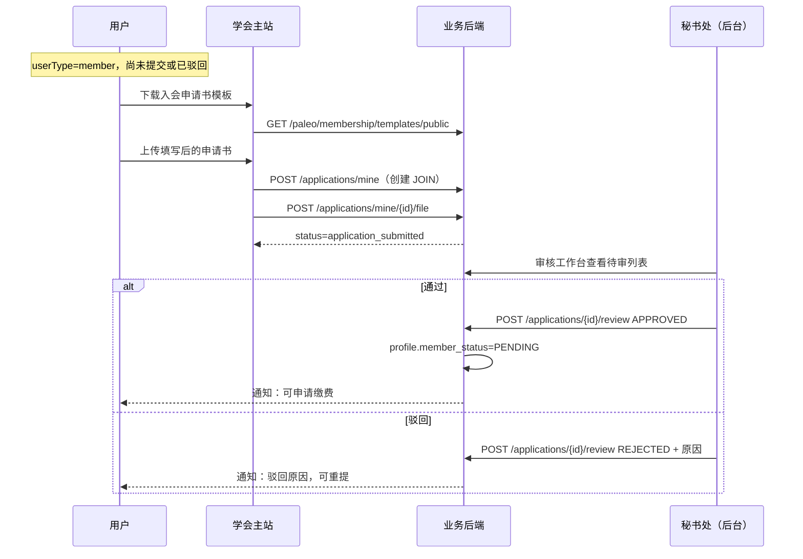
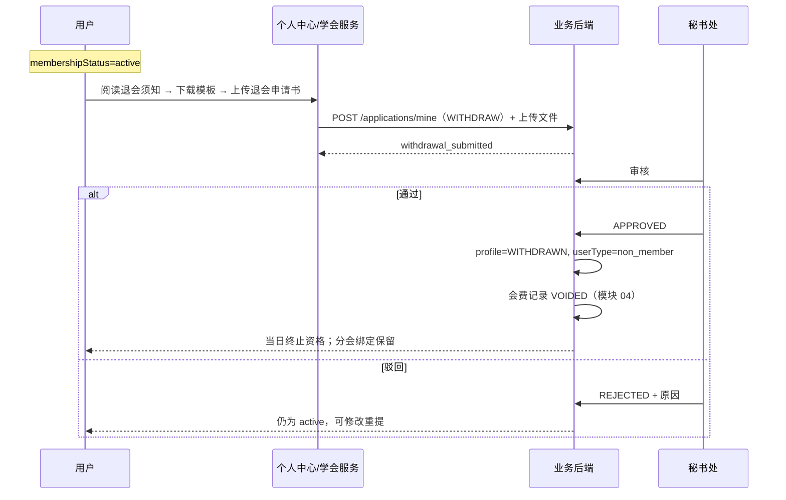

# 03 入会退会申请模块需求

| 字段 | 内容 |
|------|------|
| 文档名称 | 入会/退会申请模块 PRD |
| 模块编号 | 03 |
| 版本 | v1.0 |
| 编写日期 | 2026-07-06 |
| 文档状态 | 初稿（待人工校验） |
| 前置基准 | [中国古生物学会完整需求文档.md](../中国古生物学会完整需求文档.md) v3.1 §9 |
| 上游模块 | [02_双路径会员选择](./02_双路径会员选择模块需求.md) |
| 下游模块 | [04_会员费缴纳](./04_会员费缴纳模块需求.md) · [08_会员到期](./08_会员到期与会议资格模块需求.md) · [12_审核工作台](./12_审核工作台模块需求.md) · [13_用户管理](./13_用户管理模块需求.md) |
| 关联原型 | `paleontology-website-latest` · `paleontology-admin-latest` · `paleontology-cms-backend` |
| 不在本模块范围 | 会费凭证/发票缴纳（模块 04）、会议报名（模块 06）、会员到期自动处理（模块 08）、模板后台上传 UI 细节（模块 14/17 交界） |

---

## 目录

1. [模块概述](#1-模块概述)
2. [业务背景与目标](#2-业务背景与目标)
3. [角色与权限](#3-角色与权限)
4. [业务流程](#4-业务流程)
5. [页面原型说明](#5-页面原型说明)
6. [状态机与字段规则](#6-状态机与字段规则)
7. [接口需求](#7-接口需求)
8. [数据模型](#8-数据模型)
9. [异常处理](#9-异常处理)
10. [与上下游模块衔接](#10-与上下游模块衔接)
11. [原型差距与改造清单](#11-原型差距与改造清单)
12. [验收标准](#12-验收标准)
13. [附录](#13-附录)

---

## 1. 模块概述

### 1.1 模块定位

本模块实现**正式会员认定流程的第一步**与**主动退会流程**：

| 业务 | 说明 |
|------|------|
| **入会申请（JOIN）** | 选择正式会员路径（`userType=member`）的用户，须提交电子版入会申请书，经秘书处审核通过后方可进入会费缴纳（模块 04） |
| **退会申请（WITHDRAW）** | 仅**会员资格有效（`active`）**的用户可提交退会申请书，经秘书处审核通过后**当日**终止会员资格 |

正式会员完整认定须三步全部通过（§9.1）：

```
① 入会申请书审核通过  ← 本模块
② 会费凭证审核通过    ← 模块 04
③ 会费发票审核通过    ← 模块 04 → active
```

中间状态用户计入后台「**入会办理中**」，**不计入**正式会员统计。

### 1.2 核心设计原则

| 原则 | 本模块落地 |
|------|------------|
| 学生与非学生均须提交 | 入会申请书为必传，不因学生身份豁免 |
| 秘书处专审 | 入会/退会仅**学会总管理员**可审，财务审核员不可审 |
| 待审可撤回 | 用户可取消 PENDING 状态的申请 |
| 不可重复待审 | 同类型仅允许一条 PENDING 申请 |
| 驳回可重提 | 驳回须填原因，用户可重新提交 |
| 退会保留绑定 | 退会后分会绑定保留，可按非会员价参会 |
| 再次入会无需解锁 | 退会/过期后可重新提交入会申请 |

### 1.3 系统边界

```
┌─────────────────────────────────────────────────────────────┐
│ 学会主站                                                     │
│  MembershipApplicationDialog · Services 会员服务 Tab          │
│  PersonalCenter 退会申请区                                   │
└──────────────────────────┬──────────────────────────────────┘
                           │
┌──────────────────────────▼──────────────────────────────────┐
│ 管理后台                                                     │
│  AuditWorkbench → 入会申请 Tab · 退会申请 Tab                │
└──────────────────────────┬──────────────────────────────────┘
                           │ REST API
┌──────────────────────────▼──────────────────────────────────┐
│ 业务后端                                                     │
│  paleo_membership_application · paleo_member_profile         │
│  paleo_membership_template · OSS 文件存储 · 审计日志         │
└──────────────────────────────────────────────────────────────┘
```

---

## 2. 业务背景与目标

### 2.1 业务背景

中国古生物学会要求新会员履行**书面入会手续**，退会亦须提交正式申请书。线上系统须将纸质流程电子化：用户下载模板、填写上传，秘书处在线审核，满足审计与档案留存要求。

2026-06-17 需求明确：入会/退会均须上传 Word/PDF 申请书；2026-06-26 确认退会后可重新入会且**无需管理员解锁**。

### 2.2 模块目标

| 目标 | 说明 |
|------|------|
| G1 | 正式会员路径用户 100% 在缴费前完成入会申请书提交 |
| G2 | 秘书处可在审核工作台完成通过/驳回，驳回必填原因 |
| G3 | 退会审核通过后当日终止资格，会费记录作废（模块 04 联动） |
| G4 | 前后台 `membershipStatus` 一致，办理中用户不进「正式会员」名录 |
| G5 | 申请书文件可预览、可审计追溯 |

---

## 3. 角色与权限

### 3.1 参与角色

| 角色 | 入会申请 | 退会申请 | 审核 |
|------|:--------:|:--------:|:----:|
| 访客 | ✗ | ✗ | ✗ |
| 普通用户 regular | ✗ | ✗ | ✗ |
| 非会员 non_member | ✗（须先升级路径） | ✗ | ✗ |
| 正式会员路径 member（办理中） | ✓ | ✗ | ✗ |
| 正式会员 active | 已通过后缴费 | ✓ | ✗ |
| 学会总管理员 | — | — | ✓ 入会/退会 |
| 财务审核员 | — | — | ✗ |
| 分会管理员 | — | — | ✗ |

### 3.2 后台角色映射

| 需求文档角色 | 代码 role Key | 本模块权限 |
|--------------|---------------|------------|
| 学会总管理员 | `super_admin`（原型 `paleo_admin`） | 审核入会/退会、上传模板 |
| 财务审核员 | `finance_reviewer` | **无** |
| 分会管理员 | `branch_admin` | **无** |

---

## 4. 业务流程

### 4.1 入会申请（JOIN）



**前置条件**：

- 已登录
- `userType === "member"`（模块 02 已选择正式会员路径）
- 无同类型 PENDING 申请
- 当前非 `application_submitted` 状态（待审中应走撤销而非新建）

**成功后**：

- `membershipStatus` → `application_submitted`（待审）→ `application_approved`（通过）
- 通过后用户前往学会服务缴纳会费（模块 04）

### 4.2 撤销入会申请

```
用户处于 application_submitted（PENDING）
  → 点击「撤销申请」
  → POST /applications/mine/{id}/cancel
  → 删除待审记录
  → membershipStatus 回退为 not_member（或保持 member 路径但未提交）
```

### 4.3 驳回后重新申请

```
application_rejected
  → 展示驳回原因
  → 用户修改申请书后重新走 4.1 流程
  → 新建一条 JOIN 申请（历史驳回记录保留在库中）
```

### 4.4 退会申请（WITHDRAW）



**前置条件**：

- `membershipStatus === "active"`（仅有效会员）
- 无 PENDING 的 WITHDRAW 申请

**审核通过后**：

- `member_status` → `WITHDRAWN`
- `user_type` → `non_member`（`membership_choice_made` 保持 1）
- 会费缴费记录作废处理
- **分会绑定保留**
- 已确认会议报名资格保留（模块 08 规则）

### 4.5 退会后再次入会

```
withdrawn / expired 用户
  → 在学会服务点击「重新申请入会」或升级路径
  → userType 可为 non_member，须 chooseMembershipPath("member") 或直接 member
  → 重新走 4.1，无需管理员解锁（0626 确认）
```

### 4.6 入会完整流程（三步，跨模块）

```
注册 → 模块02选正式会员
  → 【本模块】下载模板 → 上传入会申请书 → 秘书处审核
      ├── 驳回 → 修改重提
      └── 通过 → 【模块04】上传会费凭证 → 财务审凭证
          ├── 驳回 → 重传凭证
          └── 通过 → 上传发票（7工作日内）→ 财务审发票
              ├── 驳回 → 重传发票
              └── 通过 → 正式会员 active（有效期1年）
```

---

## 5. 页面原型说明

### 5.1 前台入口

| 入口 | 组件/页面 | 场景 |
|------|-----------|------|
| 双路径选择后 | `MembershipApplicationDialog` | 选路径 B 链式打开 |
| 顶栏「加入会员」 | `PartyLayout` → `MembershipApplicationDialog` | 办理中引导 |
| 学会服务 → 会员服务 | `Services.tsx` | 主流程：入会/重申请/状态展示 |
| 个人中心 → 安全/会员 | `PersonalCenter.tsx` | 退会申请（仅 active） |

### 5.2 入会申请弹窗（MembershipApplicationDialog）

**步骤**：

| Step | 内容 |
|------|------|
| 0 | 引导页：「开始申请入会」 |
| 1 | 下载入会申请书模板 |
| 2 | 上传申请书（必填）并提交 |

**状态区块**：

| membershipStatus | UI |
|------------------|-----|
| application_submitted | 黄色提示「审核中」+「撤销申请」 |
| application_approved | 绿色提示「已通过，请前往缴费」 |
| application_rejected | 红色提示 + 驳回原因 +「重新提交」 |

**线框（Step 2 上传）**：

```
┌─────────────────────────────────────────────┐
│ 加入中国古生物学会                      [×] │
│ 正式会员入会申请                             │
├─────────────────────────────────────────────┤
│ Step 2/2：上传入会申请书 【必填】            │
│ ┌─ ─ ─ ─ ─ ─ ─ ─ ─ ─ ─ ─ ─ ─ ─ ─ ─ ┐      │
│ │     cloud_upload  点击上传           │      │
│ │  .doc / .docx / .pdf  ≤20MB       │      │
│ └─ ─ ─ ─ ─ ─ ─ ─ ─ ─ ─ ─ ─ ─ ─ ─ ─ ┘      │
│ [ 上一步 ]  [ 提交申请，等待审核 ]           │
└─────────────────────────────────────────────┘
```

### 5.3 学会服务 — 会员服务 Tab（Services.tsx）

与弹窗逻辑一致，额外包含：

- 非会员升级后入会流程（`appFlowStep` 0→1→2→3）
- 退会/过期后重新申请路径（`isWithdrawn && appFlowStep`）
- 办理中各状态卡片（申请中、已通过、缴费中等，缴费属模块 04）
- 退会审核中、已退会状态展示

### 5.4 个人中心 — 退会申请（PersonalCenter.tsx）

**可见条件**：`societyMembership.status === "active"`

**步骤**：

| Step | 内容 |
|------|------|
| 0 | 退会须知（资格终止、会议保留、记录保留） |
| 1 | 下载退会申请书模板 |
| 2 | 上传并提交 |

**退会须知要点**：

- 审核通过后会员资格**即时终止**
- 已缴费待参会订单**保留**，可按非会员身份参会
- 历史参会记录完整保留
- 分会绑定保留

**审核中状态**：展示橙色「退会申请审核中」，可提供撤销（若原型已支持）。

### 5.5 管理后台 — 审核工作台

**路径**：`AuditWorkbench.tsx`

| Tab | 角色 | 功能 |
|-----|------|------|
| 入会申请 | 学会总管理员 | 待审列表、预览申请书、通过/驳回 |
| 退会申请 | 学会总管理员 | 同上 |

**列表字段**：申请人、邮箱、申请时间、申请书（预览）、操作

**驳回**：必填原因（`RejectReasonDialog`）

**通过入会**：用户进入 `application_approved`，可缴费

**通过退会**：用户当日 `withdrawn`，`userType` 降为 `non_member`

### 5.6 申请书模板管理（后台）

| 模板类型 | templateType | 用途 |
|----------|--------------|------|
| 入会 | `JOIN` | 前台下载填写 |
| 退会 | `WITHDRAW` | 前台下载填写 |

- 后台上传 Word 模板（`POST /paleo/membership/templates/{type}/upload`）
- 前台公开读取：`GET /paleo/membership/templates/public`
- 无模板时：提示用户直接上传自备申请书

---

## 6. 状态机与字段规则

### 6.1 前台 membershipStatus（本模块相关）

| 状态 | 标签 | 触发 |
|------|------|------|
| `not_member` | 尚未入会 | 初始 / 撤销后 |
| `application_submitted` | 入会申请审核中 | JOIN 提交且 PENDING |
| `application_rejected` | 入会申请被驳回 | JOIN 审核 REJECTED |
| `application_approved` | 入会申请已通过 | JOIN 审核 APPROVED |
| `withdrawal_submitted` | 退会申请审核中 | WITHDRAW 提交且 PENDING |
| `withdrawal_rejected` | 退会申请被驳回 | WITHDRAW 审核 REJECTED |
| `withdrawn` | 已退会 | WITHDRAW 审核 APPROVED |

### 6.2 申请记录 reviewStatus

| 值 | 含义 |
|----|------|
| `PENDING` | 待审核 |
| `APPROVED` | 已通过 |
| `REJECTED` | 已驳回 |

### 6.3 申请书文件规则

| 项目 | 规则 |
|------|------|
| 格式 | `.doc` / `.docx` / `.pdf` |
| 大小 | ≤ 20MB |
| 必填 | 提交前必须上传成功 |
| 存储 | OSS / 本地存储 URL 写入 `application_file_url` |

### 6.4 业务约束

| 规则 | 说明 |
|------|------|
| 不可重复待审 | 同 `applicationType` 仅一条 `PENDING` |
| 入会适用对象 | `userType=member`；学生与非学生均须提交 |
| 退会适用对象 | 仅 `member_status=ACTIVE` |
| 驳回必填原因 | `review_comment` 非空 |
| 待审可取消 | 仅 `PENDING` 可 `cancel` |
| 通过后不可改申请书 | 须驳回后重新提交 |

### 6.5 创建申请请求字段

| 字段 | JOIN | WITHDRAW | 说明 |
|------|:----:|:--------:|------|
| applicationType | ✓ | ✓ | `JOIN` / `WITHDRAW` |
| applicantName | ✓ | ✓ | 默认当前用户姓名 |
| applicantEmail | ✓ | ✓ | 默认注册邮箱 |
| memberCategory | ✓ | — | 学生/非学生档位，供后续会费匹配 |
| applicationFileUrl | 上传后 | 上传后 | 第二步文件接口写入 |

---

## 7. 接口需求

### 7.1 用户端 — 模板

```
GET /paleo/membership/templates/public
```

**响应示例：**

```json
{
  "code": 200,
  "data": {
    "join": { "fileName": "入会申请书.docx", "fileUrl": "...", "updateTime": "..." },
    "withdraw": { "fileName": "退会申请书.docx", "fileUrl": "...", "updateTime": "..." }
  }
}
```

### 7.2 用户端 — 我的申请列表

```
GET /paleo/membership/applications/mine?applicationType=JOIN|WITHDRAW
Authorization: Bearer {token}
```

### 7.3 用户端 — 创建申请

```
POST /paleo/membership/applications/mine
```

```json
{
  "applicationType": "JOIN",
  "applicantName": "张三",
  "applicantEmail": "user@example.com",
  "memberCategory": "student_member"
}
```

**错误**：

| 条件 | msg |
|------|-----|
| 已有 PENDING 同类型 | 已有待审核的入会/退会申请，请勿重复提交 |
| 退会但非 ACTIVE | 仅有效会员可提交退会申请 |

### 7.4 用户端 — 上传申请书

```
POST /paleo/membership/applications/mine/{applicationId}/file
Content-Type: multipart/form-data
file: (binary)
```

**校验**：格式、大小；仅本人且 `PENDING` 可上传/更新。

### 7.5 用户端 — 撤回申请

```
POST /paleo/membership/applications/mine/{applicationId}/cancel
```

### 7.6 管理端 — 待审列表

```
GET /paleo/membership/applications/reviews/pending?applicationType=JOIN|WITHDRAW
RequireAdminRole: super_admin
```

返回 enriched 列表（含 userName、userEmail、fileName 等，供表格展示）。

### 7.7 管理端 — 审核

```
POST /paleo/membership/applications/{applicationId}/review
RequireAdminRole: super_admin
```

```json
{
  "reviewStatus": "APPROVED",
  "reviewComment": ""
}
```

驳回时：

```json
{
  "reviewStatus": "REJECTED",
  "reviewComment": "申请书信息不完整，请补充单位盖章后重新提交"
}
```

**审核通过副作用**：

| 类型 | 副作用 |
|------|--------|
| JOIN APPROVED | `paleo_member_profile.member_status = PENDING`；写入 `latest_application_id` |
| WITHDRAW APPROVED | `member_status = WITHDRAWN`；`user_type = non_member`；会费 VOIDED |

**审计**：`AuditLogService.logApplicationReview` 写中文可读日志。

### 7.8 管理端 — 模板上传

```
POST /paleo/membership/templates/{templateType}/upload
templateType: join | withdraw
RequireAdminRole: super_admin
```

---

## 8. 数据模型

### 8.1 paleo_membership_application

| 字段 | 类型 | 说明 |
|------|------|------|
| application_id | BIGINT PK | |
| user_id | BIGINT | 申请人 |
| application_type | VARCHAR | `JOIN` / `WITHDRAW` |
| member_category | VARCHAR | 入会时学生/非学生类别 |
| applicant_name | VARCHAR | |
| applicant_email | VARCHAR | |
| application_file_url | VARCHAR | 申请书 OSS URL |
| review_status | VARCHAR | PENDING/APPROVED/REJECTED |
| review_comment | VARCHAR | 驳回原因 |
| reviewer | VARCHAR | 审核人 |
| review_time | DATETIME | |
| create_time | DATETIME | |

### 8.2 paleo_member_profile（本模块写入）

| 操作 | member_status | 其他 |
|------|---------------|------|
| JOIN 通过 | PENDING | 设置 member_category、latest_application_id |
| WITHDRAW 通过 | WITHDRAWN | 清空有效期、latest_payment_id |
| 正式会员认定 | ACTIVE | 模块 04 发票通过后写入 |

### 8.3 paleo_membership_template

| 字段 | 说明 |
|------|------|
| template_type | `JOIN` / `WITHDRAW` |
| file_name | 原始文件名 |
| file_url | 下载地址 |

### 8.4 后台统计口径（模块 13 引用）

| 名录 | 包含用户 |
|------|----------|
| 会员用户管理 | 仅 `active` 正式会员 |
| 非会员/办理中 | `non_member` + 入会办理中（含本模块各中间态） |

---

## 9. 异常处理

### 9.1 用户端

| 场景 | 提示 |
|------|------|
| 未登录 | 请先登录系统 |
| 非 member 路径提交入会 | 请先选择成为正式会员 |
| 非 active 提交退会 | 仅有效会员需提交退会申请书 |
| 重复待审 | 已有待审核的申请… |
| 文件超大/格式错误 | 文件须为 doc/docx/pdf，不超过 20MB |
| 上传失败 | 上传失败，请重试 |
| 无模板 | 当前无可用模板，请直接上传您的申请书 |

### 9.2 管理端

| 场景 | 处理 |
|------|------|
| 驳回未填原因 | 前端拦截 + 后端校验 |
| 非 PENDING 审核 | 只有待审核申请可以审核 |
| 财务角色访问 | 403 无权限 |

### 9.3 通知（模块 16）

| 事件 | 渠道 |
|------|------|
| 入会申请提交 | 站内通知 + 可选邮件 |
| 入会审核通过/驳回 | 站内 + 邮件 |
| 退会申请提交 | 站内 |
| 退会审核通过/驳回 | 站内 + 邮件 |

---

## 10. 与上下游模块衔接

| 模块 | 衔接点 |
|------|--------|
| **02 双路径** | 须 `userType=member` 方可提交 JOIN；选路径 B 后链式打开本模块弹窗 |
| **04 会费缴纳** | `application_approved` 后方可上传凭证；退会通过 VOID 会费 |
| **05 分会绑定** | 办理中可绑定；退会后绑定保留 |
| **08 会员到期** | 过期类似退会后果（降 non_member），但无需申请书 |
| **12 审核工作台** | 本模块申请审核 UI 嵌入 |
| **13 用户管理** | 办理中 vs 正式会员名录划分 |
| **16 横切** | 文件存储、通知、审计 |

---

## 11. 原型差距与改造清单

| 项 | 现状 | 目标 | 优先级 |
|----|------|------|--------|
| 入会/退会 API | 已实现 | 保持，补强校验 | — |
| 财务角色隔离 | `@RequireAdminRole super_admin` | 确认 finance 无入口 | P0 |
| 通知持久化 | 部分仅前端 `addNotification` | 服务端存储（模块 16） | P1 |
| 创建申请无文件 | 先 create 再 upload 两步 | 保持；可选合并为原子接口 | P2 |
| 驳回后状态同步 | 依赖 `syncBusinessStateFromApi` | 审核后 WebSocket/轮询或用户刷新 | P1 |
| OSS 生产路径 | 本地 `LocalFileStorageService` | 生产切换 OSS | P1 |
| 角色命名 | 需求 `paleo_admin` vs 代码 `super_admin` | 文档映射统一 | P2 |
| 入会弹窗可关闭 | 有 × 按钮 | 办理中可关闭；首次引导可保留 | P2 |

**关键文件**：

- 前台：`MembershipApplicationDialog.tsx`、`Services.tsx`、`PersonalCenter.tsx`、`MembershipContext.tsx`
- 后台：`AuditWorkbench.tsx`、`membership-api.ts`（admin）
- 后端：`PaleoMembershipController.java`、`PaleoMembershipApplicationService.java`、`PaleoMemberProfileService.java`

---

## 12. 验收标准

### 12.1 入会申请

- [ ] 仅 `userType=member` 用户可提交入会申请
- [ ] 学生与非学生均须上传申请书
- [ ] 支持 doc/docx/pdf，≤20MB
- [ ] 可下载后台维护的入会模板
- [ ] 提交后状态为 `application_submitted`
- [ ] 待审期间可撤销
- [ ] 不可同时存在两条 PENDING 入会申请
- [ ] 秘书处审核通过后为 `application_approved`，可进入缴费
- [ ] 驳回须展示原因，可重新提交
- [ ] 办理中用户出现在后台「非会员/办理中」，不在「正式会员」

### 12.2 退会申请

- [ ] 仅 `active` 正式会员可提交退会申请
- [ ] 须上传退会申请书
- [ ] 待审可撤销
- [ ] 秘书处审核通过后当日终止资格（`withdrawn`）
- [ ] 退会后 `userType=non_member`，分会绑定保留
- [ ] 会费记录作废处理（与模块 04 联调）
- [ ] 已确认会议报名资格按模块 08 保留

### 12.3 再次入会

- [ ] 退会/过期用户可重新提交入会申请
- [ ] **无需**管理员解锁

### 12.4 管理后台

- [ ] 仅学会总管理员可审核入会/退会
- [ ] 财务审核员无入会/退会 Tab 或接口 403
- [ ] 可预览申请书文件
- [ ] 驳回必填原因
- [ ] 审核操作写入审计日志（中文摘要）

### 12.5 三步认定（跨模块联调）

- [ ] 正式会员须依次：申请书通过 → 凭证通过 → 发票通过
- [ ] 任一步未完成不计入正式会员统计

---

## 13. 附录

### 13.1 状态标签映射

参见 `shared/constants.ts` → `MEMBERSHIP_STATUS_LABEL`

### 13.2 相关总需求章节

| 章节 | 内容 |
|------|------|
| §9.1 | 正式会员认定三步 |
| §9.2 | 入会申请书规则 |
| §9.3 | 退会机制 |
| §9.4 | 入会完整流程图 |
| §17.4 | 审核工作台入会/退会 Tab |
| §17.10 | 申请书模板维护 |
| §22.1 | 三步认定、退会、再次入会 |

### 13.3 待人工确认项

| 编号 | 问题 | 建议 |
|------|------|------|
| Q1 | 入会申请待审期间是否允许绑定分会？ | 允许（原型已允许 member 路径） |
| Q2 | 撤销入会后 userType 是否仍为 member？ | 是，保持路径 B |
| Q3 | 退会审核中是否允许续费？ | 不允许，待审期间冻结续费操作 |
| Q4 | 秘书处审核 SLA 是否写进 UI？ | 保留「1-3 个工作日」提示文案 |

### 13.4 修订记录

| 版本 | 日期 | 说明 |
|------|------|------|
| v1.0 | 2026-07-06 | 初稿 |

---

**文档结束**

*本文档为模块化 PRD 初稿，须经人工校验后作为开发与测试依据。*
