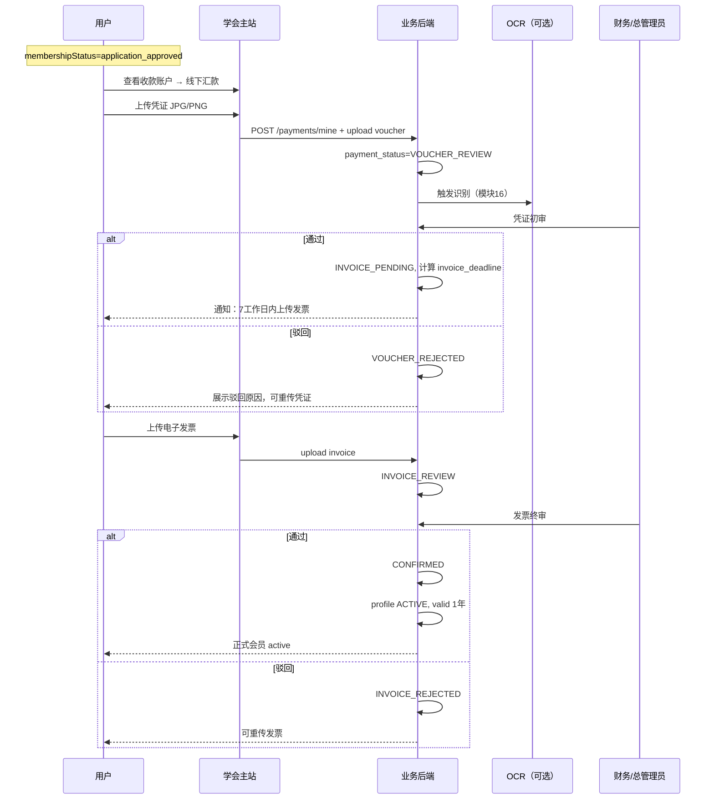

# 04 会员费缴纳模块需求

| 字段 | 内容 |
|------|------|
| 文档名称 | 会员费缴纳（两阶段审核）模块 PRD |
| 模块编号 | 04 |
| 版本 | v1.0 |
| 编写日期 | 2026-07-06 |
| 文档状态 | 初稿（待人工校验） |
| 前置基准 | [中国古生物学会完整需求文档.md](../中国古生物学会完整需求文档.md) v3.1 §10 |
| 上游模块 | [03_入会退会申请](./03_入会退会申请模块需求.md) |
| 下游模块 | [08_会员到期](./08_会员到期与会议资格模块需求.md) · [12_审核工作台](./12_审核工作台模块需求.md) · [13_用户管理](./13_用户管理模块需求.md) · [15_统计导出](./15_统计与财务导出模块需求.md) |
| 关联原型 | `paleontology-website-latest` · `paleontology-admin-latest` · `paleontology-cms-backend` |
| 不在本模块范围 | 会议费两阶段缴费（模块 06）、入会/退会申请书（模块 03）、OCR 服务接入细节（模块 16）、财务 ZIP 导出（模块 15） |

---

## 目录

1. [模块概述](#1-模块概述)
2. [业务背景与目标](#2-业务背景与目标)
3. [角色与权限](#3-角色与权限)
4. [业务流程](#4-业务流程)
5. [页面原型说明](#5-页面原型说明)
6. [费用与状态规则](#6-费用与状态规则)
7. [接口需求](#7-接口需求)
8. [数据模型](#8-数据模型)
9. [智能识别与审计](#9-智能识别与审计)
10. [异常处理](#10-异常处理)
11. [与上下游模块衔接](#11-与上下游模块衔接)
12. [原型差距与改造清单](#12-原型差距与改造清单)
13. [验收标准](#13-验收标准)
14. [附录](#14-附录)

---

## 1. 模块概述

### 1.1 模块定位

本模块实现**学会统一会员费**的线下转账 + 两阶段线上审核流程，是正式会员认定流程的**第二、三步**：

```
① 入会申请书通过（模块 03）
② 上传会费凭证 → 财务初审通过  ← 本模块·阶段一
③ 上传会费发票 → 财务终审通过  ← 本模块·阶段二 → active
```

**缴费方式**：仅**线下银行转账** + 上传凭证/发票；**不做**微信/支付宝等线上支付（0612 确认）。

**收费原则**：

- 会员费**全站统一收取一次**，不因绑定多个分会重复收费
- **每次只能缴纳一年**，不可一次缴多年
- 提前续费：在原有效期基础上**顺延一年**
- 会员费与会议费**不可合并支付**

### 1.2 核心设计原则

| 原则 | 本模块落地 |
|------|------------|
| 两阶段独立审核 | 凭证初审、发票终审分 Tab，驳回须填原因 |
| 提交后锁定 | 上传后用户不可改；须管理员驳回后方可重传 |
| 发票宽限期 | 凭证通过后 7 个工作日内须上传发票 |
| 逾期仍可传 | 超期变「发票逾期」，资格锁定，但仍可上传 |
| 学生自动匹配 | 按用户 `isStudent` / 角色自动适用 ¥100 或 ¥200 |
| 智能识别兜底 | OCR 比对金额与付款方，可自动通过或转人工（模块 16） |

### 1.3 系统边界

```
┌──────────────────────────────────────────────────────────────┐
│ 学会主站                                                      │
│  Services 会员服务 · 会费缴纳向导（memberPayStep 1~4）        │
│  PersonalCenter 缴费记录                                     │
│  MembershipContext · submitMembershipVoucher/Invoice         │
└──────────────────────────┬───────────────────────────────────┘
                           │
┌──────────────────────────▼───────────────────────────────────┐
│ 管理后台                                                      │
│  AuditWorkbench → 凭证初审 Tab · 发票终审 Tab                  │
│  MemberManagement 缴费历史 · ExtendDeadlineDialog              │
└──────────────────────────┬───────────────────────────────────┘
                           │
┌──────────────────────────▼───────────────────────────────────┐
│ 业务后端                                                      │
│  paleo_membership_payment · PaleoMemberProfile.activate       │
│  PaleoRecognitionService · AuditLogService                   │
└──────────────────────────────────────────────────────────────┘
```

---

## 2. 业务背景与目标

### 2.1 业务背景

学会会费由所财务按**线下转账 + 凭证核对 + 发票归档**习惯管理。系统须将流程线上化，减轻秘书处逐笔人工核验压力，同时满足审计整改对凭证、发票一一绑定、按学会单元分库的要求。

### 2.2 模块目标

| 目标 | 说明 |
|------|------|
| G1 | 入会申请通过后，用户可完成会费缴纳全流程 |
| G2 | 凭证/发票驳回均有原因展示，可重传 |
| G3 | 发票终审通过后 `member_status=ACTIVE`，有效期 1 年 |
| G4 | 财务可在审核工作台批量处理会员费凭证/发票 |
| G5 | 仅 `CONFIRMED` 会费计入统计与正式会员数 |

---

## 3. 角色与权限

### 3.1 用户侧

| 角色/状态 | 可否发起缴费 | 说明 |
|-----------|:------------:|------|
| `application_approved` | ✓ | 首次入会缴费 |
| `active` 且临近到期 | ✓ | 续费 |
| `expired` | ✓ | 过期后续费 |
| `voucher_rejected` / `invoice_rejected` | ✓ | 重传 |
| `invoice_pending` / `invoice_overdue` | 仅发票 | 阶段二 |
| `application_submitted` 等 | ✗ | 须先通过入会申请 |
| `non_member` | ✗ | 须先走正式会员路径 |

### 3.2 管理侧

| 角色 | 凭证初审 | 发票终审 | 延长发票截止日 |
|------|:--------:|:--------:|:--------------:|
| 学会总管理员 `super_admin` | ✓ | ✓ | ✓ |
| 财务审核员 `finance_reviewer` | ✓ | ✓ | ✗（建议仅总管理员） |
| 分会管理员 | ✗ | ✗ | ✗ |

---

## 4. 业务流程

### 4.1 首次缴纳（完整两阶段）



### 4.2 会费缴纳向导步骤（前台）

| Step | 标签 | 内容 |
|------|------|------|
| 1 | 确认会费金额 | 展示应缴金额（学生 ¥100 / 非学生 ¥200）、会员类别说明 |
| 2 | 银行汇款/转账 | 展示学会收款账户、汇款备注要求 |
| 3 | 上传凭证 | 上传转账回单截图 |
| 4 | 上传电子发票 | 仅 `invoice_pending` / `invoice_overdue` 可进入 |

Step 1~3 在首次缴费或凭证驳回重传时使用；Step 4 在凭证初审通过后使用。

### 4.3 续费流程

**触发**：`membershipStatus === active` 且临近到期，或 `expired`

**规则**：

- 仍须走两阶段（凭证 → 发票）
- **有效期计算**：若当前仍有效，新 `valid_end_date` = 原 `valid_end_date` + 1 年；若已过期，从终审通过日起 1 年
- 每次仅缴 1 年
- 无需重新提交入会申请书（除非已退会需重走模块 03）

### 4.4 发票宽限期与逾期

| 事件 | 规则 |
|------|------|
| 凭证初审通过 | `invoice_deadline` = 通过日 + **7 个工作日**（跳过周六日） |
| 距截止 ≤ 3 天 | 发送提醒通知（模块 16） |
| 超过截止日未上传 | `membershipStatus` → `invoice_overdue`；资格锁定 |
| 逾期后 | **仍可上传**发票 |
| 管理员延期 | 总管理员可延长单笔 `invoice_deadline`，须记录原因与审计 |

### 4.5 驳回与重传

| 状态 | 用户操作 |
|------|----------|
| `voucher_rejected` | 重新走 Step 1~3，上传新凭证 |
| `invoice_rejected` | 重新上传发票（Step 4） |

**锁定规则**：凭证/发票在 `VOUCHER_REVIEW` / `INVOICE_REVIEW` / `INVOICE_PENDING` 等状态下，用户**不可自行替换文件**；管理员驳回后方可重传。

### 4.6 退会联动（模块 03）

退会审核通过时：

- 该用户所有非 `VOIDED` 会费记录 → `VOIDED`
- 避免重新入会时沿用旧 `CONFIRMED` 状态

---

## 5. 页面原型说明

### 5.1 入口

| 入口 | 条件 |
|------|------|
| 学会服务 → 会员服务 | 主入口 |
| 「立即缴纳会费」按钮 | `application_approved` |
| 「上传电子发票」 | `invoice_pending` / `invoice_overdue` |
| 个人中心 → 缴费记录 | 查看历史 |

### 5.2 会费缴纳向导 UI（Services.tsx · `showFeePayment === "society"`）

**步骤条**：确认金额 → 银行汇款 → 上传凭证 →（通过后）上传发票

#### Step 1：确认金额

- 展示：标准会员 ¥200/年 或 学生会员 ¥100/年（按 `isStudent` / `roleLabel`）
- 说明：每次缴纳一年；全站统一一次

#### Step 2：银行汇款

**收款账户（原型硬编码，生产建议后台可配置）**：

| 字段 | 示例值 |
|------|--------|
| 户名 | 中国古生物学会 |
| 开户银行 | 中国工商银行南京成贤街支行 |
| 银行账号 | 4301 0108 0900 1146 512 |

**汇款备注**：`{用户姓名} 学会会费`

提供「复制账号」按钮。

#### Step 3：上传凭证

- 格式：JPG / PNG
- 大小：≤ 5MB
- 文案：上传银行汇款回单/手机银行截图
- 提交后 → `voucher_submitted`

#### Step 4：上传发票

- 格式：JPG / PNG / PDF
- 大小：≤ 10MB
- 展示截止日 `invoiceDeadline`；若有延期展示 `invoiceExtendedDeadline`
- 提交后 → `invoice_submitted`

### 5.3 会员服务状态卡片

| membershipStatus | 卡片样式 | 操作 |
|------------------|----------|------|
| voucher_submitted | 黄色「凭证初审中」 | 等待 |
| voucher_rejected | 红色 + 驳回原因 | 重新缴费 |
| invoice_pending | 蓝色 + 截止日 | 上传发票 |
| invoice_overdue | 橙色「发票逾期」 | 立即上传 |
| invoice_submitted | 黄色「发票终审中」 | 等待 |
| invoice_rejected | 红色 + 原因 | 重传发票 |
| active | 绿色「正式会员」+ 有效期 | 续费（临近到期时） |

### 5.4 个人中心 — 缴费记录

展示会费缴纳历史：金额、状态、凭证/发票链接（本人）、时间线。

### 5.5 管理后台 — 审核工作台

**凭证初审 Tab**（`AuditWorkbench` · membership voucher）：

- 列表：用户、金额、类别、提交时间、凭证预览
- OCR 识别结果摘要（金额、付款方，模块 16）
- 操作：通过（→ `INVOICE_PENDING`）、驳回（必填原因）
- 支持多选批量通过/驳回

**发票终审 Tab**：

- 列表：用户、金额、发票预览、凭证关联
- 操作：通过（→ `CONFIRMED` + 激活会员）、驳回
- **延长截止日**对话框：新日期 + 原因

**权限**：`super_admin` + `finance_reviewer`；入会/退会 Tab 与本模块分离。

### 5.6 状态颜色（§20.2）

| 状态 | 颜色 |
|------|------|
| 未缴费/初始 | 灰 |
| 审核中 | 黄 |
| 被驳回 | 红 |
| 待上传发票 | 蓝 |
| 发票逾期 | 橙 |
| 已确认/有效 | 绿 |

---

## 6. 费用与状态规则

### 6.1 费用配置（§10.1）

| 类别 | memberCategory / 配置键 | 默认年费（元） | 匹配规则 |
|------|-------------------------|----------------|----------|
| 普通/非学生会员 | `non_student_member` / `standard` | 200 | `roleLabel` 非学生 |
| 学生会员 | `student_member` / `student` | 100 | `isStudent=1` 或 role=学生 |
| 单位会员 | `corporate` | 5000 | 预留，首期可不开放 |

- 可按年度后台配置（`MEMBERSHIP_FEE_CONFIG` / 后台配置 API）
- 金额在创建缴费记录时**锁定**到 `amount` 字段

### 6.2 后端 payment_status 枚举

| 值 | 前台 membershipStatus | 说明 |
|----|----------------------|------|
| UNPAID | —（不展示空草稿） | 未上传凭证的草稿 |
| VOUCHER_REVIEW | voucher_submitted | 凭证初审中 |
| VOUCHER_REJECTED | voucher_rejected | 凭证驳回 |
| INVOICE_PENDING | invoice_pending | 待上传发票 |
| INVOICE_REVIEW | invoice_submitted | 发票终审中 |
| INVOICE_REJECTED | invoice_rejected | 发票驳回 |
| CONFIRMED | active | 终审通过 |
| VOIDED | — | 退会作废 |

> `invoice_overdue` 为前台/业务层派生状态（截止日已过且仍为 `INVOICE_PENDING`），**建议后端持久化或定时任务统一标记**。

### 6.3 状态迁移（审核操作）

| 当前 | 审核操作 | 下一状态 |
|------|----------|----------|
| VOUCHER_REVIEW | 通过 | INVOICE_PENDING |
| VOUCHER_REVIEW | 驳回 | VOUCHER_REJECTED |
| INVOICE_REVIEW | 通过 | CONFIRMED → 激活 profile |
| INVOICE_REVIEW | 驳回 | INVOICE_REJECTED |

用户上传凭证：`UNPAID` → `VOUCHER_REVIEW`  
用户上传发票：`INVOICE_PENDING` / `INVOICE_REJECTED` → `INVOICE_REVIEW`

### 6.4 正式会员激活（CONFIRMED）

`PaleoMemberProfileService.activateByPayment`：

- `member_status` = `ACTIVE`
- `valid_start_date`：默认当日；续费见 §4.3
- `valid_end_date`：`valid_start` + 1 年
- `user_type` = `member`，`membership_choice_made` = 1
- 写入 `latest_payment_id`

### 6.5 前置校验（提交凭证）

允许提交凭证的 `membershipStatus`（原型）：

`application_approved`、`expired`、`voucher_rejected`、`invoice_rejected`、`invoice_pending`、`invoice_overdue`、`unpaid`、`not_member`（续费/重试场景）

**禁止**：`application_submitted`、`withdrawal_submitted`、`active`（未到期续费需单独入口）等。

---

## 7. 接口需求

### 7.1 用户端

#### 创建/获取缴费草稿

```
POST /paleo/membership/payments/mine
```

```json
{
  "amount": 200,
  "memberCategory": "non_student_member",
  "applicationId": 123
}
```

逻辑：`getOrCreateDraft` — 复用空 `UNPAID` 草稿，避免重复行。

#### 我的缴费记录

```
GET /paleo/membership/payments/mine
```

#### 上传凭证/发票

```
POST /paleo/membership/payments/mine/{paymentId}/files/{fileRole}
fileRole: voucher | invoice
Content-Type: multipart/form-data
```

**校验**：

| fileRole | 格式 | 大小 | 前置状态 |
|----------|------|------|----------|
| voucher | JPG/PNG | ≤5MB | 可创建草稿后上传 |
| invoice | JPG/PNG/PDF | ≤10MB | `INVOICE_PENDING` 或 `INVOICE_REJECTED` |

上传成功后触发 OCR（`PaleoRecognitionService.recordMembershipUpload`）。

### 7.2 管理端

#### 待审凭证列表

```
GET /paleo/membership/payments/reviews/pending-vouchers
RequireAdminRole: super_admin, finance_reviewer
```

#### 待审发票列表

```
GET /paleo/membership/payments/reviews/pending-invoices
```

#### 审核

```
POST /paleo/membership/payments/{paymentId}/review
```

```json
{
  "paymentStatus": "INVOICE_PENDING",
  "reviewComment": ""
}
```

凭证通过：`paymentStatus = INVOICE_PENDING`，**须写入 `invoice_deadline`**（待实现字段）。

驳回：`reviewComment` 必填。

#### 延长发票截止日 【待实现】

```
POST /paleo/membership/payments/{paymentId}/extend-invoice-deadline
RequireAdminRole: super_admin
```

```json
{
  "newDeadline": "2026-08-15",
  "reason": "用户出差，延期一周"
}
```

#### 用户缴费历史（管理端）

```
GET /paleo/membership/admin/users/{userId}/payments
```

### 7.3 收款账户配置 【建议新增】

```
GET /paleo/membership/bank-account/public
```

返回学会会费收款账户信息，替代前台硬编码。

---

## 8. 数据模型

### 8.1 paleo_membership_payment

| 字段 | 类型 | 说明 |
|------|------|------|
| payment_id | BIGINT PK | |
| user_id | BIGINT | |
| application_id | BIGINT | 关联入会申请 |
| member_category | VARCHAR | student_member / non_student_member |
| amount | DECIMAL | 锁定金额 |
| payment_status | VARCHAR | 见 §6.2 |
| voucher_url | VARCHAR | 凭证 |
| invoice_url | VARCHAR | 发票 |
| review_comment | VARCHAR | 最近驳回原因 |
| valid_start_date | DATE | 生效起 |
| valid_end_date | DATE | 生效止 |
| invoice_deadline | DATE | **建议新增** |
| invoice_extended_deadline | DATE | **建议新增** |
| create_time / update_time | DATETIME | |

### 8.2 paleo_member_profile（本模块写入）

激活时更新：`member_status`、`valid_start_date`、`valid_end_date`、`member_category`、`latest_payment_id`。

### 8.3 统计口径（模块 15）

- `totalMembershipFee`：仅 `payment_status = CONFIRMED` 合计
- `memberCount`：仅 `active` 且最近一笔会费 `CONFIRMED`

---

## 9. 智能识别与审计

### 9.1 OCR（模块 16 交界）

| 环节 | 要求 |
|------|------|
| 触发 | 上传凭证或发票时 |
| 识别 | 金额、付款方、收款方、日期 |
| 比对 | 与 `amount`、用户姓名 |
| 自动通过 | 一致且无风险 → 可自动进入下一状态（阈值可配置） |
| 人工 | 不符/存疑 → 审核队列；审核页展示 OCR 付款方 |

### 9.2 审计日志

| 动作 | 示例 |
|------|------|
| MEMBERSHIP_VOUCHER_APPROVE | 会员费凭证审核通过 |
| MEMBERSHIP_VOUCHER_REJECT | 会员费凭证驳回：{原因} |
| MEMBERSHIP_INVOICE_APPROVE | 会员费发票审核通过 → 正式会员 |
| MEMBERSHIP_INVOICE_REJECT | 会员费发票驳回：{原因} |
| INVOICE_DEADLINE_EXTEND | 延长发票截止日至 {日期} |

---

## 10. 异常处理

| 场景 | 用户提示 |
|------|----------|
| 入会未通过即缴费 | 请先提交入会申请书并通过管理员审核后，再缴纳会费 |
| 凭证未审过即传发票 | 请先等待凭证初审通过后再上传发票 |
| 无有效 paymentId | 未找到有效的会员费记录，请重新提交凭证 |
| 文件超大/格式错误 | 按 §6 格式与大小提示 |
| 重复提交审核中凭证 | 您的凭证正在审核中，请耐心等待 |
| 登录过期 | 登录已过期，请重新登录 |

---

## 11. 与上下游模块衔接

| 模块 | 衔接 |
|------|------|
| 03 入会退会 | `application_approved` 后方可缴费；退会 VOID 会费 |
| 05 分会绑定 | `invoice_pending` 起可绑定分会（原型文案） |
| 06 会议费 | 独立 `paleo_conference_registration`，不可合并 |
| 08 到期 | `expired` 触发续费；到期降级 |
| 12 审核工作台 | 凭证/发票 Tab UI |
| 16 横切 | OCR、通知、文件存储 |

---

## 12. 原型差距与改造清单

| 项 | 现状 | 目标 | 优先级 |
|----|------|------|--------|
| invoice_deadline | 前端 `addWorkdays` 计算 | 后端审核通过时写入并 API 返回 | P0 |
| invoice_overdue | 前端 `checkInvoiceOverdue` | 后端定时任务或查询时计算 | P1 |
| 续费顺延 | `ensureValidDates` 从当日起算 | 续费从原 `valid_end_date` 顺延 | P0 |
| 收款账户 | Services 硬编码 | 后台可配置 + 公开 API | P1 |
| 延长截止日 API | 仅前台 `extendInvoiceDeadline` 本地 | 后端 API + 审计 | P1 |
| 入会前置校验 | 后端 create 未校验 application_approved | 服务端校验状态机 | P0 |
| OCR 自动通过 | 仅 recordUpload | 完整策略（模块 16） | P2 |
| 批量审核 | 原型部分支持 | 与会议费一致完善 | P2 |

**关键文件**：

- `Services.tsx`（memberPayStep 向导）
- `MembershipContext.tsx`（submitMembershipVoucher/Invoice）
- `membership-api.ts`
- `AuditWorkbench.tsx`
- `PaleoMembershipPaymentService.java`
- `PaleoMembershipStatusService.java`

---

## 13. 验收标准

### 13.1 缴费流程

- [ ] 入会申请通过后可见「缴纳会费」入口
- [ ] 展示正确金额：学生 ¥100，非学生 ¥200
- [ ] 线下汇款说明含账户与备注要求
- [ ] 凭证仅 JPG/PNG ≤5MB；发票 JPG/PNG/PDF ≤10MB
- [ ] 不做线上支付入口
- [ ] 每次缴费对应一年；不可一次缴多年

### 13.2 两阶段审核

- [ ] 凭证通过后进入 `invoice_pending`，截止日为 +7 工作日
- [ ] 凭证/发票驳回展示原因，可重传
- [ ] 提交后用户不可自行替换，须驳回后重传
- [ ] 发票终审通过后 `active`，有效期 1 年
- [ ] 正式会员须完整三步：申请书 → 凭证 → 发票

### 13.3 逾期与续费

- [ ] 超期未传发票标记 `invoice_overdue`，仍可上传
- [ ] 距截止 ≤3 天提醒（模块 16 联调）
- [ ] 总管理员可延期并记审计
- [ ] 提前续费在原到期日上顺延一年

### 13.4 管理后台

- [ ] 财务与总管理员可审会员费凭证/发票
- [ ] 财务不可审入会/退会（与模块 03 隔离）
- [ ] 支持批量审核
- [ ] 审核页可预览凭证/发票及 OCR 付款方
- [ ] 仅 `CONFIRMED` 计入正式会员与收入统计

### 13.5 退会联动

- [ ] 退会通过后历史会费 `VOIDED`

---

## 14. 附录

### 14.1 常量

```typescript
MEMBERSHIP_FEE_CONFIG.default.standard = 200
MEMBERSHIP_FEE_CONFIG.default.student = 100
INVOICE_GRACE_PERIOD_WORKDAYS = 7
INVOICE_DEADLINE_WARNING_DAYS = 3
```

### 14.2 相关总需求章节

§10.1～§10.7、§16.1 业务文件、§19.1 OCR、§22.1 验收（会费部分）

### 14.3 待人工确认项

| 编号 | 问题 | 建议 |
|------|------|------|
| Q1 | 收款账户是否首期就后台可配？ | 是，避免硬编码 |
| Q2 | `invoice_pending` 是否允许绑定分会？ | 与原型一致：允许 |
| Q3 | 续费是否须重新走入会申请？ | 否，仅退会后再入会需要 |
| Q4 | 单位会员 ¥5000 首期是否开放？ | 否，预留 |

### 14.4 修订记录

| 版本 | 日期 | 说明 |
|------|------|------|
| v1.0 | 2026-07-06 | 初稿 |

---

**文档结束**
