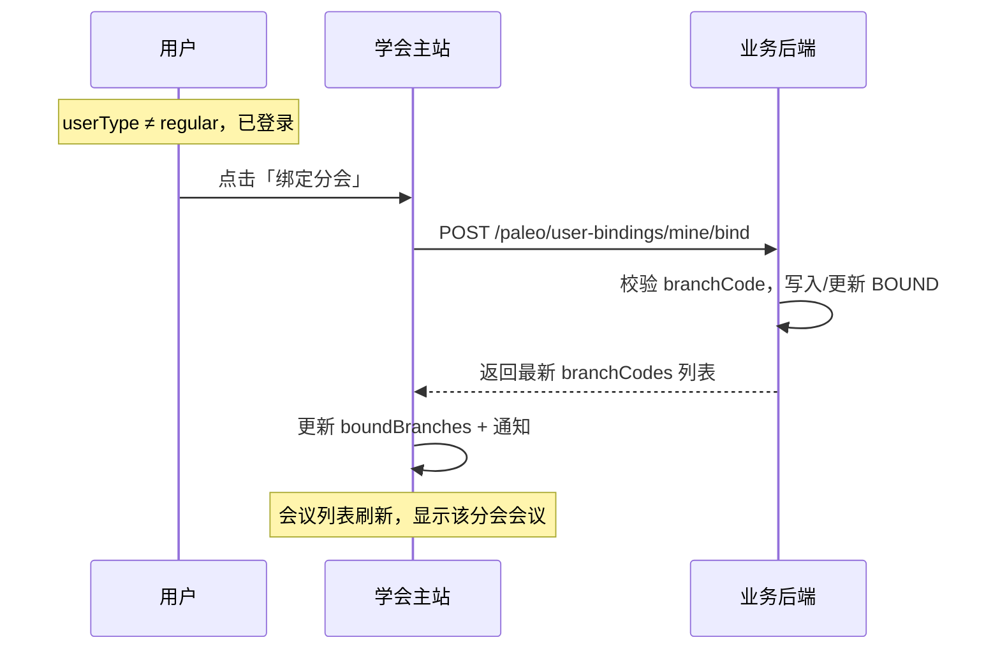

# 05 分会绑定与可见性模块需求

| 字段 | 内容 |
|------|------|
| 文档名称 | 分会绑定与可见性模块 PRD |
| 模块编号 | 05 |
| 版本 | v1.0 |
| 编写日期 | 2026-07-06 |
| 文档状态 | 初稿（待人工校验） |
| 前置基准 | [中国古生物学会完整需求文档.md](../中国古生物学会完整需求文档.md) v3.1 §11、§4.3 |
| 上游模块 | [02_双路径会员选择](./02_双路径会员选择模块需求.md) |
| 下游模块 | [06_会议发布与报名](./06_会议发布与会议费报名模块需求.md) · [09_CMS主站内容](./09_CMS主站内容发布模块需求.md) · [13_用户管理](./13_用户管理模块需求.md) · [15_统计导出](./15_统计与财务导出模块需求.md) |
| 关联原型 | `paleontology-website-latest` · `paleontology-cms-backend` · `paleontology-admin-latest` |
| 不在本模块范围 | 分会 CMS 子站内容维护（模块 09）、会议发布（模块 06）、后台分会启用/禁用（模块 14）、管理员分会数据权限（模块 11） |

---

## 目录

1. [模块概述](#1-模块概述)
2. [业务背景与目标](#2-业务背景与目标)
3. [学会单元与编码](#3-学会单元与编码)
4. [角色与权限](#4-角色与权限)
5. [业务流程](#5-业务流程)
6. [可见性规则](#6-可见性规则)
7. [页面原型说明](#7-页面原型说明)
8. [接口需求](#8-接口需求)
9. [数据模型](#9-数据模型)
10. [异常处理](#10-异常处理)
11. [与上下游模块衔接](#11-与上下游模块衔接)
12. [原型差距与改造清单](#12-原型差距与改造清单)
13. [验收标准](#13-验收标准)
14. [附录](#14-附录)

---

## 1. 模块概述

### 1.1 模块定位

本模块实现注册用户与 **11 个专业分会** 的**自助绑定/解绑**能力，并据此控制：

- 学术会议列表可见范围
- 分会通知、附件、子站受限内容
- 新会议发布时的站内通知推送范围

**总学会（`zgswxh`）** 对所有已登录注册用户**虚拟默认可访问**，不写入绑定表、不可手动解绑。

### 1.2 核心设计原则

| 原则 | 本模块落地 |
|------|------------|
| 无需审核 | 绑定/解绑立即生效 |
| 自由组合 | 0～11 个分会，无下限要求 |
| 路径前置 | 须完成双路径选择（非 `regular`）后方可绑定 |
| 状态无关绑定保留 | 退会、到期、非会员转会员均保留已绑分会 |
| 总学会例外 | 总学会会议与内容对所有注册用户开放 |
| 单账号全局 | 绑定关系跟用户走，全站通用 |

### 1.3 系统边界

```
┌─────────────────────────────────────────────────────────────┐
│ 学会主站                                                     │
│  Services → 会议绑定管理 · PersonalCenter 我的分会           │
│  学术会议 Tab 过滤 · 组织机构/分会子站可见性                 │
│  MembershipContext.toggleBranchBinding                       │
└──────────────────────────┬──────────────────────────────────┘
                           │ /paleo/user-bindings/*
┌──────────────────────────▼──────────────────────────────────┐
│ 业务后端                                                     │
│  PaleoUserBindingService · paleo_association · 审计（建议）   │
└──────────────────────────────────────────────────────────────┘
```

---

## 2. 业务背景与目标

### 2.1 业务背景

中国古生物学会下设 11 个专业分会，用户研究兴趣各异。系统须让用户**按需订阅**感兴趣的分会，从而只看到相关会议与通知，避免信息过载。绑定关系同时是会议报名、分会子站深度内容的前置条件。

### 2.2 模块目标

| 目标 | 说明 |
|------|------|
| G1 | 完成路径选择的用户可自助绑定任意分会组合 |
| G2 | 绑定后即时看到该分会会议与通知 |
| G3 | 解绑后该分会会议从列表消失 |
| G4 | 前后端绑定列表一致，换设备可同步 |
| G5 | 后台用户名录可展示已绑定分会 |

---

## 3. 学会单元与编码

### 3.1 构成（1 总学会 + 11 分会）

| 编码 | 名称 | 绑定方式 |
|------|------|----------|
| `zgswxh` | 中国古生物学会（总学会） | 虚拟绑定，全员可见 |
| `gwjzdwxfh` | 古无脊椎动物学分会 | 用户自助 |
| `kpgzwyh` | 科普工作委员会 | 用户自助 |
| `bfxfh` | 孢粉学分会 | 用户自助 |
| `wtxfh` | 微体学分会 | 用户自助 |
| `hszlzwyh` | 化石藻类专业委员会 | 用户自助 |
| `gzwxfh` | 古植物学分会 | 用户自助 |
| `dqswx` | 地球生物学分会 | 用户自助 |
| `gst` | 古生态专业分会 | 用户自助 |
| `gjzdw` | 古脊椎动物学分会 | 用户自助 |
| `swcj` | 生物沉积学分会 | 用户自助 |
| `xjsxff` | 新技术新方法专业委员会 | 用户自助 |

**数据源**：`shared/constants.ts` → `BRANCH_MAP`、`TOTAL_SOCIETY_ID`、`VALID_BRANCH_IDS`

### 3.2 编码映射

前台 `branch_code` ↔ 数据库 `paleo_association.association_id` 通过 `BRANCH_CODE_TO_ASSOCIATION_ID` 映射，须与迁移脚本一致。

---

## 4. 角色与权限

### 4.1 用户侧

| userType / 状态 | 可否绑定/解绑 | 总学会可见 |
|-----------------|:-------------:|:----------:|
| 未登录 | ✗ | 公开页 only |
| `regular`（未选路径） | ✗ | 注册后可见总学会会议 |
| `non_member` | ✓ | ✓ |
| `member`（含办理中、`invoice_pending` 等） | ✓ | ✓ |
| `active` 正式会员 | ✓ | ✓ |
| 已退会 / 已过期 | ✓（保留关系） | ✓ |

### 4.2 管理侧

| 角色 | 本模块能力 |
|------|------------|
| 用户本人 | 绑定/解绑自己的分会 |
| 学会总管理员 | 查看用户名录中的绑定分会；**不代绑**（首期） |
| 分会管理员 | 无用户绑定管理权限 |
| 财务审核员 | 无 |

---

## 5. 业务流程

### 5.1 绑定分会



**规则**：

- 幂等：已绑定再次绑定无副作用
- 历史 UNBOUND 记录可恢复为 BOUND
- 不可绑定 `zgswxh`

### 5.2 解绑分会

```
用户点击「解绑分会」
  → POST /mine/unbind
  → binding_status = UNBOUND
  → 该分会会议从列表移除
  → 已确认报名不受影响（模块 06/08）
  → 站内通知：已解绑 {分会名}
```

### 5.3 生命周期中的绑定保留

| 事件 | 绑定处理 |
|------|----------|
| 非会员 → 正式会员路径 | **保留** |
| 入会办理中 | **保留** |
| 会员到期 | **保留**；身份降 `non_member` |
| 退会审核通过 | **保留** |
| 注销账号 | 随账号删除绑定记录 |
| 重新入会 | **保留**（若未注销） |

### 5.4 与会议报名的关系

报名某分会会议的前置条件（模块 06，本模块提供绑定能力）：

1. 已登录
2. 已完成路径选择（`userType !== regular`）
3. **已绑定该分会**（总学会会议除外）
4. 未过报名截止日

未绑定时点击报名 → 提示先绑定，可跳转「会议绑定管理」。

---

## 6. 可见性规则

### 6.1 核心函数

```typescript
isSocietyAccessible(boundBranchIds, societyId): boolean
// societyId === 'zgswxh' → true
// else → boundBranchIds.includes(societyId)
```

### 6.2 分会子站（§4.3）

| 用户状态 | 可见内容 |
|----------|----------|
| 未登录 | 公开信息（概况、理事会、沿革等） |
| 已登录·`regular` | 公开信息 + 引导选择路径 |
| 已登录·未绑定该分会 | 公开信息；可绑定 |
| 已登录·已绑定 | 全部内容（会议、通知、附件等） |
| 总学会 | 对所有注册用户默认可访问 |

### 6.3 会议中心

| 会议所属 | 可见条件 |
|----------|----------|
| 总学会 `zgswxh` | 所有已登录且已选路径用户 |
| 某分会 | 已绑定该分会 |

列表默认按「已绑定分会」过滤；可提供「查看全部公开会议」说明（原型部分场景展示全部）。

### 6.4 通知推送（模块 16）

| 内容类型 | 推送范围 |
|----------|----------|
| 新会议发布（某分会） | 已绑定该分会的用户 |
| 新会议发布（总学会） | 所有已选路径用户 |
| 分会公告/动态 | 已绑定用户 |

### 6.5 附件下载（§16.2 摘录）

| 内容 | 条件 |
|------|------|
| 会议通知详情（不盖章） | 已登录 + 已绑定该分会（总学会除外） |
| 盖章通知 / 摘要模板 | 该会议报名已确认（模块 06） |
| 分会子站下载中心 | 通常已登录；深度内容须已绑定 |

---

## 7. 页面原型说明

### 7.1 入口

| 入口 | 路径/位置 |
|------|-----------|
| 学会服务 → 会员服务 | 右侧「会议绑定管理」主面板 |
| 学会服务 → 学术会议 | 「前往绑定分会」引导 |
| 个人中心 | 「我的分会」+「管理分会绑定 →」 |
| 组织机构 | 分会子站入口（可见性受绑定影响） |

### 7.2 会议绑定管理（Services.tsx）

**标题**：会议绑定管理

**统计区**：

- 徽章：`总学会：默认已绑定`
- 徽章：`分会：已绑定 N / 11`

**列表顺序**：

1. **总学会**置顶 — 绿色已绑定样式，「查看会议」按钮，「无需解绑」禁用按钮
2. 其余 11 个分会 — 按 `BRANCH_MAP` 顺序

**分会卡片元素**：

| 元素 | 说明 |
|------|------|
| 名称 | 分会中文全称 |
| 简介 | 一行摘要 `b.desc` |
| 状态标签 | 已绑定时绿色「已绑定」 |
| 查看会议 | 仅已绑定显示；跳转学术会议 Tab 并筛选该分会 |
| 绑定/解绑 | 主操作按钮 |

**说明文案**（按 `userType` 切换）：

- `regular`：请先选择参与方式…
- `non_member`：可直接绑定，按非会员价报名
- `member`：正式会员路径说明
- `withdrawn`：绑定保留，可按非会员参会

**`regular` 用户**：展示黄色提示条；绑定按钮应禁用或点击后引导路径选择（见 §12 差距）。

### 7.3 个人中心 — 我的分会

展示已绑定分会列表（名称标签）；未绑定时引导前往学会服务。

### 7.4 交互状态

| 操作 | 反馈 |
|------|------|
| 绑定成功 | Toast + 站内通知「成功绑定分会」 |
| 解绑成功 | Toast + 通知「已解绑分会」 |
| 操作总学会 | Toast「总学会默认已绑定，无需操作」 |
| API 失败 | Toast 错误信息 |

---

## 8. 接口需求

### 8.1 查询我的绑定

```
GET /paleo/user-bindings/mine
Authorization: Bearer {token}
```

**响应**：

```json
{
  "code": 200,
  "data": ["wtxfh", "gjzdw"]
}
```

- 仅返回 `binding_status=BOUND` 的分会 `branch_code`
- **不含** `zgswxh`（前端虚拟处理）

### 8.2 绑定分会

```
POST /paleo/user-bindings/mine/bind
```

```json
{
  "branchCode": "wtxfh"
}
```

**成功**：返回更新后的 `branchCodes` 数组

**校验（须补充）**：

| 校验 | 说明 |
|------|------|
| 已登录 | 401 |
| `branchCode` 合法 | 在 `VALID_BRANCH_IDS` 内 |
| 非 `zgswxh` | 总学会无需绑定 |
| `userType !== regular` | 须已完成路径选择 |
| 分会已启用 | `paleo_association` 状态（若后台禁用则不可绑） |

### 8.3 解绑分会

```
POST /paleo/user-bindings/mine/unbind
```

请求体同绑定。

### 8.4 管理端查询（用户名录）

用户详情中展示绑定分会列表，数据来自 `paleo_user_binding` + `paleo_association`（模块 13 `PaleoMembershipDirectoryService` 已聚合）。

### 8.5 审计日志 【建议实现】

| 动作 | 说明 |
|------|------|
| USER_BRANCH_BIND | 用户 {email} 绑定分会 {name} |
| USER_BRANCH_UNBIND | 用户 {email} 解绑分会 {name} |

总需求 §11.3 建议记录绑定/解绑操作。

---

## 9. 数据模型

### 9.1 paleo_user_binding

| 字段 | 类型 | 说明 |
|------|------|------|
| binding_id | BIGINT PK | |
| user_id | BIGINT | 用户 |
| association_id | BIGINT | 关联 paleo_association |
| binding_status | VARCHAR | `BOUND` / `UNBOUND` |

**约束**：同一 `user_id` + `association_id` 唯一；解绑为软状态 `UNBOUND`，非物理删除。

### 9.2 paleo_association

| 字段 | 用途 |
|------|------|
| association_id | 主键 |
| branch_code | 如 `wtxfh` |
| name | 分会名称 |
| status | 启用/禁用（影响可否新绑） |

### 9.3 前端状态

| 状态 | 存储 | 说明 |
|------|------|------|
| boundBranches | React Context | 以 API 为准 |
| ~~paleo_bound_branches_{email}~~ | localStorage | 生产环境仅作缓存，API 为准 |

---

## 10. 异常处理

| 场景 | 提示 |
|------|------|
| 未登录 | 请先登录系统 |
| regular 用户绑定 | 请先选择您的参与方式（会员/非会员） |
| 绑定总学会 | 总学会无需绑定 / 总学会默认已绑定 |
| 无效分会编码 | 无效的分会编码：{code} |
| 分会已禁用 | 该分会暂不可绑定（建议） |
| 网络失败 | 分会绑定操作失败 |

---

## 11. 与上下游模块衔接

| 模块 | 衔接 |
|------|------|
| 02 双路径 | `regular` 不可绑；`non_member`/`member` 可绑 |
| 04 会费 | `invoice_pending` 起可绑定（原型文案） |
| 06 会议 | 列表过滤、`submitConferenceVoucher` 前置校验 |
| 09 CMS | 分会子站深度内容按绑定展示 |
| 13 用户管理 | 名录展示 `boundBranches` |
| 15 统计 | `branchMemberCounts` 仅统计**正式会员**绑定数 |
| 16 通知 | 按绑定推送新会议 |

---

## 12. 原型差距与改造清单

| 项 | 现状 | 目标 | 优先级 |
|----|------|------|--------|
| regular 用户可点绑定 | 仅 `isLoggedIn` 判断 | 禁用按钮或后端拒绝 `regular` | P0 |
| 绑定审计 | 无用户侧审计 | 写入 `paleo_audit_log` | P1 |
| 分会禁用 | 未校验 association 状态 | 禁用分会不可新绑 | P2 |
| localStorage 双写 | 仍有 `paleo_bound_branches_*` | 以 API 为准 | P1 |
| 重复 Toast | Services 按钮 onClick 与 Context 双 Toast | 去重 | P2 |
| 通知持久化 | 仅前端 `addNotification` | 服务端（模块 16） | P1 |

**关键文件**：

- `Services.tsx`（会议绑定管理 UI）
- `PersonalCenter.tsx`
- `MembershipContext.tsx` → `toggleBranchBinding`
- `membership-api.ts` → `bindBranch` / `unbindBranch`
- `shared/constants.ts` → `isSocietyAccessible`
- `PaleoUserBindingService.java`
- `PaleoUserBindingController.java`

---

## 13. 验收标准

### 13.1 绑定/解绑

- [ ] 完成路径选择的用户可绑定 0～11 个分会
- [ ] 绑定/解绑立即生效，无需审核
- [ ] 总学会不可手动绑定/解绑，对所有已选路径用户可见
- [ ] `regular` 用户不可绑定
- [ ] 绑定列表服务端持久化，换设备一致
- [ ] 解绑后该分会会议从列表消失

### 13.2 可见性

- [ ] 未绑定分会不显示该分会会议（总学会除外）
- [ ] 已绑定可查看分会会议、通知、子站受限内容
- [ ] 未绑定仅见分会公开信息
- [ ] `isSocietyAccessible` 逻辑与 §6 一致

### 13.3 生命周期

- [ ] 退会、到期、非会员转会员后绑定保留
- [ ] 注销账号清除绑定记录

### 13.4 界面

- [ ] 总学会置顶，显示「已绑定 N / 11」
- [ ] 绑定/解绑有 Toast 与站内通知
- [ ] 个人中心展示已绑定分会

### 13.5 联调

- [ ] 未绑定不可报名该分会会议（模块 06）
- [ ] 后台用户名录正确展示绑定分会（模块 13）

---

## 14. 附录

### 14.1 11 个分会 ID 列表

见 `BRANCH_IDS`：`gwjzdwxfh`, `kpgzwyh`, `bfxfh`, `wtxfh`, `hszlzwyh`, `gzwxfh`, `dqswx`, `gst`, `gjzdw`, `swcj`, `xjsxff`

### 14.2 相关总需求章节

§11.1～§11.4、§4.3 分会可见性、§12.2 报名前置、§22.2 未绑定不可报分会会议

### 14.3 待人工确认项

| 编号 | 问题 | 建议 |
|------|------|------|
| Q1 | 办理中会员（仅申请书通过）能否绑定？ | 可以，与原型一致 |
| Q2 | 学术会议 Tab 是否默认只显示已绑定？ | 是，可提供说明文案 |
| Q3 | 管理员能否代用户绑分会？ | 首期不做 |
| Q4 | 解绑后进行中会议报名是否取消？ | 不取消，已确认保留 |

### 14.4 修订记录

| 版本 | 日期 | 说明 |
|------|------|------|
| v1.0 | 2026-07-06 | 初稿 |

---

**文档结束**
