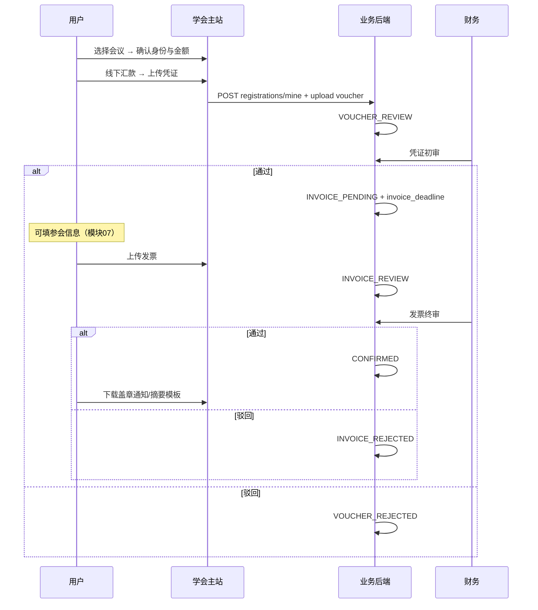

# 06 会议发布与会议费报名模块需求

| 字段 | 内容 |
|------|------|
| 文档名称 | 会议发布与会议费报名模块 PRD |
| 模块编号 | 06 |
| 版本 | v1.0 |
| 编写日期 | 2026-07-06 |
| 文档状态 | 初稿（待人工校验） |
| 前置基准 | [中国古生物学会完整需求文档.md](../中国古生物学会完整需求文档.md) v3.1 §12 |
| 上游模块 | [02_双路径会员选择](./02_双路径会员选择模块需求.md) · [05_分会绑定](./05_分会绑定与可见性模块需求.md) |
| 下游模块 | [07_参会信息摘要住宿野外](./07_参会信息摘要住宿野外模块需求.md) · [12_审核工作台](./12_审核工作台模块需求.md) · [14_会议管理后台](./14_会议管理后台模块需求.md) · [15_统计导出](./15_统计与财务导出模块需求.md) |
| 关联原型 | `paleontology-website-latest` · `paleontology-admin-latest` · `paleontology-cms-backend` |
| 不在本模块范围 | 参会信息/摘要/住宿/野外填报（模块 07）、会员费（模块 04）、会议 CMS 富文本详情页深度编排（模块 09/14 交界） |

---

## 目录

1. [模块概述](#1-模块概述)
2. [业务背景与目标](#2-业务背景与目标)
3. [会议发布与属性](#3-会议发布与属性)
4. [可见性与报名前置](#4-可见性与报名前置)
5. [四类会议费与锁价](#5-四类会议费与锁价)
6. [业务流程](#6-业务流程)
7. [页面原型说明](#7-页面原型说明)
8. [状态机与字段规则](#8-状态机与字段规则)
9. [接口需求](#9-接口需求)
10. [数据模型](#10-数据模型)
11. [异常处理](#11-异常处理)
12. [与上下游模块衔接](#12-与上下游模块衔接)
13. [原型差距与改造清单](#13-原型差距与改造清单)
14. [验收标准](#14-验收标准)
15. [附录](#15-附录)

---

## 1. 模块概述

### 1.1 模块定位

本模块覆盖**学术会议**从发布、可见、报名到**会议费两阶段审核确认**的全流程，是学会服务的第二条核心业务线。

| 能力 | 说明 |
|------|------|
| 会议发布 | 总学会/分会管理员创建会议并发布（`OPEN`） |
| 会议列表与详情 | 用户按绑定关系查看会议；未缴费可见不盖章通知 |
| 会议费报名 | 线下转账 + 凭证初审 + 发票终审 |
| 报名确认 | 发票终审通过 → `confirmed`，可下载盖章通知与摘要模板（模块 07 使用） |

### 1.2 核心设计原则

| 原则 | 本模块落地 |
|------|------------|
| 一场一缴 | 每场会议独立缴费；**一次只能缴一个会议** |
| 多会并行 | 可同时参加多场会议，各自独立审核 |
| 不可合并支付 | 会议费与会员费、会议之间均不可合并 |
| 报名锁价 | 创建报名时锁定 `fee_amount` |
| 分会隔离 | 分会会议仅绑定用户可见；总学会会议全员可见 |
| 线下转账 | 不做微信/支付宝线上支付 |
| 驳回可重传 | 须管理员手动驳回后方可重传 |

### 1.3 组织分工（§12 隐含 + §17.8）

| 会议类型 | 发布者 |
|----------|--------|
| 总学会会议（年会、论坛） | 学会总管理员 |
| 分会会议 | 对应分会管理员 |
| 总学会不代发分会会议 | 强制分会归属 |

---

## 2. 业务背景与目标

### 2.1 业务背景

学会及 11 个分会定期举办学术会议，需线上发布通知、按身份差异化收费、并完成与所财务一致的两阶段凭证/发票审核。会议费与会员费分离，且用户可能同时报名多场会议。

### 2.2 模块目标

| 目标 | 说明 |
|------|------|
| G1 | 已发布会议在前台正确展示并按绑定过滤 |
| G2 | 满足前置条件的用户可完成会议费两阶段缴费 |
| G3 | 四类会议费计价正确，报名后金额不变 |
| G4 | 财务可在审核工作台批量审会议费凭证/发票 |
| G5 | 仅 `CONFIRMED` 报名计入参会统计与收入 |

---

## 3. 会议发布与属性

### 3.1 会议基本字段

| 字段 | 说明 | 存储 |
|------|------|------|
| conference_code | 前台 ID，如 `conf-zgswxh-1` | `paleo_conference` |
| conference_title | 会议名称 | 同左 |
| association_id | 所属学会单元 | 同左 |
| city / location | 地点 | 原型扩展字段 |
| start_date / end_date | 会期 | 同左 |
| status | `DRAFT` / `OPEN` / `CLOSED` | 同左 |
| 通知详情 | 富文本；未缴费可见**不盖章版** | CMS/扩展 JSON |
| payment_deadline | 缴费截止日 | 扩展 |
| abstract_deadline | 摘要截止（模块 07） | 扩展 |
| accommodation_deadline | 住宿截止（模块 07） | 扩展 |
| field_trip_deadline | 野外截止（模块 07） | 扩展 |

> 原型 `PaleoConference` 表字段较少，完整配置（四类费用、PDF、野外路线等）在管理端 `ConferenceData` / localStorage 与 CMS 扩展中；**生产须全部 API 持久化**（模块 14 深化）。

### 3.2 会议附件（管理员上传）

| 文件 | 用户下载条件 |
|------|--------------|
| 通知 PDF（不盖章） | 已登录 + 已绑定分会（总学会除外） |
| 盖章通知 PDF | 报名 `confirmed` |
| 摘要模板 Word | 报名 `confirmed` |

### 3.3 野外路线

最多 15 条（会前/会中/会后各 5 条）；仅选择与展示，**系统不代收费用**（模块 07 填报）。

### 3.4 发布状态

| status | 前台 |
|--------|------|
| DRAFT | 不可见、不可报名 |
| OPEN | 公开列表可见（受绑定规则过滤） |
| CLOSED | 可见历史；不可新报名 |

---

## 4. 可见性与报名前置

### 4.1 会议列表可见性

| 会议所属 | 可见条件 |
|----------|----------|
| 总学会 `zgswxh` | 已登录且已完成路径选择 |
| 分会 |  additionally：`isSocietyAccessible(boundBranches, branchId)` |

未绑定分会：会议**不出现在**默认列表（可提供「全部公开会议」说明，与原型非会员行为对齐）。

### 4.2 报名前置条件（须全部满足）

| # | 条件 |
|---|------|
| 1 | 已登录 |
| 2 | `userType !== regular`（已完成双路径选择） |
| 3 | 已绑定该会议所属分会（**总学会会议除外**） |
| 4 | 正式会员路径：须 `active`，或 `invoice_pending` / `invoice_submitted`（边办会员边报名） |
| 5 | 非会员：可直接报名 |
| 6 | 未过 `payment_deadline` |
| 7 | 该会议四类费用中对应档位 **> 0**（为 0 视为通道关闭） |
| 8 | 会议 `status = OPEN` |
| 9 | 该用户该会议无 `CONFIRMED` 报名 |

### 4.3 正式会员边办边报

`userType=member` 且 `membershipStatus` 为 `invoice_pending` 或 `invoice_submitted` 时**允许**报名会议（原型 `submitConferenceVoucher` 已放开）。

---

## 5. 四类会议费与锁价

### 5.1 四类定价（§12.3）

| feeType | 适用人群 |
|---------|----------|
| `student_member` | 学生 + 正式会员（active 等） |
| `non_student_member` | 非学生 + 正式会员 |
| `student_non_member` | 学生 + 非会员 |
| `non_student_non_member` | 非学生 + 非会员 |

**选取逻辑**：`deriveFeeType(userType, isStudent)` → `getConferenceFeeByType(confId, feeType)`

### 5.2 默认推算规则

| 规则 | 公式 |
|------|------|
| 非会员价 | 会员基准价 × 1.1（向上取整） |
| 学生价 | 约为非学生基准 × 2/3（可后台单独配置） |

每场会议须**显式配置四类价格**（管理端 `ConferenceForm` 四个输入框）。

### 5.3 锁价

创建报名记录时写入：

```json
{
  "conferenceCode": "conf-1",
  "feeType": "student_member",
  "feeAmount": 800
}
```

后续管理员改价**不影响**已创建报名的 `fee_amount`。

---

## 6. 业务流程

### 6.1 会议费报名（两阶段）



### 6.2 与会员费对比

| 项目 | 会员费（模块04） | 会议费（本模块） |
|------|------------------|------------------|
| 次数 | 一年一次 | 每场一次 |
| 并行 | 单条有效会费 | 多场并行 |
| 状态机 | 相同两阶段 | 相同两阶段 |
| 发票宽限期 | 7 工作日 | 7 工作日 |
| 激活结果 | `active` 会员 | `confirmed` 报名 |

### 6.3 单次缴费约束

- 用户一次上传凭证只对应**一个** `registration_id`
- 不可在一条记录中合并多场会议费用
- 不可与会员费合并转账凭证

### 6.4 用户侧状态可操作（§12.5）

| 状态 | 可操作 |
|------|--------|
| 未缴费 | 缴纳会议注册费 |
| voucher_submitted | 等待 |
| voucher_rejected | 重传凭证 |
| invoice_pending | 填参会信息（模块07）+ 上传发票 |
| invoice_overdue | 补传发票 |
| invoice_submitted | 等待 |
| invoice_rejected | 重传发票 |
| confirmed | 下载盖章通知/摘要模板；只读查看参会信息 |

---

## 7. 页面原型说明

### 7.1 前台入口

| 入口 | 位置 |
|------|------|
| 学会服务 → 学术会议 | 会议列表 Tab |
| 分会绑定管理 → 查看会议 | 带 `conferenceBranchFilter` 跳转 |
| 个人中心 | 我的会议报名记录 |

### 7.2 学术会议列表（Services.tsx · `renderConferenceList`）

**标题**：学术会议

**筛选**：

- 默认：已绑定分会的会议（`isSocietyAccessible`）
- 可按分会筛选（从绑定管理跳转）
- 总学会会议排序置顶（`sortConferencesSocietyFirst`）

**会议卡片信息**：

- 名称、时间、地点、所属分会
- 状态标签：正在报名 / 即将开启 / 预告 / 演示
- 当前用户报名状态角标（凭证审核中、待传发票、已确认等）
- 点击 → 会议详情/报名流程

### 7.3 会议费缴纳弹窗/页（`showFeePayment` 会议分支）

**阶段一**：

1. 展示学会收款账户（同会员费）
2. 展示锁定金额与 feeType 标签
3. 非会员可展示升级正式会员节省金额提示
4. 上传汇款凭证（JPG/PNG ≤5MB）
5. 提交 → `voucher_submitted`

**阶段二**（凭证通过后）：

1. 展示发票截止日
2. 上传电子发票（JPG/PNG/PDF ≤10MB）
3. 提交 → `invoice_submitted`

### 7.4 会议详情

- 富文本通知（不盖章版）
- 四类价格对照表（会员价/非会员价）
- 各截止日期
- 报名按钮（前置校验失败时 Toast 引导绑定/入会）

### 7.5 管理后台 — 会议管理（ConferenceManagement.tsx）

**创建/编辑表单要点**：

| 区域 | 字段 |
|------|------|
| 基本信息 | 名称、所属学会、时间、地点 |
| 四类费用 | 学生会员/非学生会会员/学生非会员/非学生非会员 |
| 截止日期 | 缴费、摘要、住宿、野外 |
| 附件 | 通知 PDF、盖章 PDF、摘要模板 |
| 野外路线 | 最多 15 条（会前/会中/会后） |
| 状态 | 草稿 / 发布 |

**权限**：

- 分会管理员：仅本分会
- 总管理员：可选 12 个学会单元

（详细后台字段见模块 14；本模块定义业务必填项。）

### 7.6 管理后台 — 审核工作台

| Tab | 内容 |
|-----|------|
| 会议费凭证初审 | 待审列表、预览、通过/驳回、批量 |
| 会议费发票终审 | 同上 + 延长截止日 |

分会管理员**可审本分会**会议费（与入会/退会不同）；财务可审全站。

---

## 8. 状态机与字段规则

### 8.1 payment_status（后端）

| 值 | 前台 status |
|----|-------------|
| UNPAID | unpaid |
| VOUCHER_REVIEW | voucher_submitted |
| VOUCHER_REJECTED | voucher_rejected |
| INVOICE_PENDING | invoice_pending |
| INVOICE_REVIEW | invoice_submitted |
| INVOICE_REJECTED | invoice_rejected |
| CONFIRMED | confirmed |

### 8.2 文件上传规则

| 类型 | 格式 | 大小 |
|------|------|------|
| 缴费凭证 | JPG/PNG | ≤5MB |
| 电子发票 | JPG/PNG/PDF | ≤10MB |

### 8.3 发票宽限期

凭证初审通过时：

```
invoice_deadline = voucher_audit_time + 7 个工作日
```

后端 `PaleoConferenceRegistrationService.review` 已实现 `addWorkdays`；逾期逻辑同模块 04。

### 8.4 提交后锁定

`VOUCHER_REVIEW` / `INVOICE_REVIEW` / `INVOICE_PENDING` 状态下用户不可替换文件，须驳回后重传。

---

## 9. 接口需求

### 9.1 公开会议列表

```
GET /paleo/conferences/public/list
```

返回 `status=OPEN` 的会议列表（前台再按绑定过滤）。

### 9.2 我的报名列表

```
GET /paleo/conferences/registrations/mine
Authorization: Bearer {token}
```

### 9.3 创建报名记录（锁价）

```
POST /paleo/conferences/registrations/mine
```

```json
{
  "conferenceCode": "conf-1",
  "feeType": "student_member",
  "feeAmount": 800
}
```

**服务端校验**：会议 OPEN、未 CONFIRMED、前置条件（建议补强绑定与截止日）。

### 9.4 上传凭证/发票

```
POST /paleo/conferences/registrations/mine/{registrationId}/files/{fileRole}
fileRole: voucher | invoice
```

### 9.5 管理端审核

```
POST /paleo/conferences/registrations/{registrationId}/review
RequireAdminRole: super_admin, branch_admin, finance_reviewer
```

```json
{
  "paymentStatus": "INVOICE_PENDING",
  "reviewComment": ""
}
```

凭证通过 → `INVOICE_PENDING` + 写入 `invoice_deadline`  
发票通过 → `CONFIRMED`

### 9.6 待审队列

```
GET /paleo/conferences/registrations/reviews/pending-vouchers
GET /paleo/conferences/registrations/reviews/pending-invoices
```

分会管理员自动按 `association_id` 过滤（`adminScopeWrapper`）。

### 9.7 管理端会议 CRUD 【模块 14 扩展】

```
POST/PUT /paleo/conferences/admin/*  （建议统一 REST）
```

须持久化四类费用、截止日期、附件 URL、野外路线 JSON。

---

## 10. 数据模型

### 10.1 paleo_conference

| 字段 | 说明 |
|------|------|
| conference_id | PK |
| conference_code | 业务 ID |
| association_id | 所属学会 |
| conference_title | 标题 |
| start_date / end_date | 会期 |
| status | DRAFT/OPEN/CLOSED |

**扩展表/JSON 字段（建议）**：fee_config、deadlines、notice_url、stamped_notice_url、abstract_template_url、field_trip_routes

### 10.2 paleo_conference_registration

| 字段 | 说明 |
|------|------|
| registration_id | PK |
| conference_id | FK |
| association_id | 冗余，便于分会隔离 |
| user_id | 报名用户 |
| fee_type | 四类之一 |
| fee_amount | 锁价金额 |
| payment_status | 状态机 |
| voucher_url / invoice_url | 文件 |
| review_comment | 驳回原因 |
| voucher_submit_time / voucher_audit_time | |
| invoice_submit_time / invoice_audit_time | |
| invoice_deadline | 发票截止 |

### 10.3 统计口径

- 会议费收入：仅 `CONFIRMED`
- 参会人数：按学会单元 + 四类人群钻取（模块 15）

---

## 11. 异常处理

| 场景 | 提示 |
|------|------|
| regular 用户报名 | 请先选择参与方式 |
| 未绑定分会 | 请先绑定该会议所属分会 |
| 会员办理中不允许 | 请先完成会员缴费验证（若过严） |
| 已过缴费截止日 | 报名已截止 |
| 费用为 0 | 当前身份暂不支持报名该会议 |
| 已 CONFIRMED | 您已完成该会议报名 |
| 会议未 OPEN | 该会议当前未开放报名 |
| 凭证未过传发票 | 请先等待凭证初审通过后再上传发票 |

---

## 12. 与上下游模块衔接

| 模块 | 衔接 |
|------|------|
| 02 双路径 | 非会员/会员价差 |
| 04 会员费 | `invoice_pending` 时允许报名 |
| 05 分会绑定 | 列表过滤、报名前置 |
| 07 参会信息 | 凭证通过后填报；confirmed 后下载模板 |
| 08 到期 | 会员到期对进行中报名的冻结/保留 |
| 12 审核工作台 | 会议费 Tab |
| 14 会议管理 | 发布、费用配置、附件 |
| 16 OCR/通知 | 上传触发识别；新会议通知已绑定用户 |

---

## 13. 原型差距与改造清单

| 项 | 现状 | 目标 | 优先级 |
|----|------|------|--------|
| 会议完整配置 | 部分 localStorage/CMS | 全量 API + DB | P0 |
| 公开列表过滤 | 前端按绑定 | 后端可选 `?branchCode=` 参数 | P2 |
| 报名前置校验 | 主要在前端 | 后端 create 校验绑定/截止日/身份 | P0 |
| 会议详情 API | 依赖前端 mock 列表 | `GET /conferences/public/{code}` | P1 |
| 一次只能缴一场 | 逻辑分散 | 后端禁止多 UNPAID 并行（可选） | P2 |
| 分会管理员审会费 | 已实现 scope | 与财务权限文档对齐 | P1 |
| 非会员列表展示全部会议 | 原型行为 | 与需求「未绑定不可见」对齐确认 | Q1 |

**关键文件**：

- `Services.tsx`（学术会议 Tab、缴费 UI）
- `MembershipContext.tsx`（submitConferenceVoucher/Invoice）
- `shared/constants.ts`（四类费用、CONFERENCE_BRANCH_MAP）
- `ConferenceManagement.tsx`
- `AuditWorkbench.tsx`
- `PaleoConferenceController.java`
- `PaleoConferenceRegistrationService.java`

---

## 14. 验收标准

### 14.1 发布与可见

- [ ] 总学会/分会管理员可发布本学会会议
- [ ] 未绑定分会看不到该分会会议（总学会除外）
- [ ] 总学会会议对已选路径用户可见
- [ ] 草稿会议前台不可见

### 14.2 报名与费用

- [ ] 四类会议费配置正确，报名锁价
- [ ] 非会员价为会员价 × 1.1
- [ ] 满足 §4.2 全部前置条件方可报名
- [ ] 过了缴费截止日不可报名
- [ ] 费用为 0 不可报名

### 14.3 两阶段缴费

- [ ] 凭证/发票格式与大小符合要求
- [ ] 凭证通过后 7 工作日内须上传发票
- [ ] 驳回展示原因，可重传
- [ ] 提交后不可自行修改，须驳回后重传
- [ ] 发票终审通过后 `confirmed`
- [ ] 一次缴费只对应一个会议

### 14.4 管理后台

- [ ] 财务/总管理员可审全站会议费
- [ ] 分会管理员仅审本分会会议费
- [ ] 支持批量审核
- [ ] 审核写审计日志

### 14.5 联调

- [ ] 与模块 05 绑定校验联调
- [ ] 与模块 07 凭证通过后可填参会信息
- [ ] 与模块 15 统计 `CONFIRMED` 一致

---

## 15. 附录

### 15.1 演示会议 ID（原型）

`conf-1`～`conf-8`、`conf-zgswxh-1/2`、`demo-conf` — 见 `CONFERENCE_BRANCH_MAP`

### 15.2 相关总需求章节

§12.1～§12.5、§5.2、§17.8、§22.2

### 15.3 待人工确认项

| 编号 | 问题 | 建议 |
|------|------|------|
| Q1 | 非会员是否展示全部公开会议列表？ | 与 §11 一致：仅已绑定+总学会 |
| Q2 | member 办理中（仅申请书通过）能否报名？ | 否，须 invoice_pending 以上 |
| Q3 | 会议 closed 后已确认用户能否下载材料？ | 可以，历史保留 |

### 15.4 修订记录

| 版本 | 日期 | 说明 |
|------|------|------|
| v1.0 | 2026-07-06 | 初稿 |

---

**文档结束**
