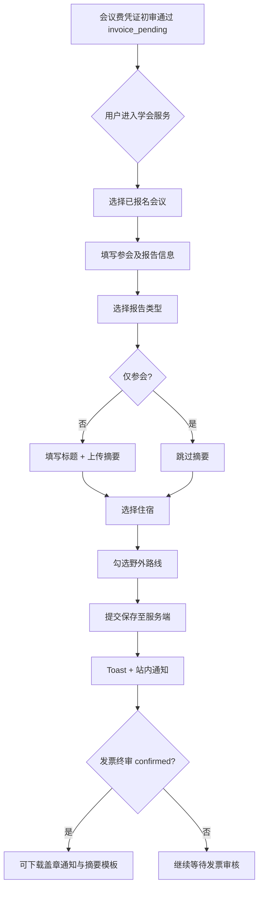
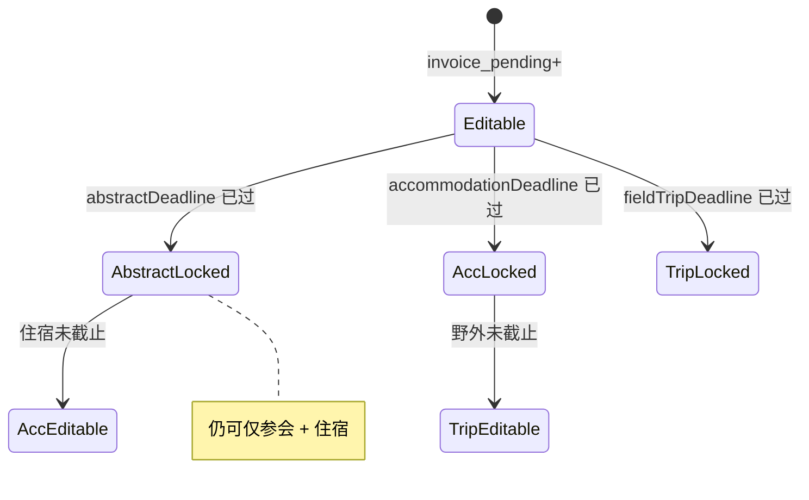
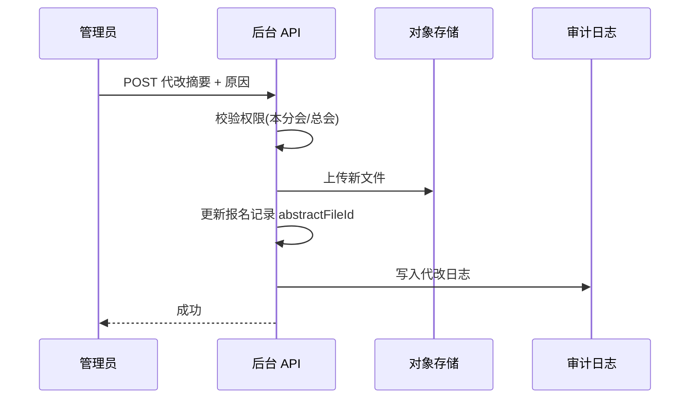

# 07 参会信息/摘要/住宿/野外模块需求

| 字段 | 内容 |
|------|------|
| 文档名称 | 参会信息/摘要/住宿/野外模块 PRD |
| 模块编号 | 07 |
| 版本 | v1.0 |
| 编写日期 | 2026-07-06 |
| 文档状态 | 初稿（待人工校验） |
| 前置基准 | [中国古生物学会完整需求文档.md](../中国古生物学会完整需求文档.md) v3.1 §13 |
| 上游模块 | [06_会议发布与会议费报名](./06_会议发布与会议费报名模块需求.md) |
| 下游模块 | [14_会议管理后台](./14_会议管理后台模块需求.md) · [15_统计与财务导出](./15_统计与财务导出模块需求.md) · [16_横切能力](./16_横切能力模块需求.md) |
| 关联原型 | `paleontology-website-latest` · `paleontology-admin-latest` · `paleontology-cms-backend` |
| 不在本模块范围 | 会议费两阶段缴费（模块 06）、会议发布与截止日配置（模块 06/14 交界）、全平台统计钻取 UI（模块 15）、盖章通知/摘要模板上传（模块 14） |

---

## 目录

1. [模块概述](#1-模块概述)
2. [业务背景与目标](#2-业务背景与目标)
3. [前置条件与解锁规则](#3-前置条件与解锁规则)
4. [参会信息表单](#4-参会信息表单)
5. [摘要上传](#5-摘要上传)
6. [住宿信息](#6-住宿信息)
7. [野外报名](#7-野外报名)
8. [截止日期与锁定规则](#8-截止日期与锁定规则)
9. [业务流程](#9-业务流程)
10. [页面原型说明](#10-页面原型说明)
11. [后台管理与统计](#11-后台管理与统计)
12. [接口需求](#12-接口需求)
13. [数据模型](#13-数据模型)
14. [异常处理](#14-异常处理)
15. [与上下游模块衔接](#15-与上下游模块衔接)
16. [原型差距与改造清单](#16-原型差距与改造清单)
17. [验收标准](#17-验收标准)
18. [附录](#18-附录)

---

## 1. 模块概述

### 1.1 模块定位

本模块覆盖用户在某场学术会议**会议费凭证初审通过之后**的参会信息采集：基础身份、报告类型与题目、Word 摘要、性别化住宿选择、会前/会中/会后野外路线点选。数据须与服务端报名记录绑定，供会务统计与摘要集中导出。

| 能力 | 说明 |
|------|------|
| 参会表单 | 姓名、性别、单位、身份、报告类型、分会场/专场 |
| 摘要管理 | `.doc/.docx` 上传，只保留最新版；按摘要截止日锁定 |
| 住宿登记 | 五种房型（含自行安排）；系统仅统计，费用由酒店收取 |
| 野外报名 | 最多 15 条路线多选；不代收费用，展示旅游公司说明 |
| 后台代改 | 摘要截止后管理员可强制代改，须审计日志 |
| 单场统计 | 报告数、摘要包、住宿房型、野外性别分布（模块 15 展示） |

### 1.2 用户角色

| 角色 | 权限 |
|------|------|
| 已登录用户（`non_member` / `member`） | 对本场已 `invoice_pending` 及以上报名的会议填报/修改参会信息 |
| 分会管理员 | 查看本分会会议参会数据；摘要截止后代改（本分会会议） |
| 总学会管理员 / 财务 | 查看全站或授权范围会议参会数据；代改、导出摘要 |
| `regular` 用户 | 不可进入本模块（须先完成模块 02 路径选择） |

---

## 2. 业务背景与目标

### 2.1 业务背景

学会学术会议除缴纳注册费外，会务组还需收集报告意向、论文摘要 Word、酒店代订意向与野外考察报名。这些信息与缴费状态、用户性别、会议截止日强相关，且须按**会议维度隔离**存储，便于分会/总学会分别导出摘要集与住宿清单。

### 2.2 设计原则（摘自总需求）

| 原则 | 本模块体现 |
|------|------------|
| 最新版本原则 | 摘要、参会信息多次修改只保留最后一次 |
| 野外路线不代收 | 仅路线选择与旅游公司公告，不收野外费 |
| 服务端持久化 | 表单、摘要文件、住宿、野外选择全部入库 |
| 性别校验 | 住宿房型、部分野外路线按性别限制 |
| 截止后锁定 | 用户不可改；管理员代改须记审计 |

### 2.3 模块目标

1. 凭证初审通过后即可开始填报，降低用户等待发票终审的时间成本。
2. 发票终审确认后解锁盖章通知与摘要模板下载（归属模块 06，本模块消费该状态）。
3. 单场会议摘要可**集中存储、一次性导出**，不同会议数据不得混合。
4. 住宿与野外按性别统计，支撑会务与旅游公司对接。

---

## 3. 前置条件与解锁规则

### 3.1 与模块 06 状态衔接

| 会议报名状态 | 用户能力 |
|--------------|----------|
| `unpaid` / `voucher_submitted` / `voucher_rejected` | 不可填写参会信息 |
| **`invoice_pending`**（凭证初审通过） | **可填写/修改参会信息、上传摘要、选住宿与野外** |
| `invoice_submitted` / `invoice_rejected` | 同上（参会信息与发票审核并行） |
| **`confirmed`**（发票终审通过） | 可继续修改（在各自截止日前）；**可下载盖章通知与摘要模板** |
| 会员到期冻结（模块 08） | 已锁定报名只读；未锁定按 §14 处理 |

> **基准文档 §13.1**：凭证初审通过即可填参会信息；报名确认后可下载盖章通知与摘要模板。  
> **原型现状**：`canAccessConferenceForm()` 要求 `confirmed`，与基准不一致（见 §16）。

### 3.2 其他前置

| 条件 | 说明 |
|------|------|
| 已登录 | 须有效 JWT |
| 已完成路径选择 | `userType` 为 `non_member` 或 `member` |
| 存在本场报名记录 | `registrationId` 关联模块 06 |
| 会议已发布 | 会议 `status = OPEN`（关闭后历史只读） |

### 3.3 解锁矩阵（建议实现）

```typescript
// 建议语义（目标实现）
canFillAttendeeInfo(status) =>
  ["invoice_pending", "invoice_submitted", "invoice_rejected", "confirmed"].includes(status)

canDownloadConferenceMaterials(status) =>
  status === "confirmed"

canEditAbstract(status, abstractDeadline) =>
  canFillAttendeeInfo(status) && !isDeadlinePassed(abstractDeadline)

canEditAccommodation(status, accommodationDeadline) =>
  canFillAttendeeInfo(status) && !isDeadlinePassed(accommodationDeadline)

canEditFieldTrip(status, fieldTripDeadline) =>
  canFillAttendeeInfo(status) && !isDeadlinePassed(fieldTripDeadline)
```

---

## 4. 参会信息表单

### 4.1 字段清单

| 字段 | 类型 | 必填 | 说明 |
|------|------|:----:|------|
| `name` | string | ✓ | 参会人姓名；默认从个人资料带入，可改 |
| `gender` | enum | ✓ | `男` / `女`；影响住宿与野外校验 |
| `unit` | string | ✓ | 工作/学习单位 |
| `role` | enum | ✓ | `教师` / `学生` / `嘉宾`（界面文案可为「老师/科研人员」等） |
| `presentationType` | enum | ✓ | `口头报告` / `展板报告` / `仅参会` |
| `reportTitle` | string | 条件 | `presentationType ≠ 仅参会` 时必填 |
| `session` | string | ✓ | 意向分会场/专场（选项由会议配置，见 §11） |
| `accommodationType` | enum | — | 见 §6；截止前未选视为自行安排 |
| `fieldTripSelections` | object | — | 见 §7 |
| `abstractFileId` | FK | 条件 | 报告类型非「仅参会」且摘要未截止时须上传 |
| `lastUpdated` | datetime | — | 服务端维护 |

### 4.2 报告类型规则

| 类型 | 报告标题 | 摘要 |
|------|----------|------|
| 口头报告 | 必填 | 必填（截止前） |
| 展板报告 | 必填 | 必填（截止前） |
| 仅参会 | 不需要 | 不需要 |

### 4.3 分会场/专场

- 选项由管理员在会议管理中配置（模块 14），不宜写死。
- 原型 `Services.tsx` 当前为 3 条硬编码专场，目标改为 `conference.sessions[]` 动态渲染。

### 4.4 自动填充

首次打开表单时，从用户资料预填 `name`、`gender`、`unit`、`role`；用户修改后以参会记录为准持久化（不回写全局资料，除非产品另行规定）。

---

## 5. 摘要上传

### 5.1 文件要求

| 项 | 规则 |
|----|------|
| 格式 | `.doc` / `.docx` |
| 大小 | ≤ 10MB |
| 版本 | **只保留最后一次**；新上传覆盖旧文件（逻辑删除或版本号递增，对外只暴露最新） |
| 存储 | 对象存储（模块 16）；路径含 `conferenceId` 隔离 |
| 元数据 | 原始文件名、`abstractSubmitTime`、上传人 |

### 5.2 交互

| 操作 | 行为 |
|------|------|
| 上传 | 校验格式/大小 → 存 OSS → 更新报名记录 |
| 重新上传 | 覆盖上一版；更新 `abstractSubmitTime` |
| 删除 | 截止前允许删除后重传；截止后用户不可删 |
| 截止后 | 用户不可上传/修改；可切换为「仅参会」并保留住宿（§8） |

### 5.3 摘要模板下载

- 摘要 **Word 模板**由管理员上传（模块 14）。
- 用户下载条件：`confirmed`（与盖章通知一致，模块 06）。

### 5.4 后台批量导出

- 按**单会议**导出全部摘要 ZIP；**禁止跨会议混合**。
- 文件名建议：`{conferenceCode}_abstracts_{exportDate}.zip`。

---

## 6. 住宿信息

### 6.1 选项枚举

与 `shared/constants.ts` 中 `ACCOMMODATION_TYPE` 一致：

| 值 | 显示名 | 性别校验 |
|----|--------|----------|
| `male_single` | 男单间 | 仅 `gender = 男` |
| `male_double` | 男双人间 | 仅 `gender = 男` |
| `female_single` | 女单间 | 仅 `gender = 女` |
| `female_double` | 女双人间 | 仅 `gender = 女` |
| `self_arranged` | 自行安排 / 自主安排 | 不限 |

> **内部取舍（0617）**：双人间**不对接同住人配对**，暂不强制填写同住人姓名。

### 6.2 业务规则

| 规则 | 说明 |
|------|------|
| 费用 | 住宿费由**酒店收取**；系统仅登记房型供统计 |
| 默认 | 住宿截止后未提交 → 视为 `self_arranged` |
| 截止后 | 不可修改；展示已选房型或「未提交，已视为自主安排」 |
| 性别变更 | 若用户修改性别导致与已选房型冲突，须提示重新选择（或提交时校验拒绝） |

### 6.3 原型展示价

原型 UI 展示参考价（如「¥450/晚」）仅为示意；**正式环境由会议配置或会务说明提供**，非本系统收款。

---

## 7. 野外报名

### 7.1 路线结构

每场会议最多 **15 条**路线，由模块 14 配置：

| 阶段 | 数量 | `phase` 值 |
|------|------|------------|
| 会前野外 | 1～5 条 | `pre` |
| 会中野外 | 1～5 条 | `during` |
| 会后野外 | 1～5 条 | `post` |

数据结构（原型已定义）：

```typescript
interface FieldTripRoute {
  id: string;
  phase: "pre" | "during" | "post";
  name: string;
  order: number;
  genderRestriction?: "male" | "female" | "any";
}

interface FieldTripSelections {
  pre: string[];    // route id 列表，可多选
  during: string[];
  post: string[];
}
```

默认生成逻辑见 `createDefaultFieldTripRoutes()`。

### 7.2 选择规则

| 规则 | 说明 |
|------|------|
| 多选 | 同一阶段内可多选路线 |
| 性别 | `genderRestriction` 为 `male`/`female` 时须与用户性别一致；`canSelectFieldTripRoute()` |
| 不收费 | 页内展示旅游公司通知与联系方式；**系统不代收野外费用** |
| 截止后 | 不可修改；未报名视为自行联系旅游公司 |
| 统计 | 按路线汇总总人数、男性、女性（模块 15 / `Statistics.tsx`） |

### 7.3 页内说明文案（原型已有）

- 「野外费用由旅游公司收取，不纳入学会会议费」
- 「野外报名将绑定您在基本信息中填写的性别…」

---

## 8. 截止日期与锁定规则

### 8.1 三类截止日（会议级配置）

| 截止日字段 | 典型默认值 | 影响范围 |
|------------|------------|----------|
| `abstractDeadline` | 开会前约 1 个月 | 摘要上传、报告标题（非仅参会） |
| `accommodationDeadline` | 开会前 7 天 | 住宿房型选择 |
| `fieldTripDeadline` | 开会前 7 天 | 野外路线选择 |

判断函数：`isDeadlinePassed(deadline)` — 当天仍可操作，次日 0 点起视为已过。

### 8.2 摘要截止后的特殊规则（§13.2）

| 仍可操作 | 已锁定 |
|----------|--------|
| 切换为「仅参会」 | 上传/修改摘要 |
| 修改住宿（若住宿截止未到） | 修改报告标题（若与摘要绑定） |
| 野外报名（若野外截止未到） | — |

### 8.3 用户修改 vs 管理员代改

| 场景 | 用户 | 管理员 |
|------|------|--------|
| 截止日前 | 可多次修改，保留最新 | 可查看 |
| 截止日后 | 不可改摘要 | 可**强制代改摘要**（须填原因，写审计日志） |
| 发票被驳回 | 参会信息保持；缴费模块处理重传 | — |
| `confirmed` 后 | 截止日前仍可改住宿/野外；摘要按摘要截止 | 代改摘要 |

### 8.4 审计日志（模块 16）

管理员代改须记录：`operatorId`、`registrationId`、`field`（如 `abstract`）、`reason`、`before`/`after` 摘要文件 ID、`operatedAt`。

---

## 9. 业务流程

### 9.1 用户填报主流程



### 9.2 分块截止锁定



### 9.3 管理员代改摘要



---

## 10. 页面原型说明

### 10.1 入口

| 入口 | 位置 | 条件 |
|------|------|------|
| 学会服务 → 学术会议 | 会议卡片「填写参会与报告信息」 | `canFillAttendeeInfo` |
| 学会服务 → 学术会议 | 报名已确认且无表单时的引导按钮 | 原型用 `active` 旧状态，目标对齐 `confirmed` |
| 演示会议 `demo-conf` | 跳过缴费演示完整表单 | 仅演示环境 |

### 10.2 参会表单页（`Services.tsx` — `editingReg` 分支）

**面包屑**：会议服务中心 → 填写参会及报告信息

**页头状态条**（目标文案）：

- 凭证已通过、待上传发票：`凭证已确认 · 可填写参会信息`
- 已确认：`报名已确认 · 可填写参会信息`

**区块顺序**（与原型一致）：

1. **基本信息** — 姓名、单位、性别、身份（2×2 栅格）
2. **学术报告与论文摘要** — 报告形式、意向专场、标题、摘要上传（与下一块有重复，改造时合并）
3. **会议论文摘要提交** — 截止时间、上传/重传/删除（原型 Phase 4 重复 UI，见 §16）
4. **住宿信息** — 五选一单选卡片；性别推荐高亮
5. **会议野外报名** — 按会前/会中/会后分组复选框
6. **底部操作** — 取消返回 / 提交参会信息

**未解锁态**：锁图标 + 当前缴费状态说明 + 返回按钮（`!canAccessConferenceForm` 分支）。

### 10.3 Context 方法（`MembershipContext.tsx`）

| 方法 | 作用 |
|------|------|
| `submitConferenceForm(confId, formData)` | 一次性提交表单字段 |
| `uploadAbstractFile(confId, url, name)` | 摘要上传（含 dataUrl，原型本地） |
| `deleteAbstract(confId)` | 删除摘要 |
| `setAccommodation(confId, type)` | 单独更新住宿 |
| `toggleFieldTripRoute(confId, phase, routeId)` | 切换路线勾选 |
| `canAccessConferenceForm(confId)` | 是否可进表单（待改为 `invoice_pending+`） |
| `canDownloadStampedNotice` / `canDownloadAbstractTemplate` | 仅 `confirmed` |

### 10.4 会议卡片上的材料下载

缴费确认后，会议详情区展示：

- 下载盖章通知 PDF
- 下载摘要 Word 模板

调用 `getConferenceFileUrl(confId, fileType)`（目标改为 API）。

---

## 11. 后台管理与统计

### 11.1 会议配置（模块 14，本模块消费）

| 配置项 | 说明 |
|--------|------|
| `abstractDeadline` | 摘要截止 |
| `accommodationDeadline` | 住宿截止 |
| `fieldTripDeadline` | 野外截止 |
| `fieldTripRoutes` | 最多 15 条 |
| `sessions` | 分会场列表（建议新增） |
| `fieldTripNotice` | 旅游公司通知富文本/附件（建议新增） |

`ConferenceManagement.tsx` 已支持摘要截止日；住宿/野外截止与路线配置需补齐。

### 11.2 参会者列表与代改

- 在会议管理或审核工作台查看某场报名列表，展开参会详情。
- 摘要截止后提供「代改摘要」：上传新 Word + 填写原因 → 触发审计。

### 11.3 单场统计维度（§13.4 → 模块 15）

| 维度 | 指标 |
|------|------|
| 报告 | 口头报告数、展板报告数、总报告数 |
| 摘要 | 已上传份数；支持 ZIP 导出 |
| 住宿 | 总登记数、男单间、男双、女单间、女双、自行安排 |
| 野外 | 会前/会中/会后：总人数、男、女；各路线明细 |

原型 `Statistics.tsx` 中 `computeRouteFieldTripStats`、`FieldTripDetailPanel` 已实现前端聚合演示。

---

## 12. 接口需求

### 12.1 获取参会信息

```
GET /paleo/conference-registrations/{registrationId}/attendee
Authorization: Bearer {token}
```

响应：§4.1 全部字段 + 摘要文件元数据（不含 OSS 直链时返回短期 signed URL）。

### 12.2 保存参会信息（全量或部分）

```
PUT /paleo/conference-registrations/{registrationId}/attendee
Content-Type: application/json
```

请求体示例：

```json
{
  "name": "张三",
  "gender": "男",
  "unit": "XX大学",
  "role": "教师",
  "presentationType": "口头报告",
  "reportTitle": "寒武纪大爆发研究进展",
  "session": "专题1：…",
  "accommodationType": "male_single",
  "fieldTripSelections": { "pre": ["c1-pre-1"], "during": [], "post": [] }
}
```

服务端校验：

- 报名状态 ∈ `canFillAttendeeInfo`
- 各字段截止日
- 住宿性别、野外 `validateFieldTripSelections`
- 报告类型与标题/摘要一致性

### 12.3 上传摘要

```
POST /paleo/conference-registrations/{registrationId}/abstract
Content-Type: multipart/form-data
file: (doc/docx, ≤10MB)
```

覆盖式更新；返回 `abstractFileId`、`fileName`、`abstractSubmitTime`。

### 12.4 删除摘要

```
DELETE /paleo/conference-registrations/{registrationId}/abstract
```

仅摘要未截止且状态允许时。

### 12.5 管理员代改摘要

```
POST /paleo/admin/conference-registrations/{registrationId}/abstract/override
Authorization: Bearer {adminToken}
Content-Type: multipart/form-data
file + reason (required)
```

写审计日志；不受用户侧摘要截止限制（仍须管理员权限）。

### 12.6 导出本场摘要

```
GET /paleo/admin/conferences/{conferenceId}/abstracts/export
Authorization: Bearer {adminToken}
```

返回 ZIP；权限：总管理员全站，分会管理员本分会。

### 12.7 单场统计

```
GET /paleo/admin/conferences/{conferenceId}/attendee-stats
```

响应含报告、住宿、野外汇总（供模块 15 图表消费）。

> **说明**：`paleontology-cms-backend` 当前**尚无**上述参会信息专用 API；报名缴费见 `PaleoConferenceRegistrationService`，本模块需扩展表结构与 Controller。

---

## 13. 数据模型

### 13.1 表：`paleo_conference_attendee`（建议）

| 列 | 类型 | 说明 |
|----|------|------|
| `id` | BIGINT PK | |
| `registration_id` | BIGINT FK | → `paleo_conference_registration.id`，唯一 |
| `conference_id` | BIGINT FK | 冗余便于按会议查询 |
| `user_id` | BIGINT FK | |
| `name` | VARCHAR(64) | |
| `gender` | ENUM(M,F) | 存库可用 M/F，接口层映射 男/女 |
| `unit` | VARCHAR(256) | |
| `role` | ENUM | TEACHER/STUDENT/GUEST |
| `presentation_type` | ENUM | ORAL/POSTER/ATTENDEE_ONLY |
| `report_title` | VARCHAR(512) | 可空 |
| `session` | VARCHAR(256) | |
| `accommodation_type` | ENUM | §6.1 |
| `field_trip_selections` | JSON | `{pre:[],during:[],post:[]}` |
| `abstract_file_id` | BIGINT FK | → 文件表，可空 |
| `abstract_submit_time` | DATETIME | |
| `last_updated` | DATETIME | |
| `created_at` | DATETIME | |

### 13.2 表：`paleo_conference_field_trip_route`

| 列 | 类型 | 说明 |
|----|------|------|
| `id` | BIGINT PK | |
| `conference_id` | BIGINT FK | |
| `phase` | ENUM | PRE/DURING/POST |
| `name` | VARCHAR(256) | |
| `sort_order` | INT | 1～5 |
| `gender_restriction` | ENUM | ANY/MALE/FEMALE |

### 13.3 与原型 `ConferenceReg` 映射

原型将参会字段与缴费状态合并在 `ConferenceReg` 对象；目标实现**缴费记录**与 **attendee 子表**分离，通过 `registrationId` 关联，前端 Context 可继续合并视图模型。

---

## 14. 异常处理

| 场景 | 处理 |
|------|------|
| 未达 `invoice_pending` 打开表单 | 403 + 前端锁页提示 |
| 摘要格式/超大 | 400 + Toast「仅支持 doc/docx，≤10MB」 |
| 摘要已截止 | 拒绝上传；提示截止日 |
| 住宿性别不符 | 400 + 「请选择与性别匹配的房型」 |
| 野外路线性别不符 | 400 + `canSelectFieldTripRoute` 的 reason |
| 会议不存在/未发布 | 404 |
| 非本人报名 | 403 |
| 分会管理员代改他分会会议 | 403 |
| OSS 上传失败 | 500 + 可重试；不部分更新 DB |
| 并发提交 | 以最后一次 `last_updated` 为准（乐观锁可选） |

---

## 15. 与上下游模块衔接

| 模块 | 衔接点 |
|------|--------|
| 06 会议费报名 | `registrationId`、状态机；`invoice_pending` 解锁填报 |
| 08 会员到期 | 冻结报名参会信息只读 |
| 14 会议管理后台 | 截止日、野外路线、分会场、摘要模板 |
| 15 统计导出 | 单场报告/住宿/野外指标与摘要 ZIP |
| 16 横切能力 | OSS 存摘要；审计日志；填报成功通知 |
| 01 登录注册 | 用户资料预填 gender/name/unit |

---

## 16. 原型差距与改造清单

| 项 | 现状 | 目标 | 优先级 |
|----|------|------|--------|
| 表单解锁时机 | `canAccessConferenceForm` = `confirmed` | `invoice_pending` 起可填 | **P0** |
| `submitConferenceForm` 校验 | 要求 `confirmed` | 与解锁规则一致 | **P0** |
| 数据持久化 | `localStorage` `paleo_confs_{email}` | 服务端 attendee API | **P0** |
| 摘要文件 | `dataUrl` 存本地 | OSS + `abstract_file_id` | **P0** |
| 住宿性别校验 | 仅 UI 推荐，未禁止跨性别 | 提交时强制校验 | P1 |
| 分会场选项 | 3 条硬编码 | 会议配置 `sessions[]` | P1 |
| 摘要 UI 重复 | 「学术报告」与「论文摘要提交」两块重复 | 合并为一块 | P2 |
| 住宿参考价 | 写死 ¥450/¥240 | 配置化或移除 | P2 |
| 旅游公司通知 | 静态 amber 提示 | 后台可配富文本/附件 | P2 |
| 后台代改摘要 | 无 | 管理端上传 + 审计 | P1 |
| 摘要批量导出 | 无 | 单会议 ZIP API | P1 |
| 后端 API | 无 attendee 专用接口 | §12 全套 | **P0** |

**关键文件**：

- `paleontology-website-latest/client/src/pages/Services.tsx`（表单 UI）
- `paleontology-website-latest/client/src/contexts/MembershipContext.tsx`（状态与方法）
- `paleontology-website-latest/shared/constants.ts`（住宿/野外枚举与校验）
- `paleontology-admin-latest/client/src/pages/admin/Statistics.tsx`（野外统计）
- `paleontology-admin-latest/client/src/pages/admin/ConferenceManagement.tsx`（截止日与路线）
- `paleontology-cms-backend` — 待新增 attendee 相关 Service/Controller

---

## 17. 验收标准

### 17.1 解锁与入口

- [ ] 凭证初审通过（`invoice_pending`）即可进入参会表单
- [ ] `confirmed` 后可下载盖章通知与摘要模板
- [ ] 未达状态用户看到明确锁页提示
- [ ] `regular` 用户不可填报

### 17.2 表单与校验

- [ ] 基础字段必填校验正确
- [ ] 口头/展板须填标题；仅参会不要求
- [ ] 住宿房型与性别不匹配时拒绝保存
- [ ] 野外路线性别限制生效
- [ ] 个人资料可预填姓名等信息

### 17.3 摘要

- [ ] 仅接受 doc/docx，≤10MB
- [ ] 重新上传只保留最新版
- [ ] 摘要截止后用户不可上传/修改
- [ ] 截止后仍可选仅参会并修改住宿（若住宿未截止）
- [ ] 单会议摘要导出 ZIP，不跨会议混合

### 17.4 住宿与野外

- [ ] 五类住宿选项完整
- [ ] 住宿/野外截止后不可修改
- [ ] 截止后未选住宿视为自行安排
- [ ] 野外 15 路线可配置、可多选
- [ ] 页内明示野外费用不由学会收取

### 17.5 持久化与后台

- [ ] 参会信息、摘要、住宿、野外全部服务端存储
- [ ] 前后台同一用户数据一致
- [ ] 管理员摘要代改须填原因并记审计
- [ ] 单场统计：报告数、住宿房型、野外性别分布正确

### 17.6 联调

- [ ] 与模块 06 状态机联调（`invoice_pending` / `confirmed`）
- [ ] 与模块 14 截止日、路线配置联调
- [ ] 与模块 15 统计页数据一致

---

## 18. 附录

### 18.1 住宿枚举（代码引用）

```typescript
export const ACCOMMODATION_TYPE = {
  MALE_SINGLE:    "male_single",
  MALE_DOUBLE:    "male_double",
  FEMALE_SINGLE:  "female_single",
  FEMALE_DOUBLE:  "female_double",
  SELF_ARRANGED:  "self_arranged",
} as const;
```

### 18.2 相关总需求章节

§13.1～§13.4、§12.3（截止日）、§17.8、§18.1（统计）、§22.2

### 18.3 待人工确认项

| 编号 | 问题 | 建议 |
|------|------|------|
| Q1 | 表单解锁用 `invoice_pending` 还是 `confirmed`？ | 以 §13.1 为准：`invoice_pending`；下载材料仍要 `confirmed` |
| Q2 | 性别修改后已选住宿/野外是否自动清空？ | 提示用户重新选择，或拒绝保存直至修正 |
| Q3 | 分会场是否必填？ | 是；仅参会也需选默认专场或「不适用」 |
| Q4 | 摘要截止后切换为「仅参会」是否保留已传摘要文件？ | 保留文件供会务参考，但统计不计入报告数 |
| Q5 | 住宿展示价格是否上线？ | 否，仅会务说明；或会议级可选配置 |

### 18.4 修订记录

| 版本 | 日期 | 说明 |
|------|------|------|
| v1.0 | 2026-07-06 | 初稿 |

---

**文档结束**
