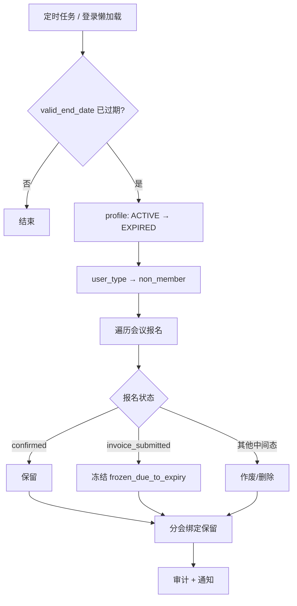
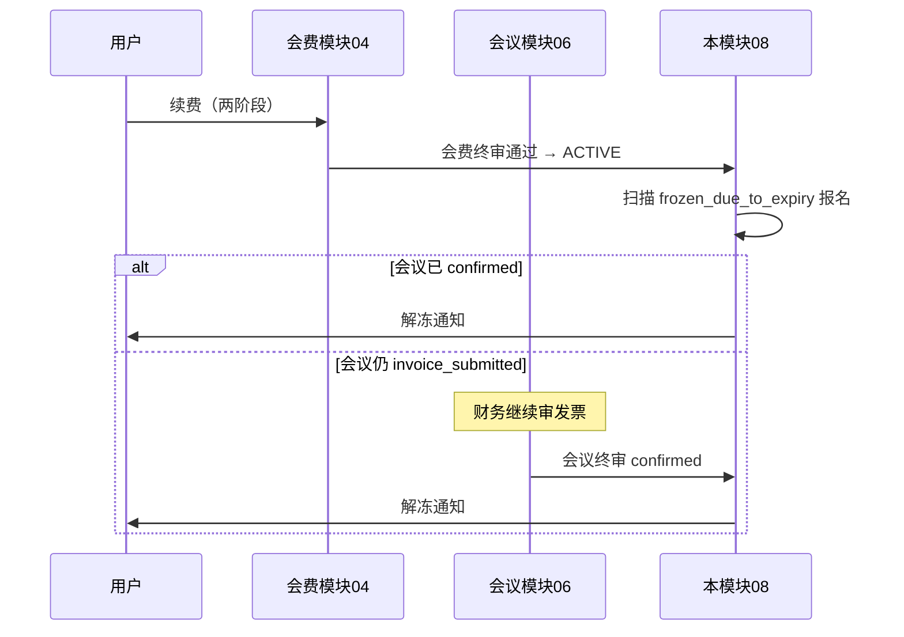

# 08 会员到期与会议资格模块需求

| 字段 | 内容 |
|------|------|
| 文档名称 | 会员到期与会议资格模块 PRD |
| 模块编号 | 08 |
| 版本 | v1.0 |
| 编写日期 | 2026-07-06 |
| 文档状态 | 初稿（待人工校验） |
| 前置基准 | [中国古生物学会完整需求文档.md](../中国古生物学会完整需求文档.md) v3.1 §14 |
| 上游模块 | [04_会员费缴纳](./04_会员费缴纳模块需求.md) · [06_会议发布与会议费报名](./06_会议发布与会议费报名模块需求.md) |
| 下游模块 | [16_横切能力](./16_横切能力模块需求.md)（到期提醒邮件/站内信、审计） |
| 关联原型 | `paleontology-website-latest` · `paleontology-admin-latest` · `paleontology-cms-backend` |
| 不在本模块范围 | 会费两阶段缴费细节（模块 04）、会议费状态机（模块 06）、退会申请书流程（模块 03）、分会绑定保留规则详述（模块 05） |

---

## 目录

1. [模块概述](#1-模块概述)
2. [业务背景与目标](#2-业务背景与目标)
3. [会员有效期规则](#3-会员有效期规则)
4. [到期检测与触发](#4-到期检测与触发)
5. [到期后身份与绑定处理](#5-到期后身份与绑定处理)
6. [会议资格分级处理](#6-会议资格分级处理)
7. [续费与资格恢复](#7-续费与资格恢复)
8. [到期提醒](#8-到期提醒)
9. [业务流程](#9-业务流程)
10. [页面与交互说明](#10-页面与交互说明)
11. [接口与定时任务](#11-接口与定时任务)
12. [数据模型](#12-数据模型)
13. [异常处理](#13-异常处理)
14. [与上下游模块衔接](#14-与上下游模块衔接)
15. [原型差距与改造清单](#15-原型差距与改造清单)
16. [验收标准](#16-验收标准)
17. [附录](#17-附录)

---

## 1. 模块概述

### 1.1 模块定位

本模块定义**正式会员资格到期**后的系统自动处理：身份降级、分会绑定保留、进行中会议报名的**分级冻结/保留/清理**，以及续费后的资格恢复与到期前提醒。

| 能力 | 说明 |
|------|------|
| 有效期管理 | 发票终审通过日起默认 1 年；续费顺延（模块 04） |
| 到期降级 | `member` → `non_member`；`memberStatus` → `expired` |
| 绑定保留 | 分会绑定**不解除**（与旧版 PRD 草案不同，以 v3.1 §11 为准） |
| 会议分级 | 「已锁定不追溯，未锁定清理」 |
| 冻结恢复 | 续费 + 被冻结会议终审通过后恢复 |
| 提醒 | 到期前 30 天、7 天站内信 + 邮件 |

### 1.2 触发角色

| 角色 | 参与方式 |
|------|----------|
| 系统定时任务 | 每日扫描到期会员，执行降级与会议处理 |
| 系统（懒加载） | 用户登录/拉取资料时校验是否已过期 |
| 正式会员用户 | 接收提醒；到期后按非会员继续参会 |
| 管理员 | 查看过期会员；不参与手动到期（全自动） |

---

## 2. 业务背景与目标

### 2.1 业务背景

学会会员资格按年缴纳会费。到期未续费视为**自动失效**（不等同于主动退会）：历史缴费与申请记录保留，用户可继续以**非会员**身份使用网站（绑定分会、按非会员价报名会议等），但不再享受正式会员价与会员身份展示。

同时，会员到期时可能仍有**进行中的会议报名**（凭证已交、发票待审等）。若一律取消，将损害已接近完成流程的用户；若一律保留，则与「非会员价」规则冲突。因此采用**分级处理**（0612 内部沟通已确认，写入 §14.2）。

### 2.2 核心原则

| 原则 | 说明 |
|------|------|
| 已锁定的不追溯 | 会议费已 `confirmed` 的报名，到期后**照常参会** |
| 未锁定的清理 | 早期中间态报名到期时**删除** |
| 给半程用户机会 | `invoice_submitted`（发票终审中）**冻结**，续费后可恢复 |
| 超期未续费 ≠ 退会 | 不走上会/退会申请书；`expired` 可直接续费（模块 04） |
| 服务端权威 | 到期处理须在后端执行，不能仅依赖浏览器 |

### 2.3 模块目标

1. 到期日次日 0 点起自动将 `ACTIVE` 会员降为 `EXPIRED` / `non_member`。
2. 按会议报名状态执行保留 / 冻结 / 删除，并通知用户。
3. 续费终审通过后恢复会员身份，并解冻符合条件的会议报名。
4. 到期前 30 天、7 天提醒用户续费。

---

## 3. 会员有效期规则

### 3.1 起算与时长

| 场景 | `valid_start_date` | `valid_end_date` |
|------|-------------------|------------------|
| 首次成为正式会员 | 会费发票终审通过日 | 通过日 + **1 年** |
| 提前续费（仍有效） | 不变 | 原 `valid_end_date` + **1 年** |
| 过期后续费 | 新发票终审通过日 | 通过日 + **1 年** |

与模块 04 §4.3 一致；后端 `PaleoMemberProfileService.activateByPayment()` 在 `validEndDate` 为空时默认 `validStartDate + 1 年`。

### 3.2 到期判定

| 规则 | 说明 |
|------|------|
| 比较基准 | `valid_end_date` 当日 23:59:59 仍有效；**次日 0 点**起视为过期 |
| 适用状态 | 仅 `memberStatus = ACTIVE` 且 `valid_end_date` 非空 |
| 不适用 | `NON_MEMBER`、`PENDING`、`WITHDRAWN` 等 |

### 3.3 与 `userType` 映射

| `memberStatus`（后端） | 前台 `userType` | 用户可见标签 |
|------------------------|-----------------|--------------|
| `ACTIVE` | `member` | 会员资格有效 |
| `EXPIRED` | `non_member` | 已过期（可续费） |
| `WITHDRAWN` | `non_member` | 已退会 |

到期后 `membershipChoiceMade` **保持为 true**（用户已做过路径选择，无需重新弹窗）。

---

## 4. 到期检测与触发

### 4.1 检测方式（须双轨）

| 方式 | 时机 | 职责 |
|------|------|------|
| **定时任务** | 每日 00:05（可配置） | 批量 `refreshExpiredMembers()`；处理会议分级；发通知 |
| **懒加载校验** | `GET /auth/info`、`getOrCreate` 会员资料 | 单用户 `refreshExpiredStatus()`；保证登录时状态正确 |

> 原型仅在 `MembershipContext` 的 `useEffect` 中检测，**不可靠**（用户不登录则永不触发）。目标以服务端定时任务为主。

### 4.2 到期处理事务（单次执行）

对每名到期用户，在同一数据库事务内顺序执行：

1. 更新 `paleo_member_profile`：`ACTIVE` → `EXPIRED`
2. 更新 `paleo_user`：`user_type` → `non_member`
3. 遍历该用户全部 `paleo_conference_registration`，按 §6 执行保留/冻结/删除
4. 写入审计日志（模块 16）
5. 发送站内通知 + 邮件（汇总冻结/取消数量）
6. **不**修改 `paleo_user_binding`（分会绑定保留）

### 4.3 幂等与重复执行

- 已为 `EXPIRED` 的用户跳过。
- 会议「删除」建议软删除（`status = VOIDED`）或硬删除并记审计，避免重复扣减统计。

---

## 5. 到期后身份与绑定处理

### 5.1 身份变更

| 字段 | 到期前 | 到期后 |
|------|--------|--------|
| `memberStatus` | `ACTIVE` | `EXPIRED` |
| `userType` | `member` | `non_member` |
| `valid_end_date` | 保留历史值 | 保留（展示「过期于 YYYY-MM-DD」） |
| `societyMembership.status`（前台） | `active` | `expired` |

### 5.2 分会绑定

| 规则 | 说明 |
|------|------|
| 绑定列表 | **全部保留**，不自动解绑 |
| 会议列表 | 仍按已绑定分会过滤（模块 05） |
| 会议费 | 新报名按**非会员价**（`getConferenceFee` 随 `userType` 变化） |
| 已 `confirmed` 历史报名 | 锁价金额 `lockedAmount` 不变（模块 06） |

> **与旧文档差异**：`docs/完整需求文档.md` 曾写「到期自动解绑」；**v3.1 §11.2 已改为绑定保留**，本模块以 v3.1 为准。

### 5.3 会费状态

到期不改变历史 `paleo_membership_payment` 记录；用户续费时新建缴费单（模块 04）。非 `VOIDED` 的旧 `CONFIRMED` 记录保留供财务导出。

### 5.4 与退会区别

| 维度 | 到期 (`EXPIRED`) | 退会 (`WITHDRAWN`) |
|------|------------------|---------------------|
| 触发 | 系统自动 | 用户申请 + 管理员审核 |
| 申请书 | 不需要 | 需要退会申请书 |
| 会费记录 | 保留 | 作废 (`VOIDED`) |
| 再入会 | 直接续费 | 须重新提交入会申请（模块 03） |
| 分会绑定 | 保留 | 保留 |

---

## 6. 会议资格分级处理

### 6.1 原则

**「已锁定的不追溯，未锁定的清理」**（§14.2、§21.1 已决议）

### 6.2 状态映射表

会议报名 `registration_status` 与模块 06 `CONFERENCE_STATUS` 对齐：

| 到期时状态 | 中文 | 处理 | `frozen_due_to_expiry` | 用户感知 |
|------------|------|------|------------------------|----------|
| `confirmed` | 已确认（终审通过） | **保留** | `false` | 照常参会；可填参会信息、下载材料 |
| `invoice_submitted` | 发票终审中 | **冻结** | `true` | 报名暂停推进；展示「因会员到期已冻结」 |
| `unpaid` | 未缴费 | **删除/作废** | — | 报名取消 |
| `voucher_submitted` | 凭证初审中 | **删除/作废** | — | 报名取消 |
| `voucher_rejected` | 凭证被驳回 | **删除/作废** | — | 报名取消 |
| `invoice_pending` | 待上传发票 | **删除/作废** | — | 报名取消 |
| `invoice_overdue` | 发票逾期 | **删除/作废** | — | 报名取消 |
| `invoice_rejected` | 发票被驳回 | **删除/作废** | — | 报名取消 |

### 6.3 冻结态行为

`frozen_due_to_expiry = true` 时：

| 能力 | 是否允许 |
|------|----------|
| 财务继续审核该会议发票 | ✓（管理员侧不阻断） |
| 用户上传/替换会议发票 | ✗（须先续费会员） |
| 用户填写参会信息（模块 07） | ✗ |
| 用户查看该会议卡片 | ✓（展示冻结说明） |
| 会议费审核通过变 `confirmed` | ✓，但用户侧仍显示冻结直至 §7 恢复条件满足 |

### 6.4 删除态行为

- 报名记录标记 `VOIDED` 或物理删除（推荐软删除 + 审计）。
- 关联参会信息（模块 07）一并归档或软删除。
- 发送通知：「【会议名】报名资格已失效（会员已到期）」。

### 6.5 原型实现对照

`MembershipContext.handleMembershipExpiry()` 已实现分级逻辑，但：

- `unpaid` **未**进入 `switch`，到期时可能残留（缺陷）。
- 删除操作为 `delete updatedRegs[confId]`（localStorage），无服务端。
- `frozenDueToExpiry` 字段被误用于会费 `invoice_overdue`（与会议冻结语义混用，应拆分）。

---

## 7. 续费与资格恢复

### 7.1 续费入口

| 状态 | 入口 |
|------|------|
| `active` 且临近到期 | 学会服务「提前续费」 |
| `expired` | 学会服务「立即续费」、个人中心 |

流程见模块 04 §4.3（两阶段缴费，无需重新入会申请）。

### 7.2 会员资格恢复

会费发票**终审通过**后：

1. `memberStatus` → `ACTIVE`
2. `userType` → `member`
3. 按模块 04 规则更新 `valid_start_date` / `valid_end_date`
4. 触发 §7.3 会议资格恢复检查

### 7.3 冻结会议恢复条件

**目标规则**（§14.2）：「续费**并**终审通过后自动恢复」

| 条件 | 说明 |
|------|------|
| 会员已恢复 `ACTIVE` | 续费发票终审通过 |
| 会议报名原为冻结态 | `frozen_due_to_expiry = true` |
| 会议终审 | 报名状态为 `confirmed`，或续费后管理员完成发票终审 |

**恢复动作**：

- `frozen_due_to_expiry` → `false`
- 发送通知：「【会议名】报名资格已恢复」
- 用户可继续上传发票（若仍在 `invoice_pending`）或下载材料（若已 `confirmed`）

> **原型差距**：`handleMembershipRenewal()` 仅在续费时清除 `frozenDueToExpiry`，**未被任何地方调用**，且未等待会议 `confirmed`。目标实现应在「会费终审通过」与「会议费终审通过」两个事件上分别评估恢复条件。

### 7.4 已删除报名

到期时被作废的报名**不自动恢复**；用户需以非会员或恢复会员后**重新报名**（新锁价规则适用）。

### 7.5 已确认报名

续费**不改变**已 `confirmed` 报名；`lockedAmount` 与参会信息保持不变。

---

## 8. 到期提醒

### 8.1 提醒时机

| 时机 | 渠道 | 内容要点 |
|------|------|----------|
| 到期前 **30** 天 | 站内信 + 邮件 | 有效期至 X；请提前续费 |
| 到期前 **7** 天 | 站内信 + 邮件 | 即将到期；续费入口链接 |
| 到期当日处理完成 | 站内信 + 邮件 | 已转非会员；冻结 N 场 / 取消 M 场 |

### 8.2 防重复

- 每用户每个提醒档位每日最多 1 条（记录 `last_reminder_30d` / `last_reminder_7d`）。
- 已 `EXPIRED` 不再发「即将到期」提醒。

### 8.3 模块归属

模板与发送通道由模块 16 实现；本模块定义**触发条件与文案变量**。

---

## 9. 业务流程

### 9.1 会员到期主流程



### 9.2 冻结会议恢复



### 9.3 与会议费并行场景

用户会员到期时，会议可能处于 `invoice_pending`（凭证已通过、待传发票）。按 §6.2 该报名**删除**。若业务希望「已填参会信息的不删」，见附录 Q2 待确认；**当前基准为删除**。

---

## 10. 页面与交互说明

### 10.1 学会服务 — 会员服务（`Services.tsx`）

| 会员状态 | UI |
|----------|-----|
| `active` | 绿色「正式会员」+ 有效期至 `{expiryDate}`；临近到期显示「提前续费」 |
| `expired` | 灰色「已过期」+ 过期日；「立即续费」按钮 |

### 10.2 个人中心（`PersonalCenter.tsx`）

- 会员卡片展示 `expiryDate`
- `expired` 状态标签「已过期」

### 10.3 学术会议 — 冻结报名

会议卡片附加说明（建议）：

- 标签：「会员到期冻结」
- 文案：「您的会员已到期，本场会议报名已暂停。续费并完成发票审核后可恢复。」
- 操作：引导「立即续费」；禁用上传发票/填写参会信息

### 10.4 通知示例（原型已有）

| 标题 | 场景 |
|------|------|
| 会员资格已到期 — 已自动转为非会员 | 到期处理完成 |
| 会议资格已恢复 | 续费后解冻 |
| 会员费即将到期 | 30d/7d 提醒（待实现） |

### 10.5 管理后台

| 页面 | 展示 |
|------|------|
| `MemberManagement.tsx` | 筛选 `EXPIRED`；有效期列 |
| `Dashboard.tsx` | 过期会员统计（可选） |
| `NonMemberManagement.tsx` | 含 `expired` 降级用户 |

管理员**不**手动执行到期；可查看状态与导出。

---

## 11. 接口与定时任务

### 11.1 现有后端能力

`PaleoMemberProfileService`：

| 方法 | 说明 |
|------|------|
| `refreshExpiredStatus(profile, operator)` | 单用户懒加载过期 |
| `refreshExpiredMembers()` | 批量过期；返回处理人数 |
| `activateByPayment(...)` | 续费/首次激活时设置有效期 |

**缺口**：`refreshExpiredMembers()` **未**挂载定时任务；**未**处理会议报名分级。

### 11.2 建议新增服务

`PaleoMembershipExpiryService`（或扩展 ProfileService）：

```
processExpiredMember(userId):
  1. expire profile + user_type
  2. processConferenceRegistrations(userId)
  3. notify + audit
```

### 11.3 定时任务

```java
@Scheduled(cron = "0 5 0 * * ?")  // 每日 00:05
public void dailyMembershipExpiryJob() {
  expiryService.processAllExpiredMembers();
  reminderService.sendUpcomingExpiryReminders(); // 30d / 7d
}
```

### 11.4 会议分级 API（内部）

```
POST /internal/membership-expiry/process/{userId}
```

仅内部或定时任务调用；不对前台暴露。

### 11.5 续费恢复钩子

在 `PaleoMembershipPaymentService` 发票终审通过回调中：

```
onMembershipPaymentConfirmed(userId):
  membershipExpiryService.restoreFrozenConferenceRegs(userId)
```

在 `PaleoConferenceRegistrationService` 会议终审通过回调中：

```
onConferenceRegistrationConfirmed(registrationId):
  membershipExpiryService.tryUnfreezeRegistration(registrationId)
```

### 11.6 查询接口（前台）

现有 `GET /paleo/auth/info` 响应应包含：

```json
{
  "userType": "non_member",
  "membershipStatus": "EXPIRED",
  "profile": {
    "validEndDate": "2025-12-31",
    "memberStatus": "EXPIRED"
  }
}
```

会议列表 API 每条报名增加：

```json
{
  "frozenDueToExpiry": true,
  "frozenReason": "MEMBERSHIP_EXPIRED"
}
```

---

## 12. 数据模型

### 12.1 `paleo_member_profile`（已有）

| 字段 | 到期相关 |
|------|----------|
| `member_status` | `ACTIVE` / `EXPIRED` |
| `valid_start_date` | 生效日 |
| `valid_end_date` | 到期日 |
| `latest_payment_id` | 最近生效缴费 |

### 12.2 `paleo_conference_registration`（扩展）

| 字段 | 类型 | 说明 |
|------|------|------|
| `frozen_due_to_expiry` | BOOLEAN | 会员到期冻结标记 |
| `frozen_at` | DATETIME | 冻结时间 |
| `voided_at` | DATETIME | 因到期作废时间 |
| `void_reason` | VARCHAR | 如 `MEMBERSHIP_EXPIRED` |

### 12.3 提醒记录（建议）

`paleo_membership_reminder_log`：

| 列 | 说明 |
|----|------|
| `user_id` | |
| `reminder_type` | `EXPIRY_30D` / `EXPIRY_7D` / `EXPIRED` |
| `sent_at` | |

### 12.4 前台 `ConferenceReg` 映射

```typescript
frozenDueToExpiry?: boolean;  // 对应 frozen_due_to_expiry
```

与 `SocietyMembership.frozenDueToExpiry` **应拆分**——后者不应表示会费发票逾期。

---

## 13. 异常处理

| 场景 | 处理 |
|------|------|
| 定时任务部分用户失败 | 单用户 try/catch，记错误日志，次日重试 |
| 到期处理中会议审核并发 | 事务 + 行锁；以到期处理时刻状态为准 |
| 续费支付中会员到期 | 以终审完成时刻会员状态为准；若已 `EXPIRED` 则按续费规则激活 |
| 用户到期日当天续费成功 | 当日仍有效；不触发到期 job |
| 重复 reminder | 幂等表防重 |
| 冻结会议在恢复前用户删号 | 随账号注销流程归档（模块 01） |

---

## 14. 与上下游模块衔接

| 模块 | 衔接点 |
|------|--------|
| 02 双路径 | 到期后 `userType = non_member`，不重置 `membershipChoiceMade` |
| 03 入会退会 | 退会 `WITHDRAWN` 与到期 `EXPIRED` 不同路径 |
| 04 会员费 | 有效期计算、续费、`activateByPayment` 触发恢复 |
| 05 分会绑定 | 到期**保留**绑定 |
| 06 会议报名 | 分级处理对象；`lockedAmount` 对已确认不变 |
| 07 参会信息 | 冻结时不可编辑；已确认可继续填（若模块 07 解锁规则允许） |
| 15 统计 | `EXPIRED` 计入非会员；作废报名不计入参会人数 |
| 16 通知/审计 | 提醒邮件、到期与恢复日志 |

---

## 15. 原型差距与改造清单

| 项 | 现状 | 目标 | 优先级 |
|----|------|------|--------|
| 到期检测 | 前台 `useEffect` + 登录时 | 服务端每日定时 + 懒加载 | **P0** |
| 会议分级 | 仅 localStorage | DB 事务 + void/freeze | **P0** |
| `unpaid` 报名 | 到期未处理 | 作废 | **P0** |
| `handleMembershipRenewal` | 已定义**从未调用** | 会费/会议终审回调触发 | **P0** |
| 恢复条件 | 续费即解冻 | 续费 + 会议终审（按 §14.2） | P1 |
| `frozenDueToExpiry` 语义 | 会费逾期与会议冻结混用 | 拆分字段 | P1 |
| 定时任务 | `refreshExpiredMembers` 无调度 | `@Scheduled` | **P0** |
| 到期提醒 30d/7d | 未实现 | 模块 16 联调 | P1 |
| 管理端 `checkMembershipExpiry` | 仅改 localStorage 状态 | 调用后端 API | P1 |
| 分会解绑 | 无（已符合 v3.1） | 保持保留 | — |

**关键文件**：

- `paleontology-website-latest/client/src/contexts/MembershipContext.tsx`（`handleMembershipExpiry` / `handleMembershipRenewal`）
- `paleontology-website-latest/client/src/pages/Services.tsx`（过期 UI）
- `paleontology-cms-backend/.../PaleoMemberProfileService.java`
- `paleontology-admin-latest/client/src/contexts/AdminContext.tsx`（`checkMembershipExpiry`）

---

## 16. 验收标准

### 16.1 会员到期

- [ ] `valid_end_date` 次日自动 `EXPIRED`
- [ ] `userType` 降为 `non_member`
- [ ] 分会绑定**保留**
- [ ] 历史会费记录保留
- [ ] 服务端定时任务每日执行且幂等

### 16.2 会议分级

- [ ] `confirmed` 报名保留，可照常参会
- [ ] `invoice_submitted` 报名冻结，用户不可推进
- [ ] 其他中间态报名作废并通知用户
- [ ] 冻结与作废写入审计

### 16.3 续费恢复

- [ ] `expired` 用户可续费（模块 04）
- [ ] 续费顺延规则正确
- [ ] 冻结报名在会员恢复且会议 `confirmed` 后解冻
- [ ] 已作废报名不自动恢复

### 16.4 提醒

- [ ] 到期前 30 天、7 天各提醒一次
- [ ] 到期当日发送汇总通知
- [ ] 邮件 + 站内信（模块 16）

### 16.5 联调

- [ ] 与模块 04 有效期联调
- [ ] 与模块 06 状态机联调
- [ ] 与模块 05 绑定保留联调
- [ ] 前后台同一用户状态一致

---

## 17. 附录

### 17.1 会议状态 → 到期处理速查

```
confirmed          → RETAIN
invoice_submitted  → FREEZE
* (all others)     → VOID
```

### 17.2 相关总需求章节

§14.1～§14.2、§10.7、§11.2、§15.1、§21.1、§22

### 17.3 待人工确认项

| 编号 | 问题 | 建议 |
|------|------|------|
| Q1 | 冻结恢复是否必须等会议 `confirmed`？ | 是，对齐 §14.2「续费并终审通过」 |
| Q2 | `invoice_pending` 且已填参会信息是否仍删除？ | 是，对齐 §14.2；除非另行决议 |
| Q3 | 到期当天 23:59 续费与 00:05 定时任务竞态 | 以支付终审时间戳为准；job 跳过当日已续费用户 |
| Q4 | 过期会员查看会员价历史订单 | 只读展示 `lockedAmount`，新报名非会员价 |

### 17.4 修订记录

| 版本 | 日期 | 说明 |
|------|------|------|
| v1.0 | 2026-07-06 | 初稿 |

---

**文档结束**
