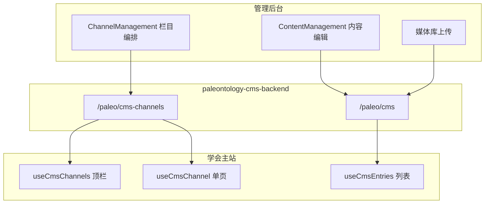
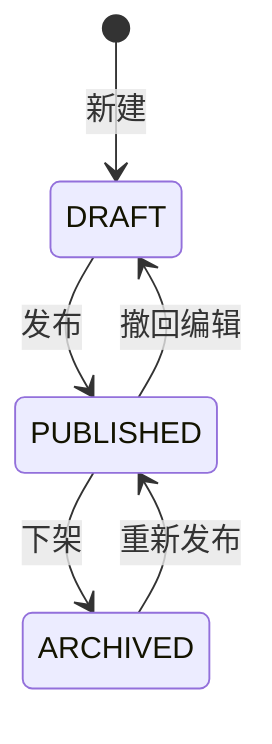

# 09 CMS 主站内容发布模块需求

| 字段 | 内容 |
|------|------|
| 文档名称 | CMS 主站内容发布模块 PRD |
| 模块编号 | 09 |
| 版本 | v1.0 |
| 编写日期 | 2026-07-06 |
| 文档状态 | 初稿（待人工校验） |
| 前置基准 | [中国古生物学会完整需求文档.md](../中国古生物学会完整需求文档.md) v3.1 §4、§17.6–§17.7 |
| 上游模块 | [05_分会绑定与可见性](./05_分会绑定与可见性模块需求.md) · [11_后台角色与数据权限](./11_后台角色与数据权限模块需求.md)（权限细节） |
| 下游模块 | [10_党建文化子系统](./10_党建文化子系统模块需求.md)（共用 CMS 引擎，党建栏目需求另册） · [16_横切能力](./16_横切能力模块需求.md)（OSS、审计） |
| 关联原型 | `paleontology-website-latest` · `paleontology-admin-latest` · `paleontology-cms-backend` |
| 不在本模块范围 | 党建 12 子栏目内容与侧栏版式（模块 10）、会议业务数据（模块 06/14）、会员/缴费业务（模块 02～04）、审核工作台（模块 12） |

---

## 目录

1. [模块概述](#1-模块概述)
2. [业务背景与目标](#2-业务背景与目标)
3. [CMS 架构模型](#3-cms-架构模型)
4. [主站内容域清单](#4-主站内容域清单)
5. [栏目编排与版式](#5-栏目编排与版式)
6. [发布与权限规则](#6-发布与权限规则)
7. [前台展示与路由](#7-前台展示与路由)
8. [管理后台功能](#8-管理后台功能)
9. [接口需求](#9-接口需求)
10. [数据模型](#10-数据模型)
11. [异常处理](#11-异常处理)
12. [与上下游模块衔接](#12-与上下游模块衔接)
13. [原型差距与改造清单](#13-原型差距与改造清单)
14. [验收标准](#14-验收标准)
15. [附录](#15-附录)

---

## 1. 模块概述

### 1.1 模块定位

本模块覆盖学会**主站**（非党建子系统）的内容管理与发布能力：首页轮播与要闻、学会简介、组织机构与分会子站、沿革时间轴、历史相册、会员公告、新闻发布、国际交流/科学传播/科技奖励、规章条例、公开文件，以及顶栏**栏目编排**与站点配置。

| 能力 | 说明 |
|------|------|
| 三表 CMS | 栏目 `channel` + 页面区块 `block` + 内容条目 `entry` |
| 直接发布 | 管理员编辑后直接发布/下架，**无二级审批** |
| 版式驱动 | 时间轴、相册、人员卡片、文件列表等由 `layoutType` 决定 |
| 分会隔离 | 分会管理员仅维护本分会 `associationId` 内容 |
| 公开/登录下载 | 公开文件无需登录；公告附件等可配置 `memberOnly` |
| API 驱动前台 | 主站通过 `/paleo/cms-channels` 与 `/paleo/cms` 拉取内容 |

### 1.2 与模块 10 边界

| 归属 | 内容 |
|------|------|
| **本模块 09** | CMS 引擎、主站栏目、分会子站、公开文件、新闻发布（非党务专题需求）、栏目编排 |
| **模块 10** | 党建文化 `/party` 及 12 子栏目内容规范、党建侧栏双栏壳层、违法违纪举报定制页 |

技术栈共用 `paleo_cms_*` 表与同一套 Controller；党建栏目的 `module_code = party`、`shell_type = party` 在编排层存在，**内容与交互细则见模块 10**。

---

## 2. 业务背景与目标

### 2.1 业务背景

学会官网除会员服务、会议报名等交互业务外，大量页面为**资讯展示型**：学会简介、分会动态、公告、公开资料等。内容需由秘书处/分会管理员在后台维护，前台自动更新，且支持按学会单元隔离数据。

0625 需求将原「资料下载」拆为「新闻发布」与「公开文件」；顶栏顺序可通过栏目编排调整，无需改代码发版。

### 2.2 设计原则

| 原则 | 本模块体现 |
|------|------------|
| 直接发布 | `DRAFT` → `PUBLISHED`，无审批流 |
| 逻辑下线 | `ARCHIVED` + `deleted=1`，保留审计 |
| 最新版本 | 列表按 `pinned`、`sort_order`、`publish_time` 排序 |
| 服务端持久化 | 全部内容入库；禁止仅 localStorage |
| 分会数据隔离 | `association_id` + `AdminScopeService` |

### 2.3 模块目标

1. 总管理员可编排顶栏、配置版式并维护全站主站内容。
2. 分会管理员可维护本分会子站各栏目。
3. 前台导航与页面标题/区块由 CMS 驱动，API 不可用时回退内置常量。
4. 公开文件支持多格式、免登录下载；新闻发布支持背景图与原文件下载。

---

## 3. CMS 架构模型

### 3.1 三层结构

### 3.2 核心实体

| 实体 | 表 | 职责 |
|------|-----|------|
| 栏目 | `paleo_cms_channel` | 路由、导航名、版式、内容模块绑定、发布状态 |
| 区块 | `paleo_cms_block` | 页面内分区（首页混合页、单页富文本区等） |
| 条目 | `paleo_cms_entry` | 文章、轮播、文件、人员、时间轴节点等原子内容 |

### 3.3 内容模块编码 `module_code`

与 `cms-sync.ts` `MODULES` 及后台 `cms-nav.ts` 对齐：

| module_code | 后台入口 | 前台消费 |
|-------------|----------|----------|
| `banners` | 轮播图 | 首页 Banner |
| `news` | 新闻动态 | 首页要闻、工作动态 |
| `announcements` | 会员公告 | `/society-announcements` |
| `pages` | 学会简介 | `/intro` 子栏目 |
| `personnel` | 组织机构 | `/structure` 人员卡片 |
| `gallery` | 历史相册 | `/gallery` |
| `timeline` | 学会沿革 | `/history` |
| `awards` | 获奖成果 | 简介内获奖区 |
| `science` | 学会服务 | `/science`、Services Tab |
| `international` | 学会服务 | `/international`、Services Tab |
| `tech-rewards` | 学会服务 | Services Tab 科技奖励 |
| `regulations` | 规章条例 | `/regulations` |
| `publish` | 新闻发布 | `/news-publish` 三类板块 |
| `public-files` | 公开文件 | `/public-downloads` |
| `downloads` | 分会/学会下载 | 分会子站下载中心 |
| `settings` | 站点配置 | 页脚、快捷入口 |
| `media` | 媒体库 | 全站引用 |
| `party` | 党建文化 | **模块 10**（编排存在，需求另册） |

分会子站内容通过 `scope = branch` + `association_id` 区分；总学会为 `scope = society` 或 `association_id` 为空/总会 ID。

---

## 4. 主站内容域清单

对应总需求 §4.1～§4.11（不含 §6 党建细则）。

### 4.1 首页（§4.1）

| 区域 | 数据来源 | 维护入口 |
|------|----------|----------|
| 顶栏导航 | `paleo_cms_channel` 顶级 `routePath` | 栏目编排 |
| Banner 轮播 | `module_code=banners` | 轮播图 |
| 新闻动态 | `module_code=news` | 新闻动态 |
| 通知摘要 | `module_code=announcements` | 会员公告 |
| 学术活动 | **会议 API**（模块 06）+ 可选 CMS 区块 | 会议管理 + 首页区块 |
| 快速入口 | `module_code=settings` | 站点配置 |
| 分会导航 | 组织机构数据 + 静态 `BRANCH_MAP` | 组织机构 / 分会管理 |
| 页脚 | `module_code=settings` | 站点配置 |

原型 `SocietyHome.tsx` 已从 API 读取 banners/news/announcements；频道元数据来自 `useCmsChannel("/")`。

### 4.2 学会简介（§4.2）

子栏目定义见 `shared/intro-sections.ts`：

| 子栏目 | 存储方式 |
|--------|----------|
| 学会概况、章程、发展规划等 | `pages` + `column_code`（如 `intro_overview`） |
| 现任/历任领导、理事会等 | `pages` + `personnel` 人员组 |
| 专业分会列表 | 链接至 `/structure` |
| 获奖成果 | `awards` 模块 |

版式：`richtext-single`、`personnel-cards`。

### 4.3 组织机构与分会子站（§4.3）

**总学会页** `/structure`：`personnel` + 组织机构图（`pages` 或区块）。

**分会子站** `/structure/branch/:branchId/:section`：结构见 `shared/branch-site.ts`：

| 子栏目 kind | 内容模块 |
|-------------|----------|
| `news-home` | 分会首页动态 |
| `page` | 富文本概况 |
| `personnel` | 理事会人员 |
| `news` | 工作动态列表 |
| `announcements` | 通知公告 |
| `timeline` | 历史沿革 |
| `gallery` | 相册 |
| `science` | 科学传播 |
| `awards` | 获奖成果 |
| `downloads` | 下载中心 |

**可见性**（模块 05）：未绑定分会仅见公开信息；已绑定见全部含附件。CMS 层通过 `memberOnly` 与前台 `isSocietyAccessible()` 联合控制。

### 4.4 学会沿革（§4.4）

- `module_code=timeline`
- 版式 `layoutType=timeline`
- 字段：年份、标题、描述、配图（`cover_url` / `extra_json`）

### 4.5 历史相册（§4.5）

- `module_code=gallery`
- 分类：`category`（早期风采/学术会议/野外考查/国际交流等）
- 版式 `gallery-grid`；支持排序、批量上传（媒体库引用）

### 4.6 会员公告（§4.6）

- `module_code=announcements`
- 支持分类、置顶 `pinned`、下架
- 未登录可看标题摘要；附件 `member_only=1` 时须登录（可配置）

### 4.7 新闻发布（§4.7，0625）

三类板块 `column_code`：

| column_code | 名称 |
|-------------|------|
| `meeting_notice` | 会议通知 |
| `party_public` | 党务公开 |
| `important_news` | 重要新闻 |

- 列表页支持**板块背景图**（`boardCovers` 存 `settings` 或 `extra_json`）
- 详情底部须提供**原文件下载**（`extra_json.originalFile`）
- 逻辑下线历史内容

前台：`NewsPublish.tsx` + `module_code=publish`。

### 4.8 国际交流（§4.8）

- `module_code=international`
- 子类型：交流动态、国际会议、合作机构等（`category` / `column_code`）
- 与学会服务 Tab、顶栏 `/international` **同源**（`useServiceCategories` 从 CMS channel 提取）

### 4.9 规章条例（§4.9）

- `module_code` 绑定栏目 `regulations`；条目可 `pages` 或专用列表
- 正文富文本 + 附件 `file_url`

### 4.10 公开文件（§4.10）

- `module_code=public-files`
- **无需登录**下载
- 格式：

| 类型 | 扩展名 |
|------|--------|
| 文档 | doc/docx, pdf, xls/xlsx, ppt/pptx, zip/rar |
| 音频 | mp3, wav, m4a |
| 视频 | mp4, avi, mov, wmv, mkv, flv |
| 图片 | jpeg, png, gif, tiff |

`column_code` 映射媒体类别；前台 `PublicDownloads.tsx`。

### 4.11 学会服务内内容 Tab（§4.11）

| Tab | module_code | 说明 |
|-----|-------------|------|
| 科学传播 | `science` | 工作动态、期刊、科普、化石保护等 |
| 科技奖励 | `tech-rewards` | 奖项介绍、公示、申报指南 |
| 服务大厅 / 专业分会 | 混合 | 服务总览为静态+链接；分会跳转子站 |

后台统一在 **学会服务** CMS 分区维护（`ContentManagement` section `services`）。

---

## 5. 栏目编排与版式

### 5.1 栏目编排（§17.7）

总管理员在 `ChannelManagement.tsx` 维护：

| 字段 | 说明 |
|------|------|
| `channel_code` | 唯一标识；锁定栏目不可改 |
| `parent_id` | 树形结构（顶栏 parent=0） |
| `route_path` | 前台路由，如 `/history` |
| `nav_name` | 顶栏显示名 |
| `sort_order` | 顶栏顺序 |
| `layout_type` | 版式类型 |
| `layout_params` | JSON 版式参数（`LayoutParamsEditor`） |
| `content_module` | 绑定 `module_code` 筛选 |
| `content_filter` | JSON 附加筛选 |
| `page_type` | `CMS` / `CUSTOM` / `HYBRID` |
| `shell_type` | `standard` / `home` / `party` |
| `visible` | 是否在导航显示 |
| `status` | `DRAFT` / `PUBLISHED` / `ARCHIVED` |
| `locked` | 定制页不可删改路由 |

### 5.2 版式类型 `layout_type`

| 值 | 适用场景 |
|----|----------|
| `hybrid-home` | 首页 |
| `list` | 公告、新闻列表 |
| `list-multi-column` | 多栏新闻 |
| `timeline` | 学会沿革 |
| `gallery-grid` | 历史相册 |
| `personnel-cards` | 领导、理事会 |
| `richtext-single` | 单页富文本 |
| `file-list` | 公开文件、下载中心 |
| `mixed` | 混合内容页 |
| `party-hub` | 党建首页（模块 10） |

### 5.3 页面解析 API

`GET /paleo/cms-channels/public/resolve?routePath=` 一次返回：

- `channel` — 页面元数据
- `blocks` — 页面区块
- `entries` — 按 `content_module` / `content_filter` 过滤的条目
- `children` — 子栏目（简介等多 Tab 场景）

前台 `useCmsChannel` 消费 `public/detail` 或 `public/resolve`。

---

## 6. 发布与权限规则

### 6.1 发布状态机

- **无审批流**；`create_by` / `update_by` 记操作人。
- 下架为逻辑删除或 `ARCHIVED`，须保留审计（模块 16）。

### 6.2 角色与数据范围（详见模块 11）

| 角色 | CMS 权限 |
|------|----------|
| `super_admin` | 全站栏目编排 + 全学会内容 |
| `finance_admin` | 通常只读 CMS（以模块 11 为准） |
| `branch_admin` | 仅 `association_id` 为本分会的 channel/entry |
| 总会专属栏目 | 国际交流、科技奖励等仅总管理员可写（§17.6） |

后端：`AdminScopeService.assertCanWriteCms()`、`canAccessAssociation()`。

### 6.3 分会隔离规则

| 规则 | 说明 |
|------|------|
| 查询过滤 | 分会管理员 list/tree 自动 `IN association_id` |
| 写入校验 | create/edit 须 `canAccessAssociation` |
| 总会内容 | `association_id` 为总会或 null |
| 分会子站 | 每条 entry 带分会 `association_id` |

---

## 7. 前台展示与路由

### 7.1 路由与页面对照

| 路由 | 页面组件 | CMS 路由 |
|------|----------|----------|
| `/` | `SocietyHome` | `/` |
| `/intro` | Intro 系列 | `/intro` |
| `/structure` | `Structure` | `/structure` |
| `/history` | `History` | `/history` |
| `/gallery` | `Gallery` | `/gallery` |
| `/society-announcements` | `SocietyAnnouncements` | `/society-announcements` |
| `/news-publish` | `NewsPublish` | `/news-publish` |
| `/international` | `International` | `/international` |
| `/regulations` | `Regulations` | `/regulations` |
| `/public-downloads` | `PublicDownloads` | `/public-downloads` |
| `/services` | `Services` | 业务+CMS Tab |

### 7.2 布局壳层（`PartyLayout.tsx`）

| 类型 | 页面 |
|------|------|
| 全宽 | 首页、学会服务、简介、组织机构、沿革、相册、公告、新闻、公开文件、国际交流等 |
| 党建侧栏 | `/party` 及子路由 — **模块 10** |

`isFullWidthPage` 与 CMS `shell_type` 应对齐；新增全宽页须同步两处或改为 CMS 驱动 `shell_type`。

### 7.3 导航回退

`useCmsChannels()`：

1. 请求 `GET /paleo/cms-channels/public/list`
2. 失败或空列表 → `FALLBACK_MAIN_NAV` / `FALLBACK_PARTY_NAV`
3. 顶栏按 `parentId=0` + `sortOrder` 构建

### 7.4 内容拉取模式

| Hook | API |
|------|-----|
| `useCmsChannels` | `/public/list` |
| `useCmsChannel(path)` | `/public/detail` 或 `/public/resolve` |
| `useCmsEntries(filter)` | `/paleo/cms/public/list` |

---

## 8. 管理后台功能

### 8.1 菜单结构（`cms-nav.ts`）

| Section key | 标题 | 本模块 |
|-------------|------|:------:|
| `banners` | 轮播图 | ✓ |
| `news` | 新闻动态 | ✓ |
| `pages` | 学会简介 | ✓ |
| `personnel` | 组织机构 | ✓ |
| `awards` | 获奖成果 | ✓ |
| `announcements` | 会员公告 | ✓ |
| `timeline` | 学会沿革 | ✓ |
| `gallery` | 历史相册 | ✓ |
| `services` | 学会服务 | ✓ |
| `regulations` | 规章条例 | ✓ |
| `publish` | 新闻发布 | ✓ |
| `public-files` | 公开文件 | ✓ |
| `branch` | 分会栏目 | ✓ |
| `media` | 媒体库 | ✓ |
| `settings` | 站点配置 | ✓ |
| `party` | 党建文化 | 编排入口；内容需求 → 模块 10 |

另：**栏目编排**独立页 `ChannelManagement`（`/admin/cms/channels`）。

### 8.2 内容编辑（`ContentManagement.tsx`）

- 按 section 切换表单：文章、轮播、人员、时间轴、公开文件等
- 富文本：`RichTextEditor`（`cms-ui.tsx`）
- 附件：`AttachmentEditor`、`uploadCmsMedia`
- 数据流：`fetchCmsDatabase()` → 编辑 → `saveCmsDatabase()` → `upsertCmsEntry` API

### 8.3 媒体库

- 上传：`POST /paleo/cms/media/upload`
- 自动写入 `module_code=media` 条目
- 其他模块通过 `cover_url` / `file_url` 引用

### 8.4 站点配置 `settings`

典型 `column_code`：版权、联系电话、友情链接、首页快捷入口 JSON 等，存 `paleo_cms_entry` 多条或 `extra_json`。

---

## 9. 接口需求

### 9.1 栏目 API（已实现）

基路径：`/paleo/cms-channels`

| 方法 | 路径 | 说明 |
|------|------|------|
| GET | `/tree` | 管理端栏目树 |
| GET | `/list` | 管理端分页列表 |
| GET | `/{channelId}` | 栏目详情 |
| POST | `/` | 新增栏目 |
| PUT | `/` | 修改栏目 |
| POST | `/{channelId}/status` | 发布/下架 |
| POST | `/{channelId}/delete` | 逻辑删除 |
| GET | `/public/list` | 公开栏目列表 |
| GET | `/public/detail` | 公开栏目+区块 |
| GET | `/public/resolve` | 公开栏目+区块+条目+子栏目 |
| GET | `/{channelId}/blocks` | 区块列表 |
| POST | `/{channelId}/blocks` | 保存区块 |
| POST | `/blocks/{blockId}/delete` | 删除区块 |

### 9.2 内容 API（已实现）

基路径：`/paleo/cms`

| 方法 | 路径 | 说明 |
|------|------|------|
| GET | `/list` | 管理端分页（支持 moduleCode 等筛选） |
| GET | `/{entryId}` | 管理端详情 |
| POST | `/` | 新增 |
| PUT | `/` | 修改 |
| POST | `/{entryId}/status` | 更新状态 |
| POST | `/{entryId}/delete` | 逻辑删除 |
| POST | `/media/upload` | 媒体上传 |
| GET | `/public/list` | 公开列表 |
| GET | `/public/{entryId}` | 公开详情 |

### 9.3 布局模板 API

`PaleoCmsLayoutController` — 提供可选 `layout_type` 元数据供栏目编排下拉。

### 9.4 待增强接口（建议）

| 接口 | 说明 | 优先级 |
|------|------|--------|
| `GET /paleo/cms/public/home-bundle` | 首页一次聚合 banners+news+announcements | P2 |
| `GET /paleo/cms/public/branch/{code}/resolve` | 分会子站按 section 解析 | P1 |
| 发布/下架写审计 | 挂钩 `AuditLogService` | P1 |

---

## 10. 数据模型

### 10.1 `paleo_cms_entry` 关键字段

| 字段 | 说明 |
|------|------|
| `module_code` | 内容模块 |
| `column_code` | 子栏目/板块 |
| `scope` | `society` / `branch` / `party` |
| `association_id` | 分会 FK |
| `title` / `summary` / `body_content` | 标题、摘要、正文 |
| `cover_url` / `media_url` / `file_url` | 封面、媒体、附件 |
| `extra_json` | 扩展（新闻原文件、人员职务等） |
| `member_only` | 是否登录可见 |
| `pinned` / `sort_order` / `publish_time` | 排序与发布 |
| `status` / `deleted` | 发布与逻辑删 |

### 10.2 `paleo_cms_channel` 关键字段

见 §5.1；`uk_channel_code` 全局唯一。

### 10.3 `paleo_cms_block`

页面内区块：`block_type`、`data_source`（JSON 指定 entry 查询条件）。

### 10.4 与原型 `CmsDatabase` 映射

管理端 `cms-sync.ts` 负责 `CmsDatabase` ↔ `ApiCmsEntry[]` 双向转换；**目标态**为管理端逐步改为按 module 直调 API，减少全量聚合。

---

## 11. 异常处理

| 场景 | 处理 |
|------|------|
| CMS API 不可用 | 前台回退 `FALLBACK_*` 常量；首页 Banner 用占位图 |
| 上传超大小/非法格式 | 400 + 明确提示（公开文件按 §4.10 校验扩展名） |
| 分会管理员写总会内容 | 403 |
| 删除锁定栏目 | 400「定制页栏目不可删除」 |
| 发布空标题条目 | 前端校验拦截 |
| 并发编辑 | 后写覆盖；可选 `update_time` 乐观锁（P2） |
| OSS/本地存储失败 | 500；不创建 entry |

---

## 12. 与上下游模块衔接

| 模块 | 衔接点 |
|------|--------|
| 05 分会绑定 | 分会子站深度内容、公告附件下载可见性 |
| 06 会议 | 首页学术活动卡片、会议通知与新闻发布边界 |
| 10 党建 | 共用 channel/entry；党建内容与侧栏需求 |
| 11 角色权限 | `AdminScopeService`、菜单 `adminRoles` |
| 14 会议管理 | 会议通知 PDF 与 CMS 新闻/下载分工 |
| 16 横切 | 文件 OSS、发布审计、富文本 XSS 过滤 |

---

## 13. 原型差距与改造清单

| 项 | 现状 | 目标 | 优先级 |
|----|------|------|--------|
| 管理端数据流 | `CmsDatabase` 全量聚合 + localStorage 缓存 | 按 module 分页 API 编辑 | P1 |
| 首页学术活动 | 部分静态/mock | 对接会议公开 API | P1 |
| 分会子站 | 部分静态 | 全量 `association_id` + resolve API | P1 |
| 公告附件登录 | 部分未 enforced | 后端 `member_only` + 下载鉴权 | P1 |
| 发布审计 | 部分操作未记 audit | 发布/下架/删除写审计 | P1 |
| 栏目编排与前台 | 部分 `isFullWidthPage` 硬编码 | 以 `shell_type` 为准 | P2 |
| OSS 存储 | `LocalFileStorageService` 本地 | 生产 OSS（模块 16） | P0 上线前 |
| 国际交流/科技奖励 | 仅总管理员可写 | 后端强制校验 | P1 |
| 党建内容 | 与主站混在 CMS_SECTIONS | 文档分离；代码可保留入口 | — |

**关键文件**：

- `paleontology-cms-backend/.../PaleoCmsChannelController.java`
- `paleontology-cms-backend/.../PaleoCmsEntryController.java`
- `paleontology-admin-latest/.../cms/ContentManagement.tsx`
- `paleontology-admin-latest/.../cms/ChannelManagement.tsx`
- `paleontology-admin-latest/client/src/lib/cms-sync.ts`
- `paleontology-website-latest/client/src/hooks/useCmsChannels.ts`
- `paleontology-website-latest/client/src/pages/SocietyHome.tsx`
- `shared/intro-sections.ts`、`shared/branch-site.ts`

---

## 14. 验收标准

### 14.1 栏目编排

- [ ] 总管理员可调整顶栏顺序、路由、版式
- [ ] 发布后前台导航自动更新
- [ ] 锁定栏目不可删改路由
- [ ] 分会管理员不可改总会专属栏目

### 14.2 主站内容

- [ ] 轮播、新闻、公告、简介、沿革、相册、规章可发布/下架
- [ ] 新闻发布三类板块 + 背景图 + 原文件下载
- [ ] 公开文件免登录、格式符合 §4.10
- [ ] 国际交流/科学传播/科技奖励与学会服务 Tab 同源

### 14.3 分会子站

- [ ] 分会管理员仅维护本分会内容
- [ ] 子站各栏目与 `branch-site.ts` 结构一致
- [ ] 可见性与模块 05 绑定规则一致

### 14.4 技术

- [ ] 内容全部持久化在 `paleo_cms_*` 表
- [ ] 公开 API 不暴露草稿/已删内容
- [ ] API 失败时前台可降级展示
- [ ] 媒体上传可被多模块引用

### 14.5 联调

- [ ] 与模块 11 权限联调
- [ ] 与模块 05 分会可见性联调
- [ ] 与模块 16 文件存储联调

---

## 15. 附录

### 15.1 默认顶栏顺序（回退常量）

首页 → 学会简介 → 组织机构 → 学会服务 → 党建文化 → 学会沿革 → 历史相册 → 会员公告 → 新闻发布 → 国际交流 → 规章条例 → 公开文件

（党建文化编排属模块 10，此处仅导航占位。）

### 15.2 相关总需求章节

§3.1～§3.3、§4.1～§4.11、§17.6～§17.7、§16.2（公开下载权限）

### 15.3 待人工确认项

| 编号 | 问题 | 建议 |
|------|------|------|
| Q1 | 会员公告附件是否默认须登录？ | 是，可单条 `member_only` 覆盖 |
| Q2 | 党务公开放在新闻发布还是党建模块？ | 新闻发布 `party_public` 板块（0625）；党建深度内容在模块 10 |
| Q3 | 分会下载中心与会公开文件边界？ | 分会 `downloads` 可需绑定；`public-files` 全站公开 |
| Q4 | 首页学术活动是否只展示已发布会议？ | 是，对接模块 06 `OPEN` 会议 |

### 15.4 修订记录

| 版本 | 日期 | 说明 |
|------|------|------|
| v1.0 | 2026-07-06 | 初稿 |

---

**文档结束**
