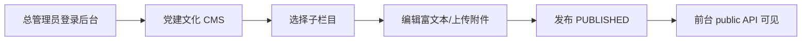
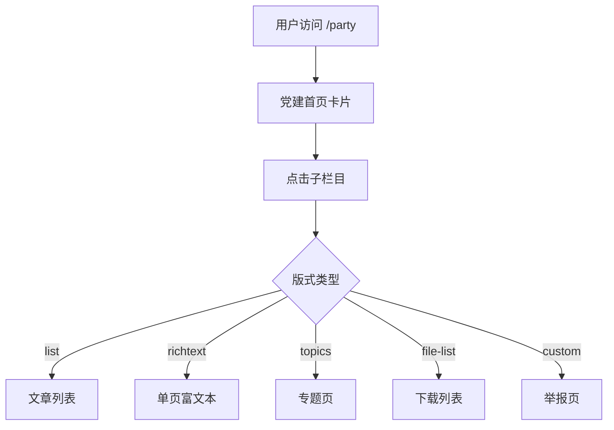
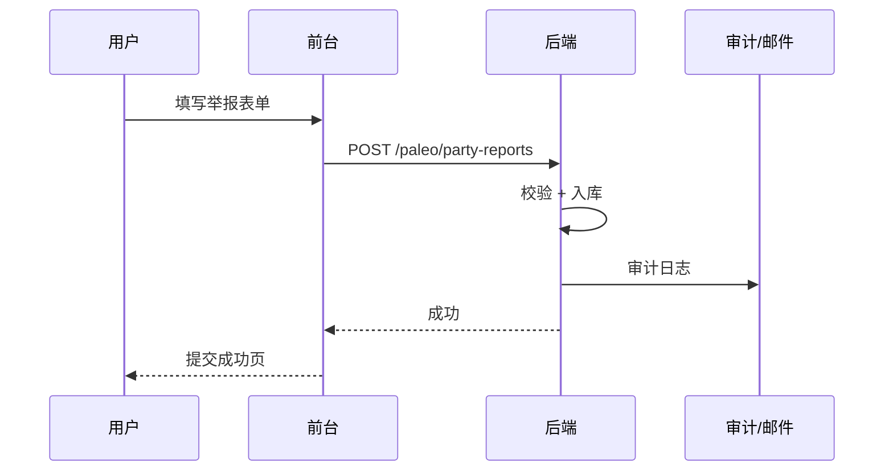

# 10 党建文化子系统模块需求

| 字段 | 内容 |
|------|------|
| 文档名称 | 党建文化子系统模块 PRD |
| 模块编号 | 10 |
| 版本 | v1.0 |
| 编写日期 | 2026-07-06 |
| 文档状态 | 初稿（待人工校验） |
| 前置基准 | [中国古生物学会完整需求文档.md](../中国古生物学会完整需求文档.md) v3.1 §6 |
| 上游模块 | [09_CMS主站内容发布](./09_CMS主站内容发布模块需求.md)（共用 CMS 引擎） · [11_后台角色与数据权限](./11_后台角色与数据权限模块需求.md) |
| 下游模块 | [16_横切能力](./16_横切能力模块需求.md)（举报持久化、文件存储、审计） |
| 关联原型 | `paleontology-website-latest` · `paleontology-admin-latest` · `paleontology-cms-backend` |
| 不在本模块范围 | 主站非党建 CMS（模块 09）、新闻发布「党务公开」板块（模块 09 §4.7）、会员业务（模块 02～08） |

---

## 目录

1. [模块概述](#1-模块概述)
2. [业务背景与目标](#2-业务背景与目标)
3. [信息架构与路由](#3-信息架构与路由)
4. [十二子栏目需求](#4-十二子栏目需求)
5. [页面版式与视觉](#5-页面版式与视觉)
6. [违法违纪举报](#6-违法违纪举报)
7. [下载中心](#7-下载中心)
8. [后台维护](#8-后台维护)
9. [接口与数据模型](#9-接口与数据模型)
10. [业务流程](#10-业务流程)
11. [异常处理](#11-异常处理)
12. [与上下游模块衔接](#12-与上下游模块衔接)
13. [原型差距与改造清单](#13-原型差距与改造清单)
14. [验收标准](#14-验收标准)
15. [附录](#15-附录)

---

## 1. 模块概述

### 1.1 模块定位

党建文化子系统是学会网站的**独立展示子系统**，审计整改重点关注模块。顶栏入口「党建文化」进入后，采用**左侧 12 子栏目导航 + 右侧内容区**双栏版式，内容由 CMS 维护，管理员直接发布/下架。

| 能力 | 说明 |
|------|------|
| 党建首页 | `/party` 枢纽页，卡片入口至 12 子栏目 |
| 12 子栏目 | 通知公告～下载中心，各栏目内容规范见 §4 |
| 侧栏导航 | CMS 驱动 `partyNavItems`，红色激活态 |
| 文章/专题 | `module_code=party`，`scope=party` |
| 举报表单 | `/reporting` 定制页（在线举报） |
| 党务模板下载 | `downloads` + `scope=party` |

### 1.2 与模块 09 边界

| 项目 | 模块 09 | 本模块 10 |
|------|---------|-----------|
| CMS 三表引擎 | ✓ 共用 | 消费 |
| 顶栏「党建文化」频道编排 | 可改顺序/标题 | 子栏目内容与版式 |
| 新闻发布 `party_public` | 党务公开短讯 | 深度党建栏目内容 |
| 分会 CMS | 分会子站 | **党建仅总会级**，不分分会 |

---

## 2. 业务背景与目标

### 2.1 业务背景

上级审计与党建整改要求学会网站具备完整的党建信息公开能力：组织建设、组织生活、理论学习、先进典型、监督举报渠道等须可在线查阅，且后台可便捷更新。

### 2.2 设计原则

| 原则 | 说明 |
|------|------|
| 独立子系统 | 与主站全宽页区分，统一党建侧栏 |
| 直接发布 | 无二级审批；逻辑下线保留历史 |
| 内容规范 | 各子栏目有明确主题边界（§6.1） |
| 公开浏览 | 党建内容默认**无需登录**即可阅读 |
| 举报严肃性 | 举报须知 CMS 可维护；提交须服务端持久化（目标） |

### 2.3 模块目标

1. 12 个子栏目结构完整、路由稳定、侧栏与 CMS 同步。
2. 秘书处可在后台「党建文化」分区维护文章、专题、下载模板与举报须知。
3. 在线举报可入库、可后台查阅，并严格审计与保密。
4. 视觉符合「Strata & Heritage」体系，党建红 `#C41E3A` 为强调色。

---

## 3. 信息架构与路由

### 3.1 顶栏入口

- 顶栏链接：`/party`（`channel_code=party`，`shell_type=party`）
- 与主站其他一级导航并列，顺序由栏目编排（模块 09）决定

### 3.2 十二子栏目路由表

与 Flyway `V2__seed_data.sql` 及 `PARTY_NAV_ITEMS` 对齐：

| # | 子栏目 | channel_code | route_path | layout_type | content_module |
|---|--------|--------------|------------|-------------|----------------|
| 1 | 通知公告 | `party_announcement` | `/announcements` | `list` | `party` |
| 2 | 党群机构 | `party_organizations` | `/organizations` | `richtext-single` | `pages` |
| 3 | 党委纪委 | `party_committees` | `/committees` | `list` | `party` |
| 4 | 党建工作 | `party_work` | `/work` | `list` | `party` |
| 5 | 组织生活 | `party_activities` | `/activities` | `list` | `party` |
| 6 | 党员队伍建设 | `party_team` | `/team-building` | `list` | `party` |
| 7 | 理论学习专栏 | `party_theory` | `/theory-study` | `list` | `party` |
| 8 | 工作动态 | `party_dynamics` | `/dynamics` | `list` | `party` |
| 9 | 党建专题 | `party_topics` | `/special-topics` | `list` + 专题版式 | `party` |
| 10 | 先进典型 | `party_exemplars` | `/exemplars` | `list`（卡片） | `party` |
| 11 | 违法违纪举报 | `party_reporting` | `/reporting` | `list` + **定制页** | `party` |
| 12 | 下载中心 | `party_downloads` | `/downloads` | `file-list` | `downloads` |

父栏目：`party`（`parent_id` 指向根），12 项为子 channel。

### 3.3 路由实现方式

| 路径 | 实现 |
|------|------|
| `/party` | 显式路由 → `Home.tsx`（党建枢纽） |
| `/reporting` | 显式路由 → `Reporting.tsx`（定制表单） |
| 其余子栏目 | `CmsDynamicPage` catch-all + `public/resolve` |

`App.tsx` 中 `/party`、`/reporting` 为保留的混合/定制页；其他党建路径走 CMS 动态解析。

### 3.4 侧栏判定逻辑

`PartyLayout.tsx`：

```typescript
const partyPaths = [
  "/party", "/announcements", "/organizations", "/committees", "/work",
  "/activities", "/team-building", "/theory-study", "/dynamics",
  "/special-topics", "/exemplars", "/reporting", "/downloads"
];
const showPartySidebarLayout = isPartyPage && !isFullWidthPage;
```

侧栏项来自 `useCmsChannels().partyNavItems`（CMS 子 channel 列表），失败时回退 `FALLBACK_PARTY_NAV`。

---

## 4. 十二子栏目需求

对应总需求 §6.1；下列「内容要点」为编辑部维护指引，「技术实现」为原型现状。

### 4.1 通知公告

| 项 | 说明 |
|----|------|
| 内容要点 | 上级批示、巡视巡察、党内选举、党务通知、公示 |
| 展示 | 文章列表；支持 `category` 标签、`pinned` 置顶 |
| 组件 | `PartyArticleList` / `CmsListLayout` |
| column_code | `party_announcement` |

### 4.2 党群机构

| 项 | 说明 |
|----|------|
| 内容要点 | 党群工作处、党支部委员会、工会、共青团；职能与架构 |
| 展示 | 单页富文本为主；可配 `blocks` 分区 |
| 组件 | `PartyRichTextPage` 或 `CmsRichTextLayout` |
| 存储 | `module_code=pages`，`column_code=party_organizations` |

### 4.3 党委纪委

| 项 | 说明 |
|----|------|
| 内容要点 | 党委履职、纪委监督、党风廉政建设 |
| category 示例 | 党委履职、纪委监督 |
| column_code | `party_committees` |

### 4.4 党建工作

| 项 | 说明 |
|----|------|
| 内容要点 | 年度要点、阶段任务、专项整治、责任制落实 |
| category 示例 | 年度要点、专项整治 |

### 4.5 组织生活

| 项 | 说明 |
|----|------|
| 内容要点 | 换届选举；三会一课、主题党日、组织生活会、中心组学习、民主生活会、民主评议 |
| category 示例 | 三会一课、主题党日 |

### 4.6 党员队伍建设

| 项 | 说明 |
|----|------|
| 内容要点 | 概况、发展党员、党员教育、党员管理、党员服务、党员奖惩、党费管理 |
| category 示例 | 发展党员、党费管理 |

### 4.7 理论学习专栏

| 项 | 说明 |
|----|------|
| 内容要点 | 权威学习数据库**外链**、党内法规、基础党务知识 |
| 实现 | 文章 `link_url` 跳转外链；或正文内嵌链接 |
| category 示例 | 党内法规、基础党务 |

### 4.8 工作动态

| 项 | 说明 |
|----|------|
| 内容要点 | 党建活动、支部工作新闻 |
| 展示 | 列表；可强调「图文报道」 |

### 4.9 党建专题

| 项 | 说明 |
|----|------|
| 内容要点 | 阶段性主题教育专题页 |
| 数据结构 | `column_code=party_topic`；`extra_json.articleIds` 关联文章 |
| 组件 | `PartyTopicsList` / `CmsTopicsLayout` |
| 后台 | 专题封面、描述、关联文章 ID 列表 |

### 4.10 先进典型

| 项 | 说明 |
|----|------|
| 内容要点 | 科学家精神、重大荣誉 |
| 展示 | **卡片布局**（封面图 + 摘要） |
| 组件 | `PartyArticleList layout="card"` |
| category 示例 | 科学家精神、荣誉表彰 |

### 4.11 违法违纪举报

见 [§6](#6-违法违纪举报) 专章。

### 4.12 下载中心

见 [§7](#7-下载中心) 专章。

### 4.13 通用文章字段

| 字段 | 说明 |
|------|------|
| `title` | 标题 |
| `category` | 子分类标签（列表徽章） |
| `summary` | 摘要 |
| `body_content` | 富文本正文 |
| `cover_url` | 封面（先进典型等） |
| `file_url` | 附件 |
| `pinned` | 置顶 |
| `publish_time` | 发布日期 |
| `status` | `DRAFT` / `PUBLISHED` / `ARCHIVED` |

排序：置顶优先 → `sort_order` → `publish_time` 降序。

---

## 5. 页面版式与视觉

### 5.1 党建首页 `/party`

`Home.tsx`：

- 顶部宣传条（`party-gradient` 图标 + 标题/副标题来自 channel）
- 快捷按钮：理论学习、通知公告
- 3 列卡片网格：遍历 `partyNavItems`，`border-t-4` 轮换强调色

`layout_type` 建议：`party-hub`（种子数据中父 channel 配置）。

### 5.2 双栏壳层

| 区域 | 说明 |
|------|------|
| 顶栏 | 与全站共用 `PartyLayout` 顶栏（深蓝 `#002B49`） |
| Hero | 党建页 Banner 高度 400px（`/party` 根路径）；子栏目 200px |
| 左侧栏 | 宽 256px；当前项 `border-l-4 border-party-red` |
| 右侧 | 主内容；面包屑：党建文化 → 当前页 |
| 页脚 | 与全站一致 |

### 5.3 设计 token

| Token | 值 | 用途 |
|-------|-----|------|
| `party-red` | `#C41E3A` | 侧栏激活、标题竖条、按钮 |
| `party-gradient` | 红渐变 | 首页图标底 |
| `accent-gold` | `#D9C5A0` | 卡片装饰 |
| 标题竖条 | `w-1 h-6 bg-party-red` | 各子页 H2 前缀 |

### 5.4 党建 Banner

`PartyLayout` Hero 背景图：党建路径使用党建专用 Banner URL（与学会主 Banner 区分）。

---

## 6. 违法违纪举报

### 6.1 页面结构（`Reporting.tsx`）

| 区域 | 内容 |
|------|------|
| 左侧 | 举报须知（CMS `party_reporting` 置顶文章富文本） |
| 左侧 | 其他须知文章列表 |
| 左侧 | 其他举报渠道（邮寄、电话、邮箱） |
| 右侧 | 在线举报表单 |

### 6.2 举报须知（CMS）

- `module_code=party`，`column_code=party_reporting`
- 置顶文章作为须知主文；支持多篇补充

### 6.3 在线表单字段

| 字段 | 必填 | 说明 |
|------|:----:|------|
| `reportedName` | ✓ | 被举报人姓名 |
| `reportedDept` | — | 部门/支部 |
| `violationType` | ✓ | 枚举：科研经费违规、学术诚信、作风纪律、其他 |
| `description` | ✓ | 事实与证据说明（建议限 1000 字） |
| `isAnonymous` | — | 默认 true |
| `reporterName` | 条件 | 非匿名时填写 |
| `reporterContact` | 条件 | 非匿名时填写 |

### 6.4 目标后端能力（待实现）

```
POST /paleo/party-reports
```

- 入库 `paleo_party_report`（建议新表）
- 仅纪委授权管理员可列表查阅
- 写审计日志；敏感字段加密或隔离存储
- 提交成功邮件通知纪委邮箱（模块 16，可选）

### 6.5 原型差距

- 提交后仅 `setSubmitted(true)`，**无 API**
- 举报渠道电话/邮箱/地址**硬编码**在 `Reporting.tsx`
- 建议：渠道信息迁入 `settings` 或 `party_reporting` 区块配置

---

## 7. 下载中心

### 7.1 数据模型

| 项 | 值 |
|----|-----|
| `module_code` | `downloads` |
| `scope` | `party` |
| `page_type` | `CUSTOM`（`PartyDownloadsList` 或 `CmsFileListLayout`） |

### 7.2 分类（后台）

`DOWNLOAD_CATEGORIES_PARTY`：

- 入党申请书
- 思想汇报
- 转正申请
- 其他模板

（需求 §6.1 另提及请假条、举报模板 — 可并入「其他模板」或扩展分类，见附录 Q2。）

### 7.3 展示

- 按 `category` 分组网格
- 每项：标题、扩展名、文件名、`file_url` 下载
- 默认**无需登录**

### 7.4 与学会/分会下载区别

| scope | 入口 |
|-------|------|
| `party` | `/downloads` 党建下载中心 |
| `society` | 规章、学会资料等 |
| `branch` | 分会子站下载中心（模块 09） |

---

## 8. 后台维护

### 8.1 入口

管理后台 → CMS → **党建文化**（`section=party`）

`cms-nav.ts`：

> 维护党建各子栏目的文章与专题

### 8.2 功能分区（`ContentManagement.tsx`）

| Tab/区 | 对象 | 操作 |
|--------|------|------|
| 文章列表 | `partyArticles` | 按 `column` 筛选；富文本编辑；发布/删除 |
| 党建专题 | `partyTopics` | 标题、封面、描述、关联文章 |
| 党务下载 | `downloadFiles` where `scope=party` | 上传模板文件 |

文章编辑对话框：选择子栏目（`PARTY_NAV_ITEMS` 除 topics/downloads）、标题、富文本、发布。

### 8.3 权限

| 角色 | 权限 |
|------|------|
| `super_admin` | 全部党建 CMS |
| `branch_admin` | **不可**编辑党建（总会专属） |
| `finance_admin` | 通常只读 |

与 §17.6「党建文化」由总管理员维护一致；后端 `AdminScopeService` 应拒绝分会写入 `scope=party`。

### 8.4 发布规则

- 与模块 09 相同：直接发布，无审批
- 下架：`status=ARCHIVED` 或逻辑删除
- 操作记审计（目标）

---

## 9. 接口与数据模型

### 9.1 复用 CMS API（模块 09）

| API | 党建用途 |
|-----|----------|
| `GET /paleo/cms-channels/public/list` | 顶栏 + 侧栏子频道 |
| `GET /paleo/cms-channels/public/resolve?routePath=` | 动态页聚合 |
| `GET /paleo/cms/public/list?moduleCode=party&columnCode=` | 文章列表 |
| `POST /paleo/cms` | 后台新增/更新 |
| `POST /paleo/cms/media/upload` | 附件/封面 |

### 9.2 Entry 约定

```json
{
  "moduleCode": "party",
  "columnCode": "party_announcement",
  "scope": "party",
  "title": "…",
  "category": "重要批示",
  "bodyContent": "<p>…</p>",
  "pinned": "1",
  "status": "PUBLISHED"
}
```

专题：

```json
{
  "moduleCode": "party",
  "columnCode": "party_topic",
  "coverUrl": "…",
  "extraJson": "{\"articleIds\":[101,102]}"
}
```

### 9.3 建议新增：举报表

`paleo_party_report`：

| 列 | 类型 | 说明 |
|----|------|------|
| `id` | BIGINT PK | |
| `reported_name` | VARCHAR | |
| `reported_dept` | VARCHAR | |
| `violation_type` | VARCHAR | |
| `description` | TEXT | |
| `is_anonymous` | CHAR(1) | |
| `reporter_name` | VARCHAR | 可空 |
| `reporter_contact` | VARCHAR | 可空 |
| `status` | ENUM | NEW/PROCESSING/CLOSED |
| `created_at` | DATETIME | |

### 9.4 种子数据

`V2__seed_data.sql`、`V3__extend_seed_content.sql` 已含 12 子 channel 与示例 party 文章，部署即用。

---

## 10. 业务流程

### 10.1 内容发布



### 10.2 用户浏览



### 10.3 举报提交（目标）



---

## 11. 异常处理

| 场景 | 处理 |
|------|------|
| CMS API 失败 | 侧栏回退 `FALLBACK_PARTY_NAV`；内容区空状态提示 |
| 子栏目无文章 | 「暂无内容，请在管理后台维护」 |
| 举报必填缺失 | 前端校验 + 禁止提交 |
| 非授权管理员读举报 | 403 |
| 下载文件缺失 | 隐藏或禁用下载项 |
| 外链理论学习失效 | 编辑部定期巡检；后台可更新 `link_url` |

---

## 12. 与上下游模块衔接

| 模块 | 衔接点 |
|------|--------|
| 09 CMS | 共用 channel/entry/block；栏目编排含 `party` 父节点 |
| 09 新闻发布 | `party_public` 板块发短讯；深度内容在本模块 |
| 11 权限 | 仅总管理员写党建 |
| 16 横切 | 举报存储、邮件通知、富文本 XSS、OSS |
| 01 登录 | 党建浏览无需登录；举报匿名可选 |

---

## 13. 原型差距与改造清单

| 项 | 现状 | 目标 | 优先级 |
|----|------|------|--------|
| 在线举报 | 仅前端 state | 后端 API + 管理端查阅 | **P0** |
| 举报渠道信息 | 硬编码 | CMS/settings 可配置 | P1 |
| 子栏目页面 | 部分独立页 + 部分 CmsDynamicPage | 统一 resolve 或保留定制页文档化 | P2 |
| 举报管理后台 | 无 | 纪委专属列表（可合入模块 12 或独立） | P1 |
| 分会写党建 | 前端可能误开 | 后端 `scope=party` 写保护 | P0 |
| 党群机构 | `pages` + `party_organizations` | 与 channel `content_module` 一致 | P2 |
| `/downloads` CUSTOM | `PartyDownloadsList` 独立组件 | 与 `CmsFileListLayout` 合并或注册到 CUSTOM registry | P2 |
| 审计日志 | 部分缺失 | 发布/下架/举报查阅全记 audit | P1 |

**关键文件**：

- `paleontology-website-latest/client/src/components/PartyLayout.tsx`
- `paleontology-website-latest/client/src/pages/Home.tsx`
- `paleontology-website-latest/client/src/pages/Reporting.tsx`
- `paleontology-website-latest/client/src/components/party/*`
- `paleontology-admin-latest/client/src/pages/admin/cms/ContentManagement.tsx`（`section=party`）
- `paleontology-admin-latest/client/src/pages/admin/cms/cms-nav.ts`
- `paleontology-cms-backend/.../db/migration/V2__seed_data.sql`

---

## 14. 验收标准

### 14.1 结构与导航

- [ ] 顶栏「党建文化」进入 `/party`
- [ ] 12 子栏目侧栏完整、顺序与 CMS 一致
- [ ] 各 `route_path` 可访问且标题/面包屑正确
- [ ] API 失败时侧栏回退可用

### 14.2 内容

- [ ] 各子栏目可发布文章/富文本/专题/下载
- [ ] 置顶、分类标签、发布日期展示正确
- [ ] 先进典型卡片布局与封面展示
- [ ] 理论学习支持外链
- [ ] 党建专题可关联多篇文章

### 14.3 举报与下载

- [ ] 举报须知来自 CMS
- [ ] 表单校验与匿名逻辑正确
- [ ] 举报提交持久化且仅授权人可查阅（目标）
- [ ] 下载中心分类与文件可下载

### 14.4 权限与后台

- [ ] 仅总管理员可维护党建 CMS
- [ ] 分会管理员无法写入 party 内容
- [ ] 发布/下架直接生效，无审批

### 14.5 视觉

- [ ] 双栏版式、党建红强调色、Hero Banner 符合设计规范
- [ ] 移动端侧栏可访问（响应式）

### 14.6 联调

- [ ] 与模块 09 CMS API 联调
- [ ] 与模块 11 角色权限联调

---

## 15. 附录

### 15.1 channel_code 与路由速查

```
/party              → party (hub)
/announcements      → party_announcement
/organizations      → party_organizations
/committees         → party_committees
/work               → party_work
/activities         → party_activities
/team-building      → party_team
/theory-study       → party_theory
/dynamics           → party_dynamics
/special-topics     → party_topics
/exemplars          → party_exemplars
/reporting          → party_reporting (CUSTOM)
/downloads          → party_downloads (CUSTOM)
```

### 15.2 相关总需求章节

§6.1～§6.2、§3.3（版式规则）、§17.6（CMS 党建入口）、§20（视觉）

### 15.3 待人工确认项

| 编号 | 问题 | 建议 |
|------|------|------|
| Q1 | 在线举报是否需登录？ | 否，默认匿名；实名可选 |
| Q2 | 下载分类是否增加「请假条」「举报模板」？ | 扩展 `DOWNLOAD_CATEGORIES_PARTY` |
| Q3 | 举报后台在哪个菜单？ | 独立「纪委举报管理」或超级管理员子页 |
| Q4 | 党务公开短讯放新闻发布还是党建通知？ | 短讯用模块 09 `party_public`；长文用 `party_announcement` |
| Q5 | 党建内容是否需会员可见？ | 否，默认公开（审计展示需要） |

### 15.4 修订记录

| 版本 | 日期 | 说明 |
|------|------|------|
| v1.0 | 2026-07-06 | 初稿 |

---

**文档结束**
