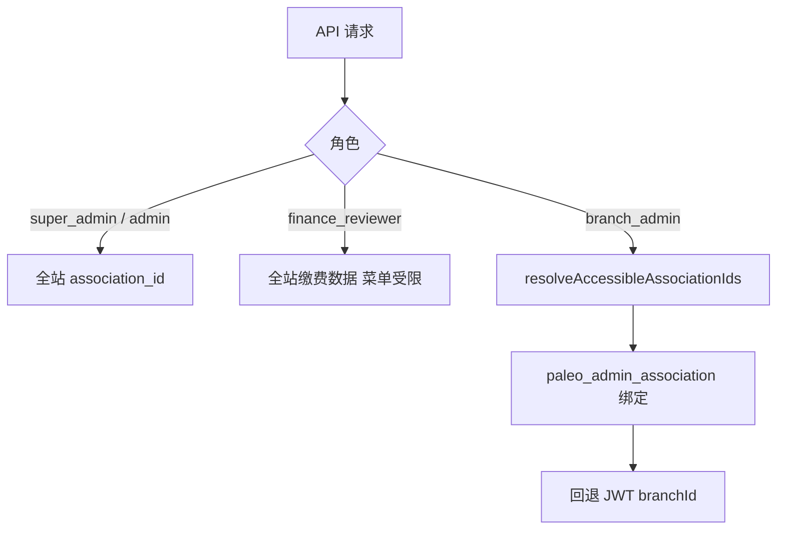
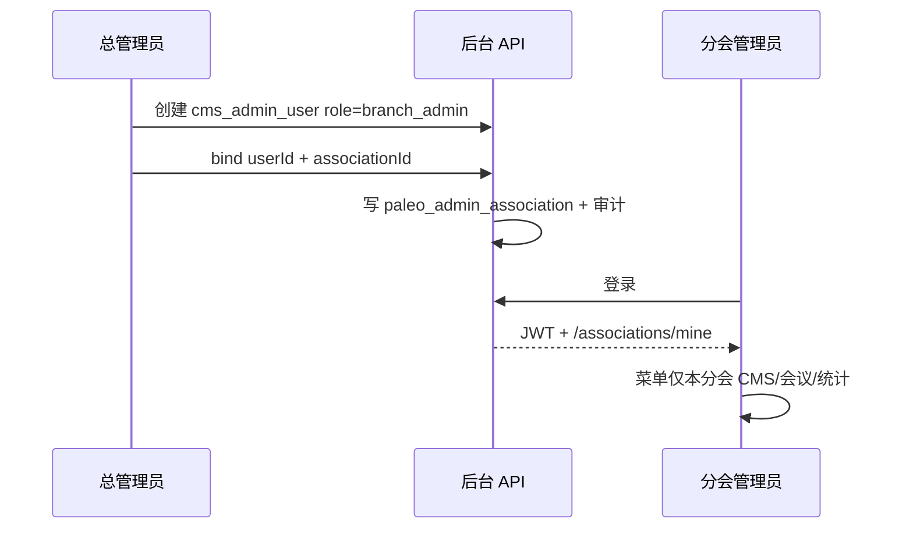
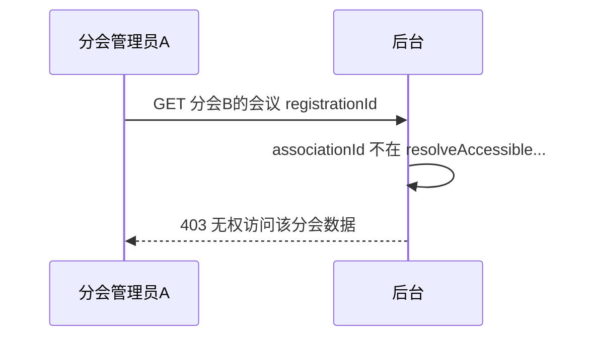

# 11 后台角色与数据权限模块需求

| 字段 | 内容 |
|------|------|
| 文档名称 | 后台角色与数据权限模块 PRD |
| 模块编号 | 11 |
| 版本 | v1.0 |
| 编写日期 | 2026-07-06 |
| 文档状态 | 初稿（待人工校验） |
| 前置基准 | [中国古生物学会完整需求文档.md](../中国古生物学会完整需求文档.md) v3.1 §17.1–§17.2 |
| 关联文档 | [2026-07-05-后台管理角色说明-PRD.md](../2026-07-05-后台管理角色说明-PRD.md) |
| 下游模块 | [09_CMS](./09_CMS主站内容发布模块需求.md) · [10_党建](./10_党建文化子系统模块需求.md) · [12_审核工作台](./12_审核工作台模块需求.md) · [13_用户管理](./13_用户管理模块需求.md) · [14_会议管理](./14_会议管理后台模块需求.md) · [15_统计导出](./15_统计与财务导出模块需求.md) |
| 关联原型 | `paleontology-admin-latest` · `paleontology-cms-backend` |
| 不在本模块范围 | 各业务模块功能细节（分散在 12～15）、前台用户身份（模块 02）、RuoYi 框架级系统管理（运维） |

---

## 目录

1. [模块概述](#1-模块概述)
2. [角色体系](#2-角色体系)
3. [权限矩阵](#3-权限矩阵)
4. [菜单与路由权限](#4-菜单与路由权限)
5. [数据范围与隔离](#5-数据范围与隔离)
6. [数据权限配置](#6-数据权限配置)
7. [认证与会话](#7-认证与会话)
8. [后端鉴权实现](#8-后端鉴权实现)
9. [业务流程](#9-业务流程)
10. [页面原型说明](#10-页面原型说明)
11. [接口需求](#11-接口需求)
12. [数据模型](#12-数据模型)
13. [异常处理](#13-异常处理)
14. [与上下游模块衔接](#14-与上下游模块衔接)
15. [原型差距与改造清单](#15-原型差距与改造清单)
16. [验收标准](#16-验收标准)
17. [附录](#17-附录)

---

## 1. 模块概述

### 1.1 模块定位

本模块定义管理后台的**角色划分、菜单可见性、接口鉴权与数据范围隔离**，确保秘书处、分会负责人、财务审核员在各自边界内操作，防止跨学会数据混查、混改、混导出。

| 能力 | 说明 |
|------|------|
| 四类业务角色 | 学会总管理员、分会管理员、财务审核员 + 系统超级管理员 |
| 菜单权限 | 按角色过滤侧栏与路由 |
| 数据权限 | 分会管理员仅 `paleo_admin_association` 绑定范围 |
| 配置界面 | 总管理员维护管理员↔分会绑定 |
| 后端强制 | `AdminScopeService` + `@RequireAdminRole` |

### 1.2 设计原则

| 原则 | 说明 |
|------|------|
| 后端为准 | 不可仅依赖前端隐藏菜单 |
| 重新登录生效 | 分会绑定变更后须重新登录（§17.1） |
| 秘书处日常 | 使用学会总管理员，非 RuoYi `admin` |
| 分会隔离 | 摘要、住宿、野外、凭证发票不得跨学会混合 |

---

## 2. 角色体系

### 2.1 角色总览（总需求 §17.1）

| # | 角色名称 | 生产 Key（建议） | 原型 `AdminRole` | 数据范围 | 建议人数 |
|---|----------|------------------|------------------|----------|----------|
| 0 | 超级管理员 | `admin` | `super_admin`（兼总管理员） | 全系统含框架 | 1（运维） |
| 1 | 学会总管理员 | `paleo_admin` | `super_admin` | 12 学会单元 | 2～3 |
| 2 | 分会管理员 | `paleo_branch_{code}` | `branch_admin` | 绑定 1 个分会 | 每分会 1 |
| 3 | 财务审核员 | `paleo_finance` | `finance_reviewer` | 全站缴费/发票 | 1～2 |

> **原型说明**：`paleontology-cms-backend` 演示将 `paleo_admin` 与 `admin` 合并为 JWT `role=super_admin`；生产 RuoYi 须区分运维超管与秘书处总管理员。

### 2.2 角色与前台用户身份

| 维度 | 后台管理角色 | 前台 `userType` |
|------|--------------|-----------------|
| 体系 | 管理员登录 `cms_admin_user` | 学会会员注册账号 |
| 无关 | 财务审核员不是「会员」 | `regular` / `non_member` / `member` |

### 2.3 演示账号（原型种子）

`AdminContext.tsx` `BUILT_IN_ADMINS`：

| 邮箱 | 角色 | 分会 |
|------|------|------|
| `admin@paleontology.org.cn` | `super_admin` | — |
| `branch1@…` ～ `branch11@…` | `branch_admin` | 各分会 `branchId` |
| `finance@paleontology.org.cn` | `finance_reviewer` | — |

`AdminUserInitializer` + `V23__admin_accounts_and_association.sql` 同步 DB 绑定。

---

## 3. 权限矩阵

### 3.1 业务功能矩阵（§17.2）

| 功能 | 总管理员 | 分会管理员 | 财务审核员 |
|------|:--------:|:----------:|:----------:|
| 仪表盘 | ✓ | ✓（本分会） | ✓ |
| 审核工作台 — 凭证/发票 | ✓ | — | ✓ |
| 审核工作台 — 入会/退会 | ✓ | — | — |
| 会员用户管理 | ✓ | — | — |
| 非会员/办理中用户管理 | ✓ | — | — |
| 会议管理 | ✓ | ✓（本分会） | — |
| 统计中心 | ✓ | ✓（本分会） | ✓ |
| 财务记录与 ZIP 导出 | ✓ | — | ✓ |
| 审计追溯 | ✓ | ✓（本分会） | — |
| 识别结果复核 | ✓ | ✓（本分会） | — |
| CMS 全站栏目 | ✓ | — | — |
| CMS 本分会栏目 | ✓ | ✓ | — |
| 栏目编排 | ✓ | — | — |
| 分会管理 | ✓ | — | — |
| 数据权限配置 | ✓ | — | — |

### 3.2 分会管理员禁止项

- 审核入会/退会申请书
- 管理其他分会数据、会议、CMS
- 修改全站导航（栏目编排）
- 访问财务记录导出菜单（原型一致）
- 配置他人数据权限

### 3.3 财务审核员禁止项

- 发布/编辑 CMS、会议
- 审核入会/退会
- 审计追溯（总需求 §17.2）
- 数据权限配置、学会/分会管理
- 代改摘要/住宿（归管理员模块 07/14）

### 3.4 统计页「按学会查看」下拉

| 选项 | 总管理员 | 分会管理员 |
|------|:--------:|:----------:|
| 全平台汇总 | ✓ | ✗ |
| 中国古生物学会（总学会） | ✓ | ✗ |
| 本分会 | ✓ | ✓（默认/唯一） |
| 其他分会 | ✓ | ✗ |

---

## 4. 菜单与路由权限

### 4.1 路由权限表（原型 `ROUTE_PERMISSIONS`）

| 路由 | super_admin | branch_admin | finance_reviewer |
|------|:-----------:|:------------:|:----------------:|
| `/admin/dashboard` | ✓ | ✓ | ✓ |
| `/admin/audit` | ✓ | ✗ | ✓ |
| `/admin/users/*` | ✓ | ✗ | ✗ |
| `/admin/conferences` | ✓ | ✓ | ✗ |
| `/admin/statistics` | ✓ | ✓ | ✓ |
| `/admin/finance` | ✓ | ✗ | ✓ |
| `/admin/branches` | ✓ | ✗ | ✗ |
| `/admin/audit-trail` | ✓ | ✓ | ✗ |
| `/admin/recognition` | ✓ | ✓ | ✗ |
| `/admin/scope` | ✓ | ✗ | ✗ |
| `/admin/cms/*` | 见 §4.2 | 见 §4.2 | ✗ |

实现：`AdminContext.canAccess(path)` 校验 `mergedRoutePermissions`；`AdminLayout` 无权限时重定向。

### 4.2 CMS 子路由差异

**仅总管理员**（示例）：

`banners`、`news`、`pages`、`personnel`、`settings`、`party`、`timeline`、`regulations`、`publish`、`channels`、`international`、`tech-rewards`

**总管理员 + 分会管理员**：

`announcements`、`gallery`、`awards`、`science`、`services`、`public-files`、`media`

**仅分会管理员主入口**：

`/admin/cms/branch`（分会栏目）

### 4.3 分会管理员 CMS 菜单（精简）

`BRANCH_CMS_MENU_ITEMS`：

分会栏目、通知公告、历史相册、学会服务、获奖成果、公开文件、媒体库

### 4.4 审核工作台 Tab（模块 12 消费）

| Tab | super_admin | finance_reviewer |
|-----|:-----------:|:----------------:|
| 凭证初审 | ✓ | ✓ |
| 发票终审 | ✓ | ✓ |
| 入会申请 | ✓ | ✗ |
| 退会申请 | ✓ | ✗ |

`AuditWorkbench.tsx`：`showMembershipTabs = adminRole === "super_admin"`。

---

## 5. 数据范围与隔离

### 5.1 判定逻辑



### 5.2 `AdminScopeService` 核心方法

| 方法 | 说明 |
|------|------|
| `isSuperAdmin` | `super_admin` 或 legacy `admin` |
| `isBranchAdmin` | `branch_admin` |
| `isFinanceReviewer` | `finance_reviewer` |
| `isSiteWideReader` | 超管或财务（可读全站统计类） |
| `canWriteCms` | 超管或分会管理员 |
| `resolveAccessibleAssociationIds` | 分会可访问的 `association_id` 列表 |
| `canAccessAssociationId` | 单条数据鉴权 |
| `assertCanWriteCms` / `assertRole` | 写操作抛 `AdminAccessDeniedException` |

### 5.3 必须隔离的数据（跨模块）

| 数据类型 | 隔离键 |
|----------|--------|
| 会议报名/参会信息 | `conference.association_id` |
| 会议费凭证/发票 | 报名 → 会议 → 分会 |
| 会议摘要 ZIP | 单会议 |
| CMS 条目 | `entry.association_id` |
| 审计日志查询 | `audit.association_id`（分会过滤） |

会员费为**全站统一**缴纳，但凭证/发票归档仍按学会单元分文件夹（模块 04/15）。

### 5.4 总会数据 `association_id`

- `branch_code = zgswxh` 或 `association_id = 1`（种子数据）
- 分会管理员**不可**访问总会数据，除非单独绑定（通常不绑定）

---

## 6. 数据权限配置

### 6.1 功能说明

学会总管理员在「**数据权限**」页（`/admin/scope`）维护：

- 管理员账号列表
- 各 `branch_admin` 与 `paleo_association` 的绑定关系
- 支持多选替换绑定（`replaceBindings`）

**变更后**：被修改管理员须**重新登录**后数据范围生效（§17.1）。

### 6.2 业务规则

| 规则 | 说明 |
|------|------|
| 首期 | 每分会 1 个管理员账号 |
| 数据模型 | 支持 1 管理员绑定多分会（预留）；首期业务仍按 1:1 运营 |
| 仅 super_admin | 配置界面与写接口 |
| 审计 | bind/unbind/replace 写 `AuditLogService` |

### 6.3 页面原型（`ScopeManagement.tsx`）

- 左侧：管理员列表（筛选 `branch_admin`）
- 右侧：11 个分会 + 总学会复选框
- 保存 → `PUT /paleo/admin/associations/bindings/replace`

---

## 7. 认证与会话

### 7.1 登录流程

1. `POST /auth/login`（`AuthController`）— 管理员账号 + 密码
2. 返回 JWT：`role`、`branchId`/`branchCode`、`displayName`
3. 前端 `ensureCmsAuth` + `fetchCmsUserInfo`
4. `branch_admin` 额外调用 `GET /paleo/admin/associations/mine` 同步绑定

### 7.2 JWT 载荷（LoginUser）

| 字段 | 说明 |
|------|------|
| `userId` | `cms_admin_user.user_id` |
| `role` | `super_admin` / `branch_admin` / `finance_reviewer` |
| `branchId` | 分会编码 fallback（如 `wtxfh`） |
| `username` | 登录邮箱 |

### 7.3 会话恢复

`AdminProvider` 启动时读 `paleo_admin_current_user` → 校验 CMS JWT；失败清除会话。

离线 fallback：localStorage 演示账号（须提示 API 不可用）。

---

## 8. 后端鉴权实现

### 8.1 注解 `@RequireAdminRole`

```java
@RequireAdminRole({"super_admin", "finance_reviewer"})
public AjaxResult reviewInvoice(...) { ... }
```

`AdminRoleAspect` 在方法/类级拦截，调用 `adminScopeService.assertRole`。

### 8.2 控制器级权限示例

| Controller | 角色限制 |
|------------|----------|
| `PaleoAdminAssociationController` 写操作 | `super_admin` only |
| `PaleoMembershipController` 入会/退会审 | `super_admin` |
| `PaleoMembershipController` 会费审 | `super_admin`, `finance_reviewer` |
| `PaleoAuditLogController` | `super_admin`, `branch_admin` |
| `PaleoRecognitionController` | `super_admin`, `branch_admin` |
| `PaleoCmsEntryController` 写 | `assertCanWriteCms` + `canAccessAssociation` |

### 8.3 业务层过滤

列表/统计接口在 Service 层附加：

```java
if (adminScopeService.isBranchAdmin(user)) {
    wrapper.in(Entity::getAssociationId, adminScopeService.resolveAccessibleAssociationIds(user));
}
```

`PaleoDashboardService`、`AuditLogService` 等已实现部分过滤。

---

## 9. 业务流程

### 9.1 分会管理员首次开通



### 9.2 跨分会访问拦截



---

## 10. 页面原型说明

### 10.1 布局守卫

`AdminLayout.tsx`：

- 未登录 → 登录页
- `!canAccess(location)` → 重定向默认页（分会默认 CMS 分支页）

### 10.2 菜单渲染

`getAllowedMenuItems()`：

- 过滤 `ALL_MENU_ITEMS` + 动态 CMS 子菜单（`cmsMenuChildren` 来自 DB channel `adminRoles` 可选）
- 分会管理员使用 `BRANCH_CMS_MENU_ITEMS`

### 10.3 数据权限页

见 §6.3；仅 `canAccess("/admin/scope")` 可见。

---

## 11. 接口需求

### 11.1 数据权限（已实现）

基路径：`/paleo/admin/associations`

| 方法 | 路径 | 角色 | 说明 |
|------|------|------|------|
| GET | `/mine` | 已登录 | 当前管理员绑定分会 |
| GET | `/bindings` | super_admin | 全部绑定 |
| GET | `/admins` | super_admin | 管理员账号列表 |
| GET | `/branches` | super_admin | 分会 association 列表 |
| POST | `/bindings` | super_admin | 单条绑定 |
| POST | `/bindings/unbind` | super_admin | 解绑 |
| PUT | `/bindings/replace` | super_admin | 批量替换绑定 |

### 11.2 认证（已实现）

| 方法 | 路径 | 说明 |
|------|------|------|
| POST | `/auth/login` | 管理员登录 |
| GET | `/auth/getInfo` | 当前用户 role/branch |

### 11.3 生产 RuoYi 扩展（建议）

| 能力 | 说明 |
|------|------|
| `sys_role` 与 paleo 角色映射 | `paleo_admin` → 业务总管理员 |
| `sys_menu` 权限标识 | 见角色说明 PRD §三 `paleo:*` |
| 双端统一 | RuoYi 前台调同一 `AdminScopeService` 逻辑 |

---

## 12. 数据模型

### 12.1 `cms_admin_user`

| 列 | 说明 |
|----|------|
| `user_id` | PK |
| `username` | 登录名（邮箱） |
| `password_hash` | BCrypt |
| `display_name` | 显示名 |
| `role` | `super_admin` / `branch_admin` / `finance_reviewer` |
| `branch_id` | 分会编码 fallback |

### 12.2 `paleo_admin_association`

| 列 | 说明 |
|----|------|
| `binding_id` | PK |
| `admin_user_id` | FK → cms_admin_user |
| `association_id` | FK → paleo_association |
| `binding_status` | `BOUND` / `UNBOUND` |

唯一键：`uk_admin_association (admin_user_id, association_id)`。

### 12.3 `paleo_association`

| 列 | 说明 |
|----|------|
| `association_id` | PK |
| `association_name` | 学会/分会名称 |
| `association_type` | SOCIETY / BRANCH |
| `branch_code` | 与前台 `BRANCH_MAP` 对齐 |

共 12 单元：1 总学会 + 11 分会。

---

## 13. 异常处理

| 场景 | 处理 |
|------|------|
| 未登录访问管理 API | 401 |
| 角色不匹配 `@RequireAdminRole` | 403 + `AdminAccessDeniedException` |
| 分会访问他分会 `association_id` | 403「无权访问该分会数据」 |
| 财务访问 CMS 写接口 | 403「当前角色无权修改 CMS」 |
| 绑定不存在的 association | 400 |
| JWT 过期 | 前端清除会话，跳转登录 |
| 绑定变更未重登 | 旧 JWT 仍带旧 scope — 文档要求重登；可选缩短 token 或服务端强制刷新 |

---

## 14. 与上下游模块衔接

| 模块 | 衔接点 |
|------|--------|
| 09 CMS | `canWriteCms`、`canAccessAssociation`；栏目 `adminRoles` |
| 10 党建 | 仅 `super_admin` 写 `scope=party` |
| 12 审核工作台 | Tab 可见性；财务审会费/会议费 |
| 13 用户管理 | 仅 `super_admin` |
| 14 会议管理 | 分会仅本分会 `association_id` |
| 15 统计/财务 | `isSiteWideReader` vs 分会过滤 |
| 16 审计 | 权限变更、越权拒绝记日志 |

---

## 15. 原型差距与改造清单

| 项 | 现状 | 目标 | 优先级 |
|----|------|------|--------|
| 总管理员 vs 超管 | 合并为 `super_admin` | 生产区分 `admin` / `paleo_admin` | P1 |
| RuoYi 菜单权限 | 原型 `ROUTE_PERMISSIONS` 硬编码 | 与 `sys_menu` 同步或 API 下发 | P1 |
| 分会会议费审核 | 矩阵写「—」 | 确认是否允许分会审本分会会议费（原型 audit 无 branch） | Q1 |
| 财务审计追溯 | 路由禁止 finance | 与 §17.2 一致 ✓ | — |
| 绑定变更生效 | 依赖重登 | 登录时强制拉 `/mine`；可选 token 失效 | P1 |
| 全会话 API 过滤 | 部分列表仍前端过滤 | 全量 Service 层 `association_id` 条件 | **P0** |
| `paleo:membership:unlock` | 已取消 | 保持删除 | — |

**关键文件**：

- `paleontology-cms-backend/.../AdminScopeService.java`
- `paleontology-cms-backend/.../PaleoAdminAssociationController.java`
- `paleontology-cms-backend/.../security/AdminRoleAspect.java`
- `paleontology-admin-latest/client/src/contexts/AdminContext.tsx`
- `paleontology-admin-latest/client/src/pages/admin/ScopeManagement.tsx`
- `paleontology-admin-latest/client/src/components/AdminLayout.tsx`

---

## 16. 验收标准

### 16.1 角色与菜单

- [ ] 四类角色登录后菜单与 §3.1 矩阵一致
- [ ] 无权限路由自动重定向或 403
- [ ] 财务无法进入 CMS/会议/用户管理/数据权限
- [ ] 分会无法进入审核工作台、用户管理、财务记录

### 16.2 数据隔离

- [ ] 分会 A 无法 API 读取分会 B 会议/CMS/统计
- [ ] 总管理员可访问全部 12 学会单元
- [ ] 财务可读全站缴费相关列表/导出
- [ ] 审计日志分会管理员仅见本分会

### 16.3 数据权限配置

- [ ] 仅总管理员可 bind/unbind/replace
- [ ] 配置变更写审计
- [ ] 分会管理员重登后范围更新

### 16.4 后端

- [ ] 所有写接口有 `@RequireAdminRole` 或 scope 断言
- [ ] 越权返回 403，不泄露他分会数据

### 16.5 联调

- [ ] 与模块 12 审核 Tab 联调
- [ ] 与模块 09/10 CMS 写权限联调
- [ ] 与模块 14 会议 `association_id` 联调

---

## 17. 附录

### 17.1 角色 Key 对照

| 总需求 / RuoYi | cms-backend JWT |
|----------------|-----------------|
| `admin` | `super_admin`（兼容 `admin`） |
| `paleo_admin` | 目标独立；原型等同 `super_admin` |
| `paleo_branch_{code}` | `branch_admin` + `branchId` |
| `paleo_finance` | `finance_reviewer` |

### 17.2 相关总需求章节

§17.1～§17.2、§17.3（仪表盘口径引用）、§21.3 分会隔离风险

### 17.3 待人工确认项

| 编号 | 问题 | 建议 |
|------|------|------|
| Q1 | 分会管理员是否审本分会会议费？ | 矩阵为「—」；若需要则开放 audit 路由 + 后端过滤 |
| Q2 | `paleo_admin` 与 `admin` 是否共用账号 | 否；运维与秘书处分离 |
| Q3 | 一会多管理员是否首期上线 | 数据模型支持，运营先 1:1 |
| Q4 | 财务是否查看非会员用户列表 | 仅缴费相关，不进用户管理页 |

### 17.4 修订记录

| 版本 | 日期 | 说明 |
|------|------|------|
| v1.0 | 2026-07-06 | 初稿 |

---

**文档结束**
