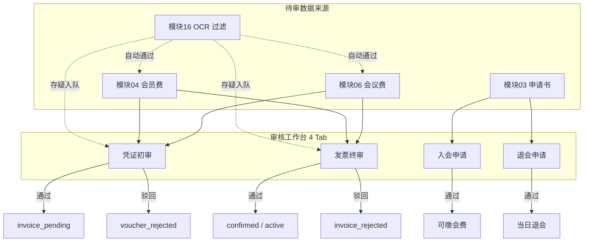
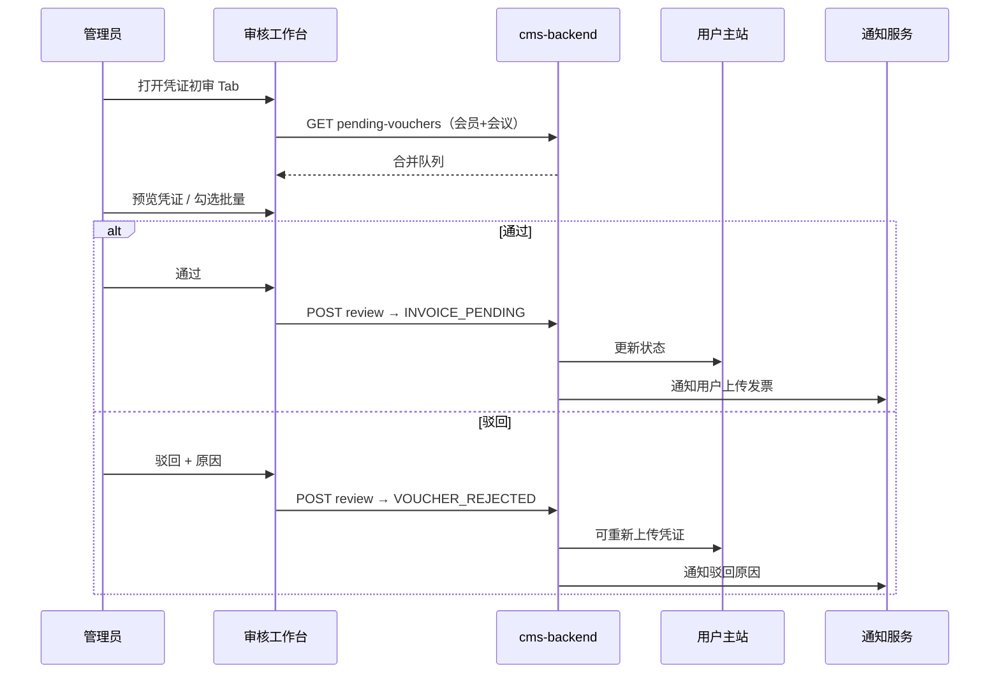
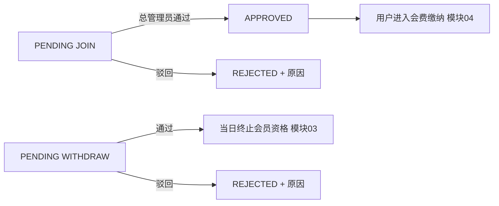

# 12 审核工作台模块需求

| 字段 | 内容 |
|------|------|
| 文档名称 | 审核工作台模块 PRD |
| 模块编号 | 12 |
| 版本 | v1.0 |
| 编写日期 | 2026-07-06 |
| 文档状态 | 初稿（待人工校验） |
| 前置基准 | [中国古生物学会完整需求文档.md](../中国古生物学会完整需求文档.md) v3.1 §17.4 |
| 上游模块 | [03_入会退会申请](./03_入会退会申请模块需求.md) · [04_会员费缴纳](./04_会员费缴纳模块需求.md) · [06_会议发布与会议费报名](./06_会议发布与会议费报名模块需求.md) · [11_后台角色与数据权限](./11_后台角色与数据权限模块需求.md) |
| 下游模块 | [13_用户管理](./13_用户管理模块需求.md) · [15_统计与财务导出](./15_统计与财务导出模块需求.md) |
| 横切关联 | [16_横切能力](./16_横切能力模块需求.md)（通知、OCR、审计） |
| 关联原型 | `paleontology-admin-latest` · `paleontology-cms-backend` |
| 不在本模块范围 | 用户名录维护（模块 13）、会议创建与费用配置（模块 14）、财务 ZIP 导出（模块 15）、OCR 服务接入与识别结果独立页（模块 16）、前台上传缴费文件（模块 04/06） |

---

## 目录

1. [模块概述](#1-模块概述)
2. [业务背景与目标](#2-业务背景与目标)
3. [角色与权限](#3-角色与权限)
4. [业务流程](#4-业务流程)
5. [页面原型说明](#5-页面原型说明)
6. [审核动作与状态映射](#6-审核动作与状态映射)
7. [队列与列表规则](#7-队列与列表规则)
8. [接口需求](#8-接口需求)
9. [数据模型](#9-数据模型)
10. [通知与审计](#10-通知与审计)
11. [异常处理](#11-异常处理)
12. [与上下游模块衔接](#12-与上下游模块衔接)
13. [原型差距与改造清单](#13-原型差距与改造清单)
14. [验收标准](#14-验收标准)
15. [附录](#15-附录)

---

## 1. 模块概述

### 1.1 模块定位

本模块实现管理后台**统一审核工作台**，将秘书处日常四类待办集中在一个页面处理：

| Tab | 审核对象 | 主要审核人 |
|-----|----------|------------|
| **凭证初审** | 会员费凭证 + 会议费凭证 | 学会总管理员、财务审核员 |
| **发票终审** | 会员费发票 + 会议费发票 | 学会总管理员、财务审核员 |
| **入会申请** | JOIN 电子版申请书 | **仅**学会总管理员 |
| **退会申请** | WITHDRAW 电子版申请书 | **仅**学会总管理员 |

工作台是模块 03（入会/退会）、模块 04（会员费）、模块 06（会议费）在管理端的**统一出口**，不负责业务规则定义，只负责**拉取待审队列、展示材料、执行通过/驳回/延期、触发下游状态变更与用户通知**。

### 1.2 核心设计原则

| 原则 | 本模块落地 |
|------|------------|
| 四 Tab 合一 | 会费与会议费凭证/发票合并展示，按 `type` 区分；减少财务切换页面 |
| 驳回必填原因 | 单笔驳回、批量驳回均须填写 `reviewComment`，前台可见 |
| 批量操作 | 凭证/发票 Tab 支持全选、批量通过、批量驳回（同一驳回原因） |
| 文件可预览 | 凭证/发票/申请书支持在线预览（图片/PDF） |
| 角色分 Tab | 财务仅见 2 Tab；入会/退会仅总管理员 |
| 分会管理员不进工作台 | 权限矩阵为「—」；会议费审核由总会财务统一处理（见 §3.3 待确认） |
| OCR 辅助、人工兜底 | 自动通过由模块 16 在入队前处理；工作台以人工队列为主，可跳转识别结果页复核 |
| 幂等与审计 | 每条审核写审计日志；重复提交须幂等拒绝 |

### 1.3 系统边界

```
┌─────────────────────────────────────────────────────────────────┐
│ 管理后台 paleontology-admin-latest                                 │
│  AuditWorkbench.tsx                                              │
│    ├─ VoucherTab      ← 会员费 + 会议费 凭证队列                  │
│    ├─ InvoiceTab      ← 会员费 + 会议费 发票队列 + 延期（总管理员）│
│    ├─ MembershipAppTab← JOIN 申请书（仅 super_admin）             │
│    └─ WithdrawalAppTab← WITHDRAW 申请书（仅 super_admin）         │
│  AdminContext · loadReviewQueues / approve* / reject* / batch*   │
│  FilePreviewDialog · RejectDialog · ExtendDeadlineDialog         │
└──────────────────────────┬──────────────────────────────────────┘
                           │ REST API
┌──────────────────────────▼──────────────────────────────────────┐
│ paleontology-cms-backend                                         │
│  PaleoMembershipController  — 申请/会员费审核队列                 │
│  PaleoConferenceController  — 会议费审核队列                      │
│  PaleoRecognitionController — OCR 结果（模块 16，独立菜单）        │
│  AuditLogService            — 审核操作审计                        │
└──────────────────────────┬──────────────────────────────────────┘
                           │ 状态变更、通知
┌──────────────────────────▼──────────────────────────────────────┐
│ 学会主站 · 用户侧状态与通知（模块 04/06/03 + 16）                 │
└─────────────────────────────────────────────────────────────────┘
```

**关联但不在本页**：`RecognitionManagement`（识别结果）为独立菜单，供管理员复核 OCR 存疑记录；自动通过的记录可能**不进入**人工队列（§10.2）。

---

## 2. 业务背景与目标

### 2.1 业务痛点

秘书处与财务需处理：

- 正式会员路径：入会申请书 → 会费凭证 → 会费发票（三步审核）
- 会议报名：会议费凭证 → 会议费发票（两步审核）
- 主动退会：退会申请书（一步审核）

若分散在多个菜单，易造成漏审、重复登录、无法批量处理。总需求 §17.4 明确要求**四 Tab 审核工作台**，并支持批量操作与文件预览。

### 2.2 模块目标

| 目标 | 可衡量结果 |
|------|------------|
| 统一待办入口 | 财务登录后 2 Tab 覆盖全部会费/会议费待审 |
| 秘书处专审入会/退会 | 总管理员 4 Tab；财务不可见后 2 Tab |
| 审核闭环 | 通过后用户状态正确推进；驳回后用户可重传 |
| 提升吞吐 | 批量通过/驳回；OCR 自动通过减少入队量（模块 16） |
| 可追溯 | 每条审核有操作人、前后状态、驳回原因、审计记录 |

### 2.3 不在本模块范围

| 内容 | 归属 |
|------|------|
| 用户上传凭证/发票/申请书 | 模块 03、04、06 前台 |
| 会员名录、禁用账号 | 模块 13 |
| 会议创建、费用配置、截止日配置 | 模块 14 |
| 仪表盘待办数字口径 | 模块 15 / §17.3 |
| OCR 引擎选型、阈值策略 | 模块 16 §19.1 |
| 财务 ZIP 打包导出 | 模块 15 |

---

## 3. 角色与权限

### 3.1 角色与 Tab 可见性

与 [11_后台角色与数据权限模块需求.md](./11_后台角色与数据权限模块需求.md) §4.4 一致：

| Tab | `super_admin`（学会总管理员） | `finance_reviewer`（财务） | `branch_admin`（分会） |
|-----|:----------------------------:|:--------------------------:|:----------------------:|
| 凭证初审 | ✓ | ✓ | **不可访问工作台** |
| 发票终审 | ✓ | ✓ | **不可访问工作台** |
| 入会申请 | ✓ | — | — |
| 退会申请 | ✓ | — | — |

原型实现：`AuditWorkbench` 中 `showMembershipTabs = adminRole === "super_admin"`，财务仅渲染前 2 Tab。

### 3.2 操作权限细分

| 操作 | super_admin | finance_reviewer |
|------|:-----------:|:----------------:|
| 凭证通过/驳回 | ✓ | ✓ |
| 发票通过/驳回 | ✓ | ✓ |
| 批量通过/驳回（凭证/发票） | ✓ | ✓ |
| **发票截止日延期** | ✓ | — |
| 入会申请通过/驳回 | ✓ | — |
| 退会申请通过/驳回 | ✓ | — |
| 文件预览 | ✓ | ✓ |

发票延期：原型仅在 `InvoiceTab` 对 `super_admin` 传入 `onExtend`；财务无延期按钮。

### 3.3 待确认：分会管理员与会议费审核

| 项 | 总需求矩阵 | 后端现状 | 建议 |
|----|------------|----------|------|
| 分会审本分会会议费 | §17.2 审核工作台对分会为「—」 | `PaleoConferenceController.reviewRegistration` 允许 `branch_admin` | **首期**：分会不进工作台，会议费由总会财务在统一队列审核；后端 `listPendingReviewsForAdmin` 对财务返回全会数据 |
| 分会数据范围 | 分会仅本分会会议 | `assertCanAccessRegistration` 已有 | 若未来开放分会审会，仅在会议费队列按 `association_id` 过滤，仍不走入会/退会 Tab |

---

## 4. 业务流程

### 4.1 工作台总览



### 4.2 凭证初审流程（会员费 + 会议费）



### 4.3 发票终审流程

与凭证类似，目标状态：

- **会员费**：`CONFIRMED` → 触发 `active`、写入有效期（模块 04、08）
- **会议费**：`CONFIRMED` → 报名确认，解锁模块 07 表单

**延期子流程**（仅总管理员，发票 Tab）：

1. 用户对 `invoice_pending` / `invoice_overdue` 记录申请或管理员主动延期
2. 管理员选择新截止日期、填写延期原因
3. 系统更新 `invoice_extended_deadline`，状态保持可上传，写审计

> 原型 `extendDeadline` 仅写 `localStorage`，**须后端 API**（见 §13）。

### 4.4 入会/退会申请审核



- 无批量操作（申请书逐份审阅）
- 预览入会/退会 PDF 或图片
- 后端 `@RequireAdminRole("super_admin")` 限制

---

## 5. 页面原型说明

### 5.1 路由与入口

| 项 | 原型 |
|----|------|
| 路由 | `/admin/audit` |
| 菜单 | 侧栏「审核工作台」 |
| 组件 | `client/src/pages/admin/AuditWorkbench.tsx` |
| 权限 | 菜单对 `super_admin`、`finance_reviewer` 可见；`branch_admin` 无此菜单 |

### 5.2 页面结构

```
┌────────────────────────────────────────────────────────────┐
│ 审核工作台                                                    │
│ 副标题（按角色切换：4 Tab 说明 / 仅会费会议费说明）              │
├────────────────────────────────────────────────────────────┤
│ [凭证初审] [发票终审] [入会申请*] [退会申请*]  *仅总管理员      │
├────────────────────────────────────────────────────────────┤
│ Card: 标题 + Badge「N 条待审」                                │
│ ┌─ 批量栏（凭证/发票 Tab）────────────────────────────────┐ │
│ │ ☐ 全选  已选 M 项          [批量通过] [批量驳回]          │ │
│ └──────────────────────────────────────────────────────────┘ │
│ ReviewTable 或 申请列表 Table                                 │
└────────────────────────────────────────────────────────────┘
```

### 5.3 ReviewTable 列（凭证/发票 Tab）

| 列 | 说明 |
|----|------|
| 复选框 | 批量选择 |
| 用户邮箱 | `userEmail`，过长截断 + title |
| 姓名 | `userName` |
| 类型 | Badge：`会员费` / `会议费`（`society_fee` / `conference_fee`） |
| 金额 | `amount`，前缀 ¥ |
| 提交时间 | `submitTime` |
| 文件 | 「预览」按钮 → `FilePreviewDialog` |
| 状态 | 映射 `MEMBERSHIP_STATUS` / `CONFERENCE_STATUS` 中文标签 |
| 操作 | 通过、驳回；（发票 Tab + super_admin）延期 |

### 5.4 入会/退会 Tab 列表

| 列 | 入会申请 | 退会申请 |
|----|----------|----------|
| 用户邮箱 | ✓ | ✓ |
| 姓名 | ✓ | ✓ |
| 提交时间 | ✓ | ✓ |
| 申请书 | 预览 | 预览 |
| 操作 | 通过 / 驳回 | 通过 / 驳回 |

无复选框、无批量栏。

### 5.5 弹窗组件

| 组件 | 用途 | 校验 |
|------|------|------|
| `RejectDialog` | 单笔驳回 | 原因非空 |
| `AlertDialog` + Textarea | 批量驳回 | 原因非空 |
| `ExtendDeadlineDialog` | 发票延期 | 新日期 + 原因非空 |
| `FilePreviewDialog` | 文件预览 | 支持 url / fileName / title |

### 5.6 空状态与加载

| 状态 | 展示 |
|------|------|
| 无待审 | Card 内「暂无待审核项目」 |
| 加载失败 | Toast 错误；控制台记录（原型）；生产应重试 + 友好提示 |
| 操作成功 | Toast：如「初审已通过，已通知用户上传发票」 |

### 5.7 视觉规范

遵循管理后台 Strata & Heritage 主题（模块 11 / 总需求 §20）：

- 标题 `text-strata-blue-deep`
- 驳回/危险操作 `bg-party-red`
- 待审数量 `Badge variant="secondary"`

---

## 6. 审核动作与状态映射

### 6.1 会员费（模块 04）

| Tab | 管理员操作 | API `paymentStatus` | 用户侧结果 |
|-----|------------|---------------------|------------|
| 凭证初审 | 通过 | `INVOICE_PENDING` | 须上传发票；启动宽限期 |
| 凭证初审 | 驳回 | `VOUCHER_REJECTED` | 可重传凭证 |
| 发票终审 | 通过 | `CONFIRMED` | 会员 `active`；写有效期 |
| 发票终审 | 驳回 | `INVOICE_REJECTED` | 可重传发票 |
| 发票终审 | 延期 | —（字段更新） | 延长 `invoice_extended_deadline` |

### 6.2 会议费（模块 06）

| Tab | 管理员操作 | API `paymentStatus` | 用户侧结果 |
|-----|------------|---------------------|------------|
| 凭证初审 | 通过 | `INVOICE_PENDING` | 须上传发票 |
| 凭证初审 | 驳回 | `VOUCHER_REJECTED` | 可重传凭证 |
| 发票终审 | 通过 | `CONFIRMED` | 报名确认；解锁模块 07 |
| 发票终审 | 驳回 | `INVOICE_REJECTED` | 可重传发票 |
| 发票终审 | 延期 | — | 延长发票截止日 |

### 6.3 入会申请 JOIN（模块 03）

| 操作 | API `reviewStatus` | 用户侧结果 |
|------|-------------------|------------|
| 通过 | `APPROVED` | 可进入会费缴纳 |
| 驳回 | `REJECTED` | 须填 `reviewComment`；可重新提交 |

### 6.4 退会申请 WITHDRAW（模块 03）

| 操作 | API `reviewStatus` | 用户侧结果 |
|------|-------------------|------------|
| 通过 | `APPROVED` | **当日**终止会员资格；分会绑定保留 |
| 驳回 | `REJECTED` | 须填原因；可重新提交 |

### 6.5 与 OCR 自动通过的关系（模块 16）

| 场景 | 是否进入工作台队列 |
|------|-------------------|
| OCR 金额一致、无风险 | 可能**自动**推进至 `INVOICE_PENDING` 或 `CONFIRMED`，**不入队** |
| OCR 存疑、金额不符 | 进入凭证或发票待审队列 |
| 管理员在识别结果页「确认无误」 | 等同人工通过，从识别页或工作台均可操作（须状态一致） |

工作台列表 API 应只返回**真正待人工处理**的记录；自动通过记录可在识别结果页或用户缴费历史中查看。

---

## 7. 队列与列表规则

### 7.1 队列合并规则（前端）

原型 `AdminContext.loadReviewQueues`：

1. 并行请求 4 个接口：会员凭证、会员发票、会议凭证、会议发票
2. 映射为统一 `ReviewItem`：
   - `id`: `payment-{paymentId}` 或 `registration-{registrationId}`
   - `type`: `society_fee` | `conference_fee`
   - `targetName`: 会员费固定文案 / 会议标题
   - `confId`: 会议 `conferenceCode`（会议费专用）
3. 分别写入 `pendingVoucherReviews`、`pendingInvoiceReviews`

### 7.2 入队条件（后端）

| 队列 | 会员费 | 会议费 |
|------|--------|--------|
| 凭证初审 | `payment_status = VOUCHER_SUBMITTED`（或等价待初审） | `payment_status = VOUCHER_SUBMITTED` |
| 发票终审 | `payment_status = INVOICE_SUBMITTED`（及待终审状态） | 同上 |

精确枚举以 `shared/constants.ts` 与后端实体为准；模块 04/06 状态机为权威定义。

### 7.3 排序与分页

| 项 | 首期建议 | 原型 |
|----|----------|------|
| 排序 | 提交时间升序（先进先出） | 接口返回顺序 |
| 分页 | 待审量较大时服务端分页 + 前端「加载更多」 | 全量拉取 |
| 刷新 | 审核成功后 `loadReviewQueues()` | ✓ |

### 7.4 批量操作语义

| 操作 | 行为 | 生产要求 |
|------|------|----------|
| 批量通过 | 对每条选中记录调用单笔通过 API | 可选：后端 `POST /reviews/batch` 事务或部分成功报告 |
| 批量驳回 | 共用一条 `reviewComment` | 同上 |
| 并发 | 原型 `for` 循环触发多个异步请求 | 应限制并发数，避免压垮服务；失败项应列表反馈 |

原型问题：批量操作先 toast 成功，不等待全部 API 完成（§13 P1）。

### 7.5 查找匹配规则

单笔审核通过 `userEmail + type + confId` 在队列中定位记录（`findVoucherReviewItem` / `findInvoiceReviewItem`）。同一用户同一会议仅应有一条待审会议费记录。

---

## 8. 接口需求

### 8.1 会员费与申请（`PaleoMembershipController`）

| 方法 | 路径 | 角色 | 说明 |
|------|------|------|------|
| GET | `/paleo/membership/payments/reviews/pending-vouchers` | super_admin, finance_reviewer | 待审会员费凭证 |
| GET | `/paleo/membership/payments/reviews/pending-invoices` | 同上 | 待审会员费发票 |
| POST | `/paleo/membership/payments/{paymentId}/review` | 同上 | Body: `paymentStatus`, `reviewComment?` |
| GET | `/paleo/membership/applications/reviews/pending?applicationType=JOIN` | **super_admin** | 待审入会 |
| GET | `/paleo/membership/applications/reviews/pending?applicationType=WITHDRAW` | **super_admin** | 待审退会 |
| POST | `/paleo/membership/applications/{applicationId}/review` | **super_admin** | Body: `reviewStatus`, `reviewComment?` |

**review 请求体示例（会员费通过初审）**：

```json
{
  "paymentStatus": "INVOICE_PENDING",
  "reviewComment": null
}
```

**review 请求体示例（驳回）**：

```json
{
  "paymentStatus": "VOUCHER_REJECTED",
  "reviewComment": "凭证金额与应缴金额不符，请核对后重新上传"
}
```

### 8.2 会议费（`PaleoConferenceController`）

| 方法 | 路径 | 角色 | 说明 |
|------|------|------|------|
| GET | `/paleo/conference/registrations/reviews/pending-vouchers` | super_admin, finance_reviewer（+ 后端过滤） | 待审会议费凭证 |
| GET | `/paleo/conference/registrations/reviews/pending-invoices` | 同上 | 待审会议费发票 |
| POST | `/paleo/conference/registrations/{registrationId}/review` | 同上 | Body: `paymentStatus`, `reviewComment?` |

> 后端注解含 `branch_admin`，但工作台菜单不对分会开放；财务角色应看到**全部会议**待审。

### 8.3 待新增接口（首期 P0）

| 方法 | 路径 | 说明 |
|------|------|------|
| POST | `/paleo/membership/payments/{paymentId}/extend-deadline` | 会员费发票延期 |
| POST | `/paleo/conference/registrations/{registrationId}/extend-deadline` | 会议费发票延期 |
| POST | `/paleo/reviews/batch` | 可选：批量审核，返回成功/失败明细 |

**延期请求体示例**：

```json
{
  "newDeadline": "2026-07-20",
  "reason": "用户出差，协商延期"
}
```

### 8.4 响应字段（队列项 enrich）

列表项应包含工作台展示与审核所需字段：

| 字段 | 会员费 | 会议费 | 申请 |
|------|--------|--------|------|
| paymentId / registrationId / applicationId | ✓ | ✓ | ✓ |
| userEmail, userName | ✓ | ✓ | ✓ |
| amount / feeAmount | ✓ | ✓ | — |
| voucherUrl, invoiceUrl | ✓ | ✓ | — |
| applicationFileUrl | — | — | ✓ |
| conferenceTitle, conferenceCode | — | ✓ | — |
| paymentStatus / reviewStatus | ✓ | ✓ | ✓ |
| createTime, updateTime, submitTime | ✓ | ✓ | ✓ |
| invoiceDeadline | — | ✓ | — |
| reviewComment（上次驳回原因） | ✓ | ✓ | ✓ |
| ocrPayerName, ocrAmount | ✓ | ✓ | —（模块 16 增强） |

### 8.5 前端 API 封装（原型）

| 文件 | 函数 |
|------|------|
| `audit-api.ts` | `fetchPendingMembershipVouchers`, `reviewMembershipPayment`, `fetchPendingApplications`, `reviewMembershipApplication` 等 |
| `conference-api.ts` | `fetchPendingConferenceVouchers`, `reviewConferenceRegistration` 等 |

---

## 9. 数据模型

### 9.1 前端 ReviewItem（原型）

```typescript
interface ReviewItem {
  id: string;
  paymentId?: number;
  registrationId?: number;
  userEmail: string;
  userName: string;
  type: "society_fee" | "conference_fee";
  targetName: string;
  amount: number;
  voucherUrl: string;
  invoiceUrl: string;
  submitTime: string;
  status: string;
  rejectReason?: string;
  invoiceDeadline?: string;
  confId?: string;
}
```

### 9.2 后端核心表（引用）

| 表 | 用途 |
|----|------|
| `paleo_membership_payment` | 会员费记录与 `payment_status` |
| `paleo_membership_application` | 入会/退会申请与 `review_status` |
| `paleo_conference_registration` | 会议报名与缴费状态 |
| `paleo_audit_log` | 审核操作审计 |
| `paleo_recognition_result` | OCR 结果（模块 16） |

### 9.3 审计事件类型

| 事件 | 触发点 |
|------|--------|
| `MEMBERSHIP_PAYMENT_REVIEW` | 会员费 review |
| `CONFERENCE_REGISTRATION_REVIEW` | 会议费 review |
| `APPLICATION_REVIEW` | 入会/退会 review |
| `INVOICE_DEADLINE_EXTENDED` | 延期（待实现） |

---

## 10. 通知与审计

### 10.1 用户通知（模块 16）

审核完成后应触发站内通知（+ 可选邮件）：

| 事件 | 通知要点 |
|------|----------|
| 凭证通过 | 请上传发票；截止日 |
| 凭证驳回 | 驳回原因 |
| 发票通过 | 会员：已成为正式会员；会议：报名成功 |
| 发票驳回 | 驳回原因 |
| 入会通过 | 请缴纳会费 |
| 入会驳回 | 驳回原因 |
| 退会通过 | 退会生效说明 |
| 发票延期 | 新截止日期 |

### 10.2 识别结果页联动

| 菜单 | 路径 | 与工作台关系 |
|------|------|--------------|
| 识别结果 | `/admin/recognition` | 复核 OCR；可对存疑记录标注后触发与 review 等效的状态推进 |

财务角色可访问识别结果页（模块 11 矩阵「识别结果复核」为 ✓）。

### 10.3 审计日志字段

- 操作人 ID / 用户名
- 目标类型、目标 ID
- `beforeStatus` → `afterStatus`
- `reviewComment`
- 时间戳、IP（可选）

---

## 11. 异常处理

| 场景 | 处理 |
|------|------|
| 记录已被他人审完 | API 409/业务错误；刷新队列；Toast「记录状态已变更」 |
| 驳回原因为空 | 前端禁用确认按钮 |
| 文件 URL 失效 | 预览失败提示；允许仅凭 OCR 字段审核或联系用户重传 |
| 批量部分失败 | 展示失败条数与原因；成功项从队列移除 |
| 无权限访问 Tab | 路由守卫 + 后端 403 |
| 网络超时 | 重试；不重复提交（幂等 key 或状态校验） |
| 会员费通过但入会未批 | 后端应拒绝：会费审核前置 JOIN APPROVED |
| 退会通过非 active 用户 | 后端拒绝 |

---

## 12. 与上下游模块衔接

### 12.1 上游输入

| 模块 | 输入到工作台 |
|------|--------------|
| 03 入会退会 | PENDING 申请书进入 Tab 3/4 |
| 04 会员费 | VOUCHER_SUBMITTED / INVOICE_SUBMITTED 进入 Tab 1/2 |
| 06 会议费 | 同上 |
| 11 角色权限 | Tab 可见性、菜单、API 鉴权 |
| 16 OCR | 过滤入队；识别页复核 |

### 12.2 下游输出

| 模块 | 工作台输出 |
|------|------------|
| 04/06 | 状态推进；用户可继续缴费或参会流程 |
| 08 会员到期 | 发票终审通过 → `active` + `expiryDate` |
| 07 参会信息 | 会议费 `CONFIRMED` 后解锁 |
| 13 用户管理 | 审核结果反映在用户名录分类 |
| 15 统计 | 已确认金额累计；待审数进仪表盘 |
| 16 通知/审计 | 每条操作发通知、写日志 |

### 12.3 与仪表盘待办数

§17.3 仪表盘「待审凭证/发票/申请」数字应与本模块队列 API 计数一致，避免两套口径。

---

## 13. 原型差距与改造清单

| 优先级 | 差距 | 原型现状 | 目标 |
|:------:|------|----------|------|
| **P0** | 发票延期无后端 | `extendDeadline` 仅写 localStorage | 实现 extend-deadline API + 审计 + 通知 |
| **P0** | 批量操作不可靠 | 循环 fire-and-forget；toast 不等待结果 | await 全部完成或批量 API + 失败明细 |
| **P0** | 会议费 branch_admin API 与工作台权限不一致 | 后端允许分会 review | 统一策略：首期仅财务在工作台审全会 |
| **P1** | 队列无分页 | 全量拉取 | 分页 + 总数 Badge |
| **P1** | OCR 字段未在表格展示 | ReviewTable 无付款方列 | 展示 `ocrPayerName`、识别金额对比 |
| **P1** | 入会/退会无批量 | 符合需求 | 保持；若秘书处要求再加 |
| **P2** | 审核后仪表盘未自动刷新 | `triggerRefresh` 局部 | WebSocket 或轮询待办数 |
| **P2** | 文件预览跨域/OSS | 依赖 url 直连 | 走模块 16 签名 URL 代理 |

---

## 14. 验收标准

### 14.1 权限与可见性

- [ ] 学会总管理员可见 4 Tab，可执行全部操作含延期
- [ ] 财务审核员仅可见凭证初审、发票终审 2 Tab
- [ ] 分会管理员无法进入审核工作台菜单与 API
- [ ] 财务无法审核入会/退会（前后端双重拦截）

### 14.2 凭证初审

- [ ] 队列合并展示会员费与会议费待审凭证
- [ ] 预览凭证文件正常
- [ ] 单笔通过 → 用户状态 `invoice_pending` 并收到通知
- [ ] 单笔驳回必填原因 → 用户可重传凭证
- [ ] 批量通过/驳回行为正确，失败有提示

### 14.3 发票终审

- [ ] 队列合并展示会员费与会议费待审发票
- [ ] 通过 → 会员 `active` 或会议 `confirmed`
- [ ] 驳回必填原因
- [ ] 总管理员可延期并写审计；财务无延期入口
- [ ] 批量操作符合 §7.4

### 14.4 入会/退会

- [ ] 仅总管理员可见 Tab
- [ ] 入会通过 → 用户可缴会费；驳回显示原因
- [ ] 退会通过 → 当日终止资格；绑定保留
- [ ] 申请书预览正常

### 14.5 横切

- [ ] 每次审核写入审计日志
- [ ] OCR 自动通过记录不入人工队列（或入队规则与模块 16 一致）
- [ ] 仪表盘待办数与队列一致

---

## 15. 附录

### 15.1 原型文件索引

| 文件 | 说明 |
|------|------|
| `paleontology-admin-latest/client/src/pages/admin/AuditWorkbench.tsx` | 四 Tab 页面 |
| `paleontology-admin-latest/client/src/contexts/AdminContext.tsx` | 队列加载与审核动作 |
| `paleontology-admin-latest/client/src/lib/audit-api.ts` | 会员费/申请 API |
| `paleontology-cms-backend/.../PaleoMembershipController.java` | 会员费与申请审核 |
| `paleontology-cms-backend/.../PaleoConferenceController.java` | 会议费审核 |

### 15.2 演示账号（原型）

| 角色 | 账号 | 预期 |
|------|------|------|
| 总管理员 | 见模块 11 附录 | 4 Tab |
| 财务 | 见模块 11 附录 | 2 Tab |

### 15.3 待人工确认项

| 编号 | 问题 | 建议 |
|------|------|------|
| Q1 | 分会管理员是否将来可审本分会会议费？ | 首期否；后端保留 `branch_admin` 过滤能力 |
| Q2 | 批量驳回是否允许不同原因？ | 首期同一原因；若需要改为逐条驳回 |
| Q3 | 发票延期是否财务可申请代操作？ | 否，仅总管理员 |
| Q4 | 工作台是否展示 OCR 比对摘要列？ | 建议 P1 展示付款方与金额 |
| Q5 | 自动通过后是否还需人工抽检？ | 运营策略；系统支持识别结果页复核 |

### 15.4 修订记录

| 版本 | 日期 | 说明 |
|------|------|------|
| v1.0 | 2026-07-06 | 初稿 |

---

**文档结束**
