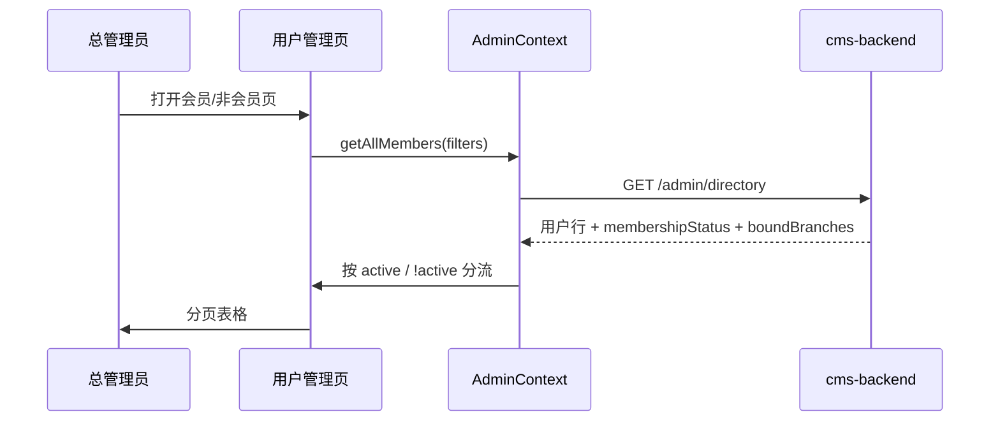
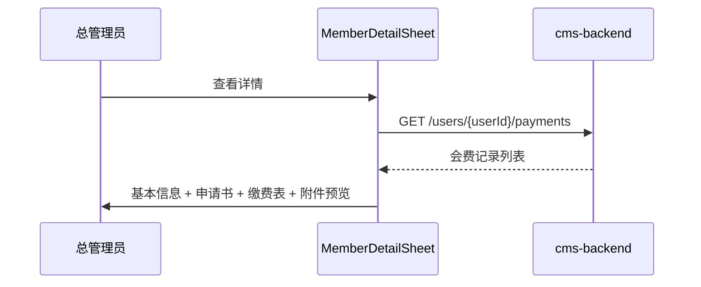
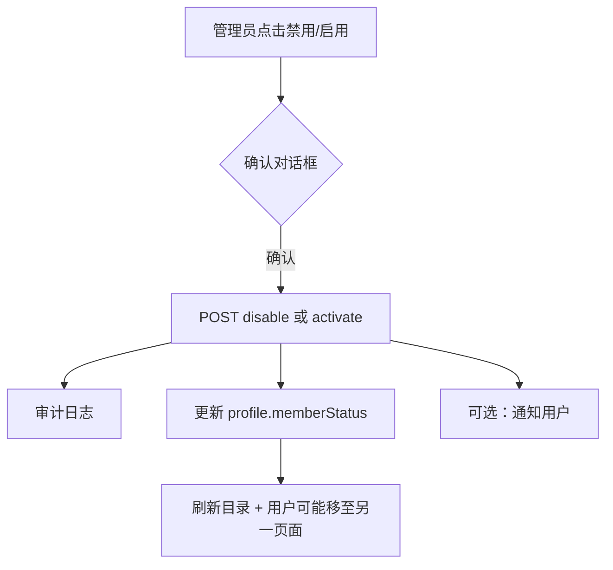

# 13 用户管理模块需求

| 字段 | 内容 |
|------|------|
| 文档名称 | 用户管理（会员/非会员）模块 PRD |
| 模块编号 | 13 |
| 版本 | v1.0 |
| 编写日期 | 2026-07-06 |
| 文档状态 | 初稿（待人工校验） |
| 前置基准 | [中国古生物学会完整需求文档.md](../中国古生物学会完整需求文档.md) v3.1 §17.3、§17.5 |
| 上游模块 | [02_双路径会员选择](./02_双路径会员选择模块需求.md) · [03_入会退会](./03_入会退会申请模块需求.md) · [04_会员费缴纳](./04_会员费缴纳模块需求.md) · [08_会员到期](./08_会员到期与会议资格模块需求.md) · [11_后台角色与数据权限](./11_后台角色与数据权限模块需求.md) · [12_审核工作台](./12_审核工作台模块需求.md) |
| 下游模块 | [15_统计与财务导出](./15_统计与财务导出模块需求.md) |
| 关联原型 | `paleontology-admin-latest` · `paleontology-cms-backend` |
| 不在本模块范围 | 前台注册登录（模块 01）、审核操作（模块 12）、会议报名记录详情（模块 14）、三级统计钻取与 ZIP 导出（模块 15）、RuoYi 系统用户（运维账号） |

---

## 目录

1. [模块概述](#1-模块概述)
2. [用户分类与口径](#2-用户分类与口径)
3. [仪表盘指标（§17.3）](#3-仪表盘指标173)
4. [角色与权限](#4-角色与权限)
5. [业务流程](#5-业务流程)
6. [页面原型说明](#6-页面原型说明)
7. [管理操作规则](#7-管理操作规则)
8. [接口需求](#8-接口需求)
9. [数据模型](#9-数据模型)
10. [异常处理](#10-异常处理)
11. [与上下游模块衔接](#11-与上下游模块衔接)
12. [原型差距与改造清单](#12-原型差距与改造清单)
13. [验收标准](#13-验收标准)
14. [附录](#14-附录)

---

## 1. 模块概述

### 1.1 模块定位

本模块实现管理后台对**学会主站注册用户**的分类查看与管理，核心为两个互补页面：

| 页面 | 路由 | 列入用户 |
|------|------|----------|
| **会员用户管理** | `/admin/users/members` | 仅**正式会员**（`membershipStatus === active`） |
| **非会员用户管理** | `/admin/users/non-members` | 非会员路径用户 + **入会办理中** + 已退会/已过期等**非 active** 用户 |

秘书处通过本模块掌握会员名录、办理进度与异常账号，并可在特殊情况下**手动禁用/开通**会员资格（须审计）。用户分类口径同时驱动**首页仪表盘**（§17.3）中的正式会员数、入会办理中数等指标。

### 1.2 核心设计原则

| 原则 | 本模块落地 |
|------|------------|
| 两页互斥、全覆盖 | 每个注册用户恰好落入其一：`active` → 会员页；其余 → 非会员页 |
| 办理中不进会员页 | 申请书/凭证/发票任一环节未完成，即使 `userType=member` 也在非会员页 |
| 仅总管理员 | 财务、分会管理员不可访问用户管理菜单与 API |
| 分会筛选 | 按用户**已绑定分会**过滤，非按所属学会单元 |
| 缴费历史可溯 | 会员详情展示会费缴纳记录（模块 04 数据） |
| 管理操作留痕 | 禁用/开通须写审计日志，注明操作人与原因 |
| 与审核分工 | 申请书/凭证/发票审核在模块 12；本模块以**查看 + 名录维护**为主 |

### 1.3 系统边界

```
┌─────────────────────────────────────────────────────────────────┐
│ 管理后台                                                         │
│  MemberManagement.tsx      ← active 正式会员                     │
│  NonMemberManagement.tsx   ← 非 active 全体                      │
│  Dashboard.tsx（指标消费） ← §17.3 口径                          │
│  AdminContext · getAllMembers / getMemberDetail / toggle*        │
└──────────────────────────┬──────────────────────────────────────┘
                           │
┌──────────────────────────▼──────────────────────────────────────┐
│ paleontology-cms-backend                                         │
│  GET  /paleo/membership/admin/directory                          │
│  GET  /paleo/membership/admin/users/{userId}/payments            │
│  POST /paleo/membership/admin/users/{userId}/disable  （待实现）  │
│  POST /paleo/membership/admin/users/{userId}/activate （待实现）  │
│  PaleoMembershipDirectoryService · PaleoMembershipStatusService  │
│  PaleoDashboardService                                           │
└──────────────────────────┬──────────────────────────────────────┘
                           │
┌──────────────────────────▼──────────────────────────────────────┐
│ 数据聚合：paleo_user + profile + payment + application + binding │
└─────────────────────────────────────────────────────────────────┘
```

---

## 2. 用户分类与口径

### 2.1 三维概念区分

| 概念 | 字段/来源 | 说明 |
|------|-----------|------|
| **用户类型** | `userType` | `regular` / `non_member` / `member`（模块 02 路径选择） |
| **会员办理状态** | `membershipStatus` | 申请书 + 会费两阶段流水线合成状态（见 §2.2） |
| **档案状态** | `memberStatus`（profile） | 后端 `ACTIVE` / `NON_MEMBER` / `EXPIRED` / `WITHDRAWN` / `PENDING` 等 |

列表分页以 **`membershipStatus`** 为唯一划分依据（与原型 `isFormalMemberStatus` 一致），`userType` 仅作展示。

### 2.2 membershipStatus 解析规则

权威实现：`PaleoMembershipStatusService.resolveMembershipStatus`（后端）与 `shared/constants.ts`（前端枚举）。

解析优先级（简化）：

```
1. 存在 PENDING 的 JOIN 申请     → application_submitted
2. profile.memberStatus 特殊值   → withdrawn / application_approved / expired
3. 最新 payment.paymentStatus    → voucher_* / invoice_* 
4. profile ACTIVE                → active
5. 默认                         → not_member
```

### 2.3 页面归属映射

| membershipStatus | 会员用户管理 | 非会员用户管理 | 仪表盘分类 |
|------------------|:------------:|:--------------:|------------|
| `active` | ✓ | | **正式会员** |
| `application_submitted` ~ `invoice_rejected`（办理流水线） | | ✓ | **入会办理中** |
| `not_member` | | ✓ | 非会员/其他 |
| `withdrawn` | | ✓ | 非会员/其他 |
| `expired` | | ✓ | 非会员/其他 |
| `regular` 未选路径（若出现在目录） | | ✓ | 非会员/其他 |

**办理流水线状态集合**（`MEMBERSHIP_PIPELINE_STATUSES`）：

- `application_submitted`、`application_rejected`、`application_approved`
- `voucher_submitted`、`voucher_rejected`
- `invoice_pending`、`invoice_overdue`、`invoice_submitted`、`invoice_rejected`

> `application_rejected` 仍在非会员页展示，便于秘书处跟进；不计入正式会员统计。

### 2.4 正式会员定义

与总需求及验收项一致：

> **正式会员** = 入会申请书审核通过 + 会费凭证审核通过 + 会费发票审核通过 → `membershipStatus === active`

仅此时进入「会员用户管理」；与 `userType === member` 不等价（办理中用户 `userType` 可为 `member` 但仍在非会员页）。

---

## 3. 仪表盘指标（§17.3）

本模块定义的用户分类是仪表盘核心指标的**单一事实来源**；仪表盘 UI 在 `Dashboard.tsx`，统计 API 在 `PaleoDashboardService`。

### 3.1 指标口径表

| 指标 | 计算规则 | 对应页面 |
|------|----------|----------|
| **用户总数** | 状态正常（`paleo_user.status=1`）的注册用户计数 | 两页之和 |
| **正式会员** | `membershipStatus === active` | 会员用户管理条数 |
| **入会办理中** | `isMembershipPipelineStatus(membershipStatus)` | 非会员页之子集 |
| **非会员/其他** | 既非 active 又非办理流水线 | 非会员页之子集 |
| **待审核** | 待审凭证 + 待审发票（模块 12 队列） | 审核工作台 |
| **会费/会议费累计** | 已 `CONFIRMED` 金额合计 | 模块 15 |

### 3.2 与分会统计的关系

- 总管理员仪表盘：各分会**正式会员**数 = `active` 且 `boundBranches` 含该分会 code
- 分会管理员仪表盘：**不**进入用户管理页；「分会用户」指绑定该分会且 `active` 的用户数（模块 11）
- 办理中用户计入全站「入会办理中」，不按分会拆卡（除非未来产品要求）

### 3.3 API

| 方法 | 路径 | 说明 |
|------|------|------|
| GET | `/paleo/dashboard/stats` | 返回 `memberCount`、`pendingMembershipCount`、`nonMemberCount`、`totalUsers` 等 |

前端 `SuperAdminView` 优先采用 API 数据，本地 `getDashboardStats()` 作降级。

---

## 4. 角色与权限

### 4.1 菜单可见性

| 菜单 | super_admin | finance_reviewer | branch_admin |
|------|:-----------:|:----------------:|:------------:|
| 用户管理 → 会员用户管理 | ✓ | — | — |
| 用户管理 → 非会员用户管理 | ✓ | — | — |

与 [11_后台角色与数据权限模块需求.md](./11_后台角色与数据权限模块需求.md) 矩阵一致。财务仅可通过审核工作台、识别结果、财务记录接触缴费相关数据，**不可浏览完整用户名录**。

### 4.2 接口鉴权

| API | 角色 |
|-----|------|
| `GET /admin/directory` | `super_admin`（`@RequireAdminRole` 或等价） |
| `GET /admin/users/{id}/payments` | `super_admin` |
| 禁用/开通（待实现） | `super_admin` |

### 4.3 数据范围

- **首期**：仅学会总管理员可访问；目录返回**全站**用户
- 后端 `listDirectoryForAdmin` 已支持分会管理员按绑定过滤，但菜单不对分会开放；若未来开放分会只读名录，须单独评审

---

## 5. 业务流程

### 5.1 用户名录加载



### 5.2 查看会员详情与缴费历史



### 5.3 手动禁用/开通会员



| 操作 | 业务含义 | 与模块 08 关系 |
|------|----------|----------------|
| **禁用** | 秘书处强制暂停 `active` 资格 | 不同于自然到期；须记录原因 |
| **启用** | 恢复曾被禁用的会员 | 恢复 `active` 与有效期规则待产品确认 |
| **手动开通** | 跳过缴费流程直接 `active` | 仅用于线下已缴费等特例；须审计 |

---

## 6. 页面原型说明

### 6.1 会员用户管理（`MemberManagement.tsx`）

**副标题**：管理已完成入会全流程（申请书、会费凭证、发票均通过）的正式会员。

#### 筛选区

| 控件 | 说明 |
|------|------|
| 搜索框 | 邮箱或姓名，模糊匹配 |
| 状态筛选 | 全部 / 会员资格有效（`active`）/ 已过期（`expired`）— 见 §12 口径问题 |
| 分会筛选 | `BRANCH_MAP` 全部分会 + 各分会 ID |

#### 列表列

| 列 | 字段 |
|----|------|
| 邮箱 | `email` |
| 姓名 | `name` / `userName` |
| 单位 | `unit` |
| 状态 | `membershipStatus` → `StatusBadge` |
| 绑定分会 | `boundBranches` / `boundBranchNames` |
| 有效期 | `expiryDate` / `validEndDate` |
| 操作 | 查看详情、禁用/启用、手动开通（非 active 时显示，列表已过滤 active 故开通按钮逻辑见 §12） |

#### 分页

- 前端分页：`ITEMS_PER_PAGE = 10`
- 显示「共 N 条，第 x/y 页」

### 6.2 非会员用户管理（`NonMemberManagement.tsx`）

**副标题**：管理非会员及入会办理中用户（申请书审核、会费凭证、发票审核未完成）。

#### 筛选区

| 控件 | 说明 |
|------|------|
| 搜索框 | 邮箱或姓名 |
| 分会筛选 | 同会员页 |

无「办理状态」筛选（可 enhancement）。

#### 列表列

| 列 | 字段 |
|----|------|
| 邮箱 | `email` |
| 姓名 | `name` |
| 单位 | `unit` |
| 用户类型 | `userType` → `getUserTypeLabel` |
| 绑定分会 | `boundBranches` |
| 操作 | 查看详情、禁用/启用 |

**建议增强**（非原型）：增加「办理状态」列展示 `membershipStatus`，便于识别办理中环节。

### 6.3 会员详情抽屉（`MemberDetailSheet`）

| 区块 | 内容 |
|------|------|
| 基本信息 | 姓名、性别、单位、角色、会员类型、用户类型、有效期、会员状态、是否禁用、绑定分会 |
| 入会申请书 | 文件预览 + 状态 + 驳回原因 |
| 退会申请书 | 若有则展示 |
| 缴费记录 | API 拉取；类型、金额、状态、提交/确认时间、凭证/发票预览 |

### 6.4 非会员详情抽屉（`NonMemberDetailSheet`）

较简版：基本信息 + 用户类型 + 绑定分会 + 是否禁用。

**建议增强**：办理中用户展示当前 `membershipStatus`、最近申请/缴费摘要，并可跳转模块 12 相关 Tab。

### 6.5 视觉与组件

- 主题色 `#002B49`、边框 `#E5E1DA`、背景 `#FCFAF7`
- 状态 Badge 颜色与 `MEMBERSHIP_STATUS_LABEL` 一致
- 文件预览复用 `FilePreviewDialog`

---

## 7. 管理操作规则

### 7.1 禁用 / 启用

| 项 | 规则 |
|----|------|
| 适用对象 | 会员页：`active` 会员；非会员页：按产品定义是否允许禁用账号级 |
| 效果（目标） | 禁用后用户无法以会员价报名、无法访问会员专属内容；**不等同于**自然到期（模块 08） |
| 必填 | 禁用原因（建议）；开通原因（手动开通时必填） |
| 审计 | `MEMBER_DISABLED` / `MEMBER_ENABLED` 事件 |
| 通知 | 可选站内信通知用户 |

**原型现状**：`toggleMemberDisabled` 将 `active` ↔ `expired` 互转，**混淆行政禁用与自然到期**（§12 P0）。

### 7.2 手动开通会员

| 项 | 规则 |
|----|------|
| 入口 | 会员管理页（原型对非 active 显示，与列表过滤矛盾） |
| 场景 | 线下已收款、历史会员导入、特殊情况豁免线上缴费 |
| 效果 | `membershipStatus → active`；写入 `validEndDate`（默认当年 12-31 或按规则顺延一年） |
| 约束 | 不应绕过未审核的入会申请书（若 `userType=member` 且无 APPROVED JOIN，应提示先审申请） |
| 审计 | `MEMBER_MANUAL_ACTIVATE` + 原因 |

**原型现状**：仅写 `localStorage`，无后端 API（§12 P0）。

### 7.3 不应在本模块提供的操作

| 操作 | 归属 |
|------|------|
| 审核申请书/凭证/发票 | 模块 12 |
| 修改用户密码、注销账号 | 模块 01 / 前台 |
| 代用户绑定分会 | 模块 05 / 前台 |
| 修改用户资料字段 | 前台个人中心；管理端只读 |

---

## 8. 接口需求

### 8.1 已有接口

#### GET `/paleo/membership/admin/directory`

**角色**：`super_admin`

**响应行**（`ApiMemberDirectoryRow`）：

| 字段 | 说明 |
|------|------|
| `userId` | 用户 ID |
| `email`, `userName`, `gender`, `unit`, `roleLabel` | 基本信息 |
| `userType` | regular / non_member / member |
| `memberStatus` | profile 原始状态 |
| `memberCategory` | 学生/非学生等 |
| `membershipStatus` | 合成展示状态（§2.2） |
| `validEndDate` | 会员有效期 |
| `boundBranches`, `boundBranchNames` | 绑定分会 |

**查询参数（建议增强）**：

| 参数 | 说明 |
|------|------|
| `search` | 邮箱/姓名 |
| `branchCode` | 绑定分会 |
| `membershipStatus` | 状态 |
| `pageNum`, `pageSize` | 服务端分页 |

#### GET `/paleo/membership/admin/users/{userId}/payments`

返回该用户全部会员费缴纳记录（含 `voucherUrl`、`invoiceUrl`、`validEndDate`、`reviewComment`）。

前端 `filterVisibleMembershipPayments` 过滤未提交凭证的 `UNPAID` 草稿。

### 8.2 待新增接口（P0）

#### POST `/paleo/membership/admin/users/{userId}/disable`

```json
{
  "reason": "违规使用账号，暂停会员资格",
  "notifyUser": true
}
```

- 将 `active` 用户设为行政禁用状态（建议 profile 字段 `adminDisabled=true` 或独立 `SUSPENDED`）
- 写审计日志

#### POST `/paleo/membership/admin/users/{userId}/enable`

恢复被行政禁用的会员（非到期恢复）。

#### POST `/paleo/membership/admin/users/{userId}/manual-activate`

```json
{
  "reason": "线下已收 2026 年会费，凭证存档",
  "validEndDate": "2026-12-31"
}
```

- 校验 JOIN 已 APPROVED（若走正式路径）
- 设置 `active` + 有效期
- 可选创建一条「线下确认」payment 记录备查

#### GET `/paleo/membership/admin/users/{userId}/detail`（可选）

聚合 profile、最新 JOIN/WITHDRAW 申请、绑定分会，减少前端多次请求。

### 8.3 前端封装

| 文件 | 函数 |
|------|------|
| `membership-api.ts` | `fetchMemberDirectory`, `fetchUserMembershipPayments` |
| `cms-api.ts` | `fetchDashboardStats` |

---

## 9. 数据模型

### 9.1 前端 MemberRecord

```typescript
interface MemberRecord {
  userId?: number;
  email: string;
  name: string;
  gender?: string;
  unit?: string;
  role?: string;
  memberType?: string;
  membershipStatus: string;
  boundBranches: string[];
  boundBranchNames?: string[];
  expiryDate?: string;
  userType: string;
  disabled?: boolean;
}
```

`mapDirectoryRow` 将 API 行映射为 `MemberRecord`。

### 9.2 后端聚合

`PaleoMembershipDirectoryService.listDirectoryForAdmin` 聚合：

- `paleo_user`
- `paleo_member_profile`
- 最新非 VOIDED `paleo_membership_payment`
- PENDING `JOIN` `paleo_membership_application`
- `paleo_user_binding` + `paleo_association`

### 9.3 审计事件（建议）

| 事件类型 | 触发 |
|----------|------|
| `MEMBER_ADMIN_DISABLE` | 禁用 |
| `MEMBER_ADMIN_ENABLE` | 启用 |
| `MEMBER_MANUAL_ACTIVATE` | 手动开通 |

---

## 10. 异常处理

| 场景 | 处理 |
|------|------|
| 目录 API 失败 | Toast + 空列表；仪表盘降级本地聚合 |
| 用户已不在当前页分类 | 操作后刷新；若状态变为 active 从未会员页消失 |
| 对非 active 执行禁用 | 提示「仅正式会员可禁用」或走账号级封禁（待定义） |
| 手动开通但 JOIN 未通过 | 后端拒绝并提示先审入会申请 |
| 重复开通 | 幂等返回成功或 409 |
| 缴费记录为空 | 详情展示「暂无缴费记录」 |
| 无权限 | 403 + 重定向仪表盘 |

---

## 11. 与上下游模块衔接

### 11.1 上游

| 模块 | 提供 |
|------|------|
| 02 | `userType` 路径 |
| 03 | 申请状态影响 `membershipStatus` |
| 04 | 缴费记录、active 认定 |
| 08 | 自然到期 → `expired`，出现在非会员页 |
| 11 | 菜单与 API 权限 |
| 12 | 审核推进办理状态；待办数进仪表盘 |

### 11.2 下游

| 模块 | 消费 |
|------|------|
| 15 | 正式会员数、学生/非学生拆分、钻取人口 |
| Dashboard | §17.3 指标 |
| 14/分会管理 | 各分会正式会员计数卡片 |

### 11.3 与模块 12 边界

| 能力 | 模块 12 | 模块 13 |
|------|---------|---------|
| 审核通过/驳回 | ✓ | |
| 名录列表与搜索 | | ✓ |
| 缴费历史只读 | | ✓ |
| 行政禁用/手动开通 | | ✓ |

---

## 12. 原型差距与改造清单

| 优先级 | 差距 | 原型现状 | 目标 |
|:------:|------|----------|------|
| **P0** | 禁用/开通无后端 | `localStorage` 改 status active↔expired | 独立 API + 区分行政禁用与到期 |
| **P0** | 手动开通无后端 | 仅 `localStorage` 设 active | `manual-activate` API + 审计 |
| **P0** | 禁用混淆到期 | `toggleMemberDisabled` 用 `expired` | `adminDisabled` 或 `SUSPENDED` 与 `expired` 分离 |
| **P1** | 目录无服务端分页/筛选 | 全量拉取 + 前端 filter | 查询参数 + 分页 |
| **P1** | 非会员页无办理状态列 | 仅 `userType` | 展示 `membershipStatus` |
| **P1** | 非会员详情过简 | 无缴费/申请摘要 | 办理中展示环节与跳转审核台 |
| **P1** | 会员页状态筛选项含 expired | 列表仅 active，筛选项无效 | 移除无效项或扩展「曾会员」视图 |
| **P2** | `getMemberDetail` 申请书来自 localStorage | 与 API 不同步 | 统一从后端 detail 接口 |
| **P2** | 禁用无原因输入 | 仅确认框 | 必填原因写审计 |

---

## 13. 验收标准

### 13.1 分类与列表

- [ ] 会员用户管理**仅**含 `membershipStatus === active` 用户
- [ ] 非会员用户管理含办理中、非会员路径、已退会、已过期等全部非 active 用户
- [ ] 两页用户并集等于全站注册用户（无遗漏、无重复）
- [ ] 搜索邮箱/姓名、按分会筛选正确

### 13.2 详情与缴费历史

- [ ] 会员详情展示基本信息、绑定分会、入会/退会申请书（若有）
- [ ] 缴费记录与模块 04 数据一致，可预览凭证/发票
- [ ] 隐藏未提交凭证的 UNPAID 空草稿

### 13.3 管理操作

- [ ] 禁用/开通/手动开通仅 `super_admin` 可用
- [ ] 每次操作写入审计日志（含原因）
- [ ] 手动开通后用户出现在会员页；禁用 active 用户后离开会员页（行为符合产品定义）

### 13.4 权限

- [ ] 财务、分会管理员无法访问用户管理菜单与 directory API

### 13.5 仪表盘口径（§17.3）

- [ ] `memberCount` = 会员页条数 = active 用户数
- [ ] `pendingMembershipCount` = 办理流水线用户数
- [ ] `nonMemberCount` = 其余用户
- [ ] 与模块 15 统计钻取人口一致

---

## 14. 附录

### 14.1 原型文件索引

| 文件 | 说明 |
|------|------|
| `client/src/pages/admin/MemberManagement.tsx` | 会员用户管理 |
| `client/src/pages/admin/NonMemberManagement.tsx` | 非会员用户管理 |
| `client/src/pages/admin/Dashboard.tsx` | 指标展示 |
| `client/src/contexts/AdminContext.tsx` | `getAllMembers`, `toggleMemberDisabled`, `manualActivateMember` |
| `client/src/lib/membership-api.ts` | directory / payments API |
| `PaleoMembershipDirectoryService.java` | 目录聚合 |
| `PaleoDashboardService.java` | 仪表盘统计 |

### 14.2 工具函数

| 函数 | 文件 | 用途 |
|------|------|------|
| `isFormalMemberStatus` | `shared/constants.ts` | `status === active` |
| `isMembershipPipelineStatus` | `shared/constants.ts` | 是否办理中 |
| `getUserTypeLabel` | `shared/constants.ts` | 用户类型中文 |

### 14.3 待人工确认项

| 编号 | 问题 | 建议 |
|------|------|------|
| Q1 | 行政禁用与自然到期是否同一状态？ | 否；禁用用 `SUSPENDED` 或 `adminDisabled` |
| Q2 | 手动开通是否必须 JOIN 已通过？ | 是（正式路径）；非会员路径升级须先选 member 路径 |
| Q3 | 已过期会员是否可出现在会员页「历史」？ | 否；统一在非会员页，状态 `expired` |
| Q4 | 非会员页是否允许禁用账号？ | 建议支持账号级封禁（禁止登录），与会员资格禁用分开 |
| Q5 | 目录是否导出 Excel？ | 放模块 15；本模块仅在线查看 |

### 14.4 修订记录

| 版本 | 日期 | 说明 |
|------|------|------|
| v1.0 | 2026-07-06 | 初稿 |

---

**文档结束**
