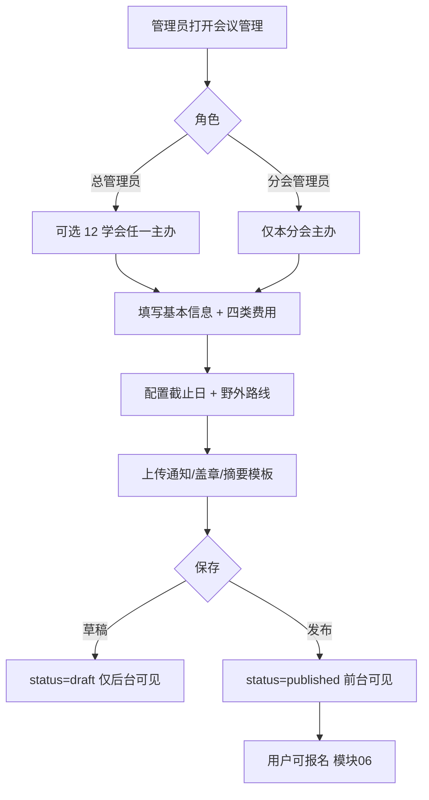
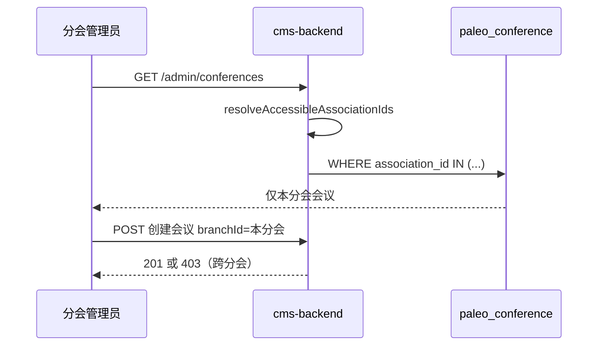
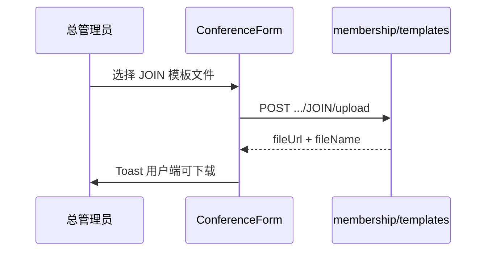

# 14 会议管理后台模块需求

| 字段 | 内容 |
|------|------|
| 文档名称 | 会议管理后台模块 PRD |
| 模块编号 | 14 |
| 版本 | v1.0 |
| 编写日期 | 2026-07-06 |
| 文档状态 | 初稿（待人工校验） |
| 前置基准 | [中国古生物学会完整需求文档.md](../中国古生物学会完整需求文档.md) v3.1 §17.8–§17.10 |
| 上游模块 | [06_会议发布与会议费报名](./06_会议发布与会议费报名模块需求.md) · [07_参会信息摘要住宿野外](./07_参会信息摘要住宿野外模块需求.md) · [11_后台角色与数据权限](./11_后台角色与数据权限模块需求.md) |
| 下游模块 | [12_审核工作台](./12_审核工作台模块需求.md) · [15_统计与财务导出](./15_统计与财务导出模块需求.md) |
| 关联原型 | `paleontology-admin-latest` · `paleontology-cms-backend` |
| 不在本模块范围 | 前台会议列表与报名 UX（模块 06）、会议费审核（模块 12）、参会表单前台填报（模块 07）、三级统计钻取 UI（模块 15）、管理员↔分会绑定配置（模块 11 `ScopeManagement`） |

---

## 目录

1. [模块概述](#1-模块概述)
2. [业务背景与目标](#2-业务背景与目标)
3. [角色与权限](#3-角色与权限)
4. [会议管理（§17.8）](#4-会议管理178)
5. [学会/分会管理（§17.9）](#5-学会分会管理179)
6. [入会/退会模板（§17.10）](#6-入会退会模板1710)
7. [业务流程](#7-业务流程)
8. [页面原型说明](#8-页面原型说明)
9. [接口需求](#9-接口需求)
10. [数据模型](#10-数据模型)
11. [异常处理](#11-异常处理)
12. [与上下游模块衔接](#12-与上下游模块衔接)
13. [原型差距与改造清单](#13-原型差距与改造清单)
14. [验收标准](#14-验收标准)
15. [附录](#15-附录)

---

## 1. 模块概述

### 1.1 模块定位

本模块实现管理后台对**学术会议**与**学会组织单元**的配置维护，以及**入会/退会申请书模板**上传，是模块 06（前台会议业务）与模块 07（参会信息采集）的**后台配置面**。

| 子能力 | 路由/入口 | 总需求 |
|--------|-----------|--------|
| **会议管理** | `/admin/conferences` | §17.8 |
| **学会/分会管理** | `/admin/branches` | §17.9 |
| **申请书模板** | 会议表单内「学会模板」区 + API | §17.10 |

核心约束（§17.8）：

- 会议数据、报名记录、参会信息**须全部持久化至服务端**
- 分会管理员仅管理**本分会**会议
- 总学会管理员发布总学会会议，**不代发分会会议**

### 1.2 核心设计原则

| 原则 | 本模块落地 |
|------|------------|
| 服务端为准 | 会议 CRUD、文件 URL、费用、截止日、野外路线入库 |
| 草稿/发布 | `draft` → `published`（后端 `DRAFT` / `OPEN`） |
| 四类费用 | 学生/非学生 × 会员/非会员，配置于创建时 |
| 报名锁价 | 已创建报名记录的 `fee_amount` 不受后续改价影响（模块 06） |
| 分会隔离 | `branch_admin` 仅见、仅改 `association_id` 在授权范围内的会议 |
| 15 条野外路线 | 会前/会中/会后，最多 15 条，支持性别限制（模块 07 消费） |
| 模板全站一份 | JOIN / WITHDRAW Word 模板学会级维护，前台下载 |

### 1.3 系统边界

```
┌──────────────────────────────────────────────────────────────────┐
│ 管理后台                                                          │
│  ConferenceManagement.tsx  — 会议 CRUD + 资料 + 模板区            │
│  BranchManagement.tsx       — 12 学会单元卡片 + 全平台汇总          │
└──────────────────────────┬───────────────────────────────────────┘
                           │
┌──────────────────────────▼───────────────────────────────────────┐
│ paleontology-cms-backend（目标完整形态）                            │
│  会议 CRUD API（待实现）                                           │
│  GET/POST /paleo/conferences/...                                   │
│  paleo_conference + paleo_conference_fee + paleo_field_trip_route  │
│  报名 GET /registrations/list（已有）                               │
│  模板 GET/POST /paleo/membership/templates（已有）                  │
│  分会 paleo_association CRUD（待增强）                              │
└──────────────────────────┬───────────────────────────────────────┘
                           │
┌──────────────────────────▼───────────────────────────────────────┐
│ 学会主站（模块 06/07）— 读取已发布会议与模板                         │
└──────────────────────────────────────────────────────────────────┘
```

---

## 2. 业务背景与目标

### 2.1 业务痛点

秘书处与各分会需独立发布学术会议：配置时间地点、差异化四类会议费、缴费/摘要/住宿/野外截止日，并上传通知 PDF、盖章通知、摘要 Word 模板。总学会另需维护 12 个学会单元信息与全站入会/退会申请书模板。

若会议配置仅存浏览器 `localStorage`，将导致换设备数据丢失、前后台不一致，违反 §17.8「须全部持久化至服务端」。

### 2.2 模块目标

| 目标 | 可衡量结果 |
|------|------------|
| 会议可管 | 总/分会管理员可创建、编辑、发布会议 |
| 配置完整 | 费用、截止日、文件、野外路线一次配置到位 |
| 组织可管 | 总管理员可编辑 12 学会单元名称/简介/启用状态 |
| 模板可更 | 上传 JOIN/WITHDRAW 模板后前台可下载 |
| 数据隔离 | 分会只见本分会会议；总会见全部 |

### 2.3 不在本模块范围

| 内容 | 归属 |
|------|------|
| 用户报名、缴费上传 | 模块 06 前台 |
| 参会信息/摘要/住宿填报 | 模块 07 |
| 会议费审核 | 模块 12 |
| 报名列表导出、摘要 ZIP | 模块 15 |
| 会议 CMS 富文本详情页 | 模块 09（若与会议通知页合并另议） |

---

## 3. 角色与权限

### 3.1 菜单可见性

| 菜单 | super_admin | branch_admin | finance_reviewer |
|------|:-----------:|:------------:|:----------------:|
| 会议管理 | ✓ 全部 | ✓ 本分会 | — |
| 学会/分会管理 | ✓ | — | — |
| 申请书模板上传 | ✓ | — | — |

财务审核员通过模块 12 审会议费，**不进入**会议配置页。

### 3.2 会议操作矩阵

| 操作 | super_admin | branch_admin |
|------|:-----------:|:------------:|
| 创建总学会会议（`branchId=zgswxh`） | ✓ | — |
| 创建本分会会议 | ✓（一般不代发） | ✓ |
| 编辑本分会会议 | ✓ | ✓ |
| 编辑他分会会议 | ✓ | — |
| 发布/下架 | ✓ | ✓（本分会） |
| 查看确认参会人数 | ✓ | ✓（本分会） |

### 3.3 组织单元操作

| 操作 | super_admin |
|------|:-----------:|
| 编辑总学会/11 分会名称、简介 | ✓ |
| 启用/禁用学会单元 | ✓ |
| 查看各分会正式会员数 | ✓（卡片展示） |
| 全平台汇总只读卡片 | ✓ |

---

## 4. 会议管理（§17.8）

### 4.1 会议基本属性

| 字段 | 必填 | 说明 |
|------|:----:|------|
| `name` / `conferenceTitle` | ✓ | 会议名称 |
| `branchId` / `associationId` | ✓ | 主办学会（`ALL_SOCIETY_UNITS` 12 选 1） |
| `startDate`, `endDate` | ✓ | 会议起止日期 |
| `location` / `city` | ✓ | 举办地点 |
| `status` | ✓ | `draft` 草稿 / `published` 已发布 |
| `sessions` | | 分会场列表（可选，多行名称） |
| `conferenceCode` | 系统 | 如 `conf-zgswxh-1`，前后台对齐用 |

### 4.2 四类会议费（`feeConfig`）

| 键 | 说明 |
|----|------|
| `studentMember` | 学生会员价 |
| `nonStudentMember` | 非学生会员价 |
| `studentNonMember` | 学生非会员价（默认 ≈ 会员价 × 1.1） |
| `nonStudentNonMember` | 非学生非会员价 |

校验：至少 `nonStudentMember` 必填（原型规则）；发布前建议四类均有值。

**改价规则**：已存在报名记录的用户保持报名时 `fee_amount`；新用户使用新价格（模块 06）。

### 4.3 截止日期

| 字段 | 用途 |
|------|------|
| `paymentDeadline` | 会议费缴费截止（提示/锁定参考） |
| `abstractDeadline` | 摘要提交截止（模块 07） |
| `accommodationDeadline` | 住宿登记截止 |
| `fieldTripDeadline` | 野外路线选择截止 |

### 4.4 会议资料文件

| 文件 | 格式 | 用户可见时机 |
|------|------|--------------|
| 公开会议通知 PDF（不盖章） | PDF | 报名前即可下载 |
| 盖章会议通知 PDF | PDF | 会议费 `confirmed` 后 |
| 摘要模板 Word | `.doc/.docx` | `confirmed` 后下载填报 |

上传限制：单文件 ≤ 20MB；存储走 OSS/本地存储服务（模块 16）；**禁止** base64 存入前端状态（原型已修复）。

### 4.5 野外路线（最多 15 条）

| 属性 | 说明 |
|------|------|
| `id` | 路线唯一 ID |
| `phase` | `pre` 会前 / `during` 会中 / `post` 会后 |
| `name` | 路线名称 |
| `order` | 序号 1–15 |
| `genderRestriction` | `any` / `male` / `female`（模块 07 校验） |

原型提供「填充 15 条默认路线」：`createDefaultFieldTripRoutes(prefix, locationHint)`。

### 4.6 发布状态

| 前端 | 后端建议 | 前台行为 |
|------|----------|----------|
| `draft` | `DRAFT` | 仅管理端可见，不出现在公开列表 |
| `published` | `OPEN` | `GET /public/list` 可见，可报名 |

下架：改回 `DRAFT` 或 `CLOSED`；已报名记录保留。

### 4.7 报名与参会数据（只读关联）

本模块不编辑报名记录，但会议卡片展示「确认参会 N 人」：

- 计数口径：`payment_status === CONFIRMED`（或前端 `confirmed`）
- 报名明细：`GET /paleo/conferences/registrations/list?conferenceId=`
- 参会信息：模块 07 表，按 `conference_id` 关联；导出在模块 15

§17.8 要求报名、参会信息持久化——后端 `paleo_conference_registration` 已有；参会扩展表待模块 07 落地。

---

## 5. 学会/分会管理（§17.9）

### 5.1 十二个学会单元

| 类型 | 数量 | ID 示例 |
|------|------|---------|
| 总学会 | 1 | `zgswxh`（`TOTAL_SOCIETY_ID`） |
| 专业分会 | 11 | `gjzdw`、`bfx` 等（见 `ALL_SOCIETY_UNITS`） |

与 `paleo_association` 表及 `branchCode` 对齐。

### 5.2 可编辑字段

| 字段 | 说明 |
|------|------|
| `name` / `associationName` | 显示名称 |
| `description` | 简介文案 |
| `disabled` / `status` | 启用/禁用；禁用后限制新绑定或新会议（已进行中报名不受影响，见原型文案） |
| `logo` | 分会 Logo（可选，原型支持） |

### 5.3 全平台汇总卡片（只读）

展示 12 学会合计：

| 指标 | 来源 |
|------|------|
| 全站注册用户 | 模块 13 directory |
| 已发布会议数 | 本模块会议 `published` 计数 |
| 累计会议费 | 模块 15 `globalStats` |

提供跳转：「管理全部会议」「查看全部学会统计」。

### 5.4 分会卡片指标

| 指标 | 说明 |
|------|------|
| 正式会员数 | `active` 且 `boundBranches` 含该分会 |
| 会议场数 | 该 `branchId` 下会议总数 |
| 启用状态 | Badge |

---

## 6. 入会/退会模板（§17.10）

### 6.1 业务说明

学会维护两份 Word 模板，供前台用户下载填写：

| 类型 | `templateType` | 前台用途 |
|------|----------------|----------|
| 入会申请书 | `JOIN` | 模块 03 下载 |
| 退会申请书 | `WITHDRAW` | 模块 03 下载 |

全站**各一份**，不随会议变化；管理入口放在会议表单底部「学会模板」区（原型 UX 选择，亦可独立菜单）。

### 6.2 上传规则

| 项 | 规则 |
|----|------|
| 格式 | `.doc` / `.docx` / `.pdf`（原型 accept） |
| 大小 | ≤ 20MB |
| 权限 | 仅 `super_admin` |
| 覆盖 | 新上传覆盖旧版；保留 `updateTime` |
| 审计 | 模板变更记日志 |

### 6.3 已有 API

| 方法 | 路径 | 说明 |
|------|------|------|
| GET | `/paleo/membership/templates/public` | 前台匿名下载 |
| GET | `/paleo/membership/templates` | 管理端查询 |
| POST | `/paleo/membership/templates/{JOIN\|WITHDRAW}/upload` | 上传 |

数据表：`paleo_membership_template`（`uk_template_type` 唯一）。

---

## 7. 业务流程

### 7.1 创建并发布会议



### 7.2 分会管理员隔离



### 7.3 模板更新流程



---

## 8. 页面原型说明

### 8.1 会议管理页（`ConferenceManagement.tsx`）

#### 列表区

- 卡片网格：会议名、主办学会、地点、日期、确认参会人数、四类费用摘要
- Badge：草稿 / 已发布
- 文件指示：通知、模板、野外路线数量
- 操作：编辑；顶部「新建会议」

#### 新建/编辑对话框（`ConferenceForm`）

| 区块 | 内容 |
|------|------|
| 基本信息 | 名称、主办学会、日期、地点、状态、分会场 |
| 会议费用 | 四类费用输入 |
| 截止日期 | 缴费、摘要、住宿、野外 |
| 野外路线 | 增删改、填充默认 15 条、性别限制 |
| 会议资料 | 公开通知、盖章通知、摘要模板（`uploadCmsMedia`） |
| 学会模板 | 入会/退会 Word（`uploadMembershipTemplate`） |

分会管理员：`branchOptions` 仅含本分会；`branchId` 默认锁定。

### 8.2 学会/分会管理页（`BranchManagement.tsx`）

| 区块 | 说明 |
|------|------|
| 全平台汇总 | 只读 Card + 跳转链接 |
| 总学会卡片 | 置顶；编辑名称/简介；启用/禁用 |
| 11 分会卡片 | 名称、简介、会员数、启用/禁用、编辑 |
| 编辑 Dialog | 名称 + 描述 Textarea |
| 禁用 AlertDialog | 确认文案含「已进行中报名不受影响」 |

### 8.3 路由

| 路径 | 组件 |
|------|------|
| `/admin/conferences` | `ConferenceManagement` |
| `/admin/branches` | `BranchManagement`（仅 super_admin 菜单） |

---

## 9. 接口需求

### 9.1 会议 API（待实现 · P0）

| 方法 | 路径 | 角色 | 说明 |
|------|------|------|------|
| GET | `/paleo/conferences/admin/list` | super_admin, branch_admin | 管理端列表（按数据范围过滤） |
| GET | `/paleo/conferences/admin/{id}` | 同上 | 详情含费用、文件、路线 |
| POST | `/paleo/conferences/admin` | 同上 | 创建 |
| PUT | `/paleo/conferences/admin/{id}` | 同上 | 更新 |
| PATCH | `/paleo/conferences/admin/{id}/status` | 同上 | 发布/下架 |
| DELETE | `/paleo/conferences/admin/{id}` | super_admin | 软删（无报名或仅草稿） |

**创建请求体示例（节选）**：

```json
{
  "conferenceTitle": "2026 中国古生物学会年会",
  "associationId": 1,
  "branchCode": "zgswxh",
  "city": "北京",
  "startDate": "2026-10-01",
  "endDate": "2026-10-05",
  "status": "DRAFT",
  "feeConfig": {
    "studentMember": 800,
    "nonStudentMember": 1200,
    "studentNonMember": 900,
    "nonStudentNonMember": 1500
  },
  "paymentDeadline": "2026-09-15",
  "abstractDeadline": "2026-09-01",
  "accommodationDeadline": "2026-09-20",
  "fieldTripDeadline": "2026-09-25",
  "publicNoticeUrl": "https://...",
  "stampedNoticeUrl": "https://...",
  "abstractTemplateUrl": "https://...",
  "fieldTripRoutes": [
    { "routeCode": "r1", "phase": "pre", "name": "路线一", "sortOrder": 1, "genderRestriction": "any" }
  ],
  "sessions": [{ "sessionName": "分会场A" }]
}
```

### 9.2 已有会议相关 API

| 方法 | 路径 | 说明 |
|------|------|------|
| GET | `/paleo/conferences/public/list` | 前台开放会议（仅 `OPEN`） |
| GET | `/paleo/conferences/registrations/list` | 管理端报名分页列表 |
| GET | `/paleo/conferences/registrations/reviews/pending-*` | 模块 12 审核队列 |

### 9.3 学会/分会 API（待增强 · P1）

| 方法 | 路径 | 说明 |
|------|------|------|
| GET | `/paleo/admin/associations/list` | 12 单元 + 简介 + status + 会员数 |
| PUT | `/paleo/admin/associations/{id}` | 更新名称、简介 |
| PATCH | `/paleo/admin/associations/{id}/status` | 启用/禁用 |

已有：`GET /paleo/admin/associations/branches`（分会列表，供 Scope 配置）。

### 9.4 模板 API（已实现）

见 §6.3；管理端上传应加 `@RequireAdminRole("super_admin")`。

### 9.5 文件上传

| 场景 | 接口 |
|------|------|
| 会议 PDF/Word | CMS 媒体 `uploadCmsMedia` 或会议专用 attach |
| 申请书模板 | `POST /templates/{type}/upload` |

---

## 10. 数据模型

### 10.1 现有表（精简）

**`paleo_conference`**（当前字段不足，需扩展）：

| 现有字段 | 待扩展 |
|----------|--------|
| conference_id, association_id, conference_code, title, city, dates, status | 费用 JSON、各截止日、文件 URL、sessions JSON |

**`paleo_conference_registration`**：报名与缴费状态（已有）。

**`paleo_association`**：学会/分会主数据。

**`paleo_membership_template`**：JOIN/WITHDRAW 模板。

### 10.2 建议新增/扩展

| 表/字段 | 用途 |
|---------|------|
| `paleo_conference_fee` 或 `fee_config_json` | 四类价格 |
| `paleo_conference_file` | 通知/模板文件角色与 URL |
| `paleo_field_trip_route` | 野外路线 1:N |
| `paleo_conference_session` | 分会场（可选独立表） |
| `paleo_attendee_info` | 模块 07 参会信息 |

### 10.3 前端类型（原型）

```typescript
interface ConferenceData {
  name: string;
  branchId: string;
  startDate: string;
  endDate: string;
  location: string;
  feeConfig: ConferenceFeeConfig;
  paymentDeadline?: string;
  abstractDeadline?: string;
  accommodationDeadline?: string;
  fieldTripDeadline?: string;
  fieldTripRoutes?: FieldTripRoute[];
  sessions: { id: string; name: string }[];
  status: "draft" | "published";
  publicNoticeUrl?: string;
  stampedNoticeUrl?: string;
  abstractTemplateUrl?: string;
}
```

原型持久化键：`paleo_admin_conferences_db`（**应废弃**，改 API）。

---

## 11. 异常处理

| 场景 | 处理 |
|------|------|
| 分会创建他分会会议 | 403 + Toast |
| 发布缺必填费用 | 前端校验拦截 |
| 上传超 20MB | 拒绝并提示 |
| 上传失败 | Toast；不提交表单 |
| 编辑已有人报名的费用 | 允许改价但提示「不影响已报名用户」 |
| 删除有报名记录的会议 | 禁止硬删；仅下架 |
| 禁用学会单元 | 确认框；不撤销进行中的报名 |
| 模板类型错误 | API `IllegalArgumentException` |
| legacy base64 文件 | 忽略不加载（防 OOM） |

---

## 12. 与上下游模块衔接

### 12.1 上游

| 模块 | 关系 |
|------|------|
| 06 | 前台消费已发布会议配置与费用 |
| 07 | 消费截止日、野外路线、摘要模板 |
| 11 | 角色、分会数据范围、`AdminScopeService` |

### 12.2 下游

| 模块 | 关系 |
|------|------|
| 12 | 会议费审核依赖会议存在与 `conferenceCode` |
| 15 | 按学会/会议钻取统计 |
| 03 | 模板下载 API |

### 12.3 与模块 06 边界

| 能力 | 06 前台 | 14 后台 |
|------|---------|---------|
| 会议列表展示 | ✓ | |
| 创建/编辑会议 | | ✓ |
| 用户报名 | ✓ | |
| 报名记录列表 | | 只读 API |
| 四类费用配置 | 消费 | 配置 |

---

## 13. 原型差距与改造清单

| 优先级 | 差距 | 原型现状 | 目标 |
|:------:|------|----------|------|
| **P0** | 会议无后端 CRUD | `localStorage` `paleo_admin_conferences_db` | 完整 REST + DB 扩展 |
| **P0** | `paleo_conference` 字段不足 | 仅 title/city/dates/status | 费用、文件、截止日、路线 |
| **P0** | 前后台会议不同步 | 主站读 API，后台读 localStorage | 统一数据源 |
| **P1** | 分会管理无后端 | `getAllBranches` localStorage + 总学会 localStorage | `paleo_association` CRUD API |
| **P1** | 无报名记录管理 UI | 仅有 API | 会议详情 Tab「报名列表」或链到统计 |
| **P1** | 模板上传权限 | Controller 未限制角色 | 仅 super_admin |
| **P2** | 会议删除/下架 | 原型无删除 | 软删 + 审计 |
| **P2** | `conferenceCode` 生成规则 | 前端时间戳 id | 后端稳定 code 与迁移脚本 |
| **P2** | 11 分会种子与 `ALL_SOCIETY_UNITS` 不一致 | DB 种子名称可能过时 | 对齐 constants 与 migration |

---

## 14. 验收标准

### 14.1 会议管理

- [ ] 总管理员可创建总学会及任意分会会议；分会管理员仅本分会
- [ ] 四类费用、各截止日、野外路线（≤15）可保存并前台可读
- [ ] 三类会议文件可上传并在正确节点供用户下载
- [ ] 草稿不出现在公开列表；发布后出现在 `public/list`
- [ ] 会议数据存服务端；刷新/换设备不丢失
- [ ] 已报名用户价格不受后台改价影响

### 14.2 学会/分会管理

- [ ] 12 学会单元可编辑名称、简介
- [ ] 启用/禁用生效且有确认提示
- [ ] 全平台汇总卡片数据与模块 13/15 口径一致
- [ ] 各分会卡片展示正式会员数

### 14.3 申请书模板

- [ ] JOIN/WITHDRAW 模板可上传覆盖
- [ ] 前台 `/templates/public` 可下载最新版
- [ ] 仅总管理员可上传

### 14.4 权限与隔离

- [ ] 分会无法编辑他分会会议（前后端）
- [ ] 财务无法访问会议管理菜单

---

## 15. 附录

### 15.1 原型文件索引

| 文件 | 说明 |
|------|------|
| `client/src/pages/admin/ConferenceManagement.tsx` | 会议 CRUD UI |
| `client/src/pages/admin/BranchManagement.tsx` | 学会/分会管理 |
| `client/src/contexts/AdminContext.tsx` | `createConference`, `getAllBranches` |
| `shared/constants.ts` | `ALL_SOCIETY_UNITS`, `FieldTripRoute`, `createDefaultFieldTripRoutes` |
| `PaleoConferenceController.java` | 报名与公开列表 |
| `PaleoMembershipController.java` | 模板 API |
| `PaleoAdminAssociationController.java` | 分会绑定（Scope） |

### 15.2 状态映射

| 前端 | 后端 DB |
|------|---------|
| `draft` | `DRAFT` |
| `published` | `OPEN` |
| （下架） | `CLOSED` |

### 15.3 待人工确认项

| 编号 | 问题 | 建议 |
|------|------|------|
| Q1 | 模板维护入口放会议页还是独立菜单？ | 首期保留会议页底部；可再加「学会配置」 |
| Q2 | 禁用分会是否阻止新用户绑定？ | 是；已绑定保留 |
| Q3 | 会议可否复制上一场配置？ | P2 增强 |
| Q4 | 分会场 sessions 是否入库独立表？ | JSON 首期可接受 |
| Q5 | 总学会代发分会会议是否绝对禁止？ | 是；API 校验 branch_admin 匹配 |

### 15.4 修订记录

| 版本 | 日期 | 说明 |
|------|------|------|
| v1.0 | 2026-07-06 | 初稿 |

---

**文档结束**
