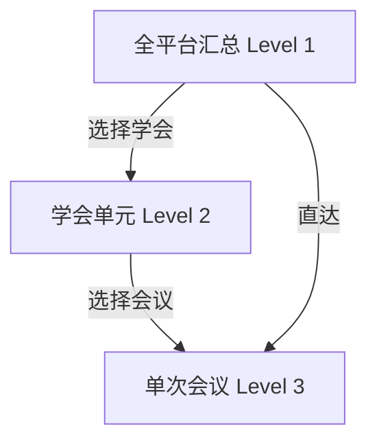
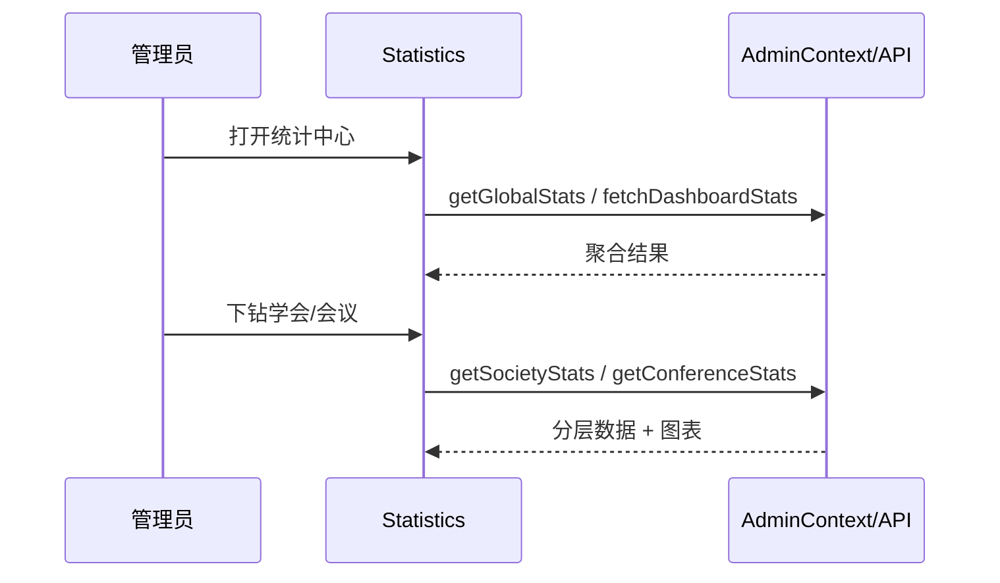
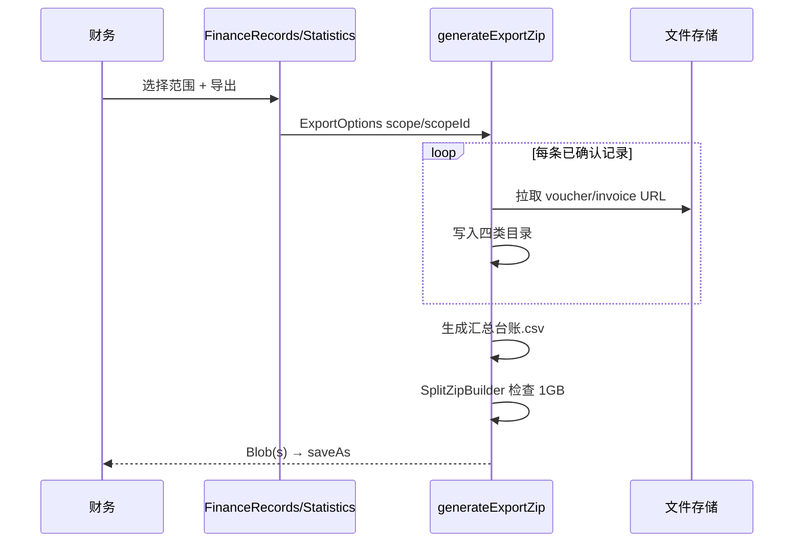

# 15 统计与财务导出模块需求

| 字段 | 内容 |
|------|------|
| 文档名称 | 统计与财务导出模块 PRD |
| 模块编号 | 15 |
| 版本 | v1.0 |
| 编写日期 | 2026-07-06 |
| 文档状态 | 初稿（待人工校验） |
| 前置基准 | [中国古生物学会完整需求文档.md](../中国古生物学会完整需求文档.md) v3.1 §18、§17.3（仪表盘指标口径） |
| 上游模块 | [04_会员费缴纳](./04_会员费缴纳模块需求.md) · [06_会议发布与会议费报名](./06_会议发布与会议费报名模块需求.md) · [07_参会信息摘要住宿野外](./07_参会信息摘要住宿野外模块需求.md) · [11_后台角色与数据权限](./11_后台角色与数据权限模块需求.md) · [13_用户管理](./13_用户管理模块需求.md) · [14_会议管理后台](./14_会议管理后台模块需求.md) |
| 横切关联 | [16_横切能力](./16_横切能力模块需求.md)（文件存储、OSS 拉取） |
| 关联原型 | `paleontology-admin-latest` · `paleontology-cms-backend` |
| 不在本模块范围 | 审核操作（模块 12）、用户名录维护（模块 13）、会议配置（模块 14）、审计日志查询（模块 16）、前台个人缴费记录 |

---

## 目录

1. [模块概述](#1-模块概述)
2. [收入统计口径](#2-收入统计口径)
3. [三级钻取体系（§18.1）](#3-三级钻取体系181)
4. [仪表盘指标（§17.3）](#4-仪表盘指标173)
5. [角色与权限](#5-角色与权限)
6. [财务 ZIP 导出（§18.2）](#6-财务-zip-导出182)
7. [页面原型说明](#7-页面原型说明)
8. [业务流程](#8-业务流程)
9. [接口需求](#9-接口需求)
10. [数据模型与聚合逻辑](#10-数据模型与聚合逻辑)
11. [异常处理](#11-异常处理)
12. [与上下游模块衔接](#12-与上下游模块衔接)
13. [原型差距与改造清单](#13-原型差距与改造清单)
14. [验收标准](#14-验收标准)
15. [附录](#15-附录)

---

## 1. 模块概述

### 1.1 模块定位

本模块为秘书处与财务提供**运营数据统计**与**凭证/发票批量导出**能力，覆盖总需求 §18 全部内容，并与首页仪表盘（§17.3）共享用户与收入口径。

| 能力 | 路由 | 主要用户 |
|------|------|----------|
| **数据统计中心** | `/admin/statistics` | 总管理员、分会管理员、财务 |
| **财务记录与 ZIP 导出** | `/admin/finance` | 财务、总管理员 |
| **仪表盘摘要** | `/admin/dashboard` | 三角色（指标子集，详见 §4） |

核心交互：**全平台汇总 → 学会单元 → 单次会议** 三级下钻；财务可按相同三级范围打包 ZIP（凭证 + 发票 + 汇总台账 CSV）。

### 1.2 核心设计原则

| 原则 | 本模块落地 |
|------|------------|
| 已确认才计收入 | 会员费/会议费仅 `CONFIRMED`（发票终审通过）计入金额与导出 |
| 四类人群一致 | 学生会员、非学生会员、学生非会员、非学生非会员 — 统计与 ZIP 目录同构 |
| 按学会隔离 | ZIP **不可跨学会混放**；全平台导出为 12 个子目录 |
| 实收非估算 | 会议费以报名记录 `fee_amount` 聚合；会员费以 payment 记录聚合 |
| 分会数据范围 | 分会管理员仅本分会；财务全站只读 |
| 大包分包 | 单 ZIP ≤ 1GB，超出 `SplitZipBuilder` 自动拆包 |
| 摘要单独导出 | 单会议可打包参会摘要 Word（模块 07 数据） |

### 1.3 系统边界

```
┌─────────────────────────────────────────────────────────────────┐
│ 管理后台                                                         │
│  Statistics.tsx      — 三级统计 + 图表 + 摘要 ZIP                │
│  FinanceRecords.tsx  — 缴费记录浏览 + 三级 ZIP 导出               │
│  Dashboard.tsx       — 指标卡片（消费统计 API / 本地聚合）        │
│  AdminContext        — getGlobalStats / generateExportZip 等     │
└──────────────────────────┬──────────────────────────────────────┘
                           │
┌──────────────────────────▼──────────────────────────────────────┐
│ paleontology-cms-backend                                         │
│  GET /paleo/dashboard/stats           — 仪表盘/全局部分指标       │
│  GET /paleo/membership/payments/stats — 会员费汇总（已有）      │
│  GET /paleo/conferences/registrations/list — 报名明细分页（已有）│
│  POST /paleo/export/finance-zip       — 服务端打包（待实现）      │
│  GET  /paleo/stats/global|society|conference — 统计 API（待实现）│
└──────────────────────────┬──────────────────────────────────────┘
                           │
┌──────────────────────────▼──────────────────────────────────────┐
│ 数据源：payment · registration · directory · attendee_info       │
└──────────────────────────────────────────────────────────────────┘
```

---

## 2. 收入统计口径

### 2.1 总需求 §18.3

> 仅统计**已确认**（发票终审通过）的会员费与会议费。

| 业务 | 后端状态 | 前端等价 | 计入统计 | 计入 ZIP |
|------|----------|----------|:--------:|:--------:|
| 会员费 | `CONFIRMED` | `confirmed` / `active` | ✓ | ✓（有发票 URL） |
| 会议费 | `CONFIRMED` | `confirmed` | ✓ | ✓ |
| 凭证待审 | `VOUCHER_REVIEW` | `voucher_submitted` | — | 可选含待审（财务页浏览，默认导出已确认） |
| 发票待审 | `INVOICE_REVIEW` | `invoice_submitted` | — | 同上 |

原型常量：

- `REVENUE_CONFERENCE_STATUSES` = `confirmed`, `approved_invoice`, `active`
- `MEMBERSHIP_REVENUE_STATUSES` = `approved`, `active`, `confirmed`

生产环境应统一为后端 `CONFIRMED` 单一权威值。

### 2.2 四类人群划分

与 `CONFERENCE_FEE_TYPE` / `deriveFeeType` 一致：

| feeType | 中文目录名 | 判定 |
|---------|------------|------|
| `student_member` | 学生会员 | `userType=member` + 学生 |
| `non_student_member` | 非学生会员 | `userType=member` + 非学生 |
| `student_non_member` | 学生（非会员） | 非 member + 学生 |
| `non_student_non_member` | 非学生（非会员） | 非 member + 非学生 |

会议报名以记录上的 `fee_type` 为准（报名时锁价锁类型）；会员费按 `member_category` 或金额推断学生/非学生。

### 2.3 用户人口统计 vs 收入统计

| 指标类型 | 口径 | 示例 |
|----------|------|------|
| 注册用户/会员数 | 模块 13 `membershipStatus` / `userType` | 正式会员总数 |
| 参会人数（收入口径） | 该场/该学会下 `CONFIRMED` 报名条数 | 累计参会总人数 |
| 绑定注册用户（学会层） | 绑定该分会的全站用户 | 与参会人数分开展示（原型 `SocietyLevelStatsBlocks`） |

---

## 3. 三级钻取体系（§18.1）

### 3.1 层级结构



| 层级 | 角色可见性 | 原型 Tab |
|------|------------|----------|
| 全平台 | `super_admin`, `finance_reviewer` | 总览 |
| 学会单元 | 总管理员任选；分会仅本分会 | 按学会查看 |
| 单次会议 | 总/财务全部；分会本分会会议 | 按会议查看 |

分会管理员默认进入**学会层**（本分会），可下钻到**会议层**；无全平台 Tab。

### 3.2 全平台汇总指标

| 类别 | 指标 |
|------|------|
| 注册 | 总注册人数 |
| 会员 | 正式会员总数；学生会员、非学生会员 |
| 非会员 | 非会员总数；学生非会员、非学生非会员 |
| 入会办理中 | 流水线用户人数 |
| 会员费 | 累计总金额；学生/非学生分别笔数与金额 |
| 会议费 | 全平台累计 + **12 个学会各自累计** |

原型组件：`GlobalStatistics` + `SocietyFeeMatrixTable`（12 学会 × 4 类费用矩阵）。

### 3.3 学会单元指标

每个学会展示 **4 大项 × 4 类人群**（学会内 16 项会议费明细）：

| 大项 | 内容 |
|------|------|
| 参会人数 | 累计参会总人数；四类人群各自人数 |
| 会员人数 | 累计正式会员参会；学生/非学生 |
| 非会员人数 | 累计；学生/非学生 |
| 会议费 | 总金额；四类笔数与金额 |

另含「绑定注册用户」统计块（与参会实收区分）。

### 3.4 单次会议指标

| 指标 | 说明 |
|------|------|
| 会议费总金额 | 四类金额合计 |
| 参加总人数 | 四类笔数之和（`CONFIRMED`） |
| 四类人群笔数与金额 | `FeeBreakdownTable` |
| 口头/展板报告数 | 参会信息 `reportType` |
| 住宿房型统计 | 五种房型计数（模块 07） |
| 野外会前/会中/会后 | 人数与性别；可下钻到路线明细 `FieldTripDetailPanel` |

附加能力：**摘要 ZIP 打包**（`downloadAbstractsZip`）。

---

## 4. 仪表盘指标（§17.3）

仪表盘为统计模块的**摘要视图**，口径须与模块 13、本模块一致。

| 指标 | 口径 | 数据源 |
|------|------|--------|
| 用户总数 | 正常注册用户 | directory |
| 正式会员 | `active` | 同会员用户管理 |
| 入会办理中 | pipeline 状态集 | `PaleoDashboardService` |
| 非会员/其他 | 其余 | 计算余量 |
| 待审核 | 待审凭证 + 待审发票 | 模块 12 队列 |
| 会费/会议费累计 | 已确认金额 | payment + registration |

| 角色 | 仪表盘视图 |
|------|------------|
| `super_admin` | `SuperAdminView` — 上表 + 分会分布 + 趋势 |
| `branch_admin` | 本分会会议/用户/待审 |
| `finance_reviewer` | `FinanceReviewerView` — 待审、收入、趋势 |

API：`GET /paleo/dashboard/stats`（`PaleoDashboardService`）。前端 `fetchDashboardStats` 优先 API，失败降级 `getDashboardStats()`。

---

## 5. 角色与权限

### 5.1 菜单矩阵

| 菜单 | super_admin | branch_admin | finance_reviewer |
|------|:-----------:|:------------:|:----------------:|
| 首页仪表盘 | ✓ | ✓ | ✓ |
| 数据统计 | ✓ 三级 | ✓ 学会+会议 | ✓ 三级（无用户管理入口） |
| 财务记录 | ✓ | — | ✓ |

### 5.2 数据范围

| 角色 | 统计范围 | ZIP 导出范围 |
|------|----------|--------------|
| super_admin | 全站 12 学会 | global / 任选 branch / 任选 conference |
| branch_admin | 本分会 | 仅本分会 branch；本分会会议 conference |
| finance_reviewer | 全站只读 | 同 super_admin |

### 5.3 不可访问

- 分会管理员：**无**财务记录菜单（§17.2 矩阵）
- 财务：**无**用户管理、审计菜单

---

## 6. 财务 ZIP 导出（§18.2）

### 6.1 导出范围

| scope | 说明 | 根目录示例 |
|-------|------|------------|
| `global` | 全平台，按 12 学会分子目录 | `export_global_all_{date}/{学会名}/` |
| `branch` | 单个学会单元 | `export_branch_{学会ID}_{date}/` |
| `conference` | 单次会议 | `export_conference_{会议ID}_{date}/` |

### 6.2 目录结构（每个范围根目录下）

```
{根目录}/
├── 学生会员/
│   ├── 缴费凭证/
│   └── 电子发票/
├── 非学生会员/
│   ├── 缴费凭证/
│   └── 电子发票/
├── 学生（非会员）/
│   └── …
├── 非学生（非会员）/
│   └── …
└── 汇总台账.csv
```

### 6.3 文件命名规则

```
{姓名}_{身份}_{日期}_{流水号}.扩展名
```

实现：`formatExportFileName(userName, identityLabel, date, serial, ext)`  
非法字符替换为 `_`。

### 6.4 打包规则

| 规则 | 说明 |
|------|------|
| 体积上限 | 单包 1GB（`ZIP_MAX_BYTES`） |
| 自动分包 | 超出则 `export_xxx_part1.zip`, `part2.zip`… |
| 学会隔离 | global 导出时每个学会独立子树，禁止混目录 |
| 台账 CSV | UTF-8 BOM；含姓名、邮箱、性别、单位、费用类型、金额、状态、报告、住宿、野外 |
| 文件来源 | HTTP URL 拉取或存储代理；**禁止**依赖 base64 存量 |
| 可选过滤 | `includeCategories` 仅导出指定 feeType |

### 6.5 导出入口

| 页面 | 入口 |
|------|------|
| 统计中心 | 学会层/会议层「导出凭证/发票」按钮 |
| 财务记录 | Tab：全部记录 / 按学会 / 按会议 — 各带导出 |
| 财务记录 | `ExportStructurePreview` 展示规范说明 |

### 6.6 摘要 ZIP（会议层，§18 延伸）

非财务凭证包，属会务导出：

- 函数：`downloadAbstractsZip(attendees, conferenceName)`
- 内容：该场已上传 `abstractFileUrl` 的 Word 文件
- 文件名：`{会议名}_摘要汇总.zip`

---

## 7. 页面原型说明

### 7.1 数据统计（`Statistics.tsx`）

#### 总管理员 / 财务

三级 Tab：**总览** | **按学会查看** | **按会议查看**

**总览 `GlobalStatistics`**：

- 用户/会员/非会员/办理中卡片
- 会员费、会议费累计
- 12 学会会议费矩阵表 `SocietyFeeMatrixTable`
- 饼图/柱状图（recharts）

**按学会 `SocietyStatistics`**：

- 下拉选择 12 学会之一
- `SocietyLevelStatsBlocks` 双套统计
- `FeeBreakdownTable` + 柱状图
- 导出 ZIP（branch scope）
- 学会下会议列表

**按会议 `ConferenceStatistics`**：

- 选择会议
- 参会/报告/住宿/野外卡片
- `FieldTripDetailPanel`
- 摘要 ZIP + 会议费 ZIP 导出

#### 分会管理员

`BranchAdminStatisticsView`：学会层 + 会议层 Tab，无全平台；导出仅本分会。

### 7.2 财务记录（`FinanceRecords.tsx`）

三个 Tab：

| Tab | 功能 |
|-----|------|
| 全部记录 | 会员费+会议费合并列表；类型/状态/日期筛选；分页 |
| 按学会查看 | 选学会 → 四类人群卡片展示凭证/发票条数；导出该学会 |
| 按会议查看 | 选会议 → 四类分类；导出该会议 |

列表字段：用户、类型（会员费/会议费）、金额、状态、目标名称、提交时间；详情 Dialog 含 OCR 金额、凭证/发票预览。

### 7.3 仪表盘（`Dashboard.tsx`）

消费统计 API 与本地聚合；待审核列表快捷入口。详细指标定义见 §4，不重复实现全套钻取。

---

## 8. 业务流程

### 8.1 统计查看流程



### 8.2 ZIP 导出流程



生产环境建议改为 **服务端异步打包** + 下载链接，避免浏览器内存压力。

---

## 9. 接口需求

### 9.1 已有接口

| 方法 | 路径 | 用途 |
|------|------|------|
| GET | `/paleo/dashboard/stats` | 仪表盘 + 部分全局指标 |
| GET | `/paleo/membership/payments/stats` | 会员费累计（按类别） |
| GET | `/paleo/membership/payments/list` | 缴费明细分页（财务） |
| GET | `/paleo/conferences/registrations/list` | 报名明细分页 |

### 9.2 待新增统计 API（P0/P1）

#### GET `/paleo/stats/global`

返回 §3.2 全平台指标 + `perSocietyConferenceFee` + `perSocietyFeeBreakdown`。

#### GET `/paleo/stats/society/{branchCode}`

返回 §3.3 学会层指标 + `feeBreakdown` + 会议列表摘要。

#### GET `/paleo/stats/conference/{conferenceId}`

返回 §3.4 单会议指标 + `accommodation` + `fieldTrips` + 参会人列表（分页）。

查询参数：`revenueOnly=true`（默认）仅已确认。

### 9.3 待新增导出 API（P0）

#### POST `/paleo/export/finance-zip`

```json
{
  "scope": "global",
  "scopeId": "zgswxh",
  "includeCategories": ["student_member", "non_student_member"],
  "revenueOnly": true
}
```

响应：

- 同步：小体积直接 `application/zip`
- 异步：`{ "jobId": "...", "status": "processing" }` → `GET /paleo/export/jobs/{jobId}` 取下载 URL

服务端须：

- 按学会分目录打包
- 1GB 分包
- 生成 `汇总台账.csv`
- 记录审计 `FINANCE_ZIP_EXPORT`

#### GET `/paleo/export/abstracts-zip?conferenceId=`

摘要 Word 批量打包（可选与上合并）。

### 9.4 权限

| API | super_admin | finance_reviewer | branch_admin |
|-----|:-----------:|:----------------:|:------------:|
| stats/global | ✓ | ✓ | — |
| stats/society | ✓ 全部 | ✓ 全部 | ✓ 本分会 |
| stats/conference | ✓ | ✓ | ✓ 本分会会议 |
| export/finance-zip | ✓ | ✓ | —（或仅本分会，待确认） |

---

## 10. 数据模型与聚合逻辑

### 10.1 前端类型

```typescript
interface GlobalStats {
  totalUsers: number;
  totalMembers: number;
  totalNonMembers: number;
  studentMembers: number;
  nonStudentMembers: number;
  studentNonMembers: number;
  nonStudentNonMembers: number;
  totalMembershipFee: number;
  studentMembershipFeeAmount: number;
  studentMembershipFeeCount: number;
  nonStudentMembershipFeeAmount: number;
  nonStudentMembershipFeeCount: number;
  totalConferenceFee: number;
  perSocietyConferenceFee: Record<string, number>;
  perSocietyFeeBreakdown: Record<string, FeeBreakdown>;
}

interface FeeBreakdown {
  studentMember: { count: number; amount: number };
  nonStudentMember: { count: number; amount: number };
  studentNonMember: { count: number; amount: number };
  nonStudentNonMember: { count: number; amount: number };
}

interface ExportOptions {
  scope: "global" | "branch" | "conference";
  scopeId: string;
  includeCategories?: ConferenceFeeType[];
}
```

### 10.2 聚合函数（原型）

| 函数 | 说明 |
|------|------|
| `getGlobalStats` | 全平台 |
| `getSocietyStats(societyId)` | 学会层 |
| `getConferenceStats(confId)` | 会议层 |
| `collectConferenceAttendees` | 从 localStorage/API 拉参会人 |
| `aggregateFeeBreakdownFromAttendees` | 四类汇总 |
| `generateExportZip` | 客户端 ZIP |

### 10.3 后端聚合（`PaleoDashboardService`）

- 用户指标：directory + pipeline 判断
- 会员费：`payment_status = CONFIRMED` 求和
- 会议费：`registration.payment_status = CONFIRMED` 求和
- 分会会员数：binding ∩ formalMemberUserIds
- **缺口**：无学会层 16 项明细、无会议层住宿/野外 API

---

## 11. 异常处理

| 场景 | 处理 |
|------|------|
| 统计 API 失败 | 降级本地聚合或空状态 + Toast |
| 无已确认记录 | 指标显示 0；导出提示「无数据」 |
| 文件 URL 失效 | ZIP 跳过该文件并在台账备注；或导出报告列出失败项 |
| 导出超 1GB | 自动分包 + Toast 说明 |
| 跨学会越权 | 403 |
| 摘要 ZIP 无文件 | Toast「没有可打包的摘要」 |
| 并发重复导出 | 幂等 jobId；限流（建议每用户每分钟 N 次） |

---

## 12. 与上下游模块衔接

### 12.1 上游

| 模块 | 提供 |
|------|------|
| 04 | 会员费 payment 记录与 CONFIRMED |
| 06 | 报名 registration、fee_type、fee_amount |
| 07 | 参会信息、摘要、住宿、野外 |
| 13 | 用户人口口径 |
| 14 | 会议元数据、学会 ID |
| 16 | 文件 URL、OSS 访问 |

### 12.2 下游

| 消费方 | 用途 |
|--------|------|
| 仪表盘 | 摘要指标 |
| 学会/分会管理页 | 全平台汇总卡片跳转 |
| 审计 | 导出操作日志 |

### 12.3 与模块 12 边界

| 模块 12 | 模块 15 |
|---------|---------|
| 待审队列操作 | 已确认收入统计 |
| 单笔预览 | 批量 ZIP |

---

## 13. 原型差距与改造清单

| 优先级 | 差距 | 原型现状 | 目标 |
|:------:|------|----------|------|
| **P0** | 统计依赖 localStorage | `getGlobalStats` 读本地会议/用户 | 后端 stats API + DB |
| **P0** | ZIP 浏览器端生成 | `generateExportZip` + JSZip | 服务端打包 + 大文件异步 |
| **P0** | 财务记录非 API | `getAllPaymentRecords` localStorage | 分页 API 合并会员费+会议费 |
| **P1** | Dashboard 与统计口径部分不一致 | API + 本地双轨 | 统一 `PaleoStatsService` |
| **P1** | 收入状态枚举混乱 | 多种 confirmed 别名 | 统一 `CONFIRMED` |
| **P1** | 无导出审计 | 无日志 | `FINANCE_ZIP_EXPORT` 审计 |
| **P2** | 全局导出含会员费+会议费混合逻辑复杂 | 按绑定分会过滤会费 | 文档化规则；后端显式参数 |
| **P2** | 摘要 ZIP 仅前端 | fetch 易失败 | 服务端打包 |

---

## 14. 验收标准

### 14.1 三级统计

- [ ] 总管理员可查看全平台 §3.2 全部指标
- [ ] 学会层展示 16 项会议费明细 + 绑定用户统计
- [ ] 会议层展示 §3.4 指标含住宿、野外、报告
- [ ] 分会管理员仅本分会数据
- [ ] 财务可查看全站统计但无用户管理入口

### 14.2 收入口径

- [ ] 会员费/会议费金额仅含 `CONFIRMED`
- [ ] 与模块 13 正式会员数、办理中数一致
- [ ] 12 学会会议费分项之和 = 全平台会议费累计

### 14.3 ZIP 导出

- [ ] global/branch/conference 三种范围可用
- [ ] 目录结构符合 §6.2
- [ ] 文件命名符合 §6.3
- [ ] 单包 ≤1GB，超出自动分包
- [ ] 含 `汇总台账.csv`
- [ ] 按学会隔离，不混放

### 14.4 财务记录页

- [ ] 可按类型/状态/日期筛选
- [ ] 按学会/会议四类展示凭证与发票数量
- [ ] 详情可预览凭证/发票

### 14.5 仪表盘

- [ ] `GET /dashboard/stats` 与统计中心总览核心数字一致

---

## 15. 附录

### 15.1 原型文件索引

| 文件 | 说明 |
|------|------|
| `client/src/pages/admin/Statistics.tsx` | 三级统计 |
| `client/src/pages/admin/FinanceRecords.tsx` | 财务记录与导出 |
| `client/src/pages/admin/Dashboard.tsx` | 仪表盘 |
| `client/src/contexts/AdminContext.tsx` | 聚合与 `generateExportZip` |
| `PaleoDashboardService.java` | 后端仪表盘统计 |
| `client/src/lib/cms-api.ts` | `fetchDashboardStats` |

### 15.2 依赖库

| 库 | 用途 |
|----|------|
| `recharts` | 统计图表 |
| `jszip` | 客户端 ZIP |
| `file-saver` | 触发下载 |

### 15.3 待人工确认项

| 编号 | 问题 | 建议 |
|------|------|------|
| Q1 | ZIP 是否仅含已确认，还是含待审？ | 默认仅 CONFIRMED；财务可选「含待审」 |
| Q2 | 全平台导出是否一次 12 个 ZIP？ | 一个 ZIP 内 12 子目录（原型做法） |
| Q3 | 会员费在学会 ZIP 中按绑定分会还是缴费发生学会？ | 按用户绑定分会归属 |
| Q4 | 服务端导出异步阈值？ | 超过 200 文件或 100MB 走异步 |
| Q5 | 分会管理员是否需要只读财务页？ | 否，保持矩阵「—」 |

### 15.4 修订记录

| 版本 | 日期 | 说明 |
|------|------|------|
| v1.0 | 2026-07-06 | 初稿 |

---

**文档结束**
