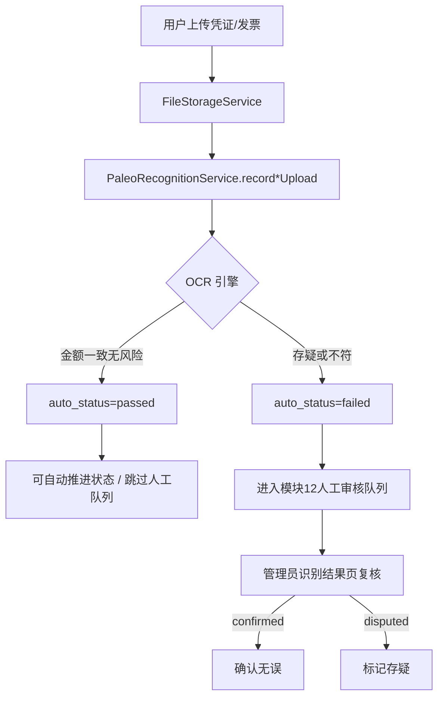

# 16 横切能力模块需求

| 字段 | 内容 |
|------|------|
| 文档名称 | 横切能力（消息/邮件/文件/OCR/审计）模块 PRD |
| 模块编号 | 16 |
| 版本 | v1.0 |
| 编写日期 | 2026-07-06 |
| 文档状态 | 初稿（待人工校验） |
| 前置基准 | [中国古生物学会完整需求文档.md](../中国古生物学会完整需求文档.md) v3.1 §15、§16、§19 |
| 服务对象 | 全端各业务模块（01～15） |
| 关联原型 | `paleontology-website-latest` · `paleontology-admin-latest` · `paleontology-cms-backend` |
| 不在本模块范围 | 各业务状态机细节（分散在 03～08、12）、CMS 内容编排（09/10）、财务 ZIP 打包逻辑（15） |

---

## 目录

1. [模块概述](#1-模块概述)
2. [架构与集成方式](#2-架构与集成方式)
3. [站内通知（§15.1）](#3-站内通知151)
4. [邮件服务（§15.2）](#4-邮件服务152)
5. [文件管理与存储（§16）](#5-文件管理与存储16)
6. [智能识别 OCR（§19.1）](#6-智能识别-ocr191)
7. [审计追溯（§19.2）](#7-审计追溯192)
8. [安全与频率限制](#8-安全与频率限制)
9. [接口需求](#9-接口需求)
10. [数据模型](#10-数据模型)
11. [异常处理](#11-异常处理)
12. [与各业务模块衔接](#12-与各业务模块衔接)
13. [原型差距与改造清单](#13-原型差距与改造清单)
14. [验收标准](#14-验收标准)
15. [附录](#15-附录)

---

## 1. 模块概述

### 1.1 模块定位

本模块定义贯穿学会网站全业务的**横切基础设施**，不单独面向最终用户菜单，而是为注册、缴费、会议、CMS、后台审核等提供统一能力：

| 子能力 | 总需求 | 主要消费方 |
|--------|--------|------------|
| **站内通知** | §15.1 | 主站顶栏铃铛；各业务触发 |
| **邮件服务** | §15.2 | 模块 01 验证码；业务结果通知 |
| **文件存储** | §16.1–16.3 | 凭证/发票/申请书/会议资料/CMS |
| **智能识别 OCR** | §19.1 | 模块 04/06 上传后；模块 12 审核 |
| **审计追溯** | §19.2 | 管理后台只读查询 |

设计目标：业务模块只调用统一 SDK/Service，不各自实现通知、存文件、写日志。

### 1.2 核心设计原则

| 原则 | 落地 |
|------|------|
| 服务端持久化 | 通知、审计、识别结果、文件元数据入库；换设备可同步 |
| 异步解耦 | 邮件/OCR 可异步队列；失败重试不阻塞主流程 |
| 审计不丢 | 写审计失败记 error 日志，但**不**回滚业务（与现 `AuditLogService` 一致） |
| 中文可读 | 审计摘要、通知文案面向秘书处/用户，非技术字段堆砌 |
| 按学会隔离 | 文件归档、审计、识别按 `association_id` 可过滤 |
| OCR 辅助人工 | 自动通过仅在高置信度；存疑进人工队列（模块 12） |
| 最小权限 | 财务无审计菜单；分会审计仅本分会 |

### 1.3 系统边界

```
┌─────────────────────────────────────────────────────────────────┐
│ 业务模块（01～15）                                                │
│  注册 · 缴费 · 会议 · CMS · 审核 · 代改 · 导出 …                  │
└───────────────┬───────────────┬───────────────┬─────────────────┘
                │               │               │
        NotificationService  FileStorageService  AuditLogService
        EmailService         RecognitionService
                │               │               │
┌───────────────▼───────────────▼───────────────▼─────────────────┐
│ MySQL · Redis · OSS/本地磁盘 · 第三方 OCR · SMTP/SendCloud         │
└─────────────────────────────────────────────────────────────────┘
```

---

## 2. 架构与集成方式

### 2.1 后端服务分层（目标形态）

| Service | 职责 |
|---------|------|
| `NotificationService` | 创建/查询/已读站内通知 |
| `EmailService` | 发信、模板渲染、发送日志、重试 |
| `FileStorageService` | 校验、存储、返回 URL；生产 OSS |
| `PaleoRecognitionService` | 上传触发识别、自动策略、人工复核 |
| `AuditLogService` | 统一 `log()`；各业务封装便捷方法 |

### 2.2 前端集成

| 端 | 集成点 |
|----|--------|
| 主站 | `MembershipContext.addNotification` → 改 API；`PartyLayout` 铃铛 |
| 管理后台 | `AuditTrail.tsx`、`RecognitionManagement.tsx`；`uploadCmsMedia` |
| 开发环境 | Vite `manus-storage` 代理（主站原型）；cms-backend 本地 `/uploads` |

### 2.3 贯穿实施阶段（索引 P0～P4）

| 阶段 | 横切接入 |
|------|----------|
| P0 | 文件上传 API + 邮件验证码（模块 01） |
| P1 | 缴费/会议上传触发 OCR + 审计审核类 |
| P2 | 站内通知服务端 + 业务邮件模板 |
| P3 | OSS 生产存储 + 识别真实 OCR |
| P4 | 截止提醒定时任务、会员到期邮件 |

---

## 3. 站内通知（§15.1）

### 3.1 触发场景

| 触发时机 | 类型 | 内容示例 |
|----------|------|----------|
| 路径选择完成 | `membership_path` | 非会员/正式会员说明 |
| 入会/退会审核结果 | `application_review` | 通过或驳回原因 |
| 凭证/发票审核结果 | `payment_review` | 会员费或会议费 |
| 发票截止临近/逾期 | `invoice_deadline` | 剩余天数提醒 |
| 新会议发布 | `conference_published` | 已绑定分会的新会议 |
| 会员到期 | `membership_expiry` | 资格变更、会议冻结 |
| 分会绑定/解绑 | `branch_binding` | 操作确认 |
| 参会信息提交 | `attendee_info` | 成功提示 |
| 个人资料更新 | `profile` | 更新成功（原型已有） |

**不包含**：注册验证码完整 6 位码（仅邮件发送，§15.1 明确要求）。

### 3.2 数据模型

```typescript
interface SystemNotification {
  id: string;
  title: string;
  content: string;
  type: "info" | "success" | "warning" | "error";
  time: string;       // ISO 或本地化展示
  read: boolean;
  link?: string;      // 可选跳转路径
}
```

服务端表建议：`paleo_notification`（`user_id`, `title`, `content`, `type`, `read_flag`, `create_time`）。

### 3.3 展示与交互（主站）

组件：`PartyLayout.tsx` 顶栏铃铛。

| 交互 | 规则 |
|------|------|
| 未读数 | Badge 显示 `notifications.filter(n => !n.read).length` |
| 打开面板 | 列表按时间倒序 |
| 单条已读 | 点击标记 `read=true` |
| 全部已读 | 「全部标为已读」 |
| 空状态 | 友好文案 |

### 3.4 原型现状

- `addNotification` 写入 `localStorage` `paleo_notifs_{email}`
- 业务多处调用（路径选择、审核结果模拟、绑定等）
- **缺口**：无后端 API，换设备不同步

---

## 4. 邮件服务（§15.2）

### 4.1 邮件类型

| 类型 | 优先级 | 触发模块 |
|------|:------:|----------|
| 注册邮箱验证码 | P0 | 01 |
| 忘记密码验证码/链接 | P0 | 01 |
| 注册成功欢迎 | P1 | 01 |
| 入会/退会审核结果 | P1 | 03/12 |
| 凭证/发票审核结果 | P1 | 04/06/12 |
| 发票截止提醒 | P2 | 04/08 |
| 会员到期提醒 | P2 | 08 |
| 新会议发布（可选） | P3 | 06/14 |

总需求 §21 待决：是否首期上线全部 16 类模板 — 建议分阶段，P0 仅验证码类。

### 4.2 发送规则

| 规则 | 说明 |
|------|------|
| 收件人 | 用户注册邮箱 |
| 失败重试 | 至少 3 次指数退避 |
| 发送日志 | `paleo_email_log`：to, template, status, error, create_time |
| 频率限制 | 同邮箱验证码 60s 间隔（模块 01） |
| 内容 | 学会署名、用途说明、有效期、勿泄露提示 |

### 4.3 技术选型

| 环境 | 方案 |
|------|------|
| 开发 | 控制台输出 / MailHog |
| 生产 | 企业邮箱 SMTP 或 SendCloud 等第三方 |

### 4.4 原型现状

- 注册/忘记密码 UI 有「发送验证码」；`requestPasswordReset` Toast 模拟成功，**未真实发信**
- 模块 01 PRD 已定义 `/paleo/auth/send-code` 等待实现

---

## 5. 文件管理与存储（§16）

### 5.1 业务文件类型与限制

| 用途 | 格式 | 大小上限 |
|------|------|----------|
| 缴费凭证 | JPG/PNG | ≤ 5MB |
| 电子发票 | JPG/PNG/PDF | ≤ 10MB |
| 入会/退会申请书 | DOC/DOCX/PDF | ≤ 20MB |
| 会议通知/盖章 PDF | PDF | ≤ 20MB |
| 摘要模板/用户摘要 | DOC/DOCX | ≤ 10MB |
| 党建/公开文件 | 按 CMS 类型 | 配置化 |

后端 `LocalFileStorageService` 当前统一 **20MB** + 扩展名白名单 — 须按上表分角色校验（P1）。

### 5.2 存储架构

| 层 | 说明 |
|----|------|
| 接入 | `MultipartFile` → `FileStorageService.store` |
| 开发 | 本地 `uploads/{yyyyMMdd}/{uuid}.ext`，URL `/uploads/...` |
| 生产 | 阿里云 OSS（或等价）；私有桶 + 签名 URL |
| 元数据 | 业务表存 `voucher_url` / `invoice_url`；CMS `paleo_cms_entry` |

主站开发：`/manus-storage/*` 代理 Forge API（Vite 插件），避免 CORS。

### 5.3 下载权限（§16.2）

| 内容 | 条件 |
|------|------|
| 公开文件 | 无需登录 |
| 会议通知（不盖章） | 已登录 + 已绑定分会（总学会除外） |
| 盖章通知 / 摘要模板 | 该会议报名 `CONFIRMED` |
| 自己的凭证/发票 | 已登录本人 |
| 分会下载中心 | 按 CMS 栏目配置 |

实现：业务 API 返回 URL 前校验；OSS 短时效签名。

### 5.4 凭证发票绑定与归档（§16.3）

| 规则 | 说明 |
|------|------|
| 会员费 | 每用户凭证与发票一一绑定于 `payment_id` |
| 会议费 | 每场会议 `registration_id` 独立一对 |
| 分库分文件夹 | 按学会单元隔离；**不可混放** |
| 导出 | 模块 15 ZIP 消费本规则 |

### 5.5 管理端上传

| 场景 | 接口/组件 |
|------|-----------|
| CMS 媒体 | `uploadCmsMedia` → `PaleoCmsEntryController` |
| 会议 PDF/Word | `ConferenceManagement` → `uploadCmsMedia` |
| 申请书模板 | `POST /paleo/membership/templates/{type}/upload` |
| 会员/会议缴费文件 | `POST .../files/{fileRole}` |

### 5.6 安全要求

- 禁止前端 base64 大文件常驻内存（管理端已规避 legacy data URL）
- 病毒扫描（可选 P3）
- 上传鉴权：本人或管理员角色

---

## 6. 智能识别 OCR（§19.1）

### 6.1 流程



### 6.2 识别内容

| 字段 | 用途 |
|------|------|
| 金额 | 与 `amount` / `fee_amount` 比对 |
| 付款方 | 与注册姓名比对；不符则风险提示 |
| 收款方 | 学会账户名 |
| 日期 | 合理性检查 |

### 6.3 自动通过策略

| 条件 | 动作 |
|------|------|
| 金额一致 + 付款方匹配 + 无风险标记 | 凭证 → 自动 `INVOICE_PENDING`；或发票 → 自动 `CONFIRMED`（可配置） |
| 任一不满足 | 保持待审；`auto_status=failed` 或 `pending` |
| 人工 confirmed | 可触发与审核通过等效操作（待产品确认） |
| 人工 disputed | 强制人工审核 |

客户要求：「尽量智能审核自动通过」——须接入成熟 OCR（阿里云/腾讯云等），原型为 **mock**（`runMockRecognition` 始终 passed）。

### 6.4 管理端页面

路由：`/admin/recognition` — `RecognitionManagement.tsx`

| 功能 | 说明 |
|------|------|
| 列表筛选 | auto_status、target_type、manual_status |
| 列展示 | 用户、类型、文件角色、识别结果、复核状态 |
| 复核 | 「确认无误」/「标记存疑」+ 可选备注 |
| 预览 | `openFilePreview(fileUrl)` |

权限：`super_admin`、`branch_admin`（本分会 `association_id`）。

### 6.5 与审核工作台关系

| 能力 | 识别结果页 | 审核工作台 |
|------|------------|------------|
| 自动通过 | 记录在此，可能不入队 | — |
| 人工审凭证/发票 | 可先复核 OCR | 正式改状态 |
| 批量 | 未来可加强 | 模块 12 已支持 |

---

## 7. 审计追溯（§19.2）

### 7.1 须审计的操作

| 类型 | action 示例 | 触发点 |
|------|-------------|--------|
| 入会/退会 | `JOIN_APPLICATION_*` | 模块 12 |
| 会员费 | `MEMBERSHIP_VOUCHER_*` / `INVOICE_*` | 模块 12 |
| 会议费 | `CONFERENCE_VOUCHER_*` / `INVOICE_*` | 模块 12 |
| CMS | `CMS_PUBLISH` / `CMS_UNPUBLISH` | 模块 09/10 |
| 权限 | `ADMIN_BINDING_*` | 模块 11 Scope |
| 识别 | `RECOGNITION_MANUAL_REVIEW` | 本模块 |
| 管理代改 | `ABSTRACT_ADMIN_EDIT` / `ACCOMMODATION_ADMIN_EDIT` | 模块 07 |
| 发票延期 | `INVOICE_DEADLINE_EXTEND` | 模块 12 |
| 会员禁用/开通 | `MEMBER_ADMIN_*`（待增） | 模块 13 |
| 财务导出 | `FINANCE_ZIP_EXPORT`（待增） | 模块 15 |

完整枚举：`AuditAction.java` + `GET /paleo/audit/actions`。

### 7.2 日志字段

| 字段 | 说明 |
|------|------|
| `operator_id` / `operator_email` / `operator_role` | 操作人 |
| `action` | 机器码 |
| `target_type` / `target_id` | 目标实体 |
| `association_id` | 分会范围（可空） |
| `summary` | **中文摘要**（面向客户） |
| `detail_json` | 结构化详情（状态前后、用户、驳回原因） |
| `ip` | 客户端 IP |
| `create_time` | 时间戳 |

### 7.3 查询权限

| 角色 | 权限 |
|------|------|
| `super_admin` | 全站；可按 `association_id` 筛选 |
| `branch_admin` | 仅 `association_id` 在绑定范围内 |
| `finance_reviewer` | **禁止**（`AuditLogService.listForAdmin` 抛错） |

路由：`/admin/audit-trail` — `AuditTrail.tsx`

### 7.4 展示要求

| 要求 | 实现 |
|------|------|
| 中文摘要 | `formatAuditSummary` 替换英文状态码 |
| 用户可读详情 | `parseAuditDetail` → 姓名、邮箱、会议、前后状态 |
| 禁止堆砌 ID | 摘要中剥离 `(id=123)` 类片段 |
| 只读 | 无删除/编辑 |

### 7.5 后端已实现

- 表：`paleo_audit_log`（V25 migration）
- `AuditLogService.log` + 业务便捷方法（`logMembershipPaymentReview` 等）
- API：`GET /paleo/audit/logs` 分页筛选

---

## 8. 安全与频率限制

| 项 | 方案 |
|----|------|
| 验证码 | Redis key `verify:{email}:{scene}`，TTL 5～10 分钟 |
| 发码频率 | 同邮箱 60s；同 IP 日上限 |
| JWT | 用户/管理员分离（模块 01/11） |
| 文件类型 | 扩展名 + MIME 双校验 |
| OCR 回调 | 内部服务鉴权 |
| 审计 | _append-only_；无用户侧接口 |

---

## 9. 接口需求

### 9.1 站内通知（待实现）

| 方法 | 路径 | 说明 |
|------|------|------|
| GET | `/paleo/notifications/mine` | 当前用户通知列表 |
| POST | `/paleo/notifications/{id}/read` | 标记已读 |
| POST | `/paleo/notifications/read-all` | 全部已读 |

业务侧内部：`NotificationService.send(userId, templateCode, params)`。

### 9.2 邮件（待实现，模块 01 部分）

| 方法 | 路径 | 说明 |
|------|------|------|
| POST | `/paleo/auth/send-code` | 注册/重置验证码 |
| POST | `/paleo/auth/verify-code` | 校验验证码 |

内部：`EmailService.sendTemplate(to, template, vars)`。

### 9.3 文件（部分已有）

| 方法 | 路径 | 说明 |
|------|------|------|
| POST | `/paleo/membership/payments/mine/{id}/files/{role}` | 会员费文件 |
| POST | `/paleo/conferences/registrations/mine/{id}/files/{role}` | 会议费文件 |
| POST | `/paleo/cms/.../upload` | CMS 媒体 |
| GET | `/uploads/**` 或 OSS 签名 URL | 下载 |

### 9.4 识别（已实现）

| 方法 | 路径 | 角色 |
|------|------|------|
| GET | `/paleo/recognition/list` | super_admin, branch_admin |
| GET | `/paleo/recognition/{id}` | 同上 |
| POST | `/paleo/recognition/{id}/review` | 同上；body: `manualStatus`, `manualComment` |

上传时自动：`recordMembershipUpload` / `recordConferenceUpload`（须在 attachFile 后调用）。

### 9.5 审计（已实现）

| 方法 | 路径 | 角色 |
|------|------|------|
| GET | `/paleo/audit/logs` | super_admin, branch_admin |
| GET | `/paleo/audit/actions` | 同上 |

---

## 10. 数据模型

### 10.1 表清单

| 表 | 状态 | 用途 |
|----|------|------|
| `paleo_notification` | 待建 | 站内通知 |
| `paleo_email_log` | 待建 | 邮件发送日志 |
| `paleo_recognition_result` | ✅ V24 | OCR 结果 |
| `paleo_audit_log` | ✅ V25 | 审计 |
| 业务表 URL 字段 | ✅ | 文件引用 |

### 10.2 paleo_recognition_result

见 V24 migration；关键字段：`target_type`, `target_id`, `file_role`, `auto_status`, `auto_detail`, `manual_status`。

### 10.3 paleo_audit_log

见 V25 migration；`operator_role`: super / branch / finance。

---

## 11. 异常处理

| 场景 | 处理 |
|------|------|
| 邮件发送失败 | 重试 + 记录；用户提示稍后再试 |
| OCR 超时 | `auto_status=failed`；入人工队列 |
| 文件超大/格式非法 | 400 + 明确文案 |
| 通知写入失败 | 记录日志；不阻断缴费主流程 |
| 审计写入失败 | 吞异常；监控告警 |
| 签名 URL 过期 | 前端刷新链接 |
| 财务访问审计 API | 403 |

---

## 12. 与各业务模块衔接

| 模块 | 使用的横切能力 |
|------|----------------|
| 01 | 邮件验证码、审计注册 |
| 03～08 | 通知、文件、OCR、审计 |
| 09/10 | 文件、CMS 审计 |
| 11 | 审计（权限绑定） |
| 12 | OCR 结果、审计、通知 |
| 13 | 审计（禁用/开通） |
| 14 | 文件上传 |
| 15 | 文件拉取 ZIP |

**集成模式**：业务 Service 在状态变更成功后依次调用 `notification`、`email`（可选）、`audit`；上传链路调用 `file` + `recognition`。

---

## 13. 原型差距与改造清单

| 优先级 | 差距 | 现状 | 目标 |
|:------:|------|------|------|
| **P0** | 站内通知仅 localStorage | `paleo_notifs_*` | `paleo_notification` + API |
| **P0** | 邮件未接入 | Toast 模拟 | SMTP/SendCloud + 验证码 |
| **P0** | 生产 OSS | 本地 `LocalFileStorageService` | OSS + 签名 URL |
| **P1** | OCR 为 mock | 始终 passed | 真实 OCR + 可配置自动通过 |
| **P1** | 文件大小未分类型 | 统一 20MB | 按 §5.1 分角色校验 |
| **P1** | 自动通过未联动状态机 | 识别与审核分离 | 高置信度自动 review |
| **P2** | 邮件业务模板不全 | 仅 UI | 审核/截止/到期模板 |
| **P2** | 截止提醒无定时任务 | 无 | 调度 + 通知/邮件 |
| **P2** | 缺少会员禁用等审计 action | 未写入 | 扩展 `AuditAction` |
| **P3** | 识别页无批量复核 | 逐条 | 批量 confirmed（可选） |

---

## 14. 验收标准

### 14.1 站内通知

- [ ] 服务端存储；换设备登录可同步
- [ ] 顶栏未读数正确；已读/全部已读有效
- [ ] §3.1 所列场景至少 P1 场景能触发通知
- [ ] 验证码不出现在站内通知

### 14.2 邮件

- [ ] 注册/忘记密码验证码真实送达
- [ ] 60s 发码限制生效
- [ ] 发送失败有日志与重试

### 14.3 文件

- [ ] 各业务文件类型与大小限制符合 §5.1
- [ ] 下载权限符合 §5.2
- [ ] 会员费/会议费凭证发票一对一绑定
- [ ] 生产环境 OSS 可访问（签名）

### 14.4 OCR

- [ ] 上传自动生成识别记录
- [ ] 金额不符不入自动通过
- [ ] 识别结果页可复核 confirmed/disputed
- [ ] 分会仅见本分会记录

### 14.5 审计

- [ ] 模块 12 审核操作均有审计记录
- [ ] 摘要为中文可读
- [ ] 财务无法访问审计 API
- [ ] 分会仅见本分会记录

---

## 15. 附录

### 15.1 原型文件索引

| 文件 | 说明 |
|------|------|
| `paleontology-website-latest/client/src/contexts/MembershipContext.tsx` | 通知、双写 localStorage |
| `paleontology-website-latest/client/src/components/PartyLayout.tsx` | 通知铃铛 UI |
| `paleontology-admin-latest/client/src/pages/admin/AuditTrail.tsx` | 审计追溯 |
| `paleontology-admin-latest/client/src/pages/admin/RecognitionManagement.tsx` | 识别复核 |
| `paleontology-admin-latest/client/src/lib/audit-api.ts` | 审计 API 封装 |
| `paleontology-admin-latest/client/src/lib/recognition-api.ts` | 识别 API |
| `PaleoRecognitionService.java` | OCR 记录与 mock |
| `AuditLogService.java` | 审计写入与查询 |
| `LocalFileStorageService.java` | 本地文件存储 |

### 15.2 通知类型建议枚举

`membership_path` · `application_review` · `payment_review` · `invoice_deadline` · `conference_published` · `membership_expiry` · `branch_binding` · `attendee_info` · `profile`

### 15.3 待人工确认项

| 编号 | 问题 | 建议 |
|------|------|------|
| Q1 | OCR 自动通过是否直接改状态？ | 高置信度可自动；须可关 |
| Q2 | 邮件是否并行站内通知？ | 关键节点双通道 |
| Q3 | OSS 桶按环境分还是按学会分？ | 单桶 + 路径前缀 `/{assoc}/` |
| Q4 | 识别 disputed 是否自动驳回？ | 否；仅标记，由审核员处理 |
| Q5 | 首期邮件模板数量？ | P0 验证码；P1 审核结果 |

### 15.4 修订记录

| 版本 | 日期 | 说明 |
|------|------|------|
| v1.0 | 2026-07-06 | 初稿 |

---

**文档结束**
